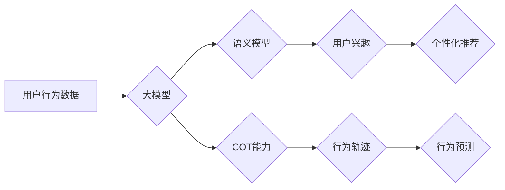

                 

## 用户行为理解：大模型的COT能力应用

> 关键词：用户行为理解，大模型，COT能力，自然语言处理，预测建模，个性化推荐，数据分析，机器学习

## 1. 背景介绍

在数字时代，用户行为数据已成为企业和研究机构的宝贵资源。理解用户行为可以帮助企业优化产品设计、提高用户体验、精准营销和个性化服务。传统的用户行为分析方法主要依赖于统计分析和规则引擎，但随着数据量的爆炸式增长和用户行为的复杂性增加，这些方法逐渐显得力不从心。

近年来，大模型技术的发展为用户行为理解带来了新的机遇。大模型，例如GPT-3、BERT等，拥有强大的语义理解和文本生成能力，能够从海量文本数据中学习用户行为的复杂模式。

COT（Contextualized Object Tracking）能力是近年来大模型研究中的一个重要方向。COT能力是指模型能够在理解上下文语境的基础上，追踪和识别特定对象的能力。在用户行为理解领域，COT能力可以帮助模型更准确地识别用户兴趣、需求和行为意图，从而实现更精准的用户行为分析和预测。

## 2. 核心概念与联系

### 2.1 用户行为理解

用户行为理解是指通过分析用户与系统或产品交互的行为数据，以揭示用户的心理状态、需求和意图，从而为产品设计、用户体验优化和个性化服务提供决策依据。

### 2.2 大模型

大模型是指参数量巨大、训练数据规模庞大的深度学习模型。大模型通常具有强大的泛化能力和语义理解能力，能够在自然语言处理、计算机视觉等领域取得突破性进展。

### 2.3 COT能力

COT（Contextualized Object Tracking）能力是指模型能够在理解上下文语境的基础上，追踪和识别特定对象的能力。例如，在阅读一篇新闻文章时，模型能够理解文章的主题和上下文，并追踪特定人物或事件的出现和发展。

### 2.4 核心概念联系

大模型的COT能力可以为用户行为理解提供强大的支持。通过学习海量用户行为数据，大模型能够建立用户行为的语义模型，并利用COT能力追踪用户在不同场景下的行为轨迹，从而更准确地理解用户的兴趣、需求和行为意图。

**Mermaid 流程图**



## 3. 核心算法原理 & 具体操作步骤

### 3.1 算法原理概述

大模型的COT能力通常基于Transformer架构，并结合了注意力机制和序列建模技术。

* **Transformer架构:** Transformer是一种新型的神经网络架构，能够有效处理序列数据，例如文本和时间序列。Transformer的核心是注意力机制，它允许模型关注输入序列中与当前任务相关的部分，从而提高模型的理解能力。
* **注意力机制:** 注意力机制是一种机制，允许模型在处理序列数据时，对不同位置的元素赋予不同的权重。通过学习不同位置元素之间的关系，模型能够更好地理解序列的语义结构。
* **序列建模:** 序列建模是指对序列数据进行建模，例如预测下一个元素的值或识别序列中的模式。大模型的COT能力通常结合序列建模技术，能够追踪特定对象的出现和发展，并预测其未来的行为。

### 3.2 算法步骤详解

1. **数据预处理:** 将用户行为数据进行清洗、格式化和编码，例如将文本数据转换为词向量。
2. **模型训练:** 使用大模型架构，例如BERT或GPT-3，训练模型，并利用注意力机制和序列建模技术学习用户行为的语义模型和COT能力。
3. **模型评估:** 使用测试数据评估模型的性能，例如准确率、召回率和F1-score。
4. **模型部署:** 将训练好的模型部署到生产环境中，用于实时用户行为分析和预测。

### 3.3 算法优缺点

**优点:**

* 能够处理海量文本数据，学习用户行为的复杂模式。
* 具有强大的语义理解和文本生成能力，能够更准确地识别用户意图。
* 可以追踪用户在不同场景下的行为轨迹，提供更全面的用户行为分析。

**缺点:**

* 训练成本高，需要大量的计算资源和训练数据。
* 模型解释性较差，难以理解模型的决策过程。
* 容易受到数据偏差的影响，需要进行充分的数据清洗和预处理。

### 3.4 算法应用领域

* **个性化推荐:** 根据用户的行为数据，推荐个性化的产品、服务和内容。
* **用户画像分析:** 建立用户画像，了解用户的兴趣、需求和行为模式。
* **欺诈检测:** 识别异常行为，预防欺诈活动。
* **客户服务优化:** 分析用户反馈，改进客户服务体验。

## 4. 数学模型和公式 & 详细讲解 & 举例说明

### 4.1 数学模型构建

大模型的COT能力通常基于Transformer架构，其核心是注意力机制。注意力机制可以表示为一个加权求和操作，其中每个元素的权重由一个注意力函数决定。

**注意力函数:**

$$
\text{Attention}(Q, K, V) = \text{softmax}\left(\frac{QK^T}{\sqrt{d_k}}\right)V
$$

其中：

* $Q$：查询矩阵
* $K$：键矩阵
* $V$：值矩阵
* $d_k$：键向量的维度
* $\text{softmax}$：softmax函数，用于将注意力权重归一化

### 4.2 公式推导过程

注意力函数的推导过程可以分为以下几个步骤：

1. 计算查询矩阵 $Q$ 和键矩阵 $K$ 的点积，并进行缩放。
2. 应用softmax函数对点积结果进行归一化，得到注意力权重。
3. 将注意力权重与值矩阵 $V$ 进行加权求和，得到最终的输出。

### 4.3 案例分析与讲解

例如，在阅读一篇新闻文章时，模型需要追踪特定人物的出现和发展。

* $Q$：表示当前词的查询向量。
* $K$：表示所有人物的键向量。
* $V$：表示所有人物的值向量。

通过计算注意力权重，模型可以识别与当前词相关的关键人物，并追踪其在文章中的出现和发展。

## 5. 项目实践：代码实例和详细解释说明

### 5.1 开发环境搭建

* Python 3.7+
* TensorFlow 2.0+
* PyTorch 1.0+
* CUDA Toolkit 10.2+

### 5.2 源代码详细实现

```python
# 使用BERT模型进行用户行为理解
from transformers import BertTokenizer, BertModel

# 加载预训练模型和词典
tokenizer = BertTokenizer.from_pretrained('bert-base-uncased')
model = BertModel.from_pretrained('bert-base-uncased')

# 将用户行为文本转换为BERT输入
text = "用户在电商平台购买了手机和耳机。"
inputs = tokenizer(text, return_tensors='pt')

# 使用BERT模型进行语义编码
outputs = model(**inputs)

# 获取每个词的隐藏状态
hidden_states = outputs.last_hidden_state

# 使用注意力机制追踪用户行为关键信息
attention_weights = model.attention.attn_weights

# 分析注意力权重，识别用户行为关键信息
```

### 5.3 代码解读与分析

* 使用预训练的BERT模型进行语义编码，提取用户行为文本的语义特征。
* 使用注意力机制追踪用户行为关键信息，例如购买的商品名称和类别。
* 分析注意力权重，识别用户行为的关键信息，例如用户对哪些商品更感兴趣。

### 5.4 运行结果展示

运行代码后，可以得到用户行为文本的语义编码和注意力权重。通过分析注意力权重，可以识别用户行为的关键信息，例如用户购买的商品名称和类别。

## 6. 实际应用场景

### 6.1 个性化推荐

大模型的COT能力可以用于个性化推荐，例如根据用户的浏览历史和购买记录，推荐相关的商品和服务。

### 6.2 用户画像分析

大模型可以分析用户的行为数据，构建用户画像，了解用户的兴趣、需求和行为模式。

### 6.3 欺诈检测

大模型可以识别异常行为，例如账户异常登录、交易金额异常等，预防欺诈活动。

### 6.4 未来应用展望

随着大模型技术的不断发展，COT能力将在用户行为理解领域得到更广泛的应用，例如：

* 更精准的个性化推荐
* 更深入的用户画像分析
* 更有效的欺诈检测
* 更智能的客户服务

## 7. 工具和资源推荐

### 7.1 学习资源推荐

* **论文:**
    * Vaswani, A., Shazeer, N., Parmar, N., Uszkoreit, J., Jones, L., Gomez, A. N., ... & Polosukhin, I. (2017). Attention is all you need. Advances in neural information processing systems, 30.
    * Devlin, J., Chang, M. W., Lee, K., & Toutanova, K. (2018). BERT: Pre-training of deep bidirectional transformers for language understanding. arXiv preprint arXiv:1810.04805.
* **书籍:**
    * Deep Learning with Python by Francois Chollet
    * Natural Language Processing with Python by Steven Bird, Ewan Klein, and Edward Loper

### 7.2 开发工具推荐

* **TensorFlow:** https://www.tensorflow.org/
* **PyTorch:** https://pytorch.org/
* **Hugging Face Transformers:** https://huggingface.co/transformers/

### 7.3 相关论文推荐

* **BERT:** https://arxiv.org/abs/1810.04805
* **GPT-3:** https://openai.com/blog/gpt-3/
* **XLNet:** https://arxiv.org/abs/1906.08237

## 8. 总结：未来发展趋势与挑战

### 8.1 研究成果总结

大模型的COT能力为用户行为理解带来了新的机遇，能够更准确地识别用户意图和行为模式。

### 8.2 未来发展趋势

* **模型规模和能力提升:** 未来大模型的规模和能力将继续提升，能够处理更复杂的用户行为数据，并提供更精准的用户行为分析和预测。
* **多模态用户行为理解:** 将文本、图像、音频等多模态数据融合，实现更全面的用户行为理解。
* **可解释性增强:** 研究更有效的模型解释方法，提高大模型的透明度和可信度。

### 8.3 面临的挑战

* **数据隐私和安全:** 大模型的训练需要海量用户数据，如何保护用户隐私和数据安全是一个重要的挑战。
* **模型偏见和公平性:** 大模型容易受到数据偏见的影响，需要研究如何减轻模型偏见，确保公平性和公正性。
* **模型部署和效率:** 大模型的部署和推理效率仍然是一个挑战，需要研究更有效的模型压缩和加速技术。

### 8.4 研究展望

未来，大模型的COT能力将在用户行为理解领域得到更广泛的应用，为企业和研究机构提供更精准的用户洞察和决策支持。


## 9. 附录：常见问题与解答

**Q1: 大模型的COT能力与传统的用户行为分析方法相比有哪些优势？**

**A1:** 大模型的COT能力能够处理海量文本数据，学习用户行为的复杂模式，并利用注意力机制追踪用户在不同场景下的行为轨迹，从而提供更准确和全面的用户行为分析。

**Q2: 如何评估大模型的COT能力？**

**A2:** 可以使用多种指标评估大模型的COT能力，例如准确率、召回率、F1-score等。

**Q3: 大模型的COT能力有哪些应用场景？**

**A3:** 大模型的COT能力可以应用于个性化推荐、用户画像分析、欺诈检测、客户服务优化等多个领域。

**Q4: 如何部署大模型的COT能力？**

**A4:** 可以使用云平台或本地服务器部署大模型的COT能力。

**Q5: 大模型的COT能力有哪些挑战？**

**A5:** 大模型的COT能力面临着数据隐私和安全、模型偏见和公平性、模型部署和效率等挑战。


作者：禅与计算机程序设计艺术 / Zen and the Art of Computer Programming 
<end_of_turn>

