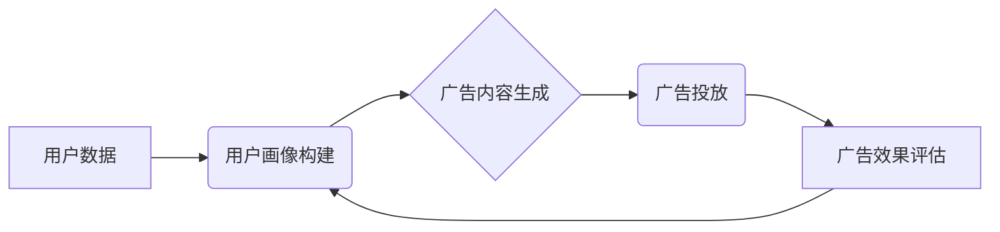

                 

## 电商平台个性化广告投放：AI大模型的精准定向

> 关键词：电商平台、个性化广告、AI大模型、精准定向、推荐系统、深度学习、Transformer、用户画像、广告效果

## 1. 背景介绍

在当今数据爆炸的时代，电商平台面临着巨大的挑战，如何精准地将广告投放到目标用户面前，提高广告转化率，是平台运营和商业发展的关键。传统的广告投放方式往往依赖于粗略的用户标签和人工筛选，难以满足用户个性化需求，导致广告效果不佳，用户体验下降。

随着人工智能技术的快速发展，特别是深度学习和自然语言处理领域的突破，AI大模型为电商平台个性化广告投放提供了全新的解决方案。AI大模型能够通过学习海量用户数据，构建用户画像，并预测用户对广告的兴趣和点击意愿，从而实现精准定向的广告投放。

## 2. 核心概念与联系

### 2.1  个性化广告

个性化广告是指根据用户的兴趣、行为、偏好等信息，定制化的广告内容和投放方式。其核心目标是提高广告的针对性和有效性，提升用户体验。

### 2.2  AI大模型

AI大模型是指在海量数据上训练的深度学习模型，拥有强大的学习和推理能力。常见的AI大模型包括Transformer、BERT、GPT等，它们能够理解和生成自然语言，并进行复杂的模式识别和预测。

### 2.3  精准定向

精准定向是指将广告精准地投放到目标用户群体，最大限度地提高广告曝光率和转化率。

**核心概念与联系流程图:**



## 3. 核心算法原理 & 具体操作步骤

### 3.1  算法原理概述

电商平台个性化广告投放的核心算法通常基于深度学习和推荐系统技术。

* **深度学习:** 通过多层神经网络，学习用户行为、兴趣等特征，构建用户画像。
* **推荐系统:** 基于用户画像和广告特征，预测用户对广告的兴趣和点击意愿，并推荐合适的广告。

常见的算法包括协同过滤、内容过滤、混合推荐等。

### 3.2  算法步骤详解

1. **数据收集和预处理:** 收集用户行为数据、广告信息等，并进行清洗、转换、特征提取等预处理。
2. **用户画像构建:** 利用深度学习模型，例如Transformer，学习用户行为、兴趣、偏好等特征，构建用户画像。
3. **广告特征提取:** 从广告信息中提取特征，例如广告标题、描述、图片、类别等。
4. **模型训练:** 利用训练数据，训练推荐模型，例如深度神经网络或梯度提升树。
5. **广告推荐:** 根据用户画像和广告特征，预测用户对广告的兴趣和点击意愿，并推荐合适的广告。
6. **广告效果评估:** 收集用户点击、转化等数据，评估广告效果，并根据评估结果进行模型优化。

### 3.3  算法优缺点

**优点:**

* **精准定向:** 能够根据用户画像，精准地将广告投放到目标用户群体。
* **个性化推荐:** 能够根据用户的兴趣和偏好，推荐个性化的广告内容。
* **提高广告效果:** 能够提高广告曝光率和转化率，提升广告投资回报率。

**缺点:**

* **数据依赖:** 需要海量用户数据进行训练，数据质量直接影响模型效果。
* **模型复杂:** 需要复杂的模型架构和训练过程，技术门槛较高。
* **隐私安全:** 需要处理用户敏感信息，需要做好隐私保护措施。

### 3.4  算法应用领域

* **电商平台:** 个性化广告投放、商品推荐、用户画像分析等。
* **社交媒体:** 个性化内容推荐、精准广告投放、用户兴趣分析等。
* **搜索引擎:** 搜索结果个性化排序、精准广告投放、用户行为分析等。

## 4. 数学模型和公式 & 详细讲解 & 举例说明

### 4.1  数学模型构建

电商平台个性化广告投放的数学模型通常基于用户-商品交互矩阵，并利用矩阵分解技术进行预测。

假设用户集合为U，商品集合为I，用户-商品交互矩阵为R，其中R(u,i)表示用户u对商品i的评分或交互行为。

目标是学习用户和商品的潜在特征，并预测用户对商品的兴趣。

### 4.2  公式推导过程

常用的矩阵分解算法包括协同过滤和深度学习模型。

* **协同过滤:** 将用户-商品交互矩阵分解成两个低维矩阵，分别表示用户和商品的潜在特征。

$$R \approx U V^T$$

其中U为用户特征矩阵，V为商品特征矩阵。

* **深度学习模型:** 利用深度神经网络，学习用户和商品的复杂特征，并预测用户对商品的兴趣。

### 4.3  案例分析与讲解

假设一个电商平台有1000个用户和1000个商品，用户-商品交互矩阵为R，其中R(u,i)表示用户u对商品i的评分。

利用协同过滤算法，将R分解成用户特征矩阵U和商品特征矩阵V。

通过学习U和V，可以预测用户对未交互过的商品的兴趣。

例如，用户1对商品A评分为5，对商品B评分为3，根据U和V，可以预测用户1对商品C的评分。

## 5. 项目实践：代码实例和详细解释说明

### 5.1  开发环境搭建

* Python 3.x
* TensorFlow/PyTorch
* Jupyter Notebook

### 5.2  源代码详细实现

```python
import tensorflow as tf

# 定义用户-商品交互矩阵
R = tf.random.normal((1000, 1000))

# 定义用户特征矩阵
U = tf.Variable(tf.random.normal((1000, 10)))

# 定义商品特征矩阵
V = tf.Variable(tf.random.normal((1000, 10)))

# 计算预测评分
predictions = tf.matmul(U, V, transpose_b=True)

# 定义损失函数
loss = tf.reduce_mean(tf.square(predictions - R))

# 定义优化器
optimizer = tf.keras.optimizers.Adam()

# 训练模型
for epoch in range(10):
    with tf.GradientTape() as tape:
        loss_value = loss
    gradients = tape.gradient(loss_value, [U, V])
    optimizer.apply_gradients(zip(gradients, [U, V]))

# 打印预测评分
print(predictions)
```

### 5.3  代码解读与分析

* 代码首先定义用户-商品交互矩阵R，以及用户特征矩阵U和商品特征矩阵V。
* 然后计算预测评分，并定义损失函数和优化器。
* 最后进行模型训练，并打印预测评分。

### 5.4  运行结果展示

训练完成后，可以将预测评分与真实评分进行比较，评估模型效果。

## 6. 实际应用场景

### 6.1  电商平台广告投放

* 根据用户画像，精准地将广告投放到目标用户群体。
* 个性化推荐广告内容，提高用户点击率和转化率。

### 6.2  社交媒体内容推荐

* 根据用户兴趣和行为，推荐个性化的内容。
* 精准广告投放，提高广告效果。

### 6.3  搜索引擎结果排序

* 根据用户搜索历史和行为，个性化排序搜索结果。
* 精准广告投放，提高广告点击率和转化率。

### 6.4  未来应用展望

* **更精准的个性化推荐:** 利用更先进的AI模型，例如Transformer，学习用户更复杂的特征，实现更精准的个性化推荐。
* **跨平台个性化广告投放:** 将用户数据整合到多个平台，实现跨平台的个性化广告投放。
* **增强用户体验:** 利用AI技术，提供更个性化、更智能的广告体验，提升用户满意度。

## 7. 工具和资源推荐

### 7.1  学习资源推荐

* **书籍:**
    * Deep Learning by Ian Goodfellow
    * Recommender Systems by  Koren
* **在线课程:**
    * Coursera: Deep Learning Specialization
    * Udacity: Machine Learning Engineer Nanodegree

### 7.2  开发工具推荐

* **TensorFlow:** 开源深度学习框架
* **PyTorch:** 开源深度学习框架
* **Scikit-learn:** 机器学习库

### 7.3  相关论文推荐

* **Attention Is All You Need:** https://arxiv.org/abs/1706.03762
* **BERT: Pre-training of Deep Bidirectional Transformers for Language Understanding:** https://arxiv.org/abs/1810.04805

## 8. 总结：未来发展趋势与挑战

### 8.1  研究成果总结

AI大模型在电商平台个性化广告投放领域取得了显著成果，能够实现精准定向、个性化推荐，提高广告效果。

### 8.2  未来发展趋势

* **模型更深更广:** 发展更深层次、更广范围的AI模型，学习用户更复杂的特征，实现更精准的个性化推荐。
* **多模态融合:** 将文本、图像、视频等多模态数据融合，构建更全面的用户画像，实现更个性化的广告投放。
* **解释性更强:** 开发更可解释的AI模型，帮助用户理解广告推荐的逻辑，提升用户信任度。

### 8.3  面临的挑战

* **数据隐私安全:** 处理用户敏感信息需要做好隐私保护措施，避免数据泄露和滥用。
* **算法公平性:** 避免算法歧视，确保广告投放公平公正。
* **模型可解释性:** 开发更可解释的AI模型，帮助用户理解广告推荐的逻辑，提升用户信任度。

### 8.4  研究展望

未来，AI大模型在电商平台个性化广告投放领域将继续发挥重要作用，并不断发展和完善。


## 9. 附录：常见问题与解答

**Q1: AI大模型的训练需要大量数据，如何解决数据稀缺的问题？**

**A1:** 可以利用数据增强技术，例如文本生成、图像合成等，增加训练数据量。也可以利用迁移学习，将预训练模型迁移到目标任务，减少训练数据需求。

**Q2: AI大模型的训练时间很长，如何加速训练过程？**

**A2:** 可以利用分布式训练技术，将模型训练任务分发到多个机器上进行并行训练。也可以利用模型压缩技术，减少模型参数量，缩短训练时间。

**Q3: 如何评估AI大模型的广告效果？**

**A3:** 可以利用点击率、转化率、用户满意度等指标评估广告效果。也可以利用A/B测试，比较不同模型的广告效果。


作者：禅与计算机程序设计艺术 / Zen and the Art of Computer Programming 
<end_of_turn>

