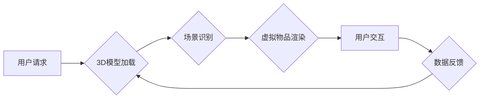

                 

## 电商平台中的AR导购系统交互优化

> 关键词：AR导购、交互优化、电商平台、用户体验、计算机视觉、深度学习、3D建模

## 1. 背景介绍

随着移动互联网和5G技术的快速发展，增强现实（AR）技术逐渐渗透到人们生活的各个方面，并为电商行业带来了新的机遇。AR导购系统作为一种新型的电商购物体验，通过将虚拟物品叠加到现实场景中，为用户提供更加直观、沉浸式的购物体验。

传统的电商购物模式主要依赖于静态图片和文字描述，用户难以准确地了解商品的尺寸、形状、颜色等信息，这往往导致用户购物决策的犹豫和退货率的增加。而AR导购系统则可以打破这种局限性，让用户在虚拟环境中试穿衣服、虚拟摆放家具，从而更直观地了解商品信息，提升购物决策的信心，最终提高用户满意度和转化率。

## 2. 核心概念与联系

AR导购系统主要包含以下核心概念：

* **增强现实（AR）：** 将虚拟信息叠加到现实世界中，以增强用户对现实世界的感知。
* **3D建模：**  将现实世界中的物体数字化，构建出三维模型，以便在虚拟环境中进行展示和交互。
* **计算机视觉：** 利用计算机技术对图像和视频进行分析和理解，例如物体识别、场景理解等。
* **深度学习：** 一种机器学习算法，能够从大量数据中学习特征，并进行预测和分类。

**AR导购系统架构流程图:**



## 3. 核心算法原理 & 具体操作步骤

### 3.1  算法原理概述

AR导购系统的核心算法主要包括：

* **目标检测算法：** 用于识别用户手机摄像头捕捉到的场景中的目标物体，例如商品、家具等。
* **姿态估计算法：** 用于估计目标物体的姿态，例如位置、方向、大小等。
* **虚拟物品渲染算法：** 用于将虚拟物品渲染到目标物体的位置，并根据目标物体的姿态进行调整。

### 3.2  算法步骤详解

1. **目标检测：** 利用深度学习算法，例如YOLO、SSD等，对用户手机摄像头捕捉到的图像进行分析，识别出场景中的目标物体。
2. **姿态估计：** 利用计算机视觉算法，例如特征点匹配、深度估计等，估计目标物体的姿态，包括位置、方向、大小等信息。
3. **虚拟物品渲染：** 根据目标物体的姿态信息，将虚拟物品渲染到目标物体的位置，并进行调整，使其与现实场景融合。
4. **用户交互：** 用户可以通过触摸、手势等方式与虚拟物品进行交互，例如旋转、缩放、移动等。
5. **数据反馈：** 用户交互的数据将反馈到系统，用于更新虚拟物品的姿态和位置，实现更加流畅的交互体验。

### 3.3  算法优缺点

**优点：**

* 提升用户购物体验：提供更加直观、沉浸式的购物体验，帮助用户更好地了解商品信息。
* 提高转化率：增强用户购物决策的信心，最终提高转化率。
* 降低退货率：用户能够更准确地了解商品信息，减少退货率。

**缺点：**

* 技术门槛高：AR导购系统的开发需要对计算机视觉、深度学习等技术有深入的了解。
* 硬件要求高：AR导购系统需要支持AR功能的手机或设备，硬件要求较高。
* 隐私安全问题：AR导购系统需要访问用户的摄像头和传感器数据，需要妥善处理用户隐私安全问题。

### 3.4  算法应用领域

AR导购算法不仅应用于电商平台，还可应用于其他领域，例如：

* **家居装修：** 用户可以通过AR技术在现实场景中虚拟摆放家具，体验不同风格的装修效果。
* **汽车销售：** 用户可以通过AR技术在现实场景中虚拟试驾汽车，体验不同车型和配置的驾驶感受。
* **医疗诊断：** 医护人员可以通过AR技术在手术过程中叠加虚拟图像，辅助诊断和手术操作。

## 4. 数学模型和公式 & 详细讲解 & 举例说明

### 4.1  数学模型构建

AR导购系统中常用的数学模型包括：

* **目标检测模型：** 通常采用深度学习模型，例如YOLO，其目标是将图像分割成网格，并预测每个网格单元中是否存在目标物体，以及目标物体的类别和位置信息。
* **姿态估计模型：** 常用计算机视觉算法，例如特征点匹配、深度估计等，其目标是根据图像信息估计目标物体的姿态，包括位置、方向、大小等信息。

### 4.2  公式推导过程

由于篇幅限制，这里只列举目标检测模型中常用的损失函数：

**损失函数：**

$$
L = \lambda_{coord} L_{coord} + \lambda_{conf} L_{conf} + \lambda_{cls} L_{cls}
$$

其中：

* $L_{coord}$：坐标损失函数，用于衡量预测框与真实框的坐标误差。
* $L_{conf}$：置信度损失函数，用于衡量预测框的置信度与真实值之间的差异。
* $L_{cls}$：类别损失函数，用于衡量预测类别与真实类别之间的差异。
* $\lambda_{coord}$、$\lambda_{conf}$、$\lambda_{cls}$：权重参数，用于平衡不同损失项的贡献。

### 4.3  案例分析与讲解

例如，YOLOv5目标检测模型使用交并比（IoU）作为坐标损失函数，其目标是使预测框与真实框的重叠区域最大化。

**IoU 公式：**

$$
IoU = \frac{Area(Intersection)}{Area(Union)}
$$

其中：

* $Area(Intersection)$：预测框与真实框的重叠区域面积。
* $Area(Union)$：预测框与真实框的并集面积。

## 5. 项目实践：代码实例和详细解释说明

### 5.1  开发环境搭建

AR导购系统的开发环境通常包括：

* **操作系统：** Android 或 iOS
* **编程语言：** Java、Kotlin 或 Swift
* **AR框架：** ARKit (iOS) 或 ARCore (Android)
* **3D建模软件：** Blender、Maya 等

### 5.2  源代码详细实现

由于篇幅限制，这里只提供一个简单的AR导购系统代码示例，用于展示AR物体渲染的基本原理：

```python
import cv2
import numpy as np
import pyrender

# 加载3D模型
model = pyrender.Mesh.from_file("model.obj")

# 创建渲染器
renderer = pyrender.OffscreenRenderer(width=640, height=480)

# 创建场景
scene = pyrender.Scene()
scene.add(model)

# 渲染场景
image = renderer.render(scene)

# 显示图像
cv2.imshow("AR导购", image)
cv2.waitKey(0)
```

### 5.3  代码解读与分析

* **加载3D模型:** 使用pyrender库加载3D模型文件。
* **创建渲染器:** 使用pyrender库创建渲染器，用于渲染场景。
* **创建场景:** 使用pyrender库创建场景，并添加3D模型。
* **渲染场景:** 使用渲染器渲染场景，生成图像。
* **显示图像:** 使用OpenCV库显示渲染后的图像。

### 5.4  运行结果展示

运行上述代码后，将显示一个包含3D模型的图像，展示了AR物体渲染的基本原理。

## 6. 实际应用场景

AR导购系统在电商平台的实际应用场景非常广泛，例如：

* **服装试衣:** 用户可以通过AR技术在手机摄像头中虚拟试穿衣服，体验不同款式和颜色的效果。
* **家居摆设:** 用户可以通过AR技术在现实场景中虚拟摆放家具，体验不同风格和布局的效果。
* **化妆试妆:** 用户可以通过AR技术在手机摄像头中虚拟试妆，体验不同彩妆效果。
* **汽车展示:** 用户可以通过AR技术在现实场景中虚拟展示汽车，体验不同车型和配置的效果。

### 6.4  未来应用展望

随着AR技术的不断发展，AR导购系统将在未来得到更广泛的应用，例如：

* **个性化推荐:** AR导购系统可以根据用户的喜好和购物历史，提供个性化的商品推荐。
* **虚拟试衣间:** AR导购系统可以构建更加逼真的虚拟试衣间，提供更丰富的试穿体验。
* **交互式购物:** AR导购系统可以支持用户与商品进行更丰富的交互，例如旋转、缩放、移动等，提升用户购物体验。

## 7. 工具和资源推荐

### 7.1  学习资源推荐

* **ARKit官方文档:** https://developer.apple.com/documentation/arkit
* **ARCore官方文档:** https://developers.google.com/ar/develop/
* **Unity AR Foundation:** https://docs.unity3d.com/Packages/com.unity.xr.arfoundation@latest/manual/index.html

### 7.2  开发工具推荐

* **Blender:** https://www.blender.org/
* **Maya:** https://www.autodesk.com/products/maya/overview
* **Unity:** https://unity.com/
* **Unreal Engine:** https://www.unrealengine.com/

### 7.3  相关论文推荐

* **YOLOv5: A Simple and Efficient Object Detection Model:** https://arxiv.org/abs/2005.10986
* **Deep Learning for Object Detection: A Survey:** https://arxiv.org/abs/1801.00659

## 8. 总结：未来发展趋势与挑战

### 8.1  研究成果总结

AR导购系统作为一种新型的电商购物体验，在提升用户购物体验、提高转化率、降低退货率等方面取得了显著的成果。

### 8.2  未来发展趋势

未来AR导购系统将朝着以下方向发展：

* **更逼真的虚拟体验:** 利用更先进的3D建模技术和渲染技术，构建更加逼真的虚拟场景，提供更沉浸式的购物体验。
* **更智能化的交互体验:** 利用人工智能技术，实现更智能化的用户交互，例如个性化推荐、语音控制等。
* **更广泛的应用场景:** AR导购系统将应用于更多领域，例如教育、医疗、旅游等。

### 8.3  面临的挑战

AR导购系统的发展也面临着一些挑战：

* **技术门槛高:** AR导购系统的开发需要对计算机视觉、深度学习等技术有深入的了解。
* **硬件要求高:** AR导购系统需要支持AR功能的手机或设备，硬件要求较高。
* **隐私安全问题:** AR导购系统需要访问用户的摄像头和传感器数据，需要妥善处理用户隐私安全问题。

### 8.4  研究展望

未来，我们需要继续加强对AR技术的研发，降低技术门槛，提升用户体验，并解决AR导购系统面临的挑战，使其更好地服务于社会发展。

## 9. 附录：常见问题与解答

**常见问题:**

* **AR导购系统需要哪些硬件设备？**

AR导购系统需要支持AR功能的手机或设备，例如支持ARKit的iPhone或支持ARCore的Android手机。

* **AR导购系统有哪些应用场景？**

AR导购系统可以应用于电商平台、家居装修、汽车销售、医疗诊断等领域。

* **如何开发AR导购系统？**

开发AR导购系统需要掌握计算机视觉、深度学习、3D建模等技术，并使用相应的开发工具和框架。

**解答:**

* AR导购系统需要支持AR功能的手机或设备，例如支持ARKit的iPhone或支持ARCore的Android手机。
* AR导购系统可以应用于电商平台、家居装修、汽车销售、医疗诊断等领域。
* 开发AR导购系统需要掌握计算机视觉、深度学习、3D建模等技术，并使用相应的开发工具和框架。


作者：禅与计算机程序设计艺术 / Zen and the Art of Computer Programming 
<end_of_turn>

