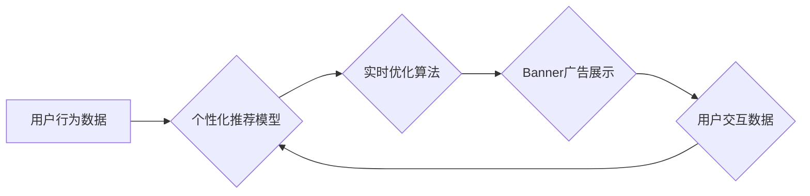

                 

## 电商平台中的实时个性化Banner优化

> 关键词：电商平台、个性化推荐、Banner优化、实时算法、机器学习、深度学习、A/B测试

## 1. 背景介绍

在当今竞争激烈的电商市场，吸引用户眼球并引导转化是平台运营的关键。Banner广告作为电商平台的重要视觉元素，在提升用户体验、促进商品曝光和驱动销售方面发挥着至关重要的作用。然而，传统的Banner广告往往采用静态、一刀切的展示方式，难以满足用户个性化需求，导致广告效果难以提升。

随着人工智能技术的快速发展，实时个性化Banner优化成为电商平台提升用户体验和商业效益的重要方向。通过对用户行为、偏好和上下文信息的深度分析，平台可以动态生成个性化的Banner广告，精准触达目标用户，提升广告点击率、转化率和用户满意度。

## 2. 核心概念与联系

### 2.1 个性化推荐

个性化推荐是指根据用户的历史行为、偏好、兴趣等信息，为用户推荐个性化的商品、服务或内容。在Banner广告中，个性化推荐可以根据用户的浏览历史、购买记录、购物车内容等信息，推荐与用户兴趣相关的商品或促销活动。

### 2.2 实时优化

实时优化是指在用户访问Banner广告时，根据用户的实时行为和上下文信息，动态调整Banner广告的展示内容、样式和位置，以最大化广告效果。例如，可以根据用户的设备类型、地理位置、时间段等信息，动态调整Banner广告的尺寸、内容和语言。

### 2.3 Banner广告

Banner广告是一种常见的网络广告形式，通常以图片或视频的形式展示在网页、移动应用等平台上。Banner广告可以用于推广商品、服务、品牌等，并通过点击或其他交互行为引导用户进行转化。

**核心架构流程图**



## 3. 核心算法原理 & 具体操作步骤

### 3.1 算法原理概述

实时个性化Banner优化的核心算法通常基于机器学习和深度学习技术，通过对用户行为数据和Banner广告表现数据进行训练，学习用户偏好和广告效果之间的关系。常见的算法包括：

* **协同过滤算法:** 基于用户的相似性或商品的相似性，推荐用户可能感兴趣的商品或广告。
* **内容基元匹配算法:** 基于商品或广告的内容特征，匹配用户的兴趣偏好，推荐相关内容。
* **深度神经网络:** 利用多层神经网络结构，学习用户行为和广告特征之间的复杂关系，实现更精准的个性化推荐。

### 3.2 算法步骤详解

1. **数据收集:** 收集用户行为数据，例如浏览历史、购买记录、购物车内容、点击行为等，以及Banner广告展示数据，例如点击率、转化率、展示次数等。
2. **数据预处理:** 对收集到的数据进行清洗、转换和特征工程，例如去除无效数据、转换数据类型、提取特征向量等。
3. **模型训练:** 选择合适的机器学习或深度学习算法，对预处理后的数据进行训练，学习用户偏好和广告效果之间的关系。
4. **模型评估:** 使用测试数据对训练好的模型进行评估，评估模型的准确率、召回率、F1-score等指标。
5. **模型部署:** 将训练好的模型部署到线上环境，实时根据用户的行为和上下文信息，动态生成个性化的Banner广告。
6. **效果监控:** 持续监控Banner广告的展示效果，例如点击率、转化率、用户满意度等，并根据效果进行模型调整和优化。

### 3.3 算法优缺点

**优点:**

* **精准推荐:** 基于用户行为和偏好，实现精准的个性化推荐，提升用户体验和广告效果。
* **实时优化:** 动态调整Banner广告内容和样式，根据用户实时行为进行优化，提升广告转化率。
* **数据驱动:** 基于数据分析和模型训练，实现数据驱动的广告优化，提升广告效果的可控性和可度量性。

**缺点:**

* **数据依赖:** 需要大量用户行为数据进行训练，数据质量和数量直接影响模型效果。
* **模型复杂:** 训练和部署深度学习模型需要较高的技术门槛和计算资源。
* **隐私安全:** 需要谨慎处理用户隐私数据，确保数据安全和用户隐私保护。

### 3.4 算法应用领域

实时个性化Banner优化算法广泛应用于电商平台、社交媒体、内容平台等领域，例如：

* **商品推荐:** 根据用户的浏览历史、购买记录等信息，推荐用户可能感兴趣的商品。
* **促销活动推广:** 根据用户的兴趣偏好和消费习惯，推荐相关的促销活动和优惠券。
* **品牌广告投放:** 根据用户的兴趣和行为特征，精准投放品牌广告，提升广告曝光率和转化率。

## 4. 数学模型和公式 & 详细讲解 & 举例说明

### 4.1 数学模型构建

假设我们有一个电商平台，用户 $u$ 的行为数据可以表示为一个向量 $u = (u_1, u_2, ..., u_n)$，其中 $u_i$ 表示用户 $u$ 在第 $i$ 个商品上的行为，例如浏览次数、购买次数等。Banner广告 $a$ 的特征向量可以表示为 $a = (a_1, a_2, ..., a_m)$，其中 $a_j$ 表示Banner广告 $a$ 的第 $j$ 个特征，例如图片类型、文字内容、颜色等。

我们的目标是预测用户 $u$ 点击Banner广告 $a$ 的概率，可以使用以下数学模型：

$$P(u \text{ clicks } a) = \sigma(w^T \cdot [u; a] + b)$$

其中：

* $P(u \text{ clicks } a)$ 表示用户 $u$ 点击Banner广告 $a$ 的概率。
* $\sigma$ 是sigmoid函数，用于将预测值映射到0到1之间。
* $w$ 是模型参数向量，表示用户行为和Banner广告特征之间的权重。
* $[u; a]$ 是将用户行为向量和Banner广告特征向量拼接在一起的向量。
* $b$ 是模型偏置项。

### 4.2 公式推导过程

该模型的训练目标是最大化预测点击概率与实际点击行为的匹配度。可以使用交叉熵损失函数来衡量模型的预测误差：

$$L = -\sum_{u, a} y_{u, a} \log(P(u \text{ clicks } a)) + (1 - y_{u, a}) \log(1 - P(u \text{ clicks } a))$$

其中：

* $y_{u, a}$ 是用户 $u$ 点击Banner广告 $a$ 的真实标签，为1表示点击，为0表示未点击。

可以使用梯度下降算法来优化模型参数 $w$ 和 $b$，使损失函数最小化。

### 4.3 案例分析与讲解

假设我们有一个电商平台，用户 $u$ 的行为数据为 $(1, 0, 2, 0)$，表示用户 $u$ 在四个商品上分别浏览了一次、未购买、浏览了两次、未购买。Banner广告 $a$ 的特征向量为 $(0.8, 0.2, 0.5, 0.3)$，表示Banner广告 $a$ 的图片类型为0.8，文字内容为0.2，颜色为0.5，位置为0.3。

根据上述模型，我们可以计算用户 $u$ 点击Banner广告 $a$ 的概率：

$$P(u \text{ clicks } a) = \sigma(w^T \cdot [u; a] + b)$$

其中 $w$ 和 $b$ 是模型训练得到的参数。

通过训练模型，我们可以得到 $w$ 和 $b$ 的值，并计算出用户 $u$ 点击Banner广告 $a$ 的概率。如果该概率高于某个阈值，则平台会将Banner广告 $a$ 展示给用户 $u$。

## 5. 项目实践：代码实例和详细解释说明

### 5.1 开发环境搭建

* **操作系统:** Linux/macOS/Windows
* **编程语言:** Python
* **深度学习框架:** TensorFlow/PyTorch
* **数据处理库:** Pandas/NumPy
* **机器学习库:** Scikit-learn

### 5.2 源代码详细实现

```python
import tensorflow as tf

# 定义模型结构
model = tf.keras.Sequential([
    tf.keras.layers.Dense(64, activation='relu', input_shape=(n_features,)),
    tf.keras.layers.Dense(32, activation='relu'),
    tf.keras.layers.Dense(1, activation='sigmoid')
])

# 编译模型
model.compile(optimizer='adam', loss='binary_crossentropy', metrics=['accuracy'])

# 训练模型
model.fit(X_train, y_train, epochs=10, batch_size=32)

# 评估模型
loss, accuracy = model.evaluate(X_test, y_test)
print('Loss:', loss)
print('Accuracy:', accuracy)

# 预测点击概率
predictions = model.predict(X_new)
```

### 5.3 代码解读与分析

* **模型结构:** 该代码定义了一个简单的深度神经网络模型，包含三个全连接层和一个sigmoid激活函数的输出层。
* **模型编译:** 使用Adam优化器、二分类交叉熵损失函数和准确率作为评估指标来编译模型。
* **模型训练:** 使用训练数据训练模型，设置训练轮数和批处理大小。
* **模型评估:** 使用测试数据评估模型的性能，输出损失值和准确率。
* **预测点击概率:** 使用训练好的模型预测新数据的点击概率。

### 5.4 运行结果展示

运行代码后，会输出模型的训练损失、准确率以及对新数据的预测结果。

## 6. 实际应用场景

### 6.1 电商平台商品推荐

电商平台可以利用实时个性化Banner优化算法，根据用户的浏览历史、购买记录等信息，推荐用户可能感兴趣的商品，提升用户体验和转化率。例如，当用户浏览了某款手机后，平台可以根据用户的兴趣偏好，在Banner广告中推荐其他相关手机型号、配件或优惠活动。

### 6.2 社交媒体广告投放

社交媒体平台可以利用实时个性化Banner优化算法，精准投放广告，提升广告效果。例如，当用户在社交媒体上关注某个品牌或话题后，平台可以根据用户的兴趣偏好，在Banner广告中投放该品牌的广告或相关话题的广告。

### 6.3 内容平台个性化内容推荐

内容平台可以利用实时个性化Banner优化算法，根据用户的阅读习惯、观看历史等信息，推荐用户可能感兴趣的内容，提升用户粘性和参与度。例如，当用户阅读了某个领域的新闻文章后，平台可以根据用户的兴趣偏好，在Banner广告中推荐其他相关领域的新闻文章、视频或专题。

### 6.4 未来应用展望

随着人工智能技术的不断发展，实时个性化Banner优化算法将应用于更多领域，例如：

* **医疗保健:** 根据患者的病史、症状等信息，推荐个性化的医疗服务和健康资讯。
* **教育:** 根据学生的学习进度、兴趣偏好等信息，推荐个性化的学习资源和课程。
* **金融:** 根据用户的投资习惯、风险偏好等信息，推荐个性化的理财产品和投资建议。

## 7. 工具和资源推荐

### 7.1 学习资源推荐

* **书籍:**
    * 《深度学习》 - Ian Goodfellow, Yoshua Bengio, Aaron Courville
    * 《机器学习》 - Tom Mitchell
* **在线课程:**
    * Coursera: 深度学习 Specialization
    * Udacity: 机器学习 Engineer Nanodegree
* **博客和网站:**
    * TensorFlow Blog: https://blog.tensorflow.org/
    * PyTorch Blog: https://pytorch.org/blog/

### 7.2 开发工具推荐

* **深度学习框架:** TensorFlow, PyTorch
* **数据处理库:** Pandas, NumPy
* **机器学习库:** Scikit-learn
* **云计算平台:** AWS, Azure, GCP

### 7.3 相关论文推荐

* **Collaborative Filtering for Implicit Feedback Datasets** -  Rendle, S., et al. (2010)
* **Deep Learning Recommendations for Personalization** -  Wang, R., et al. (2016)
* **Attention Is All You Need** - Vaswani, A., et al. (2017)

## 8. 总结：未来发展趋势与挑战

### 8.1 研究成果总结

实时个性化Banner优化算法在电商平台、社交媒体、内容平台等领域取得了显著成果，提升了用户体验、广告效果和商业效益。

### 8.2 未来发展趋势

* **更精准的个性化推荐:** 利用更先进的机器学习和深度学习算法，例如Transformer模型，实现更精准的个性化推荐。
* **多模态数据融合:** 将文本、图像、视频等多模态数据融合到Banner广告优化模型中，实现更全面的用户画像和个性化推荐。
* **实时动态优化:** 利用实时用户行为数据，动态调整Banner广告内容和样式，实现更精准的实时优化。
* **隐私保护:** 开发更隐私保护的个性化推荐算法，保障用户隐私安全。

### 8.3 面临的挑战

* **数据质量和数量:** 个性化推荐算法依赖于高质量、大规模的用户行为数据，数据质量和数量直接影响模型效果。
* **模型复杂度:** 深度学习模型的训练和部署需要较高的技术门槛和计算资源。
* **用户隐私安全:** 个性化推荐算法需要处理大量用户隐私数据，需要采取有效措施保障用户隐私安全。

### 8.4 研究展望

未来，实时个性化Banner优化算法将继续朝着更精准、更智能、更隐私保护的方向发展，为用户提供更个性化、更优质的体验，并为电商平台、社交媒体、内容平台等领域带来更大的商业价值。

## 9. 附录：常见问题与解答

**Q1: 如何收集高质量的用户行为数据？**

A1: 可以通过以下方式收集高质量的用户行为数据：

* **网站和移动应用日志:** 记录用户在网站或移动应用上的所有行为，例如浏览历史、点击行为、购买记录等。
* **用户调查问卷:** 收集用户对商品、服务和广告的反馈意见。
* **A/B测试:** 通过对比不同版本的Banner广告，收集用户点击和转化行为数据。

**Q2: 如何处理用户隐私数据？**

A2: 处理用户隐私数据需要采取以下措施：

* **匿名化数据:** 将用户个人信息从数据中移除，避免直接识别用户身份。
* **加密数据:** 使用加密技术保护用户数据安全。
* **获得用户同意:** 在收集和使用用户数据之前，需要获得用户的明确同意。

**Q3: 如何评估个性化推荐算法的性能？**

A3: 可以使用以下指标评估个性化推荐算法的性能：

* **点击率:** 用户点击广告的比例。
* **转化率:** 用户点击广告后完成购买或其他目标行为的比例。
* **准确率:** 推荐的商品与用户实际兴趣相符的比例。
* **召回率:** 推荐的商品中包含用户实际感兴趣的商品的比例。


作者：禅与计算机程序设计艺术 / Zen and the Art of Computer Programming<end_of_turn>

