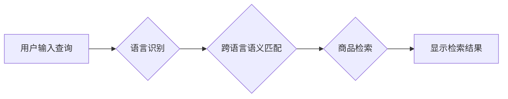

                 

## 1. 背景介绍

随着全球化进程的加速，跨境电商的蓬勃发展，用户对商品的搜索需求不再局限于单一语言。如何实现跨语言商品匹配与检索，为用户提供更精准、更便捷的购物体验，成为电商搜索领域亟待解决的关键问题。传统的基于单一语言的搜索算法难以满足跨语言搜索的需求，需要引入新的技术和方法来解决语言差异带来的挑战。

## 2. 核心概念与联系

### 2.1 跨语言商品匹配

跨语言商品匹配是指将不同语言的商品描述进行匹配，识别出语义上相似的商品。例如，将英文商品描述“red dress”与中文商品描述“红色连衣裙”进行匹配，识别出它们指的是同一种商品。

### 2.2 跨语言商品检索

跨语言商品检索是指根据用户输入的跨语言查询，从商品库中检索出与查询语义相似的商品。例如，用户输入英文查询“blue shirt”，系统需要从商品库中检索出所有与“蓝色衬衫”语义相似的商品，无论其商品描述是英文还是中文。

**跨语言商品匹配与检索流程图**



## 3. 核心算法原理 & 具体操作步骤

### 3.1 算法原理概述

跨语言商品匹配与检索的核心算法主要基于以下几个方面：

* **语言识别:** 识别用户输入的查询语言，并将其转换为目标语言。
* **跨语言语义匹配:** 将不同语言的商品描述进行语义匹配，识别出语义上相似的商品。
* **商品检索:** 根据用户输入的跨语言查询，从商品库中检索出与查询语义相似的商品。

### 3.2 算法步骤详解

1. **用户输入查询:** 用户输入查询，例如“红色连衣裙”。
2. **语言识别:** 系统识别用户输入的语言，例如中文。
3. **跨语言语义匹配:** 系统将用户输入的查询转换为目标语言，例如英文“red dress”，并与商品库中的商品描述进行语义匹配。可以使用词嵌入技术、机器翻译技术等方法进行语义匹配。
4. **商品检索:** 系统根据语义匹配结果，从商品库中检索出与查询语义相似的商品。
5. **显示检索结果:** 系统将检索到的商品信息显示给用户。

### 3.3 算法优缺点

**优点:**

* 可以实现跨语言商品匹配与检索，满足用户跨语言搜索的需求。
* 可以提高商品搜索的准确率和效率。

**缺点:**

* 跨语言语义匹配的难度较大，需要复杂的算法和模型。
* 需要大量的语料数据进行训练和测试。

### 3.4 算法应用领域

跨语言商品匹配与检索技术广泛应用于以下领域：

* 跨境电商平台
* 在线旅游平台
* 在线教育平台
* 搜索引擎

## 4. 数学模型和公式 & 详细讲解 & 举例说明

### 4.1 数学模型构建

跨语言商品匹配与检索的核心是将不同语言的商品描述进行语义匹配。可以使用词嵌入技术来构建数学模型，将单词映射到低维向量空间中，语义相似的单词在向量空间中距离较近。

**词嵌入模型**

假设我们有两个语言的单词，分别为英文单词“red”和中文单词“红色”。可以使用词嵌入模型将这两个单词映射到同一个低维向量空间中，例如300维向量空间。

*  **英文单词“red”的向量表示:**  r = [0.1, 0.2, 0.3, ..., 0.300]
*  **中文单词“红色”的向量表示:**  c = [0.2, 0.1, 0.3, ..., 0.300]

其中，r和c分别代表英文单词“red”和中文单词“红色”在300维向量空间中的向量表示。

### 4.2 公式推导过程

可以使用余弦相似度来衡量两个单词的语义相似度。余弦相似度的公式如下：

$$
\text{相似度} = \frac{r \cdot c}{||r|| ||c||}
$$

其中：

* r 和 c 分别是两个单词的向量表示。
* r ⋅ c 是两个向量之间的点积。
* ||r|| 和 ||c|| 分别是两个向量的模长。

### 4.3 案例分析与讲解

假设我们有两个商品描述，一个是英文描述“red dress”，另一个是中文描述“红色连衣裙”。我们可以使用词嵌入模型将这两个描述转换为向量表示，然后使用余弦相似度计算它们的语义相似度。如果语义相似度较高，则认为这两个商品描述指的是同一种商品。

## 5. 项目实践：代码实例和详细解释说明

### 5.1 开发环境搭建

* 操作系统: Ubuntu 20.04
* Python 版本: 3.8
* 必要的库: numpy, pandas, gensim, transformers

### 5.2 源代码详细实现

```python
import gensim.downloader as api
from gensim.models import Word2Vec
from sklearn.metrics.pairwise import cosine_similarity

# 下载预训练的词嵌入模型
model = api.load("glove-wiki-gigaword-100")

# 将商品描述转换为向量表示
def get_vector(text):
    words = text.lower().split()
    vector = sum([model[word] for word in words if word in model]) / len(words)
    return vector

# 计算两个商品描述的语义相似度
def calculate_similarity(text1, text2):
    vector1 = get_vector(text1)
    vector2 = get_vector(text2)
    similarity = cosine_similarity(vector1.reshape(1, -1), vector2.reshape(1, -1))[0][0]
    return similarity

# 示例代码
text1 = "red dress"
text2 = "红色连衣裙"
similarity = calculate_similarity(text1, text2)
print(f"语义相似度: {similarity}")
```

### 5.3 代码解读与分析

* 该代码首先下载预训练的词嵌入模型，例如GloVe模型。
* 然后定义了一个函数`get_vector`，将商品描述转换为向量表示。该函数将商品描述转换为小写，然后将每个单词转换为对应的词向量，并将所有词向量求平均值作为商品描述的向量表示。
* 接着定义了一个函数`calculate_similarity`，计算两个商品描述的语义相似度。该函数使用余弦相似度公式计算两个向量之间的相似度。
* 最后，示例代码演示了如何使用这两个函数计算两个商品描述的语义相似度。

### 5.4 运行结果展示

运行该代码后，会输出两个商品描述的语义相似度。例如，如果输出结果为0.8，则表示这两个商品描述语义相似度较高。

## 6. 实际应用场景

### 6.1 跨境电商平台

跨境电商平台可以利用跨语言商品匹配与检索技术，为来自不同国家和地区的客户提供更精准的商品搜索体验。例如，用户可以输入中文查询，系统可以识别用户语言，并从商品库中检索出与查询语义相似的商品，无论其商品描述是英文还是其他语言。

### 6.2 在线旅游平台

在线旅游平台可以利用跨语言商品匹配与检索技术，为来自不同国家和地区的客户提供更精准的旅游产品搜索体验。例如，用户可以输入中文查询，系统可以识别用户语言，并从旅游产品库中检索出与查询语义相似的旅游产品，无论其产品描述是英文还是其他语言。

### 6.3 在线教育平台

在线教育平台可以利用跨语言商品匹配与检索技术，为来自不同国家和地区的客户提供更精准的课程搜索体验。例如，用户可以输入中文查询，系统可以识别用户语言，并从课程库中检索出与查询语义相似的课程，无论其课程描述是英文还是其他语言。

### 6.4 未来应用展望

随着人工智能技术的不断发展，跨语言商品匹配与检索技术将得到更广泛的应用，例如：

* **个性化推荐:** 基于用户历史搜索记录和偏好，提供更个性化的商品推荐。
* **跨语言对话:** 实现跨语言的商品咨询和服务，为用户提供更便捷的购物体验。
* **多模态搜索:** 将文本、图像、语音等多种模态信息融合，实现更精准的商品搜索。

## 7. 工具和资源推荐

### 7.1 学习资源推荐

* **斯坦福大学自然语言处理课程:** https://web.stanford.edu/class/cs224n/
* **深度学习课程:** https://www.deeplearning.ai/
* **Hugging Face Transformers:** https://huggingface.co/transformers/

### 7.2 开发工具推荐

* **Gensim:** https://radimrehurek.com/gensim/
* **SpaCy:** https://spacy.io/
* **Transformers:** https://huggingface.co/transformers/

### 7.3 相关论文推荐

* **BERT: Pre-training of Deep Bidirectional Transformers for Language Understanding:** https://arxiv.org/abs/1810.04805
* **XLNet: Generalized Autoregressive Pretraining for Language Understanding:** https://arxiv.org/abs/1906.08237
* **T5: Text-to-Text Transfer Transformer:** https://arxiv.org/abs/1910.10683

## 8. 总结：未来发展趋势与挑战

### 8.1 研究成果总结

跨语言商品匹配与检索技术取得了显著进展，特别是深度学习技术的应用，使得跨语言语义匹配的准确率大幅提升。

### 8.2 未来发展趋势

* **更精准的语义匹配:** 研究更先进的跨语言语义匹配算法，提高语义匹配的准确率和鲁棒性。
* **多模态搜索:** 将文本、图像、语音等多种模态信息融合，实现更精准的商品搜索。
* **个性化推荐:** 基于用户历史搜索记录和偏好，提供更个性化的商品推荐。

### 8.3 面临的挑战

* **跨语言语义理解的复杂性:** 不同语言的语义表达方式存在差异，跨语言语义理解仍然是一个挑战。
* **数据稀缺性:** 跨语言语料数据相对稀缺，这限制了模型的训练和性能提升。
* **计算资源需求:** 训练大型语言模型需要大量的计算资源，这对于一些小型企业来说是一个挑战。

### 8.4 研究展望

未来，跨语言商品匹配与检索技术将继续朝着更精准、更智能、更个性化的方向发展，为用户提供更便捷、更优质的购物体验。


## 9. 附录：常见问题与解答

**Q1: 如何选择合适的词嵌入模型？**

**A1:** 选择词嵌入模型需要根据具体应用场景和数据特点进行选择。常用的词嵌入模型包括Word2Vec、GloVe、FastText等。

**Q2: 如何处理跨语言语义歧义？**

**A2:** 跨语言语义歧义是一个复杂的问题，需要结合语境信息、词义消歧等技术进行处理。

**Q3: 如何评估跨语言商品匹配与检索的性能？**

**A3:** 可以使用准确率、召回率、F1-score等指标来评估跨语言商品匹配与检索的性能。

**作者：禅与计算机程序设计艺术 / Zen and the Art of Computer Programming**<end_of_turn>

