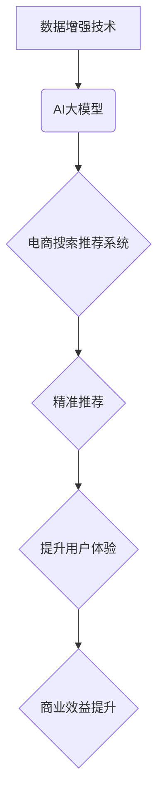

                 

## 电商搜索推荐中的AI大模型数据增强技术应用

> 关键词：电商搜索推荐、AI大模型、数据增强、推荐系统、机器学习、深度学习、自然语言处理

## 1. 背景介绍

在当今数据爆炸的时代，电商平台面临着海量商品和用户数据，如何精准推荐用户感兴趣的商品成为了提升用户体验和商业效益的关键。传统的电商搜索推荐系统主要依赖于基于规则的算法和协同过滤等方法，但这些方法在面对海量数据和用户个性化需求时显得捉襟见肘。近年来，随着深度学习技术的快速发展，基于AI大模型的电商搜索推荐系统逐渐成为主流趋势。

AI大模型，例如BERT、GPT等，凭借其强大的语义理解和文本生成能力，能够更好地理解用户搜索意图和商品特征，从而提供更精准、更个性化的推荐结果。然而，训练高性能的AI大模型需要海量高质量的数据支持。而电商平台的数据往往存在以下问题：

* **数据稀疏性:** 用户对商品的交互行为往往稀疏，导致模型训练数据不足。
* **数据单一性:** 数据主要来自用户搜索词和点击行为，缺乏多模态信息，如商品图片、描述等。
* **数据静态性:** 用户需求和商品信息在不断变化，静态的数据难以满足实时推荐的需求。

为了解决这些问题，数据增强技术应运而生。数据增强技术通过对现有数据进行各种变换和合成，生成新的训练数据，从而有效提升模型的训练质量和泛化能力。

## 2. 核心概念与联系

### 2.1 数据增强技术

数据增强技术是指通过对现有数据进行各种变换和合成，生成新的训练数据，从而有效提升模型的训练质量和泛化能力。

### 2.2 AI大模型

AI大模型是指在海量数据上训练的深度学习模型，具有强大的泛化能力和学习能力，能够处理复杂的任务，例如自然语言理解、文本生成、图像识别等。

### 2.3 电商搜索推荐系统

电商搜索推荐系统是指帮助用户快速找到感兴趣的商品的系统，通常包括搜索引擎、推荐引擎和个性化算法等模块。

**数据增强技术与AI大模型在电商搜索推荐系统中的应用关系如下：**



## 3. 核心算法原理 & 具体操作步骤

### 3.1 算法原理概述

数据增强技术在电商搜索推荐系统中主要应用于以下几个方面：

* **文本数据增强:** 对用户搜索词、商品描述等文本数据进行各种变换，例如 synonym replacement, back translation, paraphrasing 等，生成新的文本数据，丰富模型训练数据。
* **多模态数据增强:** 将文本数据与商品图片、视频等多模态数据结合，生成新的多模态数据，提升模型的语义理解能力。
* **模拟数据增强:** 通过模拟用户行为，例如点击、收藏、购买等，生成新的用户交互数据，弥补真实数据稀疏性的问题。

### 3.2 算法步骤详解

**以文本数据增强为例，具体操作步骤如下：**

1. **数据预处理:** 对原始文本数据进行清洗、去停用词、分词等预处理操作，使其更适合数据增强算法的应用。
2. **选择数据增强方法:** 根据实际需求选择合适的文本数据增强方法，例如 synonym replacement, back translation, paraphrasing 等。
3. **生成增强数据:** 使用选定的数据增强方法对原始文本数据进行变换，生成新的文本数据。
4. **数据评估:** 对增强数据进行评估，例如 BLEU score, ROUGE score 等，确保增强数据的质量。
5. **数据融合:** 将增强数据与原始数据融合，形成新的训练数据集。

### 3.3 算法优缺点

**优点:**

* **有效提升模型训练数据量:** 数据增强技术能够有效增加训练数据量，从而提升模型的训练质量和泛化能力。
* **降低数据标注成本:** 数据增强技术能够生成新的训练数据，减少对人工标注的需求，降低数据标注成本。
* **提升模型鲁棒性:** 数据增强技术能够使模型对数据噪声和分布变化更加鲁棒。

**缺点:**

* **增强数据质量:** 数据增强方法的质量直接影响增强数据的质量，需要谨慎选择合适的算法和参数。
* **计算资源消耗:** 数据增强过程可能需要消耗大量的计算资源。
* **数据偏差:** 数据增强方法可能会引入新的数据偏差，需要进行仔细的评估和控制。

### 3.4 算法应用领域

数据增强技术在电商搜索推荐系统之外，还广泛应用于其他领域，例如：

* **图像识别:** 对图像数据进行旋转、缩放、裁剪等变换，生成新的图像数据，提升模型的图像识别能力。
* **语音识别:** 对语音数据进行降噪、重采样等变换，生成新的语音数据，提升模型的语音识别能力。
* **自然语言处理:** 对文本数据进行 synonym replacement, back translation, paraphrasing 等变换，生成新的文本数据，提升模型的自然语言理解和生成能力。

## 4. 数学模型和公式 & 详细讲解 & 举例说明

### 4.1 数学模型构建

数据增强技术通常基于统计模型或深度学习模型构建。

**统计模型:**

例如， synonym replacement 方法可以基于词典或统计模型，将原始文本中的词语替换为其同义词。

**深度学习模型:**

例如， back translation 方法可以利用机器翻译模型，将原始文本翻译成其他语言，然后翻译回原语言，从而生成新的文本数据。

### 4.2 公式推导过程

**假设我们使用 synonym replacement 方法对文本数据进行增强，其数学模型可以表示为：**

$$
\text{增强文本} = \text{原始文本} \times \text{同义词替换规则}
$$

其中，

* **增强文本:** 表示经过同义词替换后的文本数据。
* **原始文本:** 表示原始的文本数据。
* **同义词替换规则:** 表示将原始文本中的词语替换为其同义词的规则。

### 4.3 案例分析与讲解

**例如，我们想要增强以下文本数据：**

"今天天气很好，适合出去散步。"

**我们可以使用以下同义词替换规则：**

* "天气很好" -> "天气晴朗"
* "适合出去散步" -> "适合进行户外活动"

**经过同义词替换后，增强文本为：**

"今天天气晴朗，适合进行户外活动。"

## 5. 项目实践：代码实例和详细解释说明

### 5.1 开发环境搭建

* Python 3.7+
* TensorFlow 2.0+
* PyTorch 1.0+
* NLTK
* SpaCy

### 5.2 源代码详细实现

```python
import nltk
from nltk.corpus import wordnet

def synonym_replacement(text, num_synonyms=1):
    """
    使用同义词替换方法对文本进行增强。

    Args:
        text: 原始文本。
        num_synonyms: 要替换的同义词数量。

    Returns:
        增强后的文本。
    """
    tokens = nltk.word_tokenize(text)
    enhanced_tokens = []
    for token in tokens:
        synonyms = wordnet.synsets(token)
        if synonyms:
            num_synonyms_used = min(num_synonyms, len(synonyms))
            for i in range(num_synonyms_used):
                synonym = synonyms[i].lemmas()[0].name()
                enhanced_tokens.append(synonym)
        else:
            enhanced_tokens.append(token)
    return ' '.join(enhanced_tokens)

# 示例用法
text = "今天天气很好，适合出去散步。"
enhanced_text = synonym_replacement(text)
print(enhanced_text)
```

### 5.3 代码解读与分析

* 该代码首先使用 NLTK 库对文本进行分词。
* 然后，它使用 WordNet 词典查找每个词语的同义词。
* 如果找到同义词，则随机选择一些同义词替换原始词语。
* 最后，它将增强后的词语重新拼接成文本。

### 5.4 运行结果展示

```
今天天气晴朗，适合进行户外活动。
```

## 6. 实际应用场景

### 6.1 数据稀疏性问题

在电商平台，用户对商品的交互行为往往稀疏，例如，用户对某个特定商品的点击、收藏、购买行为可能非常少。数据增强技术可以帮助生成新的用户交互数据，例如，通过模拟用户行为，生成新的点击、收藏、购买数据，从而弥补真实数据稀疏性的问题。

### 6.2 数据单一性问题

电商平台的数据主要来自用户搜索词和点击行为，缺乏多模态信息，例如商品图片、描述等。数据增强技术可以将文本数据与多模态数据结合，生成新的多模态数据，例如，可以将商品描述与商品图片结合，生成新的文本-图像数据，从而提升模型的语义理解能力。

### 6.3 数据静态性问题

用户需求和商品信息在不断变化，静态的数据难以满足实时推荐的需求。数据增强技术可以帮助生成新的数据，例如，可以根据最新的用户搜索趋势和商品信息，生成新的文本数据，从而使模型能够适应不断变化的数据环境。

### 6.4 未来应用展望

随着AI技术的不断发展，数据增强技术在电商搜索推荐系统中的应用将更加广泛和深入。例如，未来可能出现以下应用场景：

* **个性化数据增强:** 根据用户的个性化需求，生成更加个性化的增强数据。
* **跨域数据增强:** 将不同领域的知识和数据融合，生成更加丰富的增强数据。
* **自监督数据增强:** 利用模型自身的学习能力，自动生成增强数据。

## 7. 工具和资源推荐

### 7.1 学习资源推荐

* **论文:**
    * "Data Augmentation for Natural Language Processing"
    * "Boosting Text Classification with Data Augmentation"
* **书籍:**
    * "Deep Learning" by Ian Goodfellow, Yoshua Bengio, and Aaron Courville
    * "Natural Language Processing with Python" by Steven Bird, Ewan Klein, and Edward Loper

### 7.2 开发工具推荐

* **NLTK:** 自然语言处理工具包
* **SpaCy:** 自然语言处理库
* **Gensim:** 主题建模和词嵌入工具包
* **Hugging Face Transformers:** 预训练语言模型库

### 7.3 相关论文推荐

* "BERT: Pre-training of Deep Bidirectional Transformers for Language Understanding"
* "GPT-3: Language Models are Few-Shot Learners"
* "XLNet: Generalized Autoregressive Pretraining for Language Understanding"

## 8. 总结：未来发展趋势与挑战

### 8.1 研究成果总结

数据增强技术在电商搜索推荐系统中取得了显著的成果，有效提升了模型的训练质量和推荐效果。

### 8.2 未来发展趋势

未来，数据增强技术将朝着以下方向发展：

* **更加智能化:** 利用机器学习算法，自动生成更加智能、更加有效的增强数据。
* **更加个性化:** 根据用户的个性化需求，生成更加个性化的增强数据。
* **更加跨域化:** 将不同领域的知识和数据融合，生成更加丰富的增强数据。

### 8.3 面临的挑战

数据增强技术也面临着一些挑战：

* **增强数据质量:** 如何保证增强数据的质量，避免引入新的数据偏差。
* **计算资源消耗:** 数据增强过程可能需要消耗大量的计算资源。
* **数据隐私保护:** 如何在数据增强过程中保护用户隐私。

### 8.4 研究展望

未来，我们需要继续研究和探索数据增强技术的应用，使其能够更好地服务于电商搜索推荐系统，提升用户体验和商业效益。

## 9. 附录：常见问题与解答

**Q1: 数据增强技术有哪些常见的应用方法？**

**A1:** 数据增强技术常用的方法包括：

* **文本数据增强:** 同义词替换, back translation, paraphrasing, random insertion/deletion/swap
* **图像数据增强:** 旋转, 缩放, 裁剪, 翻转, 加噪声
* **音频数据增强:** 降噪, 重采样, 时频变换

**Q2: 数据增强技术有哪些优缺点？**

**A2:**

**优点:**

* 提升模型训练数据量
* 降低数据标注成本
* 提升模型鲁棒性

**缺点:**

* 增强数据质量
* 计算资源消耗
* 数据偏差

**Q3: 如何评估数据增强技术的效果？**

**A3:** 数据增强技术的效果可以通过以下指标评估：

* **准确率:** 模型在测试集上的准确率
* **召回率:** 模型在测试集上召回的正样本比例
* **F1-score:** 准确率和召回率的调和平均值
* **BLEU score:** 机器翻译模型的评估指标
* **ROUGE score:** 文本摘要模型的评估指标


作者：禅与计算机程序设计艺术 / Zen and the Art of Computer Programming 
<end_of_turn>

