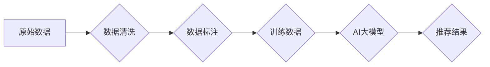

                 

## 1. 背景介绍

在当今数据爆炸的时代，电商平台面临着海量商品和用户数据，如何精准推荐用户感兴趣的商品，提升用户体验和转化率成为关键挑战。传统基于规则的推荐系统难以应对数据复杂性和用户个性化的需求。而近年来，基于AI大模型的推荐系统凭借其强大的学习能力和精准度，逐渐成为电商平台推荐的核心技术。

AI大模型的训练离不开高质量的数据标注和清洗。数据标注是指对原始数据进行人工标记，赋予其特定的标签或属性，使其能够被模型理解和学习。数据清洗是指对原始数据进行处理，去除噪声、错误和重复数据，保证数据的准确性和一致性。高质量的数据标注和清洗对于AI大模型的训练效果至关重要，直接影响着推荐系统的精准度和用户体验。

## 2. 核心概念与联系

### 2.1  电商搜索推荐系统

电商搜索推荐系统旨在帮助用户快速找到所需商品，并根据用户的兴趣和偏好，推荐相关商品。系统通常由以下几个模块组成：

* **搜索引擎模块:** 处理用户搜索词，并返回相关商品列表。
* **推荐引擎模块:** 基于用户行为、商品属性等数据，推荐用户可能感兴趣的商品。
* **展示模块:** 将搜索结果和推荐结果以用户友好的方式展示给用户。

### 2.2  AI大模型

AI大模型是指参数规模庞大、训练数据海量的人工智能模型。这类模型通常具有强大的泛化能力和学习能力，能够处理复杂的任务，例如自然语言处理、图像识别、推荐系统等。

### 2.3  数据标注与清洗

数据标注是指对原始数据进行人工标记，赋予其特定的标签或属性，使其能够被模型理解和学习。数据清洗是指对原始数据进行处理，去除噪声、错误和重复数据，保证数据的准确性和一致性。

**数据标注与清洗与AI大模型的关系:**

数据标注和清洗是AI大模型训练的基础。高质量的数据标注可以帮助模型学习到更准确的知识和规律，而高质量的数据清洗可以保证模型的训练稳定性和准确性。

**数据标注与清洗流程:**



## 3. 核心算法原理 & 具体操作步骤

### 3.1  算法原理概述

电商搜索推荐中的AI大模型通常采用深度学习算法，例如Transformer、BERT等。这些算法能够学习到用户和商品之间的复杂关系，并生成精准的推荐结果。

### 3.2  算法步骤详解

1. **数据预处理:** 对原始数据进行清洗、格式化和转换，使其符合模型的输入要求。
2. **特征工程:** 从原始数据中提取特征，例如商品属性、用户行为、文本描述等，并将其转换为模型能够理解的数值格式。
3. **模型训练:** 使用训练数据训练AI大模型，调整模型参数，使其能够准确地预测用户对商品的兴趣。
4. **模型评估:** 使用测试数据评估模型的性能，例如准确率、召回率、点击率等。
5. **模型部署:** 将训练好的模型部署到线上环境，用于实时推荐商品。

### 3.3  算法优缺点

**优点:**

* 精准度高: 深度学习算法能够学习到用户和商品之间的复杂关系，生成更精准的推荐结果。
* 可扩展性强: 深度学习模型能够处理海量数据，并随着数据量的增加而提升性能。
* 个性化强: 深度学习模型能够根据用户的历史行为和偏好，提供个性化的推荐。

**缺点:**

* 数据依赖性强: 深度学习模型需要大量的训练数据才能达到良好的性能。
* 计算资源消耗大: 训练深度学习模型需要大量的计算资源和时间。
* 黑盒效应: 深度学习模型的决策过程较为复杂，难以解释其推荐结果背后的逻辑。

### 3.4  算法应用领域

* **电商推荐:** 推荐商品、优惠券、广告等。
* **内容推荐:** 推荐新闻、视频、文章等。
* **社交推荐:** 推荐好友、群组、活动等。
* **医疗推荐:** 推荐医生、医院、药物等。

## 4. 数学模型和公式 & 详细讲解 & 举例说明

### 4.1  数学模型构建

在电商搜索推荐中，常用的数学模型包括协同过滤模型、内容过滤模型和混合模型。

* **协同过滤模型:** 基于用户之间的相似性和商品之间的相似性，推荐用户可能感兴趣的商品。
* **内容过滤模型:** 基于商品的属性和用户偏好，推荐用户可能感兴趣的商品。
* **混合模型:** 将协同过滤模型和内容过滤模型相结合，提高推荐的准确性和个性化程度。

### 4.2  公式推导过程

协同过滤模型中常用的公式包括：

* **用户相似度计算公式:**

$$
Sim(u_i, u_j) = \frac{\sum_{m \in M(u_i \cap u_j)} r_{i,m} \cdot r_{j,m}}{\sqrt{\sum_{m \in M(u_i)} r_{i,m}^2} \cdot \sqrt{\sum_{m \in M(u_j)} r_{j,m}^2}}
$$

其中：

* $u_i$ 和 $u_j$ 表示两个用户。
* $M(u_i \cap u_j)$ 表示两个用户共同评分的商品集合。
* $r_{i,m}$ 表示用户 $u_i$ 对商品 $m$ 的评分。

* **商品推荐公式:**

$$
P(u_i, m) = \frac{\sum_{j \in N(u_i)} Sim(u_i, u_j) \cdot r_{j,m}}{\sum_{j \in N(u_i)} Sim(u_i, u_j)}
$$

其中：

* $N(u_i)$ 表示与用户 $u_i$ 相似的用户集合。
* $P(u_i, m)$ 表示用户 $u_i$ 对商品 $m$ 的推荐概率。

### 4.3  案例分析与讲解

假设有两个用户 $u_1$ 和 $u_2$，他们都对商品 $m_1$ 和 $m_2$ 进行了评分，评分结果如下：

* $u_1$ 对 $m_1$ 的评分为 5，对 $m_2$ 的评分为 3。
* $u_2$ 对 $m_1$ 的评分为 4，对 $m_2$ 的评分为 5。

根据协同过滤模型的用户相似度计算公式，我们可以计算出 $u_1$ 和 $u_2$ 的相似度。

$$
Sim(u_1, u_2) = \frac{(5 \cdot 4) + (3 \cdot 5)}{\sqrt{(5^2 + 3^2)} \cdot \sqrt{(4^2 + 5^2)}} = 0.8
$$

假设 $u_1$ 想要推荐商品 $m_3$，而 $u_2$ 对 $m_3$ 的评分为 4。根据协同过滤模型的商品推荐公式，我们可以计算出 $u_1$ 对 $m_3$ 的推荐概率。

$$
P(u_1, m_3) = \frac{0.8 \cdot 4}{0.8} = 4
$$

## 5. 项目实践：代码实例和详细解释说明

### 5.1  开发环境搭建

* **操作系统:** Linux 或 macOS
* **编程语言:** Python
* **深度学习框架:** TensorFlow 或 PyTorch
* **其他工具:** Git、Jupyter Notebook

### 5.2  源代码详细实现

```python
# 导入必要的库
import tensorflow as tf

# 定义模型结构
model = tf.keras.Sequential([
    tf.keras.layers.Embedding(input_dim=vocab_size, output_dim=embedding_dim),
    tf.keras.layers.LSTM(units=128),
    tf.keras.layers.Dense(units=num_classes, activation='softmax')
])

# 编译模型
model.compile(optimizer='adam', loss='sparse_categorical_crossentropy', metrics=['accuracy'])

# 训练模型
model.fit(x_train, y_train, epochs=10, batch_size=32)

# 评估模型
loss, accuracy = model.evaluate(x_test, y_test)
print('Loss:', loss)
print('Accuracy:', accuracy)
```

### 5.3  代码解读与分析

* **Embedding层:** 将离散的词向量转换为稠密的向量表示。
* **LSTM层:** 学习文本序列中的长短时依赖关系。
* **Dense层:** 将 LSTM层的输出映射到输出类别。
* **Adam优化器:** 用于更新模型参数。
* **SparseCategoricalCrossentropy损失函数:** 用于计算分类任务的损失。
* **Accuracy指标:** 用于评估模型的准确率。

### 5.4  运行结果展示

训练完成后，可以将模型部署到线上环境，并根据用户的行为和偏好，实时推荐商品。

## 6. 实际应用场景

### 6.1  电商商品推荐

* **基于用户行为的推荐:** 根据用户的浏览历史、购买记录、收藏列表等数据，推荐用户可能感兴趣的商品。
* **基于商品属性的推荐:** 根据商品的类别、品牌、价格、评价等属性，推荐用户可能感兴趣的商品。
* **混合推荐:** 将用户行为和商品属性相结合，提高推荐的准确性和个性化程度。

### 6.2  个性化营销

* **精准广告投放:** 根据用户的兴趣和偏好，精准投放广告，提高广告转化率。
* **个性化促销:** 根据用户的购买习惯和偏好，提供个性化的促销活动，提升用户粘性。

### 6.3  内容推荐

* **新闻推荐:** 根据用户的阅读历史和兴趣，推荐用户可能感兴趣的新闻。
* **视频推荐:** 根据用户的观看历史和兴趣，推荐用户可能感兴趣的视频。

## 7. 工具和资源推荐

### 7.1  学习资源推荐

* **书籍:**
    * 《深度学习》
    * 《自然语言处理》
    * 《推荐系统》
* **在线课程:**
    * Coursera
    * edX
    * Udacity

### 7.2  开发工具推荐

* **深度学习框架:** TensorFlow, PyTorch
* **数据处理工具:** Pandas, NumPy
* **机器学习库:** scikit-learn

### 7.3  相关论文推荐

* **BERT:** Devlin, J., Chang, M. W., Lee, K., & Toutanova, K. (2018). BERT: Pre-training of deep bidirectional transformers for language understanding. arXiv preprint arXiv:1810.04805.
* **Transformer:** Vaswani, A., Shazeer, N., Parmar, N., Uszkoreit, J., Jones, L., Gomez, A. N., ... & Polosukhin, I. (2017). Attention is all you need. In Advances in neural information processing systems (pp. 5998-6008).

## 8. 总结：未来发展趋势与挑战

### 8.1  研究成果总结

近年来，AI大模型在电商搜索推荐领域取得了显著的成果，例如推荐精准度、用户体验等方面都有了大幅提升。

### 8.2  未来发展趋势

* **模型规模和能力的提升:** 未来，AI大模型的规模和能力将会进一步提升，能够处理更复杂的任务，提供更精准的推荐。
* **个性化推荐的增强:** 未来，AI大模型将更加注重用户的个性化需求，提供更加精准和个性化的推荐。
* **多模态推荐的融合:** 未来，AI大模型将融合文本、图像、视频等多模态数据，提供更加丰富的推荐体验。

### 8.3  面临的挑战

* **数据质量和隐私问题:** AI大模型的训练需要海量数据，而数据质量和隐私问题是需要解决的关键挑战。
* **模型解释性和可控性:** 深度学习模型的决策过程较为复杂，难以解释其推荐结果背后的逻辑，这需要进一步的研究和探索。
* **计算资源和成本:** 训练大型AI模型需要大量的计算资源和时间，这对于中小企业来说是一个挑战。

### 8.4  研究展望

未来，AI大模型在电商搜索推荐领域将继续发挥重要作用，并不断朝着更加智能、个性化、多模态的方向发展。


## 9. 附录：常见问题与解答

**Q1: 如何进行数据标注？**

A1: 数据标注可以采用人工标注、自动标注和半自动标注等方法。人工标注是指由人工专家对数据进行标记，例如对商品进行分类、对用户评论进行情感分析等。自动标注是指使用算法自动对数据进行标记，例如使用自然语言处理模型对文本进行情感分析等。半自动标注是指结合人工和自动标注的方法，例如使用算法初步标记数据，然后由人工专家进行校对和修正等。

**Q2: 如何进行数据清洗？**

A2: 数据清洗可以采用以下步骤：

1. **缺失值处理:** 填充缺失值，删除缺失值过多数据。
2. **重复值处理:** 删除重复数据。
3. **错误值处理:** 校正错误值，删除错误值过多数据。
4. **格式化处理:** 将数据格式统一。

**Q3: 如何选择合适的AI大模型？**

A3: 选择合适的AI大模型需要考虑以下因素：

* **任务类型:** 不同的任务类型需要选择不同的AI大模型。
* **数据规模:** 数据规模越大，需要选择更强大的AI大模型。
* **计算资源:** 计算资源有限的情况下，需要选择更轻量级的AI大模型。

**Q4: 如何评估AI大模型的性能？**

A4: AI大模型的性能可以评估以下指标：

* **准确率:** 模型预测正确的比例。
* **召回率:** 模型能够召回所有正确结果的比例。
* **F1-score:** 准确率和召回率的调和平均值。
* **AUC:** 曲线下面积，用于评估模型的排序能力。


作者：禅与计算机程序设计艺术 / Zen and the Art of Computer Programming 


<end_of_turn>

