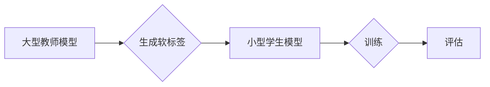

                 

## 电商搜索推荐中的AI大模型模型蒸馏技术探索

> 关键词：电商搜索推荐、AI大模型、模型蒸馏、知识蒸馏、参数量压缩、效率提升、推荐系统

## 1. 背景介绍

在当今数据爆炸的时代，电商搜索推荐系统扮演着至关重要的角色，它直接影响着用户体验和商业转化率。传统的推荐系统主要依赖于特征工程和规则匹配，但随着用户行为数据的复杂性和多样性不断增加，这些方法已难以满足日益增长的需求。

近年来，深度学习技术在推荐系统领域取得了显著的突破，基于Transformer架构的AI大模型，例如BERT、GPT等，展现出强大的文本理解和生成能力，为电商搜索推荐带来了新的机遇。然而，这些大模型通常拥有庞大的参数量，训练和部署成本极高，对硬件资源要求也十分苛刻，这限制了其在实际应用中的推广。

模型蒸馏技术应运而生，它通过将大型模型的知识“蒸馏”到小型模型中，有效地降低了模型的复杂度和资源消耗，同时保持了较高的推荐精度。

## 2. 核心概念与联系

### 2.1 模型蒸馏概述

模型蒸馏是一种机器学习技术，旨在将知识从一个大型模型（教师模型）转移到一个小型模型（学生模型）中。教师模型通常拥有更强的表达能力和更高的准确率，但其训练和部署成本较高。学生模型则更轻量级，更容易部署和推理。

模型蒸馏的核心思想是利用教师模型的输出结果（例如预测概率分布）来指导学生模型的训练，从而使学生模型能够学习到教师模型的知识和经验。

### 2.2 模型蒸馏原理

模型蒸馏的原理可以概括为以下几个步骤：

1. **训练教师模型:** 首先，需要训练一个大型的教师模型，使其在目标任务上达到较高的准确率。
2. **生成教师模型的软标签:** 将教师模型的预测结果转换为软标签，即预测概率分布。
3. **训练学生模型:** 使用教师模型的软标签来训练一个小型学生模型。
4. **评估学生模型:** 评估学生模型在目标任务上的性能，并根据需要进行调整。

### 2.3 模型蒸馏架构

**Mermaid 流程图**



## 3. 核心算法原理 & 具体操作步骤

### 3.1 算法原理概述

模型蒸馏的核心算法是基于知识迁移的训练策略。教师模型的知识主要体现在其参数和预测概率分布上。通过将教师模型的预测概率分布作为学生模型的训练目标，可以有效地将教师模型的知识“蒸馏”到学生模型中。

### 3.2 算法步骤详解

1. **数据预处理:** 对电商搜索数据进行预处理，例如文本清洗、词向量化等。
2. **教师模型训练:** 使用电商搜索数据训练一个大型的教师模型，例如BERT或GPT。
3. **学生模型初始化:** 使用预训练的模型或随机初始化一个小型学生模型。
4. **知识蒸馏训练:** 使用教师模型的预测概率分布作为学生模型的训练目标，并通过交叉熵损失函数进行优化。
5. **模型评估:** 在测试集上评估学生模型的性能，并根据需要进行调整。

### 3.3 算法优缺点

**优点:**

* **参数量压缩:** 模型蒸馏可以有效地降低模型的复杂度和参数量，从而降低训练和部署成本。
* **效率提升:** 蒸馏后的学生模型推理速度更快，更适合部署在移动端或资源有限的设备上。
* **性能提升:** 在某些情况下，蒸馏后的学生模型可以达到与教师模型相似的甚至更高的准确率。

**缺点:**

* **教师模型依赖:** 模型蒸馏需要一个预先训练好的大型教师模型，如果没有合适的教师模型，蒸馏效果可能不佳。
* **训练复杂度:** 模型蒸馏的训练过程比传统的模型训练更复杂，需要对教师模型和学生模型进行仔细的调参。
* **性能瓶颈:** 学生模型的性能仍然受到其自身架构和参数量的限制，无法完全复制教师模型的全部能力。

### 3.4 算法应用领域

模型蒸馏技术在推荐系统、图像识别、自然语言处理等多个领域都有广泛的应用。

* **电商搜索推荐:** 将大型语言模型的知识蒸馏到小型模型中，提高推荐效率和准确率。
* **图像识别:** 将大型卷积神经网络的知识蒸馏到小型模型中，降低模型大小和推理时间。
* **语音识别:** 将大型语音识别模型的知识蒸馏到小型模型中，提高语音识别在移动设备上的性能。

## 4. 数学模型和公式 & 详细讲解 & 举例说明

### 4.1 数学模型构建

模型蒸馏的目标是训练一个小型学生模型，使其能够尽可能地模仿大型教师模型的预测结果。

假设教师模型的输出为 $p_t(x)$，学生模型的输出为 $p_s(x)$，其中 $x$ 为输入数据。

模型蒸馏的目标函数可以定义为：

$$
L = KL(p_s(x) || p_t(x)) + \lambda L_{CE}(p_s(x), y)
$$

其中：

* $KL(p_s(x) || p_t(x))$ 为教师模型的预测概率分布 $p_t(x)$ 和学生模型的预测概率分布 $p_s(x)$ 之间的KL散度。
* $L_{CE}(p_s(x), y)$ 为学生模型的预测概率分布 $p_s(x)$ 和真实标签 $y$ 之间的交叉熵损失。
* $\lambda$ 为平衡KL散度和交叉熵损失的权重参数。

### 4.2 公式推导过程

KL散度度量了两个概率分布之间的差异。

$$
KL(p_s(x) || p_t(x)) = \sum_i p_s(x_i) \log \frac{p_s(x_i)}{p_t(x_i)}
$$

交叉熵损失度量了预测概率分布与真实标签之间的差异。

$$
L_{CE}(p_s(x), y) = -\sum_i y_i \log p_s(x_i)
$$

### 4.3 案例分析与讲解

假设我们训练一个电商商品推荐系统，教师模型是一个大型BERT模型，学生模型是一个小型MobileBERT模型。

在训练过程中，教师模型的输出为每个商品的推荐概率分布，学生模型的输出也为每个商品的推荐概率分布。

通过最小化目标函数，学生模型可以学习到教师模型的知识，并生成与教师模型相似的推荐结果。

## 5. 项目实践：代码实例和详细解释说明

### 5.1 开发环境搭建

* Python 3.7+
* PyTorch 1.7+
* CUDA 10.2+
* 其他依赖库：transformers, numpy, pandas等

### 5.2 源代码详细实现

```python
import torch
import torch.nn as nn
from transformers import BertModel, BertConfig

class StudentModel(nn.Module):
    def __init__(self, config):
        super(StudentModel, self).__init__()
        self.bert = BertModel.from_pretrained(config.pretrained_model_name_or_path)
        self.dropout = nn.Dropout(config.dropout)
        self.classifier = nn.Linear(config.hidden_size, config.num_classes)

    def forward(self, input_ids, attention_mask):
        outputs = self.bert(input_ids=input_ids, attention_mask=attention_mask)
        pooled_output = outputs.pooler_output
        pooled_output = self.dropout(pooled_output)
        logits = self.classifier(pooled_output)
        return logits

# 定义训练参数
config = BertConfig.from_pretrained("bert-base-uncased")
config.num_classes = 10  # 商品类别数量
config.dropout = 0.1

# 实例化学生模型
student_model = StudentModel(config)

# 定义优化器和损失函数
optimizer = torch.optim.Adam(student_model.parameters(), lr=2e-5)
loss_fn = nn.CrossEntropyLoss()

# 训练循环
for epoch in range(num_epochs):
    for batch in dataloader:
        input_ids, attention_mask, labels = batch
        optimizer.zero_grad()
        logits = student_model(input_ids, attention_mask)
        loss = loss_fn(logits, labels)
        loss.backward()
        optimizer.step()

```

### 5.3 代码解读与分析

* **模型定义:** 代码定义了一个名为`StudentModel`的学生模型，它基于预训练的BERT模型，并添加了一个全连接层用于分类。
* **参数配置:** 代码设置了模型的训练参数，例如学习率、dropout率等。
* **数据加载:** 代码假设已经准备好了训练数据，并使用`dataloader`进行数据加载。
* **训练循环:** 代码实现了训练循环，包括前向传播、反向传播和参数更新。
* **损失函数:** 代码使用交叉熵损失函数来衡量模型的预测结果与真实标签之间的差异。

### 5.4 运行结果展示

训练完成后，可以评估学生模型在测试集上的性能，例如准确率、召回率等。

## 6. 实际应用场景

### 6.1 电商搜索推荐

模型蒸馏技术可以应用于电商搜索推荐系统，将大型语言模型的知识蒸馏到小型模型中，提高推荐效率和准确率。

例如，可以将BERT模型的知识蒸馏到MobileBERT模型中，从而在移动端设备上实现高效的商品推荐。

### 6.2 个性化推荐

模型蒸馏技术还可以用于个性化推荐，将用户行为数据和商品特征融合，生成个性化的推荐结果。

例如，可以将用户历史购买记录和商品属性信息作为输入，训练一个小型模型，生成个性化的商品推荐。

### 6.3 多模态推荐

未来，模型蒸馏技术可以应用于多模态推荐，将文本、图像、视频等多种数据类型融合，生成更丰富的推荐结果。

例如，可以将商品图片、描述文本和用户评论信息作为输入，训练一个多模态推荐模型。

### 6.4 未来应用展望

模型蒸馏技术在电商搜索推荐领域具有广阔的应用前景，未来可以进一步探索以下方向：

* **更有效的蒸馏方法:** 研究更有效的知识蒸馏方法，例如教师模型的知识表示、学生模型的架构设计等。
* **跨模态蒸馏:** 研究跨模态知识蒸馏方法，将不同模态的数据融合，生成更丰富的推荐结果。
* **联邦蒸馏:** 研究联邦蒸馏方法，在保护用户隐私的前提下进行模型训练和蒸馏。

## 7. 工具和资源推荐

### 7.1 学习资源推荐

* **论文:**
    * Hinton, G., Vinyals, O., & Dean, J. (2015). Distilling the knowledge in a neural network. arXiv preprint arXiv:1503.02531.
    * Buciluă, C., Caruana, R., & Niculescu-Mizil, A. (2006). Model compression. In Proceedings of the 13th ACM SIGKDD international conference on Knowledge discovery and data mining (pp. 117-126).
* **博客:**
    * https://towardsdatascience.com/model-distillation-a-powerful-technique-for-compressing-deep-learning-models-a7918107667c
    * https://blog.paperspace.com/model-distillation-tutorial/

### 7.2 开发工具推荐

* **PyTorch:** https://pytorch.org/
* **Transformers:** https://huggingface.co/transformers/
* **TensorBoard:** https://www.tensorflow.org/tensorboard

### 7.3 相关论文推荐

* **Knowledge Distillation**
* **Model Compression**
* **Federated Learning**

## 8. 总结：未来发展趋势与挑战

### 8.1 研究成果总结

模型蒸馏技术在电商搜索推荐领域取得了显著的成果，有效地降低了模型的复杂度和资源消耗，同时保持了较高的推荐精度。

### 8.2 未来发展趋势

未来，模型蒸馏技术将朝着以下方向发展：

* **更有效的蒸馏方法:** 研究更有效的知识蒸馏方法，例如教师模型的知识表示、学生模型的架构设计等。
* **跨模态蒸馏:** 研究跨模态知识蒸馏方法，将不同模态的数据融合，生成更丰富的推荐结果。
* **联邦蒸馏:** 研究联邦蒸馏方法，在保护用户隐私的前提下进行模型训练和蒸馏。

### 8.3 面临的挑战

模型蒸馏技术也面临着一些挑战：

* **蒸馏效果评估:** 如何有效地评估模型蒸馏的效果，是一个重要的研究方向。
* **教师模型选择:** 选择合适的教师模型，对于蒸馏效果至关重要。
* **学生模型设计:** 设计高效的学生模型架构，也是一个重要的挑战。

### 8.4 研究展望

模型蒸馏技术在电商搜索推荐领域具有广阔的应用前景，未来将继续推动推荐系统的智能化发展。


## 9. 附录：常见问题与解答

**Q1: 模型蒸馏的优势是什么？**

**A1:** 模型蒸馏的主要优势在于可以有效地降低模型的复杂度和资源消耗，同时保持较高的推荐精度。

**Q2: 模型蒸馏有哪些应用场景？**

**A2:** 模型蒸馏可以应用于电商搜索推荐、个性化推荐、多模态推荐等多个领域。

**Q3: 如何选择合适的教师模型？**

**A3:** 选择合适的教师模型需要考虑模型的性能、参数量和训练成本等因素。

**Q4: 如何评估模型蒸馏的效果？**

**A4:** 可以使用准确率、召回率、F1-score等指标来评估模型蒸馏的效果。

**Q5: 模型蒸馏的未来发展趋势是什么？**

**A5:** 未来，模型蒸馏技术将朝着更有效的蒸馏方法、跨模态蒸馏和联邦蒸馏等方向发展。


作者：禅与计算机程序设计艺术 / Zen and the Art of Computer Programming<end_of_turn>

