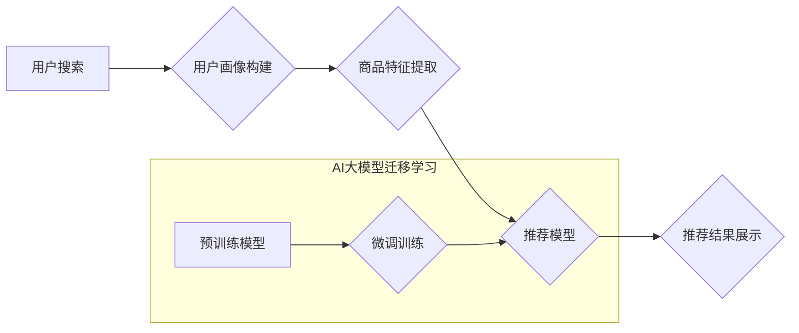

                 

## 电商搜索推荐中的AI大模型迁移学习方法探索

> 关键词：电商搜索推荐、AI大模型、迁移学习、知识蒸馏、预训练模型、个性化推荐

## 1. 背景介绍

在当今数据爆炸的时代，电商平台面临着海量商品和用户数据，如何精准推荐用户感兴趣的商品，提升用户体验和转化率成为关键挑战。传统基于规则或协同过滤的推荐算法难以有效应对数据复杂性和用户个性化需求。近年来，深度学习技术蓬勃发展，特别是Transformer模型的出现，为电商搜索推荐带来了新的机遇。

AI大模型，例如BERT、GPT等，凭借其强大的语义理解和文本生成能力，在搜索结果排序、商品描述生成、用户画像构建等方面展现出优异的性能。然而，训练大型语言模型需要海量数据和计算资源，对于电商平台来说，部署和维护这些模型可能存在成本和效率问题。

迁移学习作为一种机器学习范式，旨在利用预训练模型在源任务上的知识，迁移到目标任务中，从而降低训练成本和时间，提高模型性能。在电商搜索推荐领域，迁移学习可以有效解决数据稀缺、模型训练成本高的问题，并提升推荐精准度和个性化程度。

## 2. 核心概念与联系

### 2.1 迁移学习

迁移学习是一种机器学习范式，旨在利用预训练模型在源任务上的知识，迁移到目标任务中，从而降低训练成本和时间，提高模型性能。

**源任务**：预训练模型在源任务上进行训练，积累了丰富的知识和特征表示。

**目标任务**：需要迁移学习模型解决的实际问题，通常数据较少或与源任务不同。

**知识迁移**：将源任务上的知识和经验迁移到目标任务中，帮助目标任务模型更快、更有效地学习。

### 2.2  电商搜索推荐

电商搜索推荐是指根据用户的搜索行为、浏览历史、购买记录等信息，推荐用户可能感兴趣的商品。

**用户画像**：基于用户的历史数据构建用户画像，了解用户的兴趣偏好、消费习惯等信息。

**商品特征**：提取商品的文本描述、图片信息、价格、销量等特征，构建商品向量表示。

**推荐算法**：根据用户画像和商品特征，利用机器学习算法进行商品推荐。

### 2.3  AI大模型

AI大模型是指参数规模庞大、训练数据海量、具备强大泛化能力的深度学习模型。

**预训练模型**：在大量公共数据上进行预训练，学习到通用的语言表示和知识。

**微调**：将预训练模型应用于特定任务，通过在目标任务数据上进行少量训练，进一步提升模型性能。

**Mermaid 流程图**



## 3. 核心算法原理 & 具体操作步骤

### 3.1  算法原理概述

迁移学习在电商搜索推荐中的应用主要包括以下几种方法：

* **知识蒸馏**：将预训练模型的知识“蒸馏”到更小的模型中，降低模型复杂度和推理成本，同时保持较高的推荐性能。
* **特征提取**：利用预训练模型的特征提取能力，提取商品和用户的特征表示，作为其他推荐算法的输入，提升推荐效果。
* **预训练+微调**：将预训练模型应用于目标任务，通过在目标任务数据上进行少量训练，进一步提升模型性能。

### 3.2  算法步骤详解

以知识蒸馏为例，详细说明其在电商搜索推荐中的应用步骤：

1. **选择预训练模型**: 选择与电商搜索推荐任务相关的预训练模型，例如BERT、RoBERTa等。
2. **构建知识蒸馏模型**: 构建一个较小的蒸馏模型，并将其结构与预训练模型相似。
3. **微调预训练模型**: 在电商搜索推荐数据集上微调预训练模型，使其学习到目标任务的知识。
4. **知识蒸馏**: 将预训练模型的输出（例如logits、隐层特征）作为蒸馏模型的教师信号，训练蒸馏模型。
5. **评估蒸馏模型**: 在测试集上评估蒸馏模型的性能，并与预训练模型和原始模型进行比较。

### 3.3  算法优缺点

**优点**:

* 降低训练成本和时间：利用预训练模型的知识，减少目标任务模型的训练数据和训练时间。
* 提升模型性能：预训练模型已经学习到丰富的知识和特征表示，可以帮助目标任务模型更快、更有效地学习。
* 适用于数据稀缺场景：对于数据稀缺的电商搜索推荐任务，迁移学习可以有效提升模型性能。

**缺点**:

* 迁移效果依赖于源任务和目标任务的相似性：如果源任务和目标任务差异较大，迁移效果可能不佳。
* 需要选择合适的预训练模型和迁移学习方法：不同的预训练模型和迁移学习方法适用于不同的任务，需要根据具体情况进行选择。

### 3.4  算法应用领域

* **商品推荐**: 根据用户的搜索历史、浏览记录、购买记录等信息，推荐用户可能感兴趣的商品。
* **搜索结果排序**: 根据用户的搜索词和历史数据，对搜索结果进行排序，提升用户体验。
* **商品描述生成**: 利用预训练模型的文本生成能力，自动生成商品描述，提升商品信息丰富度。
* **用户画像构建**: 利用预训练模型的语义理解能力，构建用户画像，了解用户的兴趣偏好和消费习惯。

## 4. 数学模型和公式 & 详细讲解 & 举例说明

### 4.1  数学模型构建

知识蒸馏模型的数学模型可以表示为：

$$
\mathcal{L}_{KD} = \mathcal{L}_{CE}(y, \hat{y}_s) + \alpha \mathcal{L}_{KL}(p(y|\mathbf{x}), q(y|\mathbf{x}))
$$

其中：

* $\mathcal{L}_{CE}$ 是交叉熵损失函数，用于衡量蒸馏模型的预测结果与真实标签之间的差异。
* $y$ 是真实标签，$\hat{y}_s$ 是蒸馏模型的预测结果。
* $\mathcal{L}_{KL}$ 是KL散度，用于衡量蒸馏模型的输出概率分布与教师模型的输出概率分布之间的差异。
* $p(y|\mathbf{x})$ 是教师模型的输出概率分布，$q(y|\mathbf{x})$ 是蒸馏模型的输出概率分布。
* $\alpha$ 是平衡系数，用于控制知识蒸馏的强度。

### 4.2  公式推导过程

知识蒸馏的目标是让蒸馏模型的输出概率分布尽可能接近教师模型的输出概率分布。KL散度可以衡量两个概率分布之间的差异，因此，使用KL散度作为知识蒸馏的损失函数可以有效地实现这个目标。

### 4.3  案例分析与讲解

假设我们有一个电商搜索推荐任务，需要推荐用户可能感兴趣的商品。我们可以使用BERT预训练模型作为教师模型，并构建一个较小的蒸馏模型。在训练过程中，我们将BERT模型的输出作为蒸馏模型的教师信号，并使用知识蒸馏损失函数训练蒸馏模型。

通过知识蒸馏，我们可以将BERT模型的知识“蒸馏”到蒸馏模型中，从而降低蒸馏模型的复杂度和推理成本，同时保持较高的推荐性能。

## 5. 项目实践：代码实例和详细解释说明

### 5.1  开发环境搭建

* Python 3.7+
* PyTorch 1.7+
* CUDA 10.2+
* 其他依赖库：transformers, numpy, pandas等

### 5.2  源代码详细实现

```python
import torch
import torch.nn as nn
from transformers import BertModel

class DistillationModel(nn.Module):
    def __init__(self, bert_model_name, num_classes):
        super(DistillationModel, self).__init__()
        self.bert = BertModel.from_pretrained(bert_model_name)
        self.fc = nn.Linear(self.bert.config.hidden_size, num_classes)

    def forward(self, input_ids, attention_mask):
        outputs = self.bert(input_ids=input_ids, attention_mask=attention_mask)
        pooled_output = outputs.pooler_output
        logits = self.fc(pooled_output)
        return logits

# 实例化蒸馏模型
model = DistillationModel(bert_model_name='bert-base-uncased', num_classes=10)

# 定义优化器和损失函数
optimizer = torch.optim.Adam(model.parameters(), lr=1e-5)
criterion = nn.CrossEntropyLoss()

# 训练模型
for epoch in range(num_epochs):
    for batch in train_dataloader:
        input_ids, attention_mask, labels = batch
        logits = model(input_ids, attention_mask)
        loss = criterion(logits, labels)
        optimizer.zero_grad()
        loss.backward()
        optimizer.step()

```

### 5.3  代码解读与分析

* 代码首先定义了一个`DistillationModel`类，该类继承自`nn.Module`，实现了蒸馏模型的结构。
* 模型结构包含一个预训练的BERT模型和一个全连接层，用于将BERT模型的输出映射到目标任务的类别数。
* 然后，代码实例化了蒸馏模型，并定义了优化器和损失函数。
* 最后，代码实现了模型的训练过程，包括数据加载、前向传播、反向传播和参数更新。

### 5.4  运行结果展示

训练完成后，可以将模型部署到线上环境，并进行测试和评估。评估指标可以包括准确率、召回率、F1-score等。

## 6. 实际应用场景

### 6.1  个性化推荐

迁移学习可以帮助电商平台构建更个性化的推荐系统。通过利用用户的历史数据，例如浏览记录、购买记录、评分等信息，可以构建用户的兴趣偏好和消费习惯，并根据这些信息推荐更符合用户需求的商品。

### 6.2  搜索结果排序

迁移学习可以提升电商平台的搜索结果排序效果。通过预训练模型学习到的语义理解能力，可以更好地理解用户的搜索意图，并根据用户的搜索词和历史数据，对搜索结果进行排序，提升用户体验。

### 6.3  商品描述生成

迁移学习可以帮助电商平台自动生成商品描述。通过预训练模型学习到的文本生成能力，可以自动生成商品的描述文本，提升商品信息丰富度，并节省人工成本。

### 6.4  未来应用展望

随着AI技术的不断发展，迁移学习在电商搜索推荐领域的应用前景广阔。未来，我们可以期待以下应用场景：

* **跨平台推荐**: 利用迁移学习，将不同平台的用户数据进行融合，构建更全面的用户画像，实现跨平台的个性化推荐。
* **多模态推荐**: 将文本、图片、视频等多模态数据进行融合，构建更丰富的商品信息表示，实现更精准的推荐。
* **实时推荐**: 利用迁移学习，构建实时推荐模型，能够根据用户的实时行为进行动态推荐，提升用户体验。

## 7. 工具和资源推荐

### 7.1  学习资源推荐

* **书籍**:
    * 深度学习
    * 自然语言处理
* **在线课程**:
    * Coursera: 深度学习
    * Udacity: 自然语言处理
* **博客**:
    * Jay Alammar's Blog
    * Towards Data Science

### 7.2  开发工具推荐

* **框架**: PyTorch, TensorFlow
* **库**: transformers, numpy, pandas
* **平台**: Google Colab, AWS SageMaker

### 7.3  相关论文推荐

* **BERT**: Devlin et al. (2018). BERT: Pre-training of Deep Bidirectional Transformers for Language Understanding.
* **知识蒸馏**: Hinton et al. (2015). Distilling the Knowledge in a Neural Network.

## 8. 总结：未来发展趋势与挑战

### 8.1  研究成果总结

迁移学习在电商搜索推荐领域取得了显著的成果，能够有效降低模型训练成本，提升模型性能，并实现个性化推荐、搜索结果排序等功能。

### 8.2  未来发展趋势

* **更强大的预训练模型**: 预训练模型的规模和能力将不断提升，为迁移学习提供更丰富的知识和特征表示。
* **更有效的迁移学习方法**: 研究者将不断探索更有效的迁移学习方法，例如自适应迁移学习、联邦迁移学习等，以应对更复杂的任务和数据场景。
* **多模态迁移学习**: 将文本、图片、视频等多模态数据进行融合，构建更丰富的商品信息表示，实现更精准的推荐。

### 8.3  面临的挑战

* **数据隐私**: 迁移学习需要利用用户数据进行训练，如何保护用户隐私是一个重要的挑战。
* **模型解释性**: 迁移学习模型的决策过程往往难以解释，如何提升模型的解释性是一个重要的研究方向。
* **跨平台迁移**: 如何将不同平台的用户数据进行融合，实现跨平台的迁移学习是一个重要的挑战。

### 8.4  研究展望

未来，迁移学习将在电商搜索推荐领域发挥越来越重要的作用，将推动电商平台向更智能化、个性化、高效化的方向发展。


## 9. 附录：常见问题与解答

**Q1: 迁移学习的优势是什么？**

**A1:** 迁移学习的优势在于可以利用预训练模型的知识，降低模型训练成本和时间，同时提升模型性能。

**Q2: 迁移学习有哪些应用场景？**

**A2:** 迁移学习在电商搜索推荐领域有广泛的应用场景，例如个性化推荐、搜索结果排序、商品描述生成等。

**Q3: 如何选择合适的迁移学习方法？**

**A3:** 选择合适的迁移学习方法需要根据具体任务和数据情况进行选择。例如，对于数据稀缺的场景，知识蒸馏是一种有效的迁移学习方法。

**作者：禅与计算机程序设计艺术 / Zen and the Art of Computer Programming**<end_of_turn>

