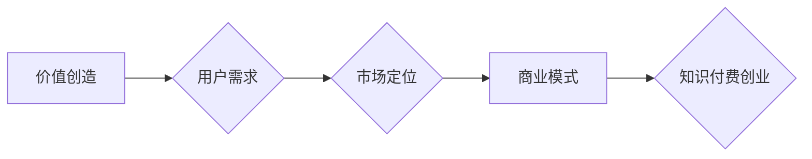

                 

## 知识付费创业中的心理建设

> 关键词：知识付费、心理建设、创业心态、坚持不懈、学习成长、价值创造、市场定位、用户需求、商业模式

### 1. 背景介绍

知识付费行业近年来蓬勃发展，成为新兴的商业模式。越来越多的人选择通过线上平台分享自己的知识和经验，并从中获得收益。然而，知识付费创业并非易事，它需要创业者具备扎实的专业知识、敏锐的市场洞察力以及强大的心理素质。

在知识付费创业的道路上，创业者会面临各种挑战和压力，例如：

* **市场竞争激烈:** 知识付费市场竞争日益激烈，如何脱颖而出并吸引用户关注是一个难题。
* **内容创作压力:** 需要持续创作高质量的内容，满足用户的学习需求，这需要创业者付出大量的精力和时间。
* **商业模式探索:** 知识付费的商业模式多种多样，如何找到适合自己的模式并实现盈利是一个需要不断探索的过程。
* **心理波动:** 面对市场反馈、用户评价等，创业者可能会经历情绪波动，需要保持积极的心态和强大的心理韧性。

### 2. 核心概念与联系

知识付费创业的核心概念包括：

* **价值创造:** 创业者需要提供有价值的知识和服务，解决用户的痛点，满足用户的学习需求。
* **用户需求:** 创业者需要深入了解用户的需求，提供符合用户需求的内容和服务。
* **市场定位:** 创业者需要明确自己的目标用户群体，并针对他们的需求进行市场定位。
* **商业模式:** 创业者需要选择合适的商业模式，例如订阅制、课程销售、会员制等，实现盈利。

**Mermaid 流程图:**



### 3. 核心算法原理 & 具体操作步骤

知识付费创业并非一个简单的算法，它需要结合多种因素进行综合分析和决策。然而，我们可以将一些关键步骤抽象成算法，并进行分析。

**3.1 算法原理概述**

知识付费创业算法的核心原理是：

* **价值评估:** 评估知识和服务的价值，并将其转化为用户愿意支付的价格。
* **用户匹配:** 根据用户的需求和兴趣，匹配合适的知识和服务。
* **内容优化:** 根据用户反馈和数据分析，不断优化内容质量和服务体验。

**3.2 算法步骤详解**

1. **市场调研:** 了解目标用户群体、竞争对手、市场趋势等信息。
2. **内容策划:** 根据市场调研结果，策划符合用户需求的知识和服务。
3. **内容创作:** 创作高质量、有价值的内容，并进行排版和制作。
4. **平台选择:** 选择合适的知识付费平台，例如付费课程平台、知识社区等。
5. **用户推广:** 通过线上线下渠道推广知识付费产品，吸引用户关注。
6. **用户运营:** 提供优质的用户服务，建立用户粘性，促进用户复购。
7. **数据分析:** 收集用户数据，分析用户行为和反馈，不断优化产品和服务。

**3.3 算法优缺点**

* **优点:** 能够帮助创业者快速了解市场需求，制定合理的商业策略，提高知识付费产品的成功率。
* **缺点:** 算法无法完全替代创业者的经验和判断，还需要创业者不断学习和实践。

**3.4 算法应用领域**

* **教育培训:** 在线课程、职业技能培训、兴趣班等。
* **专业咨询:** 财务咨询、法律咨询、心理咨询等。
* **创意设计:** 设计图纸、文案创作、音乐制作等。
* **个人成长:** 读书笔记、生活经验分享、心灵鸡汤等。

### 4. 数学模型和公式 & 详细讲解 & 举例说明

知识付费创业可以利用数学模型和公式进行分析和预测。例如，我们可以使用以下公式来计算知识付费产品的潜在收益：

$$
\text{潜在收益} = \text{用户数量} \times \text{单价} \times \text{转化率}
$$

其中：

* **用户数量:** 预计的知识付费产品用户数量。
* **单价:** 知识付费产品的单价。
* **转化率:** 用户购买知识付费产品的比例。

**4.1 数学模型构建**

我们可以构建一个更复杂的数学模型，考虑更多的因素，例如：

* **用户生命周期价值:** 用户在整个生命周期内为知识付费产品带来的价值。
* **营销成本:** 推广知识付费产品的成本。
* **运营成本:** 提供用户服务的成本。

**4.2 公式推导过程**

通过对这些因素进行分析和计算，我们可以推导出更精确的知识付费产品收益预测模型。

**4.3 案例分析与讲解**

假设一个在线课程平台，其目标用户群体是大学生，课程单价为 100 元，预计用户数量为 1000 人，转化率为 10%。

根据公式，该课程的潜在收益为：

$$
\text{潜在收益} = 1000 \times 100 \times 0.1 = 10000 \text{ 元}
$$

### 5. 项目实践：代码实例和详细解释说明

知识付费创业需要结合实际项目进行实践，才能真正掌握其中的技巧和经验。以下是一个简单的代码实例，演示如何使用 Python 语言构建一个简单的知识付费平台。

**5.1 开发环境搭建**

需要安装 Python 语言和相关库，例如 Flask、SQLAlchemy 等。

**5.2 源代码详细实现**

```python
from flask import Flask, render_template, request
from flask_sqlalchemy import SQLAlchemy

app = Flask(__name__)
app.config['SQLALCHEMY_DATABASE_URI'] = 'sqlite:///knowledge.db'
db = SQLAlchemy(app)

class Course(db.Model):
    id = db.Column(db.Integer, primary_key=True)
    title = db.Column(db.String(100), nullable=False)
    description = db.Column(db.Text)
    price = db.Column(db.Float, nullable=False)

db.create_all()

@app.route('/')
def index():
    courses = Course.query.all()
    return render_template('index.html', courses=courses)

@app.route('/course/<int:course_id>')
def course_detail(course_id):
    course = Course.query.get_or_404(course_id)
    return render_template('course_detail.html', course=course)

if __name__ == '__main__':
    app.run(debug=True)
```

**5.3 代码解读与分析**

这段代码实现了简单的知识付费平台功能，包括课程列表展示和课程详情页面。

* 使用 Flask 框架构建 Web 应用。
* 使用 SQLAlchemy ORM 操作数据库。
* 定义 Course 模型，存储课程信息。
* 使用路由规则处理用户请求。
* 使用模板引擎渲染页面。

**5.4 运行结果展示**

运行代码后，可以访问 http://127.0.0.1:5000/，查看知识付费平台首页。

### 6. 实际应用场景

知识付费创业的应用场景非常广泛，例如：

* **在线教育:** 提供各种类型的在线课程，例如编程、设计、语言学习等。
* **专业技能培训:** 为职场人士提供专业技能培训，例如项目管理、数据分析、市场营销等。
* **个人成长:** 分享个人经验和见解，帮助用户提升自我认知和生活技能。

**6.4 未来应用展望**

未来，知识付费创业将更加注重个性化、互动性和沉浸式体验。例如：

* **AI 驱动的个性化学习:** 利用人工智能技术，根据用户的学习进度和需求，提供个性化的学习路径和内容。
* **虚拟现实和增强现实:** 利用 VR/AR 技术，打造更加沉浸式的学习体验。
* **社区化学习:** 建立知识付费社区，促进用户之间的互动和交流。

### 7. 工具和资源推荐

**7.1 学习资源推荐**

* **书籍:** 《零基础学编程》、《Python 编程入门》、《数据结构与算法》
* **在线课程:** Coursera、edX、Udemy
* **博客和论坛:** CSDN、知乎、Stack Overflow

**7.2 开发工具推荐**

* **Python 语言:** Python官网
* **Flask 框架:** Flask官网
* **SQLAlchemy ORM:** SQLAlchemy官网

**7.3 相关论文推荐**

* **知识付费的商业模式创新**
* **知识付费平台的用户行为分析**
* **人工智能在知识付费领域的应用**

### 8. 总结：未来发展趋势与挑战

**8.1 研究成果总结**

知识付费创业是一个充满机遇和挑战的领域。通过分析核心概念、算法原理、实际应用场景以及未来发展趋势，我们可以更好地理解知识付费创业的本质和发展规律。

**8.2 未来发展趋势**

未来，知识付费创业将更加注重个性化、互动性和沉浸式体验，并与人工智能、虚拟现实等新技术深度融合。

**8.3 面临的挑战**

知识付费创业也面临着一些挑战，例如：

* **内容质量保证:** 确保知识付费产品的质量和价值，避免用户付费后不满意。
* **用户粘性提升:** 提高用户复购率和忠诚度，建立长期稳定的用户群体。
* **商业模式创新:** 探索新的商业模式，实现可持续发展。

**8.4 研究展望**

未来，需要进一步研究知识付费创业的商业模式、用户行为、技术应用等方面，为知识付费创业提供更加科学的理论支持和实践指导。

### 9. 附录：常见问题与解答

* **如何确定知识付费产品的价格？**

  需要根据产品的价值、目标用户群体、市场竞争等因素进行综合考虑。

* **如何推广知识付费产品？**

  可以通过线上线下渠道进行推广，例如社交媒体营销、搜索引擎优化、线下活动等。

* **如何提高用户粘性？**

  可以通过提供优质的用户服务、建立用户社区、定期举办线上线下活动等方式提高用户粘性。


作者：禅与计算机程序设计艺术 / Zen and the Art of Computer Programming 
<end_of_turn>

