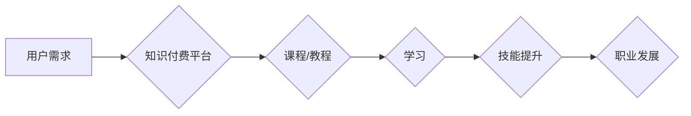

                 

## 知识付费市场分析:程序员的机遇与挑战

> 关键词：知识付费、程序员、在线教育、技术技能、市场趋势、机遇与挑战、未来发展

## 1. 背景介绍

近年来，随着互联网技术的飞速发展和数字经济的蓬勃兴起，知识付费市场呈现出爆发式增长态势。作为数字经济的重要组成部分，知识付费市场为个人和企业提供了便捷高效的学习和提升技能的途径。

对于程序员而言，知识付费市场带来了前所未有的机遇和挑战。一方面，程序员可以通过知识付费平台获取最新的技术知识和技能，提升自身竞争力；另一方面，程序员也可以利用知识付费平台分享自己的经验和技能，获得经济回报。

## 2. 核心概念与联系

**2.1 知识付费市场概述**

知识付费是指以知识、技能、经验等为核心内容，通过线上平台向用户提供付费学习服务的商业模式。它涵盖了各种形式的知识产品，例如在线课程、视频教程、电子书、直播讲座等。

**2.2 程序员与知识付费的关系**

程序员作为科技领域的核心人才，对不断学习和提升技术技能有着迫切的需求。知识付费市场为程序员提供了便捷高效的学习途径，帮助他们掌握最新的技术知识和技能，提升自身竞争力。

**2.3 知识付费市场发展趋势**

* **内容多元化:** 知识付费平台将不断丰富知识产品内容，涵盖更广泛的编程语言、框架、工具和技术领域。
* **互动性增强:** 知识付费平台将更加注重互动性，例如提供在线答疑、社区讨论、项目合作等功能，提升用户学习体验。
* **个性化定制:** 知识付费平台将根据用户的学习需求和水平，提供个性化的学习方案和内容推荐。
* **移动化发展:** 知识付费平台将更加注重移动端体验，方便用户随时随地学习。

**2.4  Mermaid 流程图**



## 3. 核心算法原理 & 具体操作步骤

**3.1 算法原理概述**

知识付费平台的推荐算法是基于用户行为数据和知识内容特征，通过机器学习模型预测用户对特定知识产品的兴趣和偏好，从而推荐最合适的学习内容。

**3.2 算法步骤详解**

1. **数据收集:** 收集用户行为数据，例如浏览记录、学习进度、评价反馈等，以及知识内容特征数据，例如主题、标签、难度等级等。
2. **数据预处理:** 对收集到的数据进行清洗、转换和特征工程，例如去除噪声数据、将文本数据转换为数值向量等。
3. **模型训练:** 选择合适的机器学习模型，例如协同过滤、内容基准、深度学习等，对预处理后的数据进行训练，学习用户兴趣和知识内容特征之间的关系。
4. **模型评估:** 使用测试数据对训练好的模型进行评估，例如计算准确率、召回率等指标，并根据评估结果进行模型调优。
5. **推荐生成:** 将训练好的模型应用于新的用户行为数据，预测用户对特定知识产品的兴趣和偏好，并生成个性化的推荐列表。

**3.3 算法优缺点**

* **优点:** 能够根据用户的学习需求和兴趣，推荐个性化的学习内容，提升用户学习体验。
* **缺点:** 需要大量的用户行为数据进行训练，算法模型的复杂度较高，需要专业的技术人员进行维护和优化。

**3.4 算法应用领域**

* **在线教育平台:** 推荐课程、学习资源和学习计划。
* **电商平台:** 推荐相关商品和服务。
* **社交媒体平台:** 推荐好友、兴趣小组和内容。

## 4. 数学模型和公式 & 详细讲解 & 举例说明

**4.1 数学模型构建**

知识付费平台的推荐算法通常基于协同过滤模型，该模型假设用户对相似物品的偏好也相似。

**4.2 公式推导过程**

协同过滤模型的核心公式是用户-物品评分矩阵的预测公式，例如基于用户的协同过滤模型的预测公式如下：

$$
\hat{r}_{u,i} = \bar{r}_u + \frac{\sum_{v \in N(u)} (r_{v,i} - \bar{r}_v) \cdot sim(u,v)}{\sum_{v \in N(u)} sim(u,v)}
$$

其中：

* $\hat{r}_{u,i}$: 用户 $u$ 对物品 $i$ 的预测评分。
* $\bar{r}_u$: 用户 $u$ 的平均评分。
* $r_{v,i}$: 用户 $v$ 对物品 $i$ 的真实评分。
* $\bar{r}_v$: 用户 $v$ 的平均评分。
* $sim(u,v)$: 用户 $u$ 和用户 $v$ 之间的相似度。
* $N(u)$: 用户 $u$ 的邻居用户集合。

**4.3 案例分析与讲解**

假设有一个用户 $u$ 想学习 Python 编程，平台根据用户的历史学习记录和其他用户的学习偏好，预测用户 $u$ 对 Python 编程课程的评分。

## 5. 项目实践：代码实例和详细解释说明

**5.1 开发环境搭建**

* Python 3.x
* TensorFlow 或 PyTorch 等深度学习框架
* Jupyter Notebook 或 VS Code 等代码编辑器

**5.2 源代码详细实现**

```python
# 导入必要的库
import numpy as np
from sklearn.metrics.pairwise import cosine_similarity

# 定义用户-物品评分矩阵
ratings_matrix = np.array([
    [5, 4, 3, 2],
    [4, 5, 2, 1],
    [3, 2, 5, 4],
    [2, 1, 4, 5]
])

# 计算用户之间的相似度
user_similarity = cosine_similarity(ratings_matrix)

# 获取用户 u 的邻居用户
user_u = 0
neighbors = np.argsort(user_similarity[user_u])[::-1][1:5]

# 预测用户 u 对物品 i 的评分
item_i = 2
predicted_rating = ratings_matrix[user_u, item_i] + np.sum((ratings_matrix[neighbors, item_i] - np.mean(ratings_matrix[neighbors, :], axis=1)) * user_similarity[user_u, neighbors]) / np.sum(user_similarity[user_u, neighbors])

# 打印预测评分
print(f"Predicted rating for user {user_u} on item {item_i}: {predicted_rating}")
```

**5.3 代码解读与分析**

* 代码首先导入必要的库，并定义用户-物品评分矩阵。
* 然后，使用余弦相似度计算用户之间的相似度。
* 接着，获取用户 u 的邻居用户，并根据协同过滤模型的公式预测用户 u 对物品 i 的评分。
* 最后，打印预测评分。

**5.4 运行结果展示**

运行上述代码，可以得到用户 u 对物品 i 的预测评分。

## 6. 实际应用场景

**6.1 在线教育平台**

知识付费平台可以根据用户的学习记录和兴趣偏好，推荐相关的课程、学习资源和学习计划，帮助用户高效地学习和提升技能。

**6.2 技术社区**

技术社区可以利用知识付费平台，提供付费的在线答疑、项目合作和技术指导服务，帮助用户解决技术难题和提升技术水平。

**6.3 个人品牌建设**

程序员可以利用知识付费平台，分享自己的技术经验和技能，打造个人品牌，获得经济回报。

**6.4 未来应用展望**

随着人工智能技术的不断发展，知识付费平台将更加智能化和个性化，能够更加精准地推荐学习内容，提升用户学习体验。

## 7. 工具和资源推荐

**7.1 学习资源推荐**

* **在线课程平台:** Coursera, Udemy, edX, Udacity
* **技术博客:** Hacker News, Stack Overflow, Medium
* **开源项目:** GitHub, GitLab

**7.2 开发工具推荐**

* **代码编辑器:** VS Code, Sublime Text, Atom
* **版本控制系统:** Git, GitHub
* **机器学习框架:** TensorFlow, PyTorch

**7.3 相关论文推荐**

* **协同过滤推荐算法:**

    * "Collaborative Filtering: A User-Based Approach" by Goldberg et al. (1992)
    * "Item-Based Collaborative Filtering Recommendation Algorithms" by Sarwar et al. (2001)

* **深度学习推荐算法:**

    * "Deep Learning for Recommender Systems" by Wang-Cheng Kang et al. (2018)
    * "Neural Collaborative Filtering" by He et al. (2017)

## 8. 总结：未来发展趋势与挑战

**8.1 研究成果总结**

知识付费市场为程序员提供了学习和提升技能的便捷途径，并促进了技术人才的培养和发展。

**8.2 未来发展趋势**

* **内容多元化:** 知识付费平台将提供更丰富的技术内容，涵盖更广泛的编程语言、框架和工具。
* **互动性增强:** 知识付费平台将更加注重互动性，例如提供在线答疑、社区讨论和项目合作等功能。
* **个性化定制:** 知识付费平台将根据用户的学习需求和水平，提供个性化的学习方案和内容推荐。
* **移动化发展:** 知识付费平台将更加注重移动端体验，方便用户随时随地学习。

**8.3 面临的挑战**

* **内容质量控制:** 知识付费平台需要加强对内容质量的控制，确保提供高质量的学习资源。
* **用户隐私保护:** 知识付费平台需要重视用户隐私保护，确保用户数据安全。
* **商业模式创新:** 知识付费平台需要不断探索新的商业模式，以实现可持续发展。

**8.4 研究展望**

未来，知识付费市场将继续发展壮大，并对程序员的学习和职业发展产生更深远的影响。研究者需要继续探索新的算法模型、技术手段和商业模式，以推动知识付费市场的健康发展。

## 9. 附录：常见问题与解答

**9.1 如何选择合适的知识付费平台？**

选择知识付费平台时，可以考虑以下因素：

* 平台的口碑和信誉
* 平台提供的课程内容和质量
* 平台的学习体验和互动性
* 平台的收费标准和服务

**9.2 如何提高知识付费学习的效率？**

提高知识付费学习效率的建议：

* 制定学习计划，并坚持执行
* 积极参与互动环节，例如在线答疑和社区讨论
* 将所学知识应用到实际项目中
* 与其他学习者交流学习经验

**9.3 如何成为知识付费平台的优质内容创作者？**

成为知识付费平台的优质内容创作者需要具备以下条件：

* 深厚的技术功底
* 优秀的表达能力
* 丰富的教学经验
* 对知识分享的热情


作者：禅与计算机程序设计艺术 / Zen and the Art of Computer Programming 
<end_of_turn>

