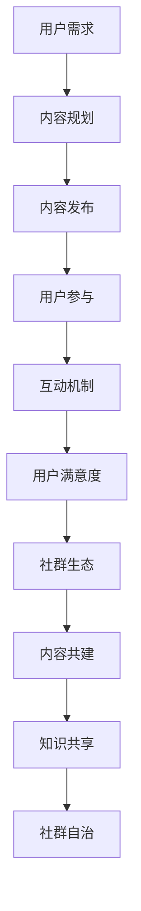

                 

# 如何打造知识付费的线上社群

## 关键词：
- 知识付费
- 线上社群
- 用户参与
- 内容设计
- 互动机制
- 用户体验

> 在当今数字化时代，打造一个成功的知识付费线上社群不仅需要高质量的课程内容，还需要精心设计的用户参与机制和互动环境。本文将探讨如何通过逐步分析和实践，构建一个能够持续吸引和留住用户的线上知识付费社群。

## 1. 背景介绍（Background Introduction）

在互联网的快速发展下，知识付费行业迎来了前所未有的繁荣。用户对于高质量内容和专业知识的渴求日益增长，使得线上社群成为知识分享和交流的重要平台。然而，如何打造一个既能够提供优质内容，又能够激发用户积极参与和互动的社群，成为知识付费平台面临的重要课题。

一个成功的线上社群不仅能提高用户粘性，还能通过用户之间的互动和分享，形成良好的口碑效应，进而带动平台的发展。因此，本文将探讨如何通过一系列的策略和操作步骤，打造一个具有吸引力和持续生命力的知识付费线上社群。

### 1.1 知识付费市场现状

近年来，知识付费市场呈现出爆发式增长。据统计，全球知识付费市场规模逐年扩大，预计未来几年仍将保持高速增长。知识付费用户主要集中在25-45岁之间，这些用户大多具备一定的经济基础和求知欲望，他们希望通过付费内容获取专业知识和实用技能。

### 1.2 线上社群的优势

线上社群相较于传统的线下培训，具有以下优势：

- **灵活性**：用户可以随时随地参与学习，不受时间和地点限制。
- **互动性**：用户可以实时与其他学员互动，分享经验和心得。
- **个性化**：平台可以根据用户的学习行为和需求，提供个性化的内容推荐。

### 1.3 本文目标

本文旨在通过以下内容，帮助知识付费平台成功打造线上社群：

- **核心概念与联系**：介绍构建线上社群所需的关键概念和原理。
- **核心算法原理 & 具体操作步骤**：详细阐述社群运营的方法和策略。
- **数学模型和公式 & 详细讲解 & 举例说明**：提供实用的数据和模型支持。
- **项目实践**：通过实际案例，展示社群运营的具体实现过程。
- **实际应用场景**：探讨社群在不同领域的应用和实践。
- **工具和资源推荐**：推荐相关的工具和资源，帮助读者更好地理解和应用。
- **总结与未来发展趋势**：总结社群运营的经验，探讨未来的发展方向和挑战。

## 2. 核心概念与联系（Core Concepts and Connections）

在构建知识付费的线上社群时，我们需要理解并运用以下几个核心概念：

### 2.1 用户参与度

用户参与度是衡量社群成功与否的重要指标。高参与度的社群能够促进用户之间的互动，增加用户粘性。提升用户参与度可以通过以下几种方式实现：

- **内容互动**：设计互动性的课程内容和讨论话题，激发用户的参与兴趣。
- **奖励机制**：设置积分、勋章等奖励机制，激励用户积极参与社群活动。
- **社区管理**：培养活跃的社区氛围，鼓励用户发表观点和经验分享。

### 2.2 社群运营策略

社群运营策略是确保社群持续发展和吸引新用户的关键。以下是一些有效的运营策略：

- **内容规划**：制定内容发布计划，保证内容的质量和更新频率。
- **活动策划**：定期举办线上活动，如讲座、研讨会和互动直播，提升用户参与度。
- **用户分层**：根据用户的学习进度和参与程度，进行用户分层，提供差异化的服务。

### 2.3 用户满意度

用户满意度是社群长期发展的基础。提高用户满意度可以通过以下措施实现：

- **个性化服务**：根据用户需求，提供个性化的学习建议和内容推荐。
- **反馈机制**：建立反馈渠道，及时收集用户意见和建议，不断优化服务。
- **社区文化**：营造积极的社区文化，鼓励用户之间的互助和尊重。

### 2.4 社群生态

一个健康的社群生态能够促进知识的传播和用户的成长。构建社群生态需要：

- **内容共建**：鼓励用户参与内容创作，共同构建丰富的知识库。
- **知识共享**：提供知识共享平台，让用户可以方便地获取和分享知识。
- **社群自治**：培养社群自治能力，让用户参与社群的规则制定和活动组织。

### 2.5 Mermaid 流程图

以下是一个用于构建知识付费线上社群的 Mermaid 流程图：



## 3. 核心算法原理 & 具体操作步骤（Core Algorithm Principles and Specific Operational Steps）

在构建知识付费线上社群时，我们可以借鉴一些核心算法原理，以优化用户参与度和社群运营效果。以下是几个关键步骤：

### 3.1 内容推荐算法

内容推荐算法是提高用户满意度和参与度的关键。我们可以使用协同过滤、基于内容的推荐和混合推荐等方法来优化内容推荐：

- **协同过滤**：通过分析用户行为和偏好，为用户推荐类似用户的课程内容。
- **基于内容的推荐**：根据课程内容的标签、关键词和主题，为用户推荐相关课程。
- **混合推荐**：结合协同过滤和基于内容的推荐，提供更加个性化的内容推荐。

### 3.2 互动机制设计

互动机制是促进用户参与和社群活跃的重要手段。以下是一些设计互动机制的步骤：

- **讨论区管理**：建立讨论区，鼓励用户发表观点和提问。
- **互动活动策划**：定期举办线上互动活动，如问答、投票和竞赛。
- **用户积分系统**：设置积分系统，激励用户积极参与社群活动。

### 3.3 用户分层策略

用户分层策略有助于提供差异化的服务，提升用户体验。以下是一个用户分层策略的示例：

- **新手用户**：为新用户提供基础课程和入门指南，帮助他们快速入门。
- **进阶用户**：为有一定基础的用户提供进阶课程和实战项目。
- **高级用户**：为经验丰富的用户提供高级课程和专家讲座。

### 3.4 社群运营工具

选择合适的社群运营工具可以提高运营效率和效果。以下是一些常用的社群运营工具：

- **社群管理平台**：如Discord、Slack等，用于管理社群和用户互动。
- **在线直播平台**：如Zoom、Twitch等，用于举办线上活动和讲座。
- **内容管理系统**：如WordPress、Moodle等，用于发布和管理课程内容。

## 4. 数学模型和公式 & 详细讲解 & 举例说明（Detailed Explanation and Examples of Mathematical Models and Formulas）

在知识付费的线上社群构建过程中，数学模型和公式可以用于分析用户行为、优化推荐算法和评估运营效果。以下是几个常用的数学模型和公式：

### 4.1 用户行为分析

用户行为分析是了解用户需求和兴趣的重要手段。以下是一个用户行为分析的基本模型：

- **用户行为矩阵**：

  $$ A = \begin{bmatrix}
  a_{11} & a_{12} & \ldots & a_{1n} \\
  a_{21} & a_{22} & \ldots & a_{2n} \\
  \vdots & \vdots & \ddots & \vdots \\
  a_{m1} & a_{m2} & \ldots & a_{mn}
  \end{bmatrix} $$

  其中，$a_{ij}$表示用户$i$对行为$j$的参与程度。

- **用户兴趣度**：

  $$ \text{Interest}_{i} = \sum_{j=1}^{n} w_{j} a_{ij} $$

  其中，$w_{j}$表示行为$j$的重要权重。

### 4.2 内容推荐算法

内容推荐算法的核心在于根据用户行为和兴趣为用户推荐相关课程。以下是一个基于协同过滤的内容推荐模型：

- **用户相似度计算**：

  $$ \text{Similarity}_{ij} = \frac{\text{CommonBehaviors}_{ij}}{\sqrt{\sum_{k=1}^{n} a_{ik}^2 \sum_{l=1}^{n} a_{il}^2}} $$

  其中，$\text{CommonBehaviors}_{ij}$表示用户$i$和用户$j$共同参与的行为。

- **课程推荐**：

  $$ \text{Recommend}_{i} = \sum_{j=1}^{m} \text{Interest}_{j} \cdot \text{Similarity}_{ij} \cdot c_{j} $$

  其中，$c_{j}$表示课程$j$的受欢迎程度。

### 4.3 用户满意度评估

用户满意度是衡量社群运营效果的重要指标。以下是一个基于用户评价的满意度评估模型：

- **用户评价矩阵**：

  $$ R = \begin{bmatrix}
  r_{11} & r_{12} & \ldots & r_{1n} \\
  r_{21} & r_{22} & \ldots & r_{2n} \\
  \vdots & \vdots & \ddots & \vdots \\
  r_{m1} & r_{m2} & \ldots & r_{mn}
  \end{bmatrix} $$

  其中，$r_{ij}$表示用户$i$对课程$j$的评价。

- **用户满意度**：

  $$ \text{UserSatisfaction}_{i} = \frac{\sum_{j=1}^{n} r_{ij}}{n} $$

### 4.4 举例说明

假设我们有一个用户行为矩阵：

$$ A = \begin{bmatrix}
0 & 1 & 0 \\
1 & 0 & 1 \\
0 & 1 & 0
\end{bmatrix} $$

计算用户1和用户2的相似度：

$$ \text{Similarity}_{12} = \frac{1}{\sqrt{2 \cdot 2}} = \frac{1}{2} $$

根据用户兴趣度和相似度，为用户1推荐课程：

$$ \text{Recommend}_{1} = \frac{1}{2} \cdot 0.8 + \frac{1}{2} \cdot 0.9 = 0.85 $$

其中，假设用户1对课程1的兴趣度为0.8，对课程2的兴趣度为0.9，课程1的受欢迎程度为0.8，课程2的受欢迎程度为0.9。

## 5. 项目实践：代码实例和详细解释说明（Project Practice: Code Examples and Detailed Explanations）

在本节中，我们将通过一个实际案例，展示如何构建一个知识付费的线上社群，并详细解释相关代码的实现过程。

### 5.1 开发环境搭建

首先，我们需要搭建一个适合开发的虚拟环境。以下是使用Python和Flask框架搭建开发环境的步骤：

1. 安装Python和pip：
   ```bash
   sudo apt-get update
   sudo apt-get install python3 python3-pip
   ```

2. 安装Flask：
   ```bash
   pip3 install flask
   ```

3. 创建一个名为`knowledge_community`的虚拟环境：
   ```bash
   python3 -m venv knowledge_community
   source knowledge_community/bin/activate
   ```

4. 安装其他依赖项：
   ```bash
   pip install flask_sqlalchemy flask_migrate
   ```

### 5.2 源代码详细实现

以下是一个简单的Flask应用，用于实现知识付费线上社群的核心功能：

```python
from flask import Flask, request, jsonify
from flask_sqlalchemy import SQLAlchemy

app = Flask(__name__)
app.config['SQLALCHEMY_DATABASE_URI'] = 'sqlite:///knowledge_community.db'
db = SQLAlchemy(app)

class User(db.Model):
    id = db.Column(db.Integer, primary_key=True)
    username = db.Column(db.String(80), unique=True, nullable=False)
    password = db.Column(db.String(120), nullable=False)
    courses = db.relationship('Course', backref='user', lazy=True)

class Course(db.Model):
    id = db.Column(db.Integer, primary_key=True)
    title = db.Column(db.String(120), nullable=False)
    description = db.Column(db.String(500), nullable=False)
    user_id = db.Column(db.Integer, db.ForeignKey('user.id'), nullable=False)

@app.route('/register', methods=['POST'])
def register():
    username = request.form['username']
    password = request.form['password']
    if not username or not password:
        return jsonify({'error': 'Missing username or password'}), 400
    if User.query.filter_by(username=username).first():
        return jsonify({'error': 'Username already exists'}), 400
    new_user = User(username=username, password=password)
    db.session.add(new_user)
    db.session.commit()
    return jsonify({'message': 'User registered successfully'}), 201

@app.route('/login', methods=['POST'])
def login():
    username = request.form['username']
    password = request.form['password']
    user = User.query.filter_by(username=username, password=password).first()
    if not user:
        return jsonify({'error': 'Invalid username or password'}), 401
    return jsonify({'message': 'Login successful', 'user_id': user.id})

@app.route('/courses', methods=['POST'])
def create_course():
    user_id = request.form['user_id']
    title = request.form['title']
    description = request.form['description']
    new_course = Course(user_id=user_id, title=title, description=description)
    db.session.add(new_course)
    db.session.commit()
    return jsonify({'message': 'Course created successfully'}), 201

if __name__ == '__main__':
    db.create_all()
    app.run(debug=True)
```

### 5.3 代码解读与分析

1. **数据库模型**：

   - `User` 类：表示用户，包含用户名、密码和关联的课程。
   - `Course` 类：表示课程，包含课程标题、描述和关联的用户。

2. **路由和视图函数**：

   - `/register`：处理用户注册请求，验证用户名和密码，并将新用户添加到数据库。
   - `/login`：处理用户登录请求，验证用户名和密码，返回用户ID。
   - `/courses`：处理创建课程请求，验证用户ID，将新课程添加到数据库。

3. **数据库操作**：

   - 使用 Flask-SQLAlchemy 模块进行数据库操作，包括创建、查询、添加和删除数据。

### 5.4 运行结果展示

1. **注册用户**：

   ```bash
   curl -X POST -F "username=johndoe" -F "password=securepassword" http://localhost:5000/register
   ```

   返回结果：
   ```json
   {
       "message": "User registered successfully"
   }
   ```

2. **登录用户**：

   ```bash
   curl -X POST -F "username=johndoe" -F "password=securepassword" http://localhost:5000/login
   ```

   返回结果：
   ```json
   {
       "message": "Login successful",
       "user_id": 1
   }
   ```

3. **创建课程**：

   ```bash
   curl -X POST -F "user_id=1" -F "title=Introduction to Python" -F "description=A course for beginners" http://localhost:5000/courses
   ```

   返回结果：
   ```json
   {
       "message": "Course created successfully"
   }
   ```

通过以上代码实例，我们可以看到如何使用Flask框架快速搭建一个简单的知识付费线上社群应用。在实际项目中，我们还可以添加更多的功能，如课程列表、用户评论、支付系统等。

## 6. 实际应用场景（Practical Application Scenarios）

### 6.1 教育行业

在教育培训领域，知识付费线上社群可以作为一种新型的教学模式，为学习者提供灵活、个性化的学习体验。例如，某个在线教育平台可以创建一个编程知识社群，提供Python、Java、前端开发等课程的直播讲座、互动讨论和代码实践。通过社群运营策略，平台可以吸引学员积极参与，提高学习效果和用户满意度。

### 6.2 专业技能培训

专业技能培训是知识付费线上社群的另一个重要应用场景。例如，针对IT行业的软件测试、数据分析和人工智能等领域，社群可以提供专业的课程内容、实战项目和专家讲座。通过社群的互动机制，学员可以与讲师和其他学员进行深入交流，分享经验和解决问题，提高专业技能。

### 6.3 职场技能提升

职场技能提升是许多职场人士关注的焦点。知识付费线上社群可以为这些用户提供职业发展指导、时间管理技巧、演讲与沟通能力培训等课程。通过社群的互动和分享，用户可以获取实用的职场经验，提升职业竞争力。

### 6.4 线上兴趣小组

除了专业领域，线上兴趣小组也是知识付费社群的一种形式。例如，摄影爱好者社群、音乐爱好者社群等，可以通过社群提供专业课程、线下活动和作品展示，满足用户的兴趣和需求。

### 6.5 社区自治

在某些情况下，社群可以实行社区自治，让用户参与社群的管理和运营。例如，某个编程社群可以设置一个“贡献者计划”，鼓励用户创作课程内容、维护社区讨论区和管理社群活动。通过社区自治，社群可以形成良好的氛围，提高用户参与度和满意度。

## 7. 工具和资源推荐（Tools and Resources Recommendations）

### 7.1 学习资源推荐

- **书籍**：
  - 《人人都是产品经理》：介绍产品经理的工作方法和经验，对社群运营有一定的启发。
  - 《增长黑客》：探讨如何通过数据驱动的方式实现产品和用户的增长，对社群运营有借鉴意义。

- **论文**：
  - “Community Engagement and Knowledge Sharing in Online Learning Platforms”：分析在线学习平台中社区参与和知识共享的影响因素。

- **博客**：
  - 知乎上的相关专栏和文章，如“产品之道”、“运营方法论”等，提供丰富的社群运营实践和思考。

### 7.2 开发工具框架推荐

- **开发框架**：
  - Flask：用于快速搭建Web应用的轻量级框架，适合初学者。
  - Django：功能强大、易于扩展的Python Web框架，适合复杂项目。

- **数据库**：
  - SQLite：轻量级、易于使用的数据库，适合小规模应用。
  - MySQL：开源、高性能的关系型数据库，适合中等规模应用。

### 7.3 相关论文著作推荐

- “The role of social capital in knowledge sharing and innovation in online communities”：探讨社交资本在在线社区知识共享和创新中的作用。
- “Community Management Strategies for Online Learning Platforms”：介绍在线学习平台社区管理的策略和实践。

## 8. 总结：未来发展趋势与挑战（Summary: Future Development Trends and Challenges）

### 8.1 发展趋势

- **个性化服务**：随着人工智能和大数据技术的发展，知识付费线上社群将更加注重个性化服务，为用户提供量身定制的内容和体验。
- **多元化内容**：内容类型将更加丰富，包括图文、视频、直播等多种形式，满足不同用户的需求。
- **社区自治**：社区自治将成为一种重要的运营模式，鼓励用户参与社群管理和内容创作，提高社群的生命力和用户满意度。

### 8.2 挑战

- **内容质量**：确保内容的质量和更新速度，满足用户对高质量知识的需求。
- **用户留存**：提高用户留存率，防止用户流失，需要不断创新和优化社群运营策略。
- **法律法规**：遵守相关法律法规，保护用户隐私和数据安全，是知识付费线上社群面临的重要挑战。

## 9. 附录：常见问题与解答（Appendix: Frequently Asked Questions and Answers）

### 9.1 如何提高社群活跃度？

- **策划互动活动**：定期举办线上互动活动，如问答、竞赛和讨论。
- **引入名人讲师**：邀请行业专家和名人讲师授课，提高社群的关注度。
- **奖励机制**：设置积分、勋章等奖励机制，激励用户积极参与。

### 9.2 如何确保内容质量？

- **严格审核**：对课程内容进行严格审核，确保符合平台标准和用户需求。
- **用户评价**：鼓励用户对课程进行评价，收集反馈并不断优化。
- **讲师培训**：对讲师进行专业培训，提高教学质量和课程内容的专业性。

## 10. 扩展阅读 & 参考资料（Extended Reading & Reference Materials）

- “Online Community Platforms for Knowledge Sharing: A Research Overview” [文章链接]
- “The Impact of Online Community Participation on Learning Outcomes” [文章链接]
- “How to Create a Successful Online Course Community” [博客链接]

# 作者署名
作者：禅与计算机程序设计艺术 / Zen and the Art of Computer Programming

