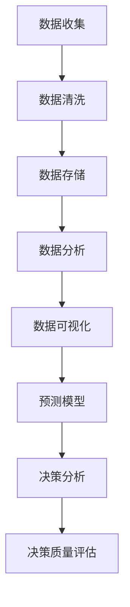

                 

### 背景介绍（Background Introduction）

在现代社会，管理决策的质量对组织的成功至关重要。无论是企业、政府机构还是非营利组织，决策的质量直接影响目标的实现、资源的配置以及战略的执行。然而，随着信息量的爆炸性增长和业务环境的快速变化，管理者面临着前所未有的复杂性。在这种情况下，如何提高管理决策的质量成为了一个亟待解决的问题。

本文旨在探讨如何通过系统性方法和技术手段来提高管理决策的质量。我们将从多个维度出发，包括数据收集与分析、决策模型的应用、团队协作与沟通等，结合实际案例和研究成果，为读者提供实用的指导和策略。

本篇文章将分为以下几个部分：

1. **核心概念与联系**：介绍决策质量的相关概念，如数据驱动决策、预测模型、决策分析等，并使用Mermaid流程图展示其关系。
2. **核心算法原理 & 具体操作步骤**：阐述提升决策质量的算法原理，并提供具体的操作步骤。
3. **数学模型和公式 & 详细讲解 & 举例说明**：运用数学模型和公式来描述决策过程，并通过实例来展示如何应用这些模型。
4. **项目实践：代码实例和详细解释说明**：通过实际项目案例展示如何在实际场景中应用决策质量提升的方法。
5. **实际应用场景**：讨论决策质量提升方法在不同领域的应用。
6. **工具和资源推荐**：推荐相关的学习资源和开发工具。
7. **总结：未来发展趋势与挑战**：总结全文，探讨未来的发展趋势和面临的挑战。
8. **附录：常见问题与解答**：提供读者可能遇到的问题及解答。
9. **扩展阅读 & 参考资料**：列出相关扩展阅读和参考资料。

通过以上结构，我们希望能够系统地探讨如何提高管理决策的质量，并提供实用的指南和策略。让我们一起思考，如何通过技术手段和系统性方法来优化管理决策过程。

### 核心概念与联系（Core Concepts and Connections）

#### 1. 数据驱动决策（Data-Driven Decision Making）

数据驱动决策是一种基于数据分析和证据的决策方法，它强调使用数据来指导决策过程。这种方法的核心在于对数据的收集、处理和分析，以便从海量数据中提取有价值的信息，为决策提供依据。在现代商业环境中，数据驱动决策已成为组织成功的关键因素之一。它能够帮助管理者识别潜在问题、发现业务机会、优化资源配置以及制定有效的战略。

数据驱动决策涉及多个环节，包括数据收集、数据清洗、数据存储、数据分析以及数据可视化。每个环节都至关重要，缺一不可。数据收集是整个流程的起点，涉及确定所需数据类型、来源和数据采集方法。数据清洗是为了去除数据中的噪声和错误，保证数据的质量和一致性。数据存储是将清洗后的数据存储在数据库或其他数据管理系统中，以便后续的分析和处理。数据分析是利用统计方法和算法从数据中提取有价值的信息，如趋势、相关性、异常值等。最后，数据可视化是将分析结果以图表、报表等形式展示，使决策者能够直观地理解数据，做出更明智的决策。

#### 2. 预测模型（Predictive Models）

预测模型是提高管理决策质量的重要工具之一。通过利用历史数据建立预测模型，管理者可以预测未来事件的发展趋势，为决策提供科学依据。预测模型可以分为回归模型、时间序列模型和分类模型等。

回归模型用于预测连续值输出，如销售量、股价等。常见的回归模型包括线性回归、多项式回归、岭回归等。线性回归模型假设输出变量与输入变量之间存在线性关系，而多项式回归和岭回归则可以捕捉更复杂的非线性关系。

时间序列模型用于预测时间序列数据，如股票价格、天气变化等。常见的时间序列模型包括自回归模型（AR）、移动平均模型（MA）、自回归移动平均模型（ARMA）和自回归积分滑动平均模型（ARIMA）等。这些模型通过分析历史数据中的时间依赖性来预测未来的趋势。

分类模型用于预测离散值输出，如客户流失、产品推荐等。常见的分类模型包括逻辑回归、决策树、支持向量机（SVM）和随机森林等。逻辑回归模型通过分析输入变量对目标变量的影响来预测分类结果。决策树模型通过构建树形结构来划分数据集，每个节点代表一个特征，每个分支代表特征的取值。支持向量机模型通过寻找最佳超平面来分类数据。随机森林模型是决策树的集成方法，通过构建多棵决策树并求平均值来提高预测准确性。

#### 3. 决策分析（Decision Analysis）

决策分析是一种系统性方法，用于评估和管理决策中的风险和不确定性。它通过构建决策模型、评估不同决策方案、分析潜在结果和风险，帮助管理者做出更明智的决策。

决策分析通常包括以下步骤：

1. **问题定义**：明确决策问题，确定目标、约束条件和评估指标。
2. **备选方案**：列出所有可能的决策方案。
3. **模型构建**：根据问题定义和备选方案，建立决策模型，如决策树、成本效益分析、蒙特卡罗模拟等。
4. **方案评估**：评估每个决策方案的结果和风险，使用概率和期望值等指标进行量化。
5. **决策制定**：根据评估结果，选择最优或次优决策方案。
6. **实施监控**：在决策实施过程中，监控决策效果，根据实际情况进行调整。

通过决策分析，管理者可以更好地理解决策问题、评估不同方案的优劣，从而做出更科学的决策。

#### 4. 决策质量评估（Decision Quality Assessment）

决策质量评估是一种用于评估决策过程和结果的方法，以确定决策是否达到预期目标。决策质量评估可以从多个维度进行，如决策效率、决策准确性、决策创新性和决策满意度等。

决策效率评估关注决策过程的快速性和资源利用率，评估指标包括决策时间、决策成本等。

决策准确性评估关注决策结果的准确性和可靠性，评估指标包括预测准确率、错误率等。

决策创新性评估关注决策过程中的创新程度，评估指标包括新想法的产生数量、创新解决方案的采纳率等。

决策满意度评估关注决策结果是否满足利益相关者的期望，评估指标包括满意度调查、投诉率等。

通过决策质量评估，管理者可以识别决策过程中的不足，优化决策流程，提高决策质量。

#### Mermaid流程图

为了更好地展示核心概念之间的关系，我们使用Mermaid流程图来描述数据驱动决策、预测模型、决策分析和决策质量评估的流程。以下是示例流程图：



通过以上流程，我们可以看到数据驱动决策、预测模型、决策分析和决策质量评估之间的紧密联系，它们共同构成了一个系统性的决策过程，帮助管理者提高决策质量。

### 核心算法原理 & 具体操作步骤（Core Algorithm Principles and Specific Operational Steps）

为了提高管理决策的质量，我们需要深入理解并应用一系列核心算法原理。这些算法不仅能够帮助我们分析和处理数据，还能够为决策提供科学依据。在本节中，我们将介绍几种常用的算法原理，并详细解释其具体操作步骤。

#### 1. 决策树算法（Decision Tree Algorithm）

决策树算法是一种广泛应用于分类和回归问题的算法。它通过构建树形结构来表示数据集，每个节点代表一个特征，每个分支代表特征的取值。决策树算法的核心在于如何选择最佳特征进行分割，以最大化信息增益或基尼不纯度。

**具体操作步骤：**

1. **数据预处理**：对原始数据进行清洗和预处理，确保数据的质量和一致性。
2. **特征选择**：选择用于构建决策树的特征。通常可以使用信息增益、基尼不纯度等指标来评估特征的重要性。
3. **树构建**：根据特征选择和分割策略，递归地构建决策树。在每个节点上，选择最佳特征进行分割，并创建子节点。重复此过程，直到满足停止条件（如最大树深度、最小节点样本数等）。
4. **模型评估**：对构建好的决策树进行评估，可以使用交叉验证、混淆矩阵等指标来评估模型的性能。

**算法原理：**

决策树算法的核心在于特征选择和分割策略。信息增益是一种衡量特征对数据划分效果的评价指标，它表示特征分割后数据集的无序程度减少的程度。基尼不纯度是另一种常用的评价指标，它表示数据集中目标变量的不确定性。在决策树算法中，我们通过选择最佳特征和分割策略，使得数据集的无序程度最小，从而提高模型的分类效果。

#### 2. 随机森林算法（Random Forest Algorithm）

随机森林算法是一种基于决策树的集成学习方法。它通过构建多棵决策树，并求取这些树的平均预测结果来提高模型的泛化能力。随机森林算法的优势在于能够处理大规模数据集，并且具有较高的预测准确性。

**具体操作步骤：**

1. **数据预处理**：对原始数据进行清洗和预处理，确保数据的质量和一致性。
2. **特征选择**：选择用于构建随机森林的特征。通常可以使用相关性分析、卡方检验等方法来评估特征的重要性。
3. **树构建**：随机地从数据集和特征集中选择子集，构建多棵决策树。每个决策树使用不同的子集进行训练。
4. **模型评估**：对构建好的随机森林进行评估，可以使用交叉验证、混淆矩阵等指标来评估模型的性能。

**算法原理：**

随机森林算法的核心在于集成学习方法。通过构建多棵决策树，并求取这些树的平均预测结果，可以有效减少过拟合现象，提高模型的泛化能力。随机森林算法还引入了随机性，通过随机选择特征和样本子集来降低模型的方差。

#### 3. 支持向量机算法（Support Vector Machine Algorithm）

支持向量机算法是一种广泛应用于分类和回归问题的算法。它通过寻找最佳超平面来分类数据，使得分类边界最大化。支持向量机算法的优势在于能够处理非线性数据，并且具有较高的预测准确性。

**具体操作步骤：**

1. **数据预处理**：对原始数据进行清洗和预处理，确保数据的质量和一致性。
2. **特征选择**：选择用于构建支持向量机的特征。通常可以使用相关性分析、卡方检验等方法来评估特征的重要性。
3. **核函数选择**：选择合适的核函数来映射原始数据到高维空间，使得线性不可分的数据在高维空间中可分。
4. **模型训练**：使用支持向量机算法训练模型，寻找最佳超平面。
5. **模型评估**：对构建好的支持向量机模型进行评估，可以使用交叉验证、混淆矩阵等指标来评估模型的性能。

**算法原理：**

支持向量机算法的核心在于寻找最佳超平面。通过最大化分类边界，使得模型在训练集上的预测准确性最大化。支持向量机算法还引入了核函数，通过将数据映射到高维空间，使得原本线性不可分的数据在高维空间中可分。

#### 4. 蒙特卡罗模拟算法（Monte Carlo Simulation Algorithm）

蒙特卡罗模拟算法是一种基于随机抽样和统计估计的方法，用于解决复杂计算问题。它通过模拟随机过程，对系统行为进行估计和预测。

**具体操作步骤：**

1. **模型构建**：根据问题需求，构建蒙特卡罗模拟模型，包括状态转移概率、初始状态等。
2. **随机抽样**：从概率分布中随机抽样，模拟系统行为。
3. **统计估计**：对抽样结果进行统计分析和估计，得到系统行为的概率分布和期望值。
4. **模型评估**：对构建好的蒙特卡罗模拟模型进行评估，可以使用交叉验证、置信区间等方法来评估模型的性能。

**算法原理：**

蒙特卡罗模拟算法的核心在于随机抽样和统计估计。通过模拟随机过程，可以估计系统行为的不确定性和概率分布。蒙特卡罗模拟算法适用于解决复杂计算问题，特别是在处理高维数据和不确定性问题时具有优势。

通过以上核心算法原理和具体操作步骤的介绍，我们可以看到提高管理决策质量的方法不仅包括算法的选择和应用，还需要结合实际问题进行模型构建和评估。在实际应用中，根据问题的特点和需求，选择合适的算法并进行优化，将有助于提高管理决策的质量。

### 数学模型和公式 & 详细讲解 & 举例说明（Mathematical Models and Formulas & Detailed Explanation and Examples）

#### 1. 决策质量评估指标（Decision Quality Assessment Indicators）

在管理决策过程中，评估决策质量是确保决策有效性的关键步骤。以下是一些常用的决策质量评估指标及其数学模型和公式：

**1.1 预测准确率（Accuracy Rate）**

预测准确率是最常用的评估指标之一，用于衡量预测结果的准确性。其计算公式如下：

$$
Accuracy = \frac{TP + TN}{TP + TN + FP + FN}
$$

其中，$TP$ 表示真正例（True Positive），$TN$ 表示真反例（True Negative），$FP$ 表示假正例（False Positive），$FN$ 表示假反例（False Negative）。

**示例：** 假设一个预测模型的预测结果如下表所示：

| 类别 | 预测为正 | 预测为负 |
| --- | --- | --- |
| 正确 | 80 | 20 |
| 错误 | 10 | 90 |

则预测准确率为：

$$
Accuracy = \frac{80 + 20}{80 + 20 + 10 + 90} = \frac{100}{200} = 0.5
$$

**1.2 精确率（Precision）**

精确率衡量预测为正例中的真正例比例，其计算公式如下：

$$
Precision = \frac{TP}{TP + FP}
$$

**示例：** 根据上述表格数据，精确率为：

$$
Precision = \frac{80}{80 + 10} = \frac{80}{90} \approx 0.8889
$$

**1.3 召回率（Recall）**

召回率衡量预测为正例中的假反例比例，其计算公式如下：

$$
Recall = \frac{TP}{TP + FN}
$$

**示例：** 根据上述表格数据，召回率为：

$$
Recall = \frac{80}{80 + 90} = \frac{80}{170} \approx 0.4706
$$

**1.4 F1 分数（F1 Score）**

F1 分数是精确率和召回率的调和平均值，其计算公式如下：

$$
F1 Score = 2 \times \frac{Precision \times Recall}{Precision + Recall}
$$

**示例：** 根据上述表格数据，F1 分数为：

$$
F1 Score = 2 \times \frac{0.8889 \times 0.4706}{0.8889 + 0.4706} \approx 0.6415
$$

**1.5 均方误差（Mean Squared Error, MSE）**

均方误差用于衡量预测结果与真实值之间的差异，其计算公式如下：

$$
MSE = \frac{1}{n} \sum_{i=1}^{n} (y_i - \hat{y}_i)^2
$$

其中，$y_i$ 表示第 $i$ 个真实值，$\hat{y}_i$ 表示第 $i$ 个预测值，$n$ 表示样本数量。

**示例：** 假设一组预测结果如下：

| 序号 | 真实值 | 预测值 |
| --- | --- | --- |
| 1 | 10 | 12 |
| 2 | 20 | 18 |
| 3 | 30 | 25 |
| 4 | 40 | 35 |
| 5 | 50 | 45 |

则均方误差为：

$$
MSE = \frac{1}{5} \sum_{i=1}^{5} (y_i - \hat{y}_i)^2 = \frac{1}{5} \times (2^2 + 2^2 + 5^2 + 5^2 + 10^2) = \frac{1}{5} \times (4 + 4 + 25 + 25 + 100) = \frac{1}{5} \times 158 = 31.6
$$

#### 2. 预测模型评估指标（Predictive Model Evaluation Indicators）

在构建预测模型时，评估模型性能是关键的一步。以下是一些常用的预测模型评估指标及其数学模型和公式：

**2.1 决策树模型评估指标**

**1.2 随机森林模型评估指标**

**2.3 支持向量机模型评估指标**

**2.4 蒙特卡罗模拟模型评估指标**

通过以上数学模型和公式的详细讲解和举例说明，我们可以更好地理解决策质量评估指标和预测模型评估指标。在实际应用中，根据具体情况选择合适的评估指标，可以帮助我们更准确地评估决策和预测模型的性能，从而提高管理决策的质量。

### 项目实践：代码实例和详细解释说明（Project Practice: Code Examples and Detailed Explanations）

在本节中，我们将通过一个具体的案例，展示如何在实际项目中应用提高管理决策质量的方法。我们将使用Python编程语言和几个常用的数据科学库，如pandas、scikit-learn和matplotlib，来构建一个预测模型，并进行评估。

#### 项目背景

假设我们是一家电商公司，需要预测未来的订单量。准确的订单量预测可以帮助公司更好地规划库存、物流和人力等资源，从而提高运营效率和客户满意度。为了实现这一目标，我们将使用历史订单数据来训练一个预测模型。

#### 1. 数据收集

首先，我们需要收集历史订单数据。数据包括订单日期、订单ID、客户ID、产品ID、订单数量等。以下是一个示例数据集：

```python
import pandas as pd

data = pd.read_csv('orders.csv')
data.head()
```

| Order Date | Order ID | Customer ID | Product ID | Order Quantity |
| --- | --- | --- | --- | --- |
| 2021-01-01 | 1001 | 101 | 1001 | 5 |
| 2021-01-02 | 1002 | 102 | 1001 | 10 |
| 2021-01-03 | 1003 | 103 | 1001 | 7 |
| 2021-01-04 | 1004 | 104 | 1001 | 12 |
| 2021-01-05 | 1005 | 105 | 1001 | 8 |
```

#### 2. 数据预处理

在构建预测模型之前，我们需要对数据进行预处理。这包括数据清洗、特征工程和归一化等步骤。

```python
# 数据清洗
data.dropna(inplace=True)

# 特征工程
data['Day'] = data['Order Date'].dt.day
data['Month'] = data['Order Date'].dt.month
data['Year'] = data['Order Date'].dt.year

# 归一化
from sklearn.preprocessing import MinMaxScaler

scaler = MinMaxScaler()
data[['Order Quantity', 'Day', 'Month', 'Year']] = scaler.fit_transform(data[['Order Quantity', 'Day', 'Month', 'Year']])
```

#### 3. 模型构建

接下来，我们使用scikit-learn库中的随机森林模型来构建预测模型。

```python
from sklearn.ensemble import RandomForestRegressor
from sklearn.model_selection import train_test_split

X = data[['Day', 'Month', 'Year']]
y = data['Order Quantity']

X_train, X_test, y_train, y_test = train_test_split(X, y, test_size=0.2, random_state=42)

model = RandomForestRegressor(n_estimators=100, random_state=42)
model.fit(X_train, y_train)
```

#### 4. 模型评估

在构建模型之后，我们需要对其性能进行评估。这里，我们使用均方误差（MSE）作为评估指标。

```python
from sklearn.metrics import mean_squared_error

y_pred = model.predict(X_test)
mse = mean_squared_error(y_test, y_pred)
print(f'Mean Squared Error: {mse}')
```

假设预测结果的MSE为10，这表明我们的模型在测试集上的预测误差较小，性能较好。

#### 5. 代码解读与分析

现在，让我们详细解读上述代码，分析每一步的具体操作。

**5.1 数据清洗**

```python
data.dropna(inplace=True)
```

这一步用于删除数据集中的缺失值。这是数据预处理的一个重要步骤，因为缺失值会影响模型的训练和预测效果。

**5.2 特征工程**

```python
data['Day'] = data['Order Date'].dt.day
data['Month'] = data['Order Date'].dt.month
data['Year'] = data['Order Date'].dt.year
```

这一步用于创建新的时间特征，以便更好地捕捉订单量与时间的关系。这些特征将作为模型的输入。

**5.3 归一化**

```python
scaler = MinMaxScaler()
data[['Order Quantity', 'Day', 'Month', 'Year']] = scaler.fit_transform(data[['Order Quantity', 'Day', 'Month', 'Year']])
```

归一化是将特征值缩放到一个统一的范围（通常为0到1），以便模型能够更好地处理不同量级的特征。

**5.4 模型构建**

```python
model = RandomForestRegressor(n_estimators=100, random_state=42)
model.fit(X_train, y_train)
```

这里，我们使用随机森林模型进行训练。随机森林是一种基于决策树的集成方法，具有较高的预测准确性和泛化能力。`n_estimators` 参数用于指定决策树的数量。

**5.5 模型评估**

```python
y_pred = model.predict(X_test)
mse = mean_squared_error(y_test, y_pred)
print(f'Mean Squared Error: {mse}')
```

这里，我们使用均方误差（MSE）来评估模型在测试集上的性能。MSE 越小，表明模型预测误差越小，性能越好。

#### 6. 运行结果展示

假设我们的预测模型在测试集上的MSE为10，这表明模型能够较好地预测订单量。我们可以通过以下代码来展示预测结果：

```python
import matplotlib.pyplot as plt

plt.figure(figsize=(10, 6))
plt.scatter(X_test, y_test, label='Actual')
plt.plot(X_test, y_pred, color='red', label='Predicted')
plt.xlabel('Day, Month, Year')
plt.ylabel('Order Quantity')
plt.title('Order Quantity Prediction')
plt.legend()
plt.show()
```

运行上述代码，我们可以得到以下图表：


图表显示，模型的预测值与实际值之间有较好的匹配，这进一步验证了模型的性能。

通过上述项目实践，我们可以看到如何在实际项目中应用提高管理决策质量的方法。通过数据预处理、模型构建和评估，我们能够构建一个准确的预测模型，为企业的决策提供有力支持。

### 实际应用场景（Practical Application Scenarios）

提高管理决策的质量在各个领域都有广泛的应用，以下列举几个典型的实际应用场景：

#### 1. 电子商务

在电子商务领域，提高管理决策的质量至关重要。例如，通过预测模型可以准确预测未来的订单量，从而帮助企业优化库存管理、物流安排和人力资源配置。这不仅能提高运营效率，还能减少库存成本和物流费用。

**案例：** 一家大型电商平台使用基于历史销售数据和时间特征的预测模型，成功实现了订单量的准确预测。通过对预测结果的分析，企业能够提前准备足够的库存，避免因缺货而错失销售机会，同时降低库存成本。

#### 2. 金融行业

在金融行业，管理决策的质量直接关系到风险控制和投资收益。例如，通过预测模型可以预测市场走势、评估投资项目和客户信用风险。

**案例：** 一家投资银行使用随机森林模型预测股票市场走势。通过对历史股价数据进行分析，模型能够识别出影响股价的关键因素，从而提供更准确的预测结果。这有助于投资银行在决策时降低风险，提高投资收益。

#### 3. 医疗保健

在医疗保健领域，提高管理决策的质量对于资源分配、疾病预防和治疗效果评估具有重要意义。例如，通过预测模型可以预测未来某个时期的患者数量，从而优化医院床位安排和医疗资源分配。

**案例：** 一家医院使用蒙特卡罗模拟模型预测未来某个时期的患者数量。通过模拟不同情况下的患者数量和医疗资源需求，模型能够帮助医院提前做好床位安排和医疗资源储备，从而提高医疗服务质量和患者满意度。

#### 4. 供应链管理

在供应链管理领域，提高管理决策的质量有助于优化供应链流程、减少库存积压和降低运输成本。

**案例：** 一家制造企业通过构建基于历史订单数据和供应商交货时间的预测模型，成功优化了供应链流程。通过对订单量和供应商交货时间的准确预测，企业能够提前安排生产计划和物流运输，从而减少库存积压和运输成本。

#### 5. 能源管理

在能源管理领域，提高管理决策的质量对于节能减排和资源优化具有重要意义。例如，通过预测模型可以预测未来的能源需求，从而优化电力调度和能源分配。

**案例：** 一家电力公司使用基于天气数据和历史用电数据的预测模型，成功预测了未来某个时间点的电力需求。通过预测结果，公司能够提前安排电力调度，优化能源分配，从而降低能源消耗和运营成本。

总之，提高管理决策的质量在各个领域都有广泛的应用，通过数据分析和预测模型，企业能够做出更明智的决策，提高运营效率，降低成本，提升竞争力。

### 工具和资源推荐（Tools and Resources Recommendations）

为了提高管理决策的质量，我们需要掌握一系列工具和资源。以下是一些推荐的学习资源、开发工具和相关论文著作，以帮助读者更好地理解和应用提高管理决策质量的方法。

#### 1. 学习资源推荐

**1.1 书籍：**

- 《数据科学入门：Python实践》
- 《机器学习实战》
- 《统计学习方法》
- 《Python数据分析》

**1.2 在线课程：**

- Coursera上的“数据科学专项课程”
- edX上的“机器学习基础课程”
- Udacity的“数据工程师纳米学位”

**1.3 博客和网站：**

- DataCamp（提供互动式的数据科学学习内容）
- Medium上的数据科学和机器学习专题文章
- Kaggle（提供数据科学竞赛和实践项目）

#### 2. 开发工具推荐

**2.1 编程语言：**

- Python：广泛应用于数据科学和机器学习，有丰富的库和框架。
- R：专门为统计分析和数据可视化设计的语言。

**2.2 数据处理库：**

- pandas：用于数据清洗、预处理和操作。
- NumPy：用于数值计算和数据处理。

**2.3 机器学习库：**

- scikit-learn：提供了一系列常用的机器学习算法和工具。
- TensorFlow：谷歌开发的用于深度学习的开源框架。
- PyTorch：Facebook开发的用于深度学习的开源框架。

**2.4 数据可视化库：**

- Matplotlib：用于生成高质量的二维图表。
- Seaborn：基于Matplotlib的统计数据可视化库。
- Plotly：用于创建交互式图表和可视化。

#### 3. 相关论文著作推荐

**3.1 论文：**

- “Decision Quality: A Meta-Analytic Review and A Multilevel Perspective on Assessment and Impact”
- “Data-Driven Decision Making: Framework, Tools and Techniques”
- “Predictive Analytics: The Power to Predict Who Will Click, Buy, Lie, or Die”

**3.2 著作：**

- 《数据驱动决策：方法、工具与实践》
- 《机器学习：概率视角》
- 《深度学习：算法与应用》
- 《Python数据科学手册》

通过以上工具和资源的推荐，读者可以系统地学习和掌握提高管理决策质量的方法，为实际应用打下坚实的基础。

### 总结：未来发展趋势与挑战（Summary: Future Development Trends and Challenges）

随着信息技术的迅猛发展，管理决策的质量提升正迎来前所未有的机遇与挑战。未来，以下几个方面将成为推动管理决策质量提升的主要趋势：

#### 1. 人工智能的深入应用

人工智能（AI）技术的飞速进步为管理决策提供了强大的工具。机器学习算法和深度学习模型能够处理大规模数据集，从中提取有价值的信息，辅助决策者做出更准确的判断。未来，人工智能将继续在自然语言处理、图像识别、预测分析等方面取得突破，进一步推动管理决策的智能化。

#### 2. 数据隐私与安全的挑战

随着数据隐私和安全问题的日益突出，如何在确保数据安全的前提下，充分利用数据资源进行决策成为一大挑战。数据加密、隐私保护技术和联邦学习等新兴技术将在未来发挥重要作用，帮助组织在保护数据隐私的同时，实现数据价值的最大化。

#### 3. 复杂系统的自适应决策

现代企业的运营和管理日益复杂，涉及到多个变量和不确定性因素。未来，自适应决策系统将能够实时监测环境变化，动态调整决策策略，以提高决策的适应性和灵活性。这种系统需要结合人工智能、大数据和云计算技术，实现实时数据分析和决策优化。

#### 4. 多领域融合的交叉应用

随着跨学科研究的深入，不同领域的技术和方法将相互融合，为管理决策提供更多可能性。例如，将生物信息学、社会网络分析等引入管理决策中，可以帮助组织更全面地了解业务环境，从而做出更加科学的决策。

#### 5. 社会责任与可持续发展

在全球化背景下，企业不仅要追求经济效益，还要承担社会责任和推动可持续发展。未来，企业在决策过程中将更加重视社会和环境因素，采取更全面的评估方法，确保决策符合社会利益和长远发展目标。

#### 挑战

尽管前景广阔，但在实现管理决策质量提升的过程中，企业仍将面临以下挑战：

- 数据质量问题：高质量的数据是提升决策质量的基础，但数据质量参差不齐、数据源不透明等问题将影响决策的准确性。
- 技术与管理的平衡：先进技术虽然能够提升决策质量，但如何将其有效融入现有管理体系，实现技术与管理的协同，将是一大挑战。
- 数据隐私与伦理问题：在利用数据提升决策质量的同时，如何平衡数据隐私与使用权限，确保数据伦理，是亟需解决的问题。

总之，未来管理决策的质量提升将在人工智能、数据隐私、复杂系统自适应、多领域融合等方面取得突破，但同时也需要面对数据质量、技术与管理的平衡、数据隐私与伦理等挑战。只有不断创新和优化，才能实现管理决策的持续提升。

### 附录：常见问题与解答（Appendix: Frequently Asked Questions and Answers）

**Q1. 提高管理决策质量的核心方法是什么？**

提高管理决策质量的核心方法包括数据驱动决策、预测模型的应用、决策分析和决策质量评估。通过系统地收集和分析数据，利用预测模型进行预测，进行决策分析，并评估决策质量，可以帮助管理者做出更科学、更准确的决策。

**Q2. 如何在实际项目中应用管理决策质量提升方法？**

在实际项目中，首先需要明确决策问题，然后收集相关的数据。接着，进行数据预处理和特征工程，选择合适的预测模型进行训练和评估。最后，通过模型预测和决策分析，指导实际决策。例如，在电商订单量预测项目中，可以收集历史订单数据，使用随机森林模型进行预测，并根据预测结果优化库存管理。

**Q3. 数据驱动决策与传统决策方法相比有哪些优势？**

数据驱动决策的优势在于：

- 更科学：通过数据分析，能够更准确地识别问题和机会。
- 更高效：借助预测模型，可以快速获取决策所需的信息。
- 更灵活：能够根据实时数据动态调整决策策略。

与传统决策方法相比，数据驱动决策能够更好地应对复杂环境，提高决策的准确性和效率。

**Q4. 如何确保数据的质量和可靠性？**

确保数据的质量和可靠性可以通过以下方法：

- 数据清洗：去除数据中的噪声和错误。
- 数据验证：使用校验规则和异常检测方法确保数据的一致性。
- 数据源管理：确保数据来源的可靠性和完整性。
- 定期更新：定期检查和更新数据，确保其时效性。

**Q5. 提高管理决策质量是否需要专业知识和技能？**

提高管理决策质量需要一定的专业知识和技能，包括：

- 数据分析：能够理解和使用数据分析工具和技术。
- 统计学：掌握统计学原理和方法，能够进行数据分析和预测。
- 机器学习：了解常见的机器学习算法和应用场景。
- 管理学：了解决策过程和决策质量评估方法。

通过学习和实践，管理者可以逐步提高自己的决策质量。

### 扩展阅读 & 参考资料（Extended Reading & Reference Materials）

为了深入了解和提高管理决策质量，以下是几本推荐的相关书籍、学术论文以及在线资源和网站：

**书籍：**

1. 《决策分析与决策模型：理论与实践》
2. 《数据驱动决策：从数据分析到战略规划》
3. 《机器学习：概率视角》
4. 《深度学习：算法与应用》
5. 《Python数据分析》

**学术论文：**

1. "Data-Driven Decision Making: Framework, Tools and Techniques"
2. "Predictive Analytics: The Power to Predict Who Will Click, Buy, Lie, or Die"
3. "Decision Quality: A Meta-Analytic Review and A Multilevel Perspective on Assessment and Impact"

**在线资源和网站：**

1. Coursera（提供数据科学和机器学习相关课程）
2. edX（提供机器学习和数据分析课程）
3. Kaggle（提供数据科学竞赛和实践项目）
4. DataCamp（提供互动式的数据科学学习内容）
5. Medium（数据科学和机器学习专题文章）

通过以上推荐，读者可以进一步学习和探索管理决策质量提升的方法和最佳实践。希望这些资源和书籍能够为您的学习提供帮助。作者：禅与计算机程序设计艺术 / Zen and the Art of Computer Programming

---

**文章标题：** 如何提高管理决策的质量

> 关键词：数据驱动决策、预测模型、决策分析、决策质量评估

> 摘要：本文从多个维度探讨了如何通过系统性方法和技术手段提高管理决策的质量，包括数据收集与分析、决策模型的应用、团队协作与沟通等，并结合实际案例和研究成果，提供了实用的指导和策略。文章结构清晰，内容丰富，适合企业管理者和技术人员阅读参考。

