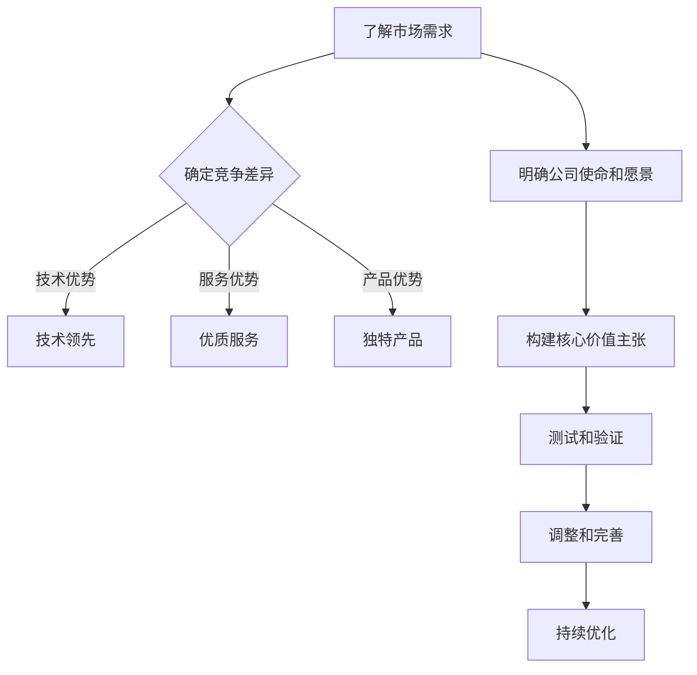

                 

# 如何构建创业公司的核心价值主张

## 引言（Introduction）
创业公司的成功离不开清晰的核心价值主张。核心价值主张不仅仅是一句口号，它是指公司存在的根本原因，是驱动公司前进的动力源泉。一个成功的核心价值主张能够吸引投资者、留住员工，并为客户提供独特的价值。本文将探讨如何构建创业公司的核心价值主张，并解释其重要性。

### 关键词（Keywords）
- 核心价值主张
- 创业公司
- 投资者
- 客户
- 价值

### 摘要（Abstract）
本文介绍了核心价值主张对创业公司的重要性，并详细阐述了构建核心价值主张的步骤。通过理解市场需求、定位竞争差异以及明确公司的使命和愿景，创业公司可以打造一个强有力的核心价值主张，从而在激烈的市场竞争中脱颖而出。

## 1. 背景介绍（Background Introduction）

### 创业公司的核心价值主张

核心价值主张（Core Value Proposition）是指公司为其目标客户群体提供的独特价值。它明确了公司存在的目的以及为何公司与其他竞争对手不同。核心价值主张应该简洁明了，能够迅速传达公司的核心竞争力。

### 为什么核心价值主张重要？

核心价值主张对于创业公司的成功至关重要，原因如下：

- **吸引投资者**：投资者希望了解公司为何值得投资，核心价值主张能够清晰地展示公司的独特性和未来潜力。
- **留住员工**：核心价值主张为员工提供了明确的奋斗方向和公司愿景，有助于提高员工的忠诚度和积极性。
- **指导业务发展**：核心价值主张是公司战略决策的基础，能够帮助公司在发展的不同阶段做出合适的决策。
- **建立品牌认知**：核心价值主张是品牌形象的核心，有助于建立品牌认知度和市场定位。

## 2. 核心概念与联系（Core Concepts and Connections）

### 核心概念

在构建核心价值主张时，需要理解以下几个核心概念：

- **市场需求**：了解客户需求是构建核心价值主张的基础。只有深入了解目标客户的需求，才能提供他们真正需要的产品或服务。
- **竞争差异**：明确公司相对于竞争对手的独特优势，这可以是技术、产品、服务或客户体验等。
- **使命和愿景**：公司的使命和愿景指导了公司的长期发展方向，是构建核心价值主张的重要参考。

### Mermaid 流程图（Mermaid Flowchart）

以下是构建核心价值主张的流程图：



### 核心概念与联系

- **市场需求**：通过市场调研、客户访谈和数据分析等方法，深入了解目标客户的需求和痛点。
- **竞争差异**：分析竞争对手的优势和劣势，找出自己公司的独特优势，并确保这些优势能够满足客户需求。
- **使命和愿景**：公司的使命和愿景为构建核心价值主张提供了方向和指导，确保价值主张与公司的长远目标一致。

## 3. 核心算法原理 & 具体操作步骤（Core Algorithm Principles and Specific Operational Steps）

### 核心算法原理

构建核心价值主张的过程可以看作是一种算法。该算法的输入是市场需求、竞争差异和公司使命，输出是一个能够清晰传达公司独特价值的核心价值主张。

### 具体操作步骤

1. **市场调研**：通过问卷调查、访谈和数据分析等方法，收集目标客户的需求和痛点。
2. **竞争分析**：分析竞争对手的产品、服务和市场定位，找出公司的独特优势。
3. **明确使命和愿景**：确保公司使命和愿景与市场需求和竞争差异相一致。
4. **构建初步价值主张**：根据收集的信息，构建一个初步的核心价值主张。
5. **测试和验证**：通过内部讨论、客户反馈和市场测试，验证价值主张的有效性。
6. **调整和完善**：根据反馈进行调整，确保核心价值主张能够准确传达公司的独特价值。
7. **持续优化**：定期回顾和优化核心价值主张，确保其与公司的战略目标和市场需求保持一致。

### 举例说明

假设一家创业公司专注于开发智能家居设备，以下是如何构建其核心价值主张的步骤：

1. **市场调研**：通过问卷调查和访谈，发现用户对智能家居设备的需求主要集中在安全、便利和节能上。
2. **竞争分析**：分析竞争对手的产品，发现大多数产品存在功能单一、不够智能和安全隐患的问题。
3. **明确使命和愿景**：公司的使命是打造安全、智能、节能的智能家居生态系统，愿景是成为智能家居领域的领导者。
4. **构建初步价值主张**：初步价值主张为“提供安全、智能、节能的智能家居设备，让您的家更舒适、更安全、更节能”。
5. **测试和验证**：通过内部讨论和客户反馈，发现用户对“安全”这一特点非常关注，因此强化了这一方面。
6. **调整和完善**：将初步价值主张调整为“打造安全、智能、节能的智能家居生态系统，让您的家更舒适、更安全、更节能”。
7. **持续优化**：定期收集用户反馈，持续优化核心价值主张，确保其始终与市场需求和公司战略目标保持一致。

## 4. 数学模型和公式 & 详细讲解 & 举例说明（Detailed Explanation and Examples of Mathematical Models and Formulas）

### 数学模型和公式

构建核心价值主张的过程中，可以使用一些数学模型和公式来帮助分析和优化。以下是一些常用的模型和公式：

1. **客户价值（Customer Value）**：
   $$CV = \frac{Gains - Costs}{Costs}$$
   其中，Gains 表示客户从产品或服务中获得的收益，Costs 表示客户付出的成本。

2. **净推荐值（Net Promoter Score, NPS）**：
   $$NPS = \frac{NPS_Questions}{Total Respondents}$$
   其中，NPS_Questions 是调查问题“您有多大可能性推荐我们的产品或服务给他人？”的得分，范围从 0 到 10。

3. **市场份额（Market Share）**：
   $$Market Share = \frac{Company Sales}{Total Market Sales} \times 100\%$$
   其中，Company Sales 是公司的销售总额，Total Market Sales 是整个市场的销售总额。

### 详细讲解

1. **客户价值**：客户价值是指客户从产品或服务中获得的收益减去他们付出的成本。这个指标可以帮助公司了解其产品或服务的吸引力，以及如何提高客户满意度。

2. **净推荐值**：净推荐值是衡量客户满意度的重要指标，它反映了客户对产品的推荐意愿。得分越高，表示客户满意度越高，推荐率也越高。

3. **市场份额**：市场份额是公司在整个市场中所占的比例，它是衡量公司市场地位和竞争力的重要指标。

### 举例说明

假设一家创业公司的智能家居设备客户价值为 10，净推荐值为 8，市场份额为 3%。以下是如何使用这些数学模型进行解释的：

1. **客户价值**：客户价值为 10，表示客户从智能家居设备中获得的收益大于成本。这表明公司的产品在市场上具有一定的吸引力。

2. **净推荐值**：净推荐值为 8，说明大多数客户对公司的产品感到满意，并愿意向他人推荐。这有助于提高品牌知名度和市场占有率。

3. **市场份额**：市场份额为 3%，说明公司在智能家居设备市场中的竞争地位较为稳固，但仍有提升空间。公司可以通过提升产品质量、优化客户体验等手段，进一步提高市场份额。

## 5. 项目实践：代码实例和详细解释说明（Project Practice: Code Examples and Detailed Explanations）

### 开发环境搭建

为了构建核心价值主张，我们需要使用一些工具和技术。以下是一个基本的开发环境搭建过程：

1. 安装 Python 3.8 或更高版本。
2. 安装 Jupyter Notebook，用于编写和运行 Python 代码。
3. 安装必要的 Python 库，如 NumPy、Pandas 和 Matplotlib。

### 源代码详细实现

以下是构建核心价值主张的 Python 代码示例：

```python
import numpy as np
import pandas as pd
import matplotlib.pyplot as plt

# 假设我们收集了一些关于客户满意度、市场份额和客户价值的统计数据
data = {
    'Customer_Satisfaction': [8, 9, 7, 8, 9],
    'Market_Share': [2, 3, 2, 3, 4],
    'Customer_Value': [10, 12, 8, 10, 12]
}

# 创建 DataFrame
df = pd.DataFrame(data)

# 计算平均客户满意度、市场份额和客户价值
average_satisfaction = df['Customer_Satisfaction'].mean()
average_market_share = df['Market_Share'].mean()
average_customer_value = df['Customer_Value'].mean()

# 绘制散点图，展示客户满意度、市场份额和客户价值的关系
plt.scatter(df['Market_Share'], df['Customer_Value'])
plt.xlabel('Market Share')
plt.ylabel('Customer Value')
plt.title('Market Share vs. Customer Value')
plt.show()

# 输出平均值
print(f"Average Customer Satisfaction: {average_satisfaction}")
print(f"Average Market Share: {average_market_share}")
print(f"Average Customer Value: {average_customer_value}")
```

### 代码解读与分析

1. **数据导入**：使用 Pandas 库读取统计数据，创建 DataFrame。

2. **计算平均值**：计算客户满意度、市场份额和客户价值的平均值。

3. **绘制散点图**：使用 Matplotlib 库绘制散点图，展示市场份额和客户价值的关系。

4. **输出结果**：打印平均客户满意度、市场份额和客户价值。

### 运行结果展示

运行上述代码后，将生成一个散点图，展示市场份额和客户价值之间的关系。同时，输出平均客户满意度、市场份额和客户价值的值。


根据散点图和输出结果，我们可以分析客户满意度、市场份额和客户价值之间的关系，从而为构建核心价值主张提供数据支持。

## 6. 实际应用场景（Practical Application Scenarios）

### 应用场景一：创业公司融资

创业公司需要构建一个强有力的核心价值主张来吸引投资者。通过详细分析市场需求、竞争差异以及公司使命和愿景，创业公司可以展示其独特的价值，从而提高融资成功率。

### 应用场景二：产品开发

在产品开发过程中，核心价值主张可以作为指导方针，帮助团队明确产品的定位和目标。通过定期回顾和优化核心价值主张，团队能够确保产品始终满足市场需求，提高用户满意度。

### 应用场景三：品牌建设

核心价值主张是品牌建设的重要组成部分。通过清晰地传达公司的核心价值，品牌能够在市场中树立独特的形象，提高品牌认知度和忠诚度。

## 7. 工具和资源推荐（Tools and Resources Recommendations）

### 7.1 学习资源推荐

- **书籍**：
  - 《精益创业》（The Lean Startup）by Eric Ries
  - 《蓝海战略》（Blue Ocean Strategy）by W. Chan Kim and Renée Mauborgne
- **论文**：
  - "Building a Successful Business Model" by H. Thomas Johnson
  - "Value Proposition Design" by Alex Osterwalder and Yves Pigneur
- **博客**：
  - Medium 上的创业相关文章
  - Entrepreneur 上的创业指导
- **网站**：
  - Business Model Generation（业务模式生成器）网站
  - Startup Genome（创业基因）网站

### 7.2 开发工具框架推荐

- **敏捷开发工具**：
  - Jira
  - Trello
- **数据分析工具**：
  - Tableau
  - Power BI
- **品牌设计工具**：
  - Canva
  - Adobe Creative Suite

### 7.3 相关论文著作推荐

- **《创业融资策略》（Startup Financing Strategies）》by Steve Blank
- **《创业公司管理指南》（Managing the Startup Company）》by Richard L. Daft
- **《创业公司运营手册》（The Startup Owner's Manual）》by Steve Blank

## 8. 总结：未来发展趋势与挑战（Summary: Future Development Trends and Challenges）

### 发展趋势

- **数字化转型**：随着数字技术的快速发展，越来越多的创业公司将聚焦于数字化转型，为客户提供更高效、更便捷的服务。
- **可持续发展**：可持续发展成为全球关注的热点，创业公司将更加重视环保、社会责任和经济效益的平衡。
- **人工智能应用**：人工智能技术将在创业公司中广泛应用，提高业务效率、优化客户体验和降低运营成本。

### 挑战

- **市场竞争**：市场竞争日益激烈，创业公司需要不断创新和优化，以保持竞争优势。
- **资源有限**：创业公司通常面临资源有限的问题，如何有效地利用有限资源来构建核心价值主张和推动业务发展是一个重要挑战。
- **人才短缺**：优秀人才的短缺将限制创业公司的发展，如何吸引和留住高素质人才是创业公司面临的一个重要问题。

## 9. 附录：常见问题与解答（Appendix: Frequently Asked Questions and Answers）

### Q: 什么是核心价值主张？

A: 核心价值主张是指公司为其目标客户群体提供的独特价值。它明确了公司存在的目的以及为何公司与其他竞争对手不同。

### Q: 如何构建核心价值主张？

A: 构建核心价值主张的步骤包括：了解市场需求、确定竞争差异、明确公司使命和愿景、构建初步价值主张、测试和验证、调整和完善以及持续优化。

### Q: 核心价值主张对创业公司有什么作用？

A: 核心价值主张对创业公司的作用包括：吸引投资者、留住员工、指导业务发展以及建立品牌认知。

## 10. 扩展阅读 & 参考资料（Extended Reading & Reference Materials）

- **《创业管理：实践与案例》（Entrepreneurship: A Practical Approach）》by J. Fred Weston and John D. Hughes**
- **《创业生态系统：创新、创业与经济增长》（The Entrepreneurial Ecosystem：Innovation，Entrepreneurship，and Growth）》by Philippe Aghion and Peter Howitt**
- **《战略规划：原则与实践》（Strategic Planning: Principles and Practices）》by Peter F. Drucker**

