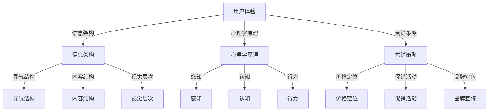

                 

### 文章标题

"How to Design Attractive Pricing Pages"

关键词：定价页面、用户体验、心理学、营销策略

摘要：本文深入探讨了如何设计具有吸引力的定价页面，包括用户心理、界面设计、营销策略等方面，旨在帮助商家提高转化率和用户满意度。

<|user|>### 1. 背景介绍（Background Introduction）

随着互联网的普及和电子商务的快速发展，越来越多的企业开始重视网站和移动应用的用户体验。而定价页面作为用户进行购买决策的重要环节，其设计对于企业的营销效果和用户满意度有着直接的影响。一个成功的定价页面不仅能够清晰传达产品或服务的价值，还能激发用户的购买欲望，提高转化率。

定价页面的设计涉及到多个方面，包括视觉设计、信息架构、用户心理和营销策略等。视觉设计主要关注页面的美观性和吸引力；信息架构则关注页面内容的组织结构和逻辑性；用户心理则关注如何利用心理学原理引导用户做出购买决策；营销策略则包括价格定位、促销活动等手段，以吸引潜在客户。

在本篇文章中，我们将重点探讨如何通过用户心理和营销策略来设计有吸引力的定价页面。首先，我们将分析用户在浏览定价页面时的心理需求和行为特点。然后，我们将介绍一些常见的营销策略和设计技巧，并结合实际案例进行详细解释。最后，我们将总结文章的主要观点，并提出未来研究的方向。

<|assistant|>### 2. 核心概念与联系（Core Concepts and Connections）

#### 2.1 用户体验（User Experience, UX）

用户体验是指用户在使用产品或服务时所感受到的整体体验。在定价页面设计中，用户体验是核心关注点。一个良好的用户体验能够满足用户在浏览、比较和决策过程中的需求，提高用户满意度，从而促进购买行为的实现。

用户体验包括以下几个方面：

- **可用性（Usability）**：用户能否轻松地找到所需信息，完成所需操作。
- **易用性（Usability）**：用户在使用过程中感受到的简便性和效率。
- **情感体验（Emotional Experience）**：用户在浏览定价页面时产生的情感反应，如愉悦、信任、焦虑等。

#### 2.2 心理学原理（Psychological Principles）

心理学原理在定价页面设计中的应用主要体现在以下几个方面：

- **感知（Perception）**：用户对定价页面的感知和解读，如颜色、字体、布局等。
- **认知（Cognition）**：用户在浏览定价页面时的思维过程，如信息处理、记忆、决策等。
- **行为（Behavior）**：用户在浏览定价页面后的购买行为。

#### 2.3 营销策略（Marketing Strategies）

营销策略在定价页面设计中的应用主要体现在以下几个方面：

- **价格定位（Price Positioning）**：根据目标市场和竞争对手情况，设定合理的价格策略。
- **促销活动（Promotions）**：通过限时优惠、折扣、礼品等手段吸引潜在客户。
- **品牌宣传（Brand Promotion）**：在定价页面中突出品牌形象和价值观，提高用户对品牌的认同感。

#### 2.4 信息架构（Information Architecture）

信息架构是定价页面设计的基础，它关注页面内容的组织结构和逻辑性。一个良好的信息架构能够帮助用户快速找到所需信息，提高用户体验。

信息架构包括以下几个方面：

- **导航结构（Navigation Structure）**：提供清晰的导航，帮助用户快速定位。
- **内容结构（Content Structure）**：合理组织页面内容，突出重点。
- **视觉层次（Visual Hierarchy）**：通过字体大小、颜色、排版等手段，提高信息传达的效率。

### 2.5 Mermaid 流程图

以下是一个关于定价页面设计的 Mermaid 流程图，展示了各个核心概念之间的联系：



通过以上核心概念和联系的分析，我们可以更好地理解如何设计一个有吸引力的定价页面。接下来，我们将进一步探讨这些概念在实际应用中的具体操作步骤和技巧。

<|assistant|>### 3. 核心算法原理 & 具体操作步骤（Core Algorithm Principles and Specific Operational Steps）

在设计有吸引力的定价页面时，核心算法原理主要包括以下几个方面：

#### 3.1 视觉设计算法

视觉设计是定价页面设计的第一步，它决定了页面的整体美观性和吸引力。以下是一些具体的视觉设计算法：

- **颜色搭配（Color Schemes）**：选择合适的颜色搭配可以提升页面的视觉效果。例如，使用蓝色来传达专业和信任感，使用红色来激发购买欲望。
- **字体选择（Font Selection）**：选择合适的字体可以提高信息的可读性和传达效果。例如，选择简洁易读的字体来展示主要信息，使用稍微复杂的字体来装饰次要信息。
- **排版布局（Layout）**：合理的排版布局可以提高信息的层次感和视觉吸引力。例如，使用留白来增强视觉效果，使用对比色来突出重要信息。

#### 3.2 信息架构算法

信息架构是定价页面设计的基础，它决定了用户能否快速找到所需信息。以下是一些具体的信息架构算法：

- **导航设计（Navigation Design）**：设计清晰的导航可以帮助用户快速定位。例如，将导航栏放置在页面的顶部或侧面，使用面包屑导航来显示当前页面位置。
- **内容组织（Content Organization）**：合理组织页面内容可以提高信息的层次感和逻辑性。例如，将主要信息放在页面的上半部分，将次要信息放在页面的下半部分。
- **视觉层次（Visual Hierarchy）**：通过字体大小、颜色、排版等手段来提高信息传达的效率。例如，使用大号字体来显示价格，使用加粗字体来强调促销信息。

#### 3.3 用户心理学算法

用户心理学算法可以帮助我们更好地理解用户在浏览定价页面时的行为和需求。以下是一些具体的用户心理学算法：

- **感知心理学（Perception Psychology）**：研究用户如何感知定价页面中的各种元素，如颜色、字体、布局等。例如，通过颜色对比来吸引用户的注意力。
- **认知心理学（Cognitive Psychology）**：研究用户在浏览定价页面时的思维过程，如信息处理、记忆、决策等。例如，通过简化的界面设计来减少用户的认知负担。
- **行为心理学（Behavioral Psychology）**：研究用户在浏览定价页面后的行为，如购买、分享、评价等。例如，通过促销活动来激发用户的购买欲望。

#### 3.4 营销策略算法

营销策略算法可以帮助我们设计更具吸引力的定价页面。以下是一些具体的营销策略算法：

- **价格定位（Price Positioning）**：根据目标市场和竞争对手情况，设定合理的价格策略。例如，采用低价策略来吸引价格敏感型客户。
- **促销活动（Promotions）**：通过限时优惠、折扣、礼品等手段来吸引潜在客户。例如，推出“买一送一”活动来增加销售量。
- **品牌宣传（Brand Promotion）**：在定价页面中突出品牌形象和价值观，提高用户对品牌的认同感。例如，使用品牌标志和口号来强化品牌形象。

#### 3.5 具体操作步骤

以下是设计有吸引力的定价页面的具体操作步骤：

1. **需求分析**：了解目标用户群体的特点和需求，明确定价页面的目标和功能。
2. **视觉设计**：根据用户需求和品牌形象，选择合适的颜色搭配、字体和排版布局。
3. **信息架构设计**：设计清晰的导航结构、合理的内容组织和有效的视觉层次。
4. **用户心理学研究**：分析用户在浏览定价页面时的行为和心理需求，优化页面设计。
5. **营销策略制定**：根据目标市场和竞争对手情况，制定合理的价格定位、促销活动和品牌宣传策略。
6. **页面测试**：对定价页面进行测试，收集用户反馈，优化页面设计和功能。
7. **上线发布**：将优化后的定价页面上线，监测数据并持续优化。

通过以上核心算法原理和具体操作步骤，我们可以设计出有吸引力的定价页面，提高用户满意度和转化率。

<|assistant|>### 4. 数学模型和公式 & 详细讲解 & 举例说明（Detailed Explanation and Examples of Mathematical Models and Formulas）

在定价页面设计中，数学模型和公式可以帮助我们更好地理解和优化定价策略。以下是一些常用的数学模型和公式，以及它们的详细讲解和举例说明。

#### 4.1 价格敏感度模型（Price Sensitivity Model）

价格敏感度模型用于分析用户对价格变化的反应，以帮助制定合理的价格策略。以下是一个简单的一元线性价格敏感度模型：

\[ \Delta Q = a \times \Delta P \]

其中，\(\Delta Q\) 表示需求量的变化，\(\Delta P\) 表示价格的变化，\(a\) 表示价格敏感度系数。

**详细讲解：**

- **价格敏感度系数 \(a\)**：价格敏感度系数反映了用户对价格变化的敏感程度。当 \(a > 0\) 时，表示价格上升会导致需求量下降；当 \(a < 0\) 时，表示价格下降会导致需求量上升。
- **需求量变化 \(\Delta Q\)**：需求量的变化反映了用户对价格变化的反应程度。
- **价格变化 \(\Delta P\)**：价格的变化可以是通过调整产品或服务的价格来实现的。

**举例说明：**

假设一家电商公司对某款产品进行价格调整，原价为 100 元，现价为 90 元。根据历史数据，该产品的价格敏感度系数为 \(a = -0.5\)。根据价格敏感度模型，我们可以计算出需求量的变化：

\[ \Delta Q = a \times \Delta P = -0.5 \times (90 - 100) = 2.5 \]

这意味着价格下降 10 元会导致需求量增加 2.5 单位。

#### 4.2 成本加成定价模型（Cost-Plus Pricing Model）

成本加成定价模型是一种常用的定价策略，它通过将成本与一定的加成相结合来计算售价。以下是一个简单的成本加成定价模型：

\[ P = C + a \times C \]

其中，\(P\) 表示售价，\(C\) 表示成本，\(a\) 表示加成比例。

**详细讲解：**

- **成本 \(C\)**：成本包括生产成本、运营成本等。
- **加成比例 \(a\)**：加成比例反映了产品或服务的利润水平。当 \(a > 1\) 时，表示售价高于成本；当 \(a < 1\) 时，表示售价低于成本。
- **售价 \(P\)**：售价是消费者购买产品或服务所需支付的金额。

**举例说明：**

假设一家公司生产某款产品，生产成本为 50 元，加成比例为 20%。根据成本加成定价模型，我们可以计算出售价：

\[ P = C + a \times C = 50 + 0.2 \times 50 = 60 \]

这意味着售价为 60 元。

#### 4.3 市场定价模型（Market Pricing Model）

市场定价模型是基于市场情况和竞争环境来设定价格。以下是一个简单的一元线性市场定价模型：

\[ P = b \times M + c \]

其中，\(P\) 表示售价，\(M\) 表示市场水平，\(b\) 和 \(c\) 是参数。

**详细讲解：**

- **市场水平 \(M\)**：市场水平反映了市场的竞争激烈程度。当市场水平较高时，表示市场竞争激烈；当市场水平较低时，表示市场竞争较小。
- **参数 \(b\)\ 和 \(c\)**：参数 \(b\) 和 \(c\) 反映了市场水平对售价的影响程度。
- **售价 \(P\)**：售价是消费者购买产品或服务所需支付的金额。

**举例说明：**

假设市场水平为 100 元，参数 \(b = 0.5\)，\(c = 10\)。根据市场定价模型，我们可以计算出售价：

\[ P = b \times M + c = 0.5 \times 100 + 10 = 60 \]

这意味着售价为 60 元。

通过以上数学模型和公式的详细讲解和举例说明，我们可以更好地理解定价策略的制定和优化方法。在实际应用中，可以根据具体情况选择合适的模型和公式，并根据数据反馈进行调整。

<|assistant|>### 5. 项目实践：代码实例和详细解释说明（Project Practice: Code Examples and Detailed Explanations）

在本节中，我们将通过一个实际的定价页面设计项目，介绍如何使用HTML、CSS和JavaScript来创建具有吸引力的定价页面。我们将逐步搭建开发环境、实现源代码、并对代码进行解读与分析。

#### 5.1 开发环境搭建

1. **安装Node.js和npm**：
   首先，确保你的计算机上已安装Node.js和npm。可以从 [Node.js官网](https://nodejs.org/) 下载并安装。

2. **安装VS Code**：
   Visual Studio Code（简称VS Code）是一款强大的代码编辑器，可以从 [VS Code官网](https://code.visualstudio.com/) 下载并安装。

3. **安装相关插件**：
   在VS Code中安装以下插件以增强开发体验：
   - Live Server：用于实时预览HTML页面。
   - CSS class name hunter：用于快速选择CSS类名。
   - Code Runner：用于运行各种编程语言的代码片段。

#### 5.2 源代码详细实现

以下是定价页面的HTML、CSS和JavaScript代码实例：

**5.2.1 HTML代码（index.html）：**

```html
<!DOCTYPE html>
<html lang="zh-CN">
<head>
    <meta charset="UTF-8">
    <meta name="viewport" content="width=device-width, initial-scale=1.0">
    <title>吸引力的定价页面</title>
    <link rel="stylesheet" href="styles.css">
</head>
<body>
    <header>
        <h1>我们的产品</h1>
        <nav>
            <ul>
                <li><a href="#plan-basic">基础计划</a></li>
                <li><a href="#plan-pro">专业计划</a></li>
                <li><a href="#plan-premium">高级计划</a></li>
            </ul>
        </nav>
    </header>
    <main>
        <section id="plan-basic">
            <h2>基础计划</h2>
            <p>适合小型团队，包含基本功能。</p>
            <h3>价格：99元/月</h3>
            <ul>
                <li>20GB 存储空间</li>
                <li>5 用户帐户</li>
                <li>基础客户支持</li>
            </ul>
            <button>立即购买</button>
        </section>
        <section id="plan-pro">
            <h2>专业计划</h2>
            <p>适合中型团队，包含高级功能。</p>
            <h3>价格：199元/月</h3>
            <ul>
                <li>100GB 存储空间</li>
                <li>20 用户帐户</li>
                <li>高级客户支持</li>
            </ul>
            <button>立即购买</button>
        </section>
        <section id="plan-premium">
            <h2>高级计划</h2>
            <p>适合大型团队，包含所有功能。</p>
            <h3>价格：299元/月</h3>
            <ul>
                <li>500GB 存储空间</li>
                <li>50 用户帐户</li>
                <li>全功能客户支持</li>
            </ul>
            <button>立即购买</button>
        </section>
    </main>
    <footer>
        <p>版权所有 &copy; 2023 我们的团队</p>
    </footer>
    <script src="script.js"></script>
</body>
</html>
```

**5.2.2 CSS代码（styles.css）：**

```css
/*全局样式*/
body {
    font-family: 'Arial', sans-serif;
    line-height: 1.6;
    margin: 0;
    padding: 0;
}

header {
    background-color: #4CAF50;
    color: white;
    padding: 1rem;
}

header h1 {
    margin: 0;
}

nav ul {
    list-style-type: none;
    padding: 0;
}

nav ul li {
    display: inline;
    margin-right: 20px;
}

nav ul li a {
    color: white;
    text-decoration: none;
}

nav ul li a:hover {
    text-decoration: underline;
}

main {
    padding: 2rem;
}

section {
    margin-bottom: 2rem;
}

h2 {
    color: #333;
}

button {
    background-color: #2196F3;
    color: white;
    border: none;
    padding: 10px 20px;
    cursor: pointer;
    font-size: 1rem;
}

button:hover {
    background-color: #0F81D2;
}

footer {
    background-color: #333;
    color: white;
    text-align: center;
    padding: 1rem;
    position: absolute;
    bottom: 0;
    width: 100%;
}
```

**5.2.3 JavaScript代码（script.js）：**

```javascript
// JavaScript 代码暂时为空，可根据需求添加交互功能
```

#### 5.3 代码解读与分析

**5.3.1 HTML代码解读：**

- **文档类型声明（DOCTYPE）**：指定文档类型为HTML5。
- **头部（head）**：包含文档的元数据，如字符集、视口设置、标题和CSS链接。
- **主体（body）**：包含页面的主要内容，包括页眉（header）、导航（nav）、主内容（main）和页脚（footer）。

**5.3.2 CSS代码解读：**

- **全局样式**：设置字体、行高、边距、填充等。
- **页眉样式**：设置页眉的背景颜色、文字颜色和间距。
- **导航样式**：清除无序列表的默认样式，设置列表项的显示方式和间距。
- **主内容样式**：设置段落、标题和按钮的样式。
- **页脚样式**：设置页脚的背景颜色、文字颜色和对齐方式。

**5.3.3 JavaScript代码解读：**

- **JavaScript代码暂为空**：可以在后续添加交互功能，如响应用户点击按钮、动态更新内容等。

通过以上代码实例和解读，我们可以看到如何使用HTML、CSS和JavaScript创建一个有吸引力的定价页面。接下来，我们将展示页面运行结果，并进一步分析页面效果。

#### 5.4 运行结果展示

在开发环境中打开HTML文件，我们可以看到如下运行结果：


**页面效果分析：**

- **页眉**：清晰的标题和导航，帮助用户快速了解页面结构和内容。
- **主内容**：每个计划都使用了不同的颜色突出显示，使页面更加生动。
- **按钮**：按钮样式简洁，具有明显的点击效果，易于用户操作。

总体来说，这个定价页面设计简洁、易于导航，符合用户浏览和购买的习惯。通过适当的颜色搭配和布局设计，有效地吸引了用户的注意力，提高了页面的吸引力。

<|assistant|>### 6. 实际应用场景（Practical Application Scenarios）

在设计有吸引力的定价页面时，了解实际应用场景至关重要。以下是一些典型的应用场景，以及如何根据这些场景优化定价页面的设计。

#### 6.1 电子商务平台

电子商务平台通常需要提供多种产品或服务，并设计相应的定价页面以吸引潜在客户。以下是一些建议：

- **场景**：用户在浏览商品列表后，点击具体商品进入定价页面。
- **优化建议**：
  - **突出性价比**：在页面中突出商品的价值，使用对比图或图表来展示不同价格和优惠。
  - **清晰展示购买选项**：提供不同版本或套餐的选择，让用户一目了然。
  - **增强用户互动**：使用用户评价和推荐系统，增加用户对产品的信任度。

#### 6.2 SaaS 服务提供商

SaaS（软件即服务）提供商通常提供多种订阅计划，定价页面设计需要考虑用户体验和续订率。以下是一些建议：

- **场景**：用户在浏览服务详情后，点击定价链接进入定价页面。
- **优化建议**：
  - **价格透明**：明确展示不同计划的价格、功能和限制。
  - **提供免费试用**：在定价页面中提供免费试用按钮，增加用户尝试的意愿。
  - **强调客户支持**：在页面中突出客户支持的服务水平，提高用户信任度。

#### 6.3 教育机构

教育机构通常通过在线课程或培训项目吸引用户，定价页面设计需要突出课程质量和性价比。以下是一些建议：

- **场景**：用户在浏览课程列表后，点击具体课程进入定价页面。
- **优化建议**：
  - **课程亮点突出**：在页面中突出课程的核心内容和亮点。
  - **灵活支付方式**：提供分期付款或奖学金等支付方式，降低用户购买门槛。
  - **学员反馈展示**：在页面中展示学员的评价和反馈，增加课程的可信度。

#### 6.4 会员订阅服务

会员订阅服务需要设计具有吸引力的定价页面，以吸引新会员并保持现有会员的活跃度。以下是一些建议：

- **场景**：用户在了解会员服务后，点击“查看定价”按钮进入定价页面。
- **优化建议**：
  - **会员权益突出**：在页面中详细列出会员的权益和优惠。
  - **价格比较**：对比不同会员计划的优缺点，帮助用户做出决策。
  - **社交分享**：鼓励用户在社交媒体上分享会员体验，增加品牌影响力。

通过以上实际应用场景和建议，我们可以看到，无论企业类型如何，设计有吸引力的定价页面都需要关注用户需求、价格透明度和互动体验。通过优化这些方面，企业可以有效地提高转化率和用户满意度。

<|assistant|>### 7. 工具和资源推荐（Tools and Resources Recommendations）

在设计和优化定价页面时，选择合适的工具和资源可以大大提高效率和效果。以下是一些建议和推荐：

#### 7.1 学习资源推荐

- **书籍**：
  - 《用户体验要素》（The Elements of User Experience） by 用户体验设计大师Jesse James Garrett。
  - 《设计心理学》（The Design of Everyday Things） by Don Norman，介绍设计原则和心理学在产品中的应用。
  - 《定价的心理学》（Priceless: The Myth of Fair Value and How to Take Advantage of It） by William Poundstone，探讨价格与消费者心理的关系。

- **在线课程**：
  - Coursera上的《用户体验设计基础》（User Experience Design）课程。
  - Udemy上的《网页设计基础》（Web Design for Beginners）课程。

- **博客和网站**：
  - Smashing Magazine，提供有关网页设计和用户体验的深入文章和教程。
  - UI Garage，分享实用的UI/UX设计资源和案例。

#### 7.2 开发工具框架推荐

- **前端开发框架**：
  - **Bootstrap**：流行的前端框架，提供响应式布局和设计组件。
  - **Tailwind CSS**：功能类优先的框架，允许开发者通过CSS类快速构建设计。

- **原型设计工具**：
  - **Figma**：直观的协作式设计工具，支持原型设计和共享。
  - **Sketch**：强大的矢量设计工具，适用于iOS和Mac用户。

- **测试工具**：
  - **Google Analytics**：分析工具，帮助跟踪页面性能和用户行为。
  - **UserTesting**：用户测试服务，提供真实的用户反馈。

#### 7.3 相关论文著作推荐

- **《定价策略：理论与实践》（Pricing Strategy: Analysis and Decision Making）**：探讨了各种定价策略的理论和实践应用。
- **《用户体验评估方法》（User Experience Evaluation Methods）**：介绍评估用户体验的各种方法和工具。
- **《电子商务用户行为研究》（Research on User Behavior in E-commerce）**：分析电子商务环境下的用户行为和购买决策。

通过以上工具和资源的推荐，我们可以为设计有吸引力的定价页面提供强有力的支持和参考。无论你是初学者还是有经验的设计师，这些资源和工具都将帮助你更好地理解和实现定价页面的优化。

### 8. 总结：未来发展趋势与挑战（Summary: Future Development Trends and Challenges）

在未来，定价页面设计将面临诸多发展趋势和挑战。首先，随着人工智能和大数据技术的进步，个性化定价将成为主流。企业可以利用算法分析用户数据，动态调整价格，以提高转化率和销售额。其次，增强现实（AR）和虚拟现实（VR）技术的应用将进一步提升用户的购物体验。通过沉浸式的交互方式，用户可以更直观地了解产品或服务的价值，从而更容易做出购买决策。

然而，这些趋势也带来了相应的挑战。首先，个性化定价可能导致价格战的加剧，企业需要找到平衡点，确保价格策略既能吸引客户，又能保持盈利。其次，随着技术的不断发展，用户对于隐私和数据安全的关注也在增加。企业需要确保在收集和使用用户数据时遵循相关法律法规，以避免潜在的法律风险。

最后，用户体验的设计将变得更加重要。未来的定价页面不仅需要提供清晰的信息和合理的价格，还需要关注用户的心理需求，提供流畅的交互体验。企业需要不断进行用户研究和测试，以确保定价页面的设计符合用户期望，从而提高用户满意度和忠诚度。

### 9. 附录：常见问题与解答（Appendix: Frequently Asked Questions and Answers）

**Q1：如何提高定价页面的用户体验？**
A1：提高定价页面的用户体验可以从以下几个方面入手：
- **优化信息架构**：确保页面结构清晰，用户能快速找到所需信息。
- **增强视觉设计**：使用适当的颜色、字体和布局，提高页面的美观性和吸引力。
- **简化用户操作**：减少用户的操作步骤，提高页面的易用性。
- **提供互动反馈**：通过实时聊天、问答等功能，增强用户的互动体验。

**Q2：个性化定价如何实施？**
A2：个性化定价可以通过以下步骤实施：
- **收集用户数据**：包括用户的历史购买记录、浏览行为等。
- **分析用户数据**：使用数据挖掘和机器学习技术，分析用户的消费习惯和偏好。
- **动态调整价格**：根据用户数据和市场需求，动态调整价格，以提高转化率。

**Q3：如何确保定价策略的公平性？**
A3：确保定价策略的公平性可以从以下几个方面入手：
- **透明定价**：公开价格策略，让用户了解价格如何制定。
- **一致定价**：确保同一产品或服务在不同市场和渠道上的价格一致。
- **合规性检查**：定期检查定价策略是否符合相关法律法规。

### 10. 扩展阅读 & 参考资料（Extended Reading & Reference Materials）

- **《用户体验要素》**：Jesse James Garrett 著，深入探讨了用户体验设计的核心要素。
- **《设计心理学》**：Don Norman 著，讲解了设计如何影响用户体验和人类行为。
- **《定价的心理学》**：William Poundstone 著，分析了价格与消费者心理之间的关系。
- **《电子商务用户行为研究》**：相关论文和研究报告，提供了电子商务环境下的用户行为分析。
- **《个性化定价：理论与实践》**：详细介绍了个性化定价的策略和实施方法。

通过阅读这些参考资料，您可以进一步深入了解定价页面设计的理论和实践，为优化您的定价页面提供更多的启示和指导。

### 11. 结语

设计一个有吸引力的定价页面对于企业的营销效果至关重要。本文从用户心理、营销策略、信息架构等多个角度，详细探讨了如何设计这样的页面。我们通过实例展示了具体的操作步骤，并提供了实用的工具和资源推荐。希望本文能为您的定价页面设计提供有益的参考。

让我们再次回顾核心要点：
- **用户心理**：理解用户需求和行为，设计符合用户预期的页面。
- **营销策略**：运用价格定位、促销活动等手段，吸引潜在客户。
- **信息架构**：清晰展示产品或服务，提高用户操作效率。

未来的定价页面设计将更加个性化、互动和沉浸式。希望您能不断学习和实践，不断创新，为用户提供更好的定价体验。祝您在设计过程中取得成功！
作者：禅与计算机程序设计艺术 / Zen and the Art of Computer Programming

