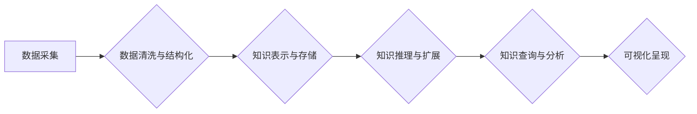

                 

## 知识的图谱化：复杂关系的可视化呈现

> 关键词：知识图谱、关系数据库、图数据库、节点、边、算法、可视化、应用场景

## 1. 背景介绍

在信息爆炸的时代，海量数据无处不在，而知识的获取和利用变得越来越重要。传统的文本存储和检索方式难以有效地处理复杂的关系和结构化信息。知识图谱作为一种新型的知识表示形式，以图的形式展现知识和其之间的关系，为我们提供了一种全新的视角和方法来理解和利用知识。

知识图谱的核心是节点和边。节点代表知识实体，例如人物、地点、事件等；边代表实体之间的关系，例如“出生于”、“位于”、“参与”等。通过节点和边的连接，知识图谱可以构建出复杂的知识网络，清晰地展现知识之间的关联性。

## 2. 核心概念与联系

### 2.1  知识图谱的构成

知识图谱由以下核心概念组成：

* **节点 (Entity):** 代表知识中的个体实体，例如人物、地点、概念、事件等。
* **边 (Relation):** 代表实体之间的关系，例如“出生于”、“位于”、“参与”等。
* **属性 (Property):** 描述实体的特征，例如“姓名”、“年龄”、“国籍”等。

### 2.2  知识图谱的架构

知识图谱的架构通常包含以下几个部分：

* **数据存储层:** 用于存储知识图谱中的节点、边和属性。常用的存储方式包括关系数据库和图数据库。
* **知识推理层:** 利用规则和逻辑推理，从已有的知识中推导出新的知识。
* **知识查询层:** 提供查询接口，方便用户检索和分析知识图谱中的信息。
* **可视化层:** 将知识图谱以图形化的形式呈现，方便用户理解和交互。

**Mermaid 流程图**



## 3. 核心算法原理 & 具体操作步骤

### 3.1  算法原理概述

知识图谱的构建和维护需要多种算法的支持，例如：

* **实体识别 (Entity Recognition):** 从文本中识别出实体，例如人物、地点、事件等。
* **关系抽取 (Relation Extraction):** 从文本中抽取实体之间的关系，例如“出生于”、“位于”、“参与”等。
* **知识图谱补全 (Knowledge Graph Completion):** 利用已有的知识推断出缺失的知识。

### 3.2  算法步骤详解

以关系抽取为例，其基本步骤如下：

1. **文本预处理:** 对文本进行清洗、分词、词性标注等处理，以便于后续算法的执行。
2. **特征提取:** 从预处理后的文本中提取实体和关系的特征，例如词语序列、语法结构、语义相似度等。
3. **模型训练:** 利用训练数据，训练一个关系抽取模型，例如深度学习模型、支持向量机等。
4. **关系预测:** 将待抽取的文本输入到训练好的模型中，预测实体之间的关系。

### 3.3  算法优缺点

不同的算法具有不同的优缺点，需要根据实际应用场景选择合适的算法。

* **深度学习模型:** 能够学习到复杂的语义关系，效果较好，但需要大量的训练数据。
* **支持向量机:** 训练速度快，效果稳定，但对特征工程要求较高。

### 3.4  算法应用领域

关系抽取算法广泛应用于以下领域：

* **信息提取:** 从文本中提取关键信息，例如人物关系、事件描述等。
* **知识图谱构建:** 从文本数据中构建知识图谱，丰富知识库。
* **问答系统:** 理解用户问题，从知识图谱中找到答案。

## 4. 数学模型和公式 & 详细讲解 & 举例说明

### 4.1  数学模型构建

知识图谱可以用图论模型来表示。其中，节点代表实体，边代表关系。

* **节点:**  用集合 $E$ 表示，其中每个元素 $e \in E$ 代表一个实体。
* **边:** 用集合 $R$ 表示，其中每个元素 $r \in R$ 代表一个关系。

一个知识图谱可以表示为一个三元组 $(E, R, T)$，其中 $T$ 是实体和关系之间的连接关系，可以表示为一个二元关系集合。

### 4.2  公式推导过程

知识图谱推理可以使用逻辑推理规则进行推导。例如，如果我们知道“张三出生于北京”和“北京是中国首都”，我们可以推导出“张三出生在中国”。

这种推理过程可以用逻辑公式来表示。例如，我们可以用以下公式表示“张三出生于北京”这个知识：

$$
\text{出生于}(张三, 北京)
$$

我们可以用以下公式表示“北京是中国首都”这个知识：

$$
\text{位于}(北京, 中国)
$$

然后，我们可以使用逻辑推理规则，例如“如果 A 出生于 B，并且 B 位于 C，那么 A 位于 C”，推导出“张三位于中国”这个知识。

### 4.3  案例分析与讲解

例如，在医疗领域，我们可以构建一个知识图谱，包含患者、医生、疾病、药物等实体，以及“诊断”、“治疗”、“服药”等关系。通过知识图谱推理，我们可以推导出新的知识，例如“患者 A 患有疾病 B，医生 C 可以治疗疾病 B”。

## 5. 项目实践：代码实例和详细解释说明

### 5.1  开发环境搭建

为了实现知识图谱的构建和维护，我们可以使用以下工具和技术：

* **编程语言:** Python
* **图数据库:** Neo4j
* **知识图谱构建工具:** RDFlib

### 5.2  源代码详细实现

```python
# 使用 RDFlib 库构建知识图谱

from rdflib import Graph, Literal, Namespace

# 定义命名空间
rdf = Namespace("http://www.w3.org/1999/02/22-rdf-syntax-ns#")
rdfs = Namespace("http://www.w3.org/2000/01/rdf-schema#")
schema = Namespace("http://schema.org/")

# 创建知识图谱
g = Graph()

# 添加实体
g.add((schema.Person("张三"), rdf.type, schema.Person))
g.add((schema.Person("李四"), rdf.type, schema.Person))

# 添加关系
g.add((schema.Person("张三"), schema.bornIn, schema.Place("北京")))
g.add((schema.Person("李四"), schema.bornIn, schema.Place("上海")))

# 保存知识图谱
g.serialize("knowledge_graph.rdf", format="rdfxml")
```

### 5.3  代码解读与分析

这段代码使用 RDFlib 库构建了一个简单的知识图谱。

* 首先，定义了命名空间，以便于组织和管理知识图谱中的实体和关系。
* 然后，创建了一个知识图谱对象，并添加了两个实体和两个关系。
* 最后，将知识图谱保存为 RDF 格式的文件。

### 5.4  运行结果展示

运行这段代码后，会生成一个名为 `knowledge_graph.rdf` 的文件，该文件包含了构建的知识图谱。

## 6. 实际应用场景

知识图谱在各个领域都有广泛的应用场景：

### 6.1  搜索引擎

知识图谱可以帮助搜索引擎更好地理解用户查询意图，并提供更精准的搜索结果。例如，当用户搜索“苹果公司”时，搜索引擎可以利用知识图谱中的信息，返回苹果公司的相关信息，例如公司简介、产品列表、创始人等。

### 6.2  推荐系统

知识图谱可以帮助推荐系统更好地理解用户的兴趣和偏好，并推荐更相关的商品或服务。例如，当用户购买了一本书后，推荐系统可以利用知识图谱中的信息，推荐其他与该书相关的书籍或作者。

### 6.3  问答系统

知识图谱可以帮助问答系统更好地理解用户问题，并从知识库中找到答案。例如，当用户问“中国首都在哪里？”时，问答系统可以利用知识图谱中的信息，回答“北京”。

### 6.4  未来应用展望

随着人工智能技术的不断发展，知识图谱的应用场景将会更加广泛。例如，知识图谱可以用于医疗诊断、法律推理、金融风险评估等领域。

## 7. 工具和资源推荐

### 7.1  学习资源推荐

* **书籍:**
    * 《知识图谱：构建、查询和应用》
    * 《图数据库：原理、技术和应用》
* **在线课程:**
    * Coursera 上的 “Knowledge Graphs” 课程
    * edX 上的 “Graph Databases” 课程

### 7.2  开发工具推荐

* **图数据库:** Neo4j, JanusGraph, TigerGraph
* **知识图谱构建工具:** RDFlib, Apache Jena, Stardog

### 7.3  相关论文推荐

* **《Knowledge Graph Embedding: A Survey》**
* **《A Survey on Knowledge Graph Completion》**

## 8. 总结：未来发展趋势与挑战

### 8.1  研究成果总结

知识图谱技术已经取得了显著的进展，在信息检索、推荐系统、问答系统等领域取得了广泛应用。

### 8.2  未来发展趋势

未来，知识图谱技术将朝着以下几个方向发展：

* **更智能的知识推理:** 利用深度学习等人工智能技术，实现更智能的知识推理，能够推导出更复杂的知识。
* **更丰富的知识来源:** 不仅限于文本数据，还可以从图像、音频、视频等多模态数据中提取知识。
* **更个性化的知识服务:** 根据用户的兴趣和需求，提供更个性化的知识服务。

### 8.3  面临的挑战

知识图谱技术也面临着一些挑战：

* **数据质量:** 知识图谱的数据质量直接影响其应用效果，需要不断完善数据采集、清洗和验证的流程。
* **知识表示:** 如何更好地表示复杂的关系和知识结构，仍然是一个开放的问题。
* **可解释性:** 知识图谱推理过程的复杂性，使得其结果的可解释性较差，需要进一步研究如何提高可解释性。

### 8.4  研究展望

未来，我们将继续致力于知识图谱技术的研发和应用，希望能够为人类社会带来更多价值。

## 9. 附录：常见问题与解答

### 9.1  知识图谱与数据库的区别是什么？

知识图谱和数据库都是用于存储和管理数据的，但它们在数据结构和应用场景上有所不同。

* **数据库:** 主要用于存储结构化数据，例如表格数据，以键值对的形式存储数据。
* **知识图谱:** 主要用于存储非结构化数据，例如文本数据，以节点和边的形式存储数据，可以表示复杂的关系和知识结构。

### 9.2  如何构建知识图谱？

构建知识图谱需要以下步骤：

1. **数据采集:** 从各种数据源中收集相关数据。
2. **数据清洗:** 对收集到的数据进行清洗和预处理。
3. **知识表示:** 将数据转换为知识图谱的节点和边形式。
4. **知识推理:** 利用逻辑推理规则，从已有的知识中推导出新的知识。
5. **知识存储:** 将构建好的知识图谱存储到数据库中。

### 9.3  知识图谱有哪些应用场景？

知识图谱在各个领域都有广泛的应用场景，例如：

* **搜索引擎:** 提高搜索结果的精准度。
* **推荐系统:** 提供更个性化的商品或服务推荐。
* **问答系统:** 帮助用户找到更准确的答案。
* **医疗诊断:** 辅助医生进行诊断。
* **法律推理:** 帮助律师进行法律分析。


作者：禅与计算机程序设计艺术 / Zen and the Art of Computer Programming 
<end_of_turn>

