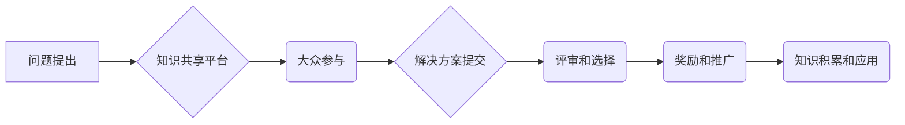

                 

## 知识的开放创新：众包解决方案的潜力

> 关键词：众包、开放创新、知识共享、协同开发、人工智能、大数据、云计算

### 1. 背景介绍

在当今信息爆炸的时代，知识的获取和创造日益成为经济和社会发展的重要驱动力。传统知识产权制度和封闭的创新模式已经难以满足快速发展的社会需求。开放创新，即打破传统知识壁垒，鼓励知识共享和协同开发，成为了一种新的创新模式。众包，即利用互联网平台，将任务和问题发布给大众，并通过奖励机制激励参与者贡献解决方案，成为开放创新的一种重要手段。

众包的优势在于其能够汇集来自全球各地的智慧和资源，激发大众的创造力，并降低创新成本。它打破了地理、时间和身份的限制，为每个人提供参与创新机会，从而加速知识的传播和应用。

### 2. 核心概念与联系

**2.1 核心概念**

* **开放创新:**  打破传统知识壁垒，鼓励知识共享和协同开发，通过合作和共赢的方式推动创新。
* **众包:** 利用互联网平台，将任务和问题发布给大众，并通过奖励机制激励参与者贡献解决方案。

**2.2 联系**

开放创新和众包是相辅相成的关系。众包是开放创新的一种具体实践，它通过汇集大众智慧，加速知识共享和协同开发，从而实现开放创新的目标。

**2.3 架构流程图**



### 3. 核心算法原理 & 具体操作步骤

**3.1 算法原理概述**

众包解决方案的核心算法原理是基于**群体智慧**和**激励机制**。群体智慧是指通过大量个体协同工作，能够产生比单个个体更智能的解决方案。激励机制则通过奖励机制，鼓励参与者积极贡献解决方案，提高参与度和效率。

**3.2 算法步骤详解**

1. **问题定义:** 明确提出需要解决的问题，并将其分解成可操作的任务。
2. **平台搭建:** 建立一个知识共享平台，提供任务发布、解决方案提交、评审和奖励等功能。
3. **任务发布:** 将问题和任务发布到平台，并设置相应的奖励机制。
4. **大众参与:** 吸引大众参与，并提供必要的工具和资源，帮助他们理解问题和提交解决方案。
5. **解决方案评审:** 对提交的解决方案进行评审，并根据预设的标准进行评分和排名。
6. **奖励和推广:** 对优秀解决方案的作者进行奖励，并推广优秀解决方案，使其得到更广泛的应用。
7. **知识积累和应用:** 将优秀解决方案收集和整理，形成知识库，并将其应用于实际问题解决。

**3.3 算法优缺点**

**优点:**

* **汇集智慧:** 可以汇集来自全球各地的智慧和资源，提高解决方案的质量和创新性。
* **降低成本:** 可以降低创新成本，因为不需要雇佣大量专业人员。
* **加速创新:** 可以加速知识的传播和应用，推动创新发展。

**缺点:**

* **质量控制:** 众包解决方案的质量难以保证，需要建立有效的评审机制。
* **激励机制:** 需要设计合理的激励机制，才能吸引大众积极参与。
* **知识产权:** 需要解决知识产权问题，确保参与者的权益得到保护。

**3.4 算法应用领域**

众包解决方案可以应用于各个领域，例如：

* **软件开发:** 利用众包平台，可以快速开发和测试软件，并获得用户反馈。
* **产品设计:** 可以利用众包平台，收集用户需求，并设计出更符合用户喜好的产品。
* **科学研究:** 可以利用众包平台，收集和分析大数据，并进行科学研究。
* **教育培训:** 可以利用众包平台，提供个性化的教育培训，并提高学习效率。

### 4. 数学模型和公式 & 详细讲解 & 举例说明

**4.1 数学模型构建**

众包解决方案的效率可以被数学模型表示为：

$$
Efficiency = \frac{Number of Solutions}{Time \times Cost}
$$

其中：

* **Number of Solutions:** 提交的有效解决方案数量。
* **Time:** 完成任务所需的时间。
* **Cost:** 完成任务的成本。

**4.2 公式推导过程**

该公式的推导过程基于以下假设：

* 提交的解决方案数量与参与者的数量和质量成正比。
* 完成任务所需的时间与任务复杂度和参与者的效率成正比。
* 完成任务的成本与参与者的数量和时间成正比。

**4.3 案例分析与讲解**

假设一个软件开发项目，需要开发一个新的应用程序。

* **传统开发模式:** 需要雇佣一个团队的软件工程师，开发时间为6个月，成本为100,000美元。
* **众包开发模式:** 将开发任务发布到众包平台，吸引来自全球各地的开发者参与，开发时间为3个月，成本为50,000美元。

根据上述公式，我们可以计算出两种模式的效率：

* **传统开发模式:** Efficiency = 1 / (6 * 100,000) = 0.0000167
* **众包开发模式:** Efficiency = 1 / (3 * 50,000) = 0.0000667

从计算结果可以看出，众包开发模式的效率比传统开发模式高。

### 5. 项目实践：代码实例和详细解释说明

**5.1 开发环境搭建**

为了实现一个简单的众包解决方案，我们可以使用以下开发环境：

* **编程语言:** Python
* **框架:** Flask
* **数据库:** MongoDB
* **云平台:** AWS

**5.2 源代码详细实现**

```python
from flask import Flask, render_template, request, redirect, url_for
from flask_pymongo import PyMongo

app = Flask(__name__)
app.config['MONGO_URI'] = 'mongodb://localhost:27017/mydatabase'
mongo = PyMongo(app)

@app.route('/')
def index():
    return render_template('index.html')

@app.route('/submit', methods=['POST'])
def submit():
    solution = request.form['solution']
    # 保存解决方案到数据库
    mongo.db.solutions.insert_one({'solution': solution})
    return redirect(url_for('index'))

if __name__ == '__main__':
    app.run(debug=True)
```

**5.3 代码解读与分析**

* 该代码实现了一个简单的众包平台，用户可以通过网页提交解决方案。
* 使用Flask框架构建了Web应用程序，MongoDB数据库用于存储解决方案。
* `index.html`页面用于展示问题和提交解决方案的表单。
* `submit`函数处理用户提交的解决方案，并将其保存到数据库。

**5.4 运行结果展示**

运行该代码后，可以访问`http://127.0.0.1:5000/`，看到一个简单的网页，用户可以在网页上提交解决方案。

### 6. 实际应用场景

**6.1 医疗诊断**

众包平台可以收集来自全球各地的医生和患者的案例数据，并利用机器学习算法进行分析，辅助医生进行诊断。

**6.2 新药研发**

众包平台可以收集来自全球各地的科学家和研究人员的实验数据，并利用大数据分析技术进行筛选，加速新药研发。

**6.3 教育培训**

众包平台可以提供个性化的教育培训，并利用用户反馈进行改进，提高学习效率。

**6.4 未来应用展望**

随着人工智能、大数据和云计算技术的不断发展，众包解决方案的应用场景将会更加广泛。

### 7. 工具和资源推荐

**7.1 学习资源推荐**

* **书籍:**
    * 《The Wisdom of Crowds》 by James Surowiecki
    * 《Crowdsourcing》 by Jeff Howe
* **在线课程:**
    * Coursera: "Crowdsourcing and Open Innovation"
    * edX: "The Science of Crowdsourcing"

**7.2 开发工具推荐**

* **众包平台:**
    * Amazon Mechanical Turk
    * Upwork
    * Freelancer
* **数据分析工具:**
    * Python (Pandas, NumPy, Scikit-learn)
    * R
    * Tableau

**7.3 相关论文推荐**

* "The Wisdom of Crowds" by James Surowiecki
* "Crowdsourcing: Why the Power of the Crowd Is Driving the Future of Business" by Jeff Howe
* "The Future of Work: How Crowdsourcing is Transforming the Workplace" by Thomas Malone

### 8. 总结：未来发展趋势与挑战

**8.1 研究成果总结**

众包解决方案是一种高效、低成本的创新模式，能够汇集大众智慧，加速知识传播和应用。

**8.2 未来发展趋势**

* **人工智能的应用:** 人工智能技术将进一步提高众包解决方案的效率和智能化水平。
* **区块链技术的应用:** 区块链技术可以解决众包平台上的信任和安全问题。
* **虚拟现实和增强现实技术的应用:** 虚拟现实和增强现实技术可以为众包平台提供更沉浸式的体验。

**8.3 面临的挑战**

* **质量控制:** 众包解决方案的质量难以保证，需要建立有效的评审机制。
* **激励机制:** 需要设计合理的激励机制，才能吸引大众积极参与。
* **知识产权:** 需要解决知识产权问题，确保参与者的权益得到保护。

**8.4 研究展望**

未来研究方向包括：

* 开发更智能的众包算法，提高解决方案的质量和效率。
* 设计更有效的激励机制，吸引更多参与者参与众包平台。
* 研究众包解决方案在不同领域的应用，并探索其潜在的价值。

### 9. 附录：常见问题与解答

**9.1 如何保证众包解决方案的质量？**

可以通过以下方式保证众包解决方案的质量：

* 建立有效的评审机制，邀请专家对提交的解决方案进行评审。
* 设置合理的奖励机制，鼓励参与者提交高质量的解决方案。
* 提供必要的工具和资源，帮助参与者理解问题和提交解决方案。

**9.2 如何激励参与者积极参与众包平台？**

可以通过以下方式激励参与者积极参与众包平台：

* 提供合理的奖励，例如金钱、积分、荣誉称号等。
* 创建一个积极的社区氛围，鼓励参与者互相交流和合作。
* 提供个性化的学习和发展机会，帮助参与者提升技能。

**9.3 如何保护参与者的知识产权？**

可以通过以下方式保护参与者的知识产权：

* 在众包平台上明确规定知识产权归属。
* 使用加密技术保护参与者的个人信息和解决方案。
* 建立一个公平公正的知识产权管理机制。


作者：禅与计算机程序设计艺术 / Zen and the Art of Computer Programming 
<end_of_turn>

