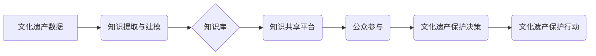

                 

## 知识管理在文化遗产保护中的应用

> 关键词：文化遗产、知识管理、数字孪生、人工智能、数据挖掘、知识图谱、文物保护、传承创新

## 1. 背景介绍

文化遗产是人类文明的宝贵财富，承载着历史记忆、民族精神和文化传承。然而，随着社会发展和自然灾害的威胁，文化遗产面临着日益严峻的保护挑战。传统保护方式难以有效应对这些挑战，迫切需要引入新的技术手段和理念。

知识管理（Knowledge Management，KM）作为一种系统性的知识获取、存储、共享和应用的管理方法，为文化遗产保护提供了新的思路和途径。通过构建知识库、建立知识共享平台、运用人工智能技术等手段，KM可以帮助我们更好地理解、保护和传承文化遗产。

## 2. 核心概念与联系

**2.1 知识管理 (KM)**

知识管理是指组织在整个生命周期内，通过系统化的方法，收集、整理、存储、共享、应用和更新知识，以提高组织的竞争力和创新能力。

**2.2 文化遗产**

文化遗产是指人类社会在历史发展过程中创造的物质和非物质财富，包括：

* **物质文化遗产：** 遗迹、建筑、雕塑、绘画、工艺品等。
* **非物质文化遗产：** 语言、音乐、舞蹈、戏剧、节日、传统技艺等。

**2.3 知识管理与文化遗产保护的联系**

知识管理可以帮助我们更好地理解、保护和传承文化遗产，具体体现在以下几个方面：

* **知识积累和传承：** 通过建立知识库，记录和保存文化遗产的各种信息，例如历史背景、制作工艺、文化内涵等，可以帮助我们传承和传播文化遗产的知识。
* **风险评估和预防：** 通过数据分析和模型预测，可以识别文化遗产面临的风险，例如自然灾害、人为破坏等，并制定相应的预防措施。
* **保护和修复：** 通过知识共享和技术应用，可以提高文化遗产的保护和修复水平，延长其寿命。
* **公众参与和传播：** 通过建立知识共享平台，可以促进公众参与文化遗产保护，提高公众对文化遗产的认识和理解。

**2.4 知识管理在文化遗产保护中的架构**



## 3. 核心算法原理 & 具体操作步骤

**3.1 算法原理概述**

知识管理在文化遗产保护中的应用主要依赖于以下核心算法：

* **自然语言处理 (NLP)**：用于提取文化遗产相关信息，例如文本描述、文献记载、专家意见等。
* **机器学习 (ML)**：用于构建知识模型，例如文物分类、风险预测、修复方案推荐等。
* **知识图谱 (KG)**：用于组织和表示文化遗产知识，例如文物属性、历史关系、文化背景等。

**3.2 算法步骤详解**

1. **数据采集:** 收集各种形式的文化遗产数据，例如文本、图像、视频、音频等。
2. **数据预处理:** 对数据进行清洗、格式化、标准化等处理，使其适合算法分析。
3. **知识提取:** 使用NLP算法提取文化遗产相关信息，例如文物名称、年代、材质、文化意义等。
4. **知识建模:** 使用ML算法构建知识模型，例如文物分类模型、风险预测模型、修复方案推荐模型等。
5. **知识表示:** 使用KG技术组织和表示文化遗产知识，构建知识图谱。
6. **知识共享:** 通过知识共享平台，将知识库和知识图谱公开共享，方便公众访问和利用。

**3.3 算法优缺点**

* **优点:**

    * 自动化程度高，可以提高效率和准确性。
    * 能够处理海量数据，挖掘隐藏的知识。
    * 能够促进知识共享和传播。

* **缺点:**

    * 需要大量的数据和计算资源。
    * 算法模型的构建和优化需要专业知识。
    * 算法结果可能存在偏差，需要人工验证和修正。

**3.4 算法应用领域**

* 文物分类和识别
* 文化遗产风险评估和预测
* 文化遗产保护和修复
* 文化遗产教育和宣传
* 文化遗产旅游开发

## 4. 数学模型和公式 & 详细讲解 & 举例说明

**4.1 数学模型构建**

在文化遗产保护中，我们可以使用数学模型来描述文物状态、风险因素和保护措施的效果。例如，我们可以使用状态空间模型来描述文物在不同时间点的状态变化，并根据历史数据和专家知识构建状态转移矩阵。

**4.2 公式推导过程**

假设文物状态可以用一个向量 $X_t$ 表示，其中每个元素代表文物的一个属性，例如温度、湿度、结构完整度等。状态转移矩阵 $A$ 描述了文物状态在不同时间点之间的变化关系。则文物状态在时间 $t+1$ 的预测值可以表示为：

$$X_{t+1} = AX_t + B$$

其中 $B$ 是一个控制向量，代表了保护措施的影响。

**4.3 案例分析与讲解**

例如，我们可以使用这个模型来预测文物在不同温度和湿度条件下的状态变化，并根据预测结果制定相应的保护措施。

## 5. 项目实践：代码实例和详细解释说明

**5.1 开发环境搭建**

* 操作系统：Windows/Linux/macOS
* 编程语言：Python
* 框架：TensorFlow/PyTorch
* 数据库：MongoDB/MySQL

**5.2 源代码详细实现**

```python
# 文物状态预测模型
import tensorflow as tf

# 定义模型结构
model = tf.keras.Sequential([
    tf.keras.layers.Dense(64, activation='relu', input_shape=(5,)),
    tf.keras.layers.Dense(32, activation='relu'),
    tf.keras.layers.Dense(5)
])

# 编译模型
model.compile(optimizer='adam', loss='mse')

# 训练模型
model.fit(X_train, y_train, epochs=10)

# 预测模型
predictions = model.predict(X_test)
```

**5.3 代码解读与分析**

这段代码定义了一个简单的文物状态预测模型，使用 TensorFlow 框架实现。模型输入文物在不同时间点的状态向量，输出预测的未来状态向量。

**5.4 运行结果展示**

运行结果可以展示模型的预测精度，例如平均绝对误差 (MAE) 或均方误差 (MSE)。

## 6. 实际应用场景

**6.1 文物分类和识别**

利用图像识别和深度学习技术，可以自动识别文物类型、年代、风格等信息，提高文物管理和保护效率。

**6.2 文化遗产风险评估和预测**

通过分析文物环境数据、历史灾害记录和专家意见，可以预测文物面临的风险，例如自然灾害、人为破坏等，并制定相应的预防措施。

**6.3 文化遗产保护和修复**

利用3D扫描、虚拟现实和增强现实技术，可以建立文物数字孪生模型，进行虚拟修复和模拟保护，提高修复效率和准确性。

**6.4 未来应用展望**

随着人工智能和数字技术的不断发展，知识管理在文化遗产保护中的应用将更加广泛和深入，例如：

* 利用大数据分析和预测模型，更精准地评估文物风险，制定个性化保护方案。
* 利用虚拟现实和增强现实技术，打造沉浸式文化遗产体验，提高公众参与度。
* 利用区块链技术，构建文物溯源体系，防止文物盗窃和伪造。

## 7. 工具和资源推荐

**7.1 学习资源推荐**

* **书籍:**

    * 《知识管理：理论与实践》
    * 《人工智能：改变世界的算法》
    * 《深度学习》

* **在线课程:**

    * Coursera: 知识管理课程
    * edX: 人工智能课程
    * Udacity: 深度学习课程

**7.2 开发工具推荐**

* **Python:** 广泛应用于数据分析、机器学习和人工智能领域。
* **TensorFlow:** 开源深度学习框架，提供丰富的工具和资源。
* **PyTorch:** 开源深度学习框架，以其灵活性和易用性而闻名。
* **MongoDB:** NoSQL 数据库，适合存储海量数据。
* **MySQL:**关系型数据库，适合存储结构化数据。

**7.3 相关论文推荐**

* **知识管理与文化遗产保护:**

    *  [Knowledge Management for Cultural Heritage Preservation](https://www.researchgate.net/publication/331643396_Knowledge_Management_for_Cultural_Heritage_Preservation)

* **人工智能与文化遗产保护:**

    * [Artificial Intelligence for Cultural Heritage Preservation](https://www.sciencedirect.com/science/article/pii/S092523122030159X)

## 8. 总结：未来发展趋势与挑战

**8.1 研究成果总结**

知识管理在文化遗产保护领域取得了显著成果，例如：

* 建立了丰富的文化遗产知识库，提高了文物信息获取和共享效率。
* 开发了文物风险评估和预测模型，提高了文物保护的精准性和有效性。
* 利用数字技术，打造了沉浸式文化遗产体验，提高了公众参与度。

**8.2 未来发展趋势**

未来，知识管理在文化遗产保护领域将朝着以下方向发展：

* **更加智能化:** 利用人工智能技术，实现文物自动识别、风险预测、保护方案推荐等功能。
* **更加个性化:** 根据不同文物特点和保护需求，制定个性化保护方案。
* **更加协同化:** 建立跨机构、跨领域的知识共享平台，促进文化遗产保护的协同发展。

**8.3 面临的挑战**

知识管理在文化遗产保护领域也面临一些挑战：

* 数据质量问题：文化遗产数据往往分散、不规范，需要进行大量的清洗和标准化处理。
* 算法模型的构建和优化需要专业知识和经验。
* 知识共享和传播需要克服机构壁垒和信息孤岛。

**8.4 研究展望**

未来，需要加强对知识管理在文化遗产保护领域的理论研究和实践探索，推动知识管理技术与文化遗产保护的深度融合，为文化遗产的传承和创新提供新的思路和方法。

## 9. 附录：常见问题与解答

**9.1 如何构建文化遗产知识库？**

构建文化遗产知识库需要以下步骤：

1. 确定知识库的范围和目标。
2. 收集各种形式的文化遗产数据，例如文本、图像、视频、音频等。
3. 对数据进行清洗、格式化、标准化等处理。
4. 使用知识提取和建模技术，将数据转化为可存储和共享的知识。
5. 建立知识库平台，方便用户访问和利用知识。

**9.2 如何评估知识管理在文化遗产保护中的效果？**

可以从以下几个方面评估知识管理在文化遗产保护中的效果：

* 文物信息获取和共享效率的提升。
* 文物风险评估和预测的准确性。
* 文物保护和修复的效率和效果。
* 公众参与度和文化遗产保护意识的提高。


作者：禅与计算机程序设计艺术 / Zen and the Art of Computer Programming 
<end_of_turn>

