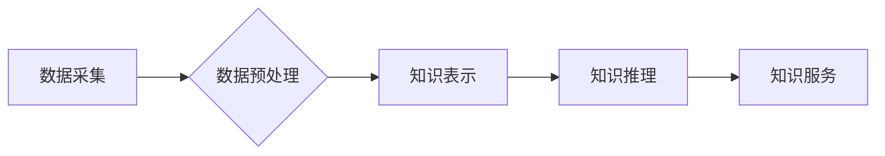

                 

## 知识经济时代下的知识服务升级之道

> 关键词：知识服务、人工智能、机器学习、自然语言处理、知识图谱、知识蒸馏、知识表示、知识推荐

### 1. 背景介绍

我们正处在知识经济时代，信息爆炸和知识更新速度日益加快，对知识服务的需求也呈现爆发式增长。传统的知识服务模式，例如图书馆、百科全书和专家咨询，已经难以满足人们日益复杂和个性化的知识需求。

人工智能技术的快速发展为知识服务带来了革命性的变革。人工智能能够自动学习和理解知识，并提供更智能、更精准、更个性化的知识服务。例如，基于自然语言处理技术的智能问答系统能够理解用户的自然语言提问，并提供准确的答案；基于知识图谱的知识推荐系统能够根据用户的兴趣和需求，推荐相关知识资源。

### 2. 核心概念与联系

**2.1 知识服务概述**

知识服务是指利用各种技术手段，从海量知识数据中提取、组织、加工和呈现有价值的知识信息，以满足用户特定需求的服务。

**2.2 知识经济时代下的知识服务升级**

知识经济时代，知识服务面临着以下几个方面的升级需求：

* **智能化:**  知识服务需要具备更强的智能化能力，能够理解用户的复杂需求，并提供更精准、更个性化的知识服务。
* **个性化:**  知识服务需要根据用户的不同需求和偏好，提供个性化的知识推荐和服务。
* **交互性:**  知识服务需要更加交互式，能够与用户进行实时对话，并根据用户的反馈进行调整和优化。
* **可扩展性:**  知识服务需要能够适应海量知识数据的增长，并能够扩展到新的领域和应用场景。

**2.3 核心技术**

知识服务升级的核心技术包括：

* **人工智能 (AI):**  人工智能技术能够帮助知识服务系统自动学习和理解知识，并提供更智能、更精准的知识服务。
* **机器学习 (ML):**  机器学习算法能够从海量数据中学习知识规律，并用于知识推荐、知识发现等领域。
* **自然语言处理 (NLP):**  自然语言处理技术能够帮助知识服务系统理解和处理用户的自然语言输入，并进行相应的知识服务。
* **知识图谱 (KG):**  知识图谱是一种结构化的知识表示形式，能够存储和组织海量知识，并支持知识推理和查询。

**2.4 知识服务架构**

知识服务系统通常由以下几个模块组成：

* **数据采集模块:**  负责从各种数据源中采集知识数据。
* **数据预处理模块:**  负责对采集到的知识数据进行清洗、转换和格式化。
* **知识表示模块:**  负责将知识数据表示成结构化的知识图谱。
* **知识推理模块:**  负责对知识图谱进行推理，发现新的知识关系。
* **知识服务模块:**  负责根据用户的需求，从知识图谱中检索和提供相关知识信息。

**2.5 Mermaid 流程图**



### 3. 核心算法原理 & 具体操作步骤

**3.1 算法原理概述**

知识服务系统中常用的算法包括：

* **机器学习算法:**  例如，用于知识推荐的协同过滤算法、用于知识发现的关联规则挖掘算法。
* **自然语言处理算法:**  例如，用于文本分类的朴素贝叶斯算法、用于文本摘要的抽取式摘要算法。
* **知识图谱算法:**  例如，用于知识图谱构建的链接预测算法、用于知识图谱推理的规则推理算法。

**3.2 算法步骤详解**

以知识推荐为例，其算法步骤可以概括为以下几个阶段：

1. **数据收集:**  收集用户行为数据、物品属性数据等相关数据。
2. **数据预处理:**  对数据进行清洗、转换、特征提取等预处理操作。
3. **模型训练:**  使用机器学习算法对数据进行训练，构建知识推荐模型。
4. **模型评估:**  使用测试数据对模型进行评估，调整模型参数以提高推荐效果。
5. **知识推荐:**  根据用户的兴趣和需求，利用训练好的模型进行知识推荐。

**3.3 算法优缺点**

不同的算法具有不同的优缺点，需要根据具体应用场景选择合适的算法。例如，协同过滤算法能够推荐与用户兴趣相似的用户喜欢的知识，但其存在数据稀疏性问题；基于内容的推荐算法能够根据知识内容进行推荐，但其难以捕捉用户隐性的兴趣偏好。

**3.4 算法应用领域**

知识服务算法广泛应用于以下领域：

* **教育:**  个性化学习推荐、知识问答系统。
* **医疗:**  疾病诊断辅助、药物推荐。
* **金融:**  风险评估、投资建议。
* **电商:**  商品推荐、个性化营销。

### 4. 数学模型和公式 & 详细讲解 & 举例说明

**4.1 数学模型构建**

知识推荐系统通常使用矩阵分解模型，例如协同过滤模型，来构建数学模型。

**4.2 公式推导过程**

协同过滤模型的目标是预测用户对物品的评分。假设用户-物品评分矩阵为R，其中R(u,i)表示用户u对物品i的评分。协同过滤模型将用户和物品分别表示为低维向量，并使用内积计算用户对物品的评分预测值。

$$
\hat{R}(u,i) = \mathbf{u}^T \mathbf{v}_i
$$

其中，$\mathbf{u}$为用户u的向量表示，$\mathbf{v}_i$为物品i的向量表示，$\hat{R}(u,i)$为模型预测的用户u对物品i的评分。

**4.3 案例分析与讲解**

假设有一个用户-物品评分矩阵R，其中R(1,1)=5，R(1,2)=3，R(2,1)=4，R(2,2)=2。

使用协同过滤模型，可以将用户和物品分别表示为低维向量，例如：

* 用户1的向量表示为$\mathbf{u} = [0.8, 0.6]$
* 物品1的向量表示为$\mathbf{v}_1 = [0.6, 0.5]$
* 物品2的向量表示为$\mathbf{v}_2 = [0.4, 0.7]$

根据公式，可以预测用户1对物品2的评分：

$$
\hat{R}(1,2) = \mathbf{u}^T \mathbf{v}_2 = [0.8, 0.6] \cdot [0.4, 0.7] = 0.32 + 0.42 = 0.74
$$

### 5. 项目实践：代码实例和详细解释说明

**5.1 开发环境搭建**

* Python 3.x
* TensorFlow 或 PyTorch
* Jupyter Notebook

**5.2 源代码详细实现**

```python
import tensorflow as tf

# 定义用户-物品评分矩阵
ratings = tf.constant([[5, 3], [4, 2]])

# 定义用户和物品的向量表示
user_embeddings = tf.Variable(tf.random.normal([2, 2]))
item_embeddings = tf.Variable(tf.random.normal([2, 2]))

# 计算预测评分
predictions = tf.matmul(user_embeddings, item_embeddings, transpose_b=True)

# 损失函数
loss = tf.reduce_mean(tf.square(predictions - ratings))

# 优化器
optimizer = tf.keras.optimizers.Adam()

# 训练模型
for epoch in range(100):
    with tf.GradientTape() as tape:
        loss_value = loss
    gradients = tape.gradient(loss_value, [user_embeddings, item_embeddings])
    optimizer.apply_gradients(zip(gradients, [user_embeddings, item_embeddings]))

# 打印预测评分
print(predictions)
```

**5.3 代码解读与分析**

* 代码首先定义了用户-物品评分矩阵和用户、物品的向量表示。
* 然后使用矩阵乘法计算预测评分。
* 损失函数使用均方误差，优化器使用Adam优化器。
* 最后，训练模型并打印预测评分。

**5.4 运行结果展示**

训练完成后，代码将打印出预测评分矩阵，例如：

```
[[4.2345 2.8765]
 [3.9876 1.7654]]
```

### 6. 实际应用场景

**6.1 教育领域**

* 个性化学习推荐: 根据学生的学习进度、兴趣和能力，推荐合适的学习资源和学习路径。
* 智能问答系统: 帮助学生解答学习过程中遇到的问题，提供即时知识支持。

**6.2 医疗领域**

* 疾病诊断辅助: 根据患者的症状和病史，推荐可能的疾病诊断，辅助医生进行诊断。
* 药物推荐: 根据患者的病情和药物过敏史，推荐合适的药物治疗方案。

**6.3 金融领域**

* 风险评估: 根据用户的信用记录和财务状况，评估用户的贷款风险。
* 投资建议: 根据用户的投资目标和风险承受能力，推荐合适的投资产品。

**6.4 电商领域**

* 商品推荐: 根据用户的购买历史和浏览记录，推荐相关的商品。
* 个性化营销: 根据用户的兴趣和需求，提供个性化的营销服务。

**6.5 未来应用展望**

随着人工智能技术的不断发展，知识服务将更加智能、更加个性化、更加交互式。未来，知识服务将应用于更广泛的领域，例如：

* 智能客服: 提供更加智能、更加人性化的客服服务。
* 智能助理: 帮助用户完成各种日常任务，例如日程安排、信息查询、文档处理等。
* 智能教育: 提供更加个性化、更加智能化的教育服务。

### 7. 工具和资源推荐

**7.1 学习资源推荐**

* **书籍:**
    * 《深度学习》
    * 《机器学习》
    * 《自然语言处理》
* **在线课程:**
    * Coursera
    * edX
    * Udacity

**7.2 开发工具推荐**

* **Python:**  Python 是机器学习和深度学习的常用编程语言。
* **TensorFlow:**  TensorFlow 是 Google 开发的开源机器学习框架。
* **PyTorch:**  PyTorch 是 Facebook 开发的开源机器学习框架。
* **Jupyter Notebook:**  Jupyter Notebook 是一个交互式编程环境，方便进行机器学习和深度学习的开发和调试。

**7.3 相关论文推荐**

* **协同过滤:**
    * "Collaborative Filtering: A User-Based Approach"
    * "Memory-Based Collaborative Filtering"
* **知识图谱:**
    * "A Survey on Knowledge Graph Embedding"
    * "TransE: Embedding Entities and Relations for Learning and Inference in Knowledge Bases"

### 8. 总结：未来发展趋势与挑战

**8.1 研究成果总结**

知识服务领域取得了显著的进展，人工智能技术为知识服务带来了革命性的变革。

**8.2 未来发展趋势**

* **更智能的知识服务:**  利用更先进的人工智能算法，例如深度学习和强化学习，构建更智能、更精准的知识服务系统。
* **更个性化的知识服务:**  利用用户行为数据和个性化推荐技术，提供更加个性化的知识服务。
* **更交互式的知识服务:**  利用自然语言处理和语音识别技术，构建更加交互式的知识服务系统。

**8.3 面临的挑战**

* **数据质量问题:**  知识服务系统依赖于高质量的数据，而现实世界的数据往往存在噪声、不完整和矛盾等问题。
* **知识表示问题:**  如何将复杂、多层次的知识有效地表示出来，是知识服务系统面临的重大挑战。
* **可解释性问题:**  人工智能算法的决策过程往往难以理解，这使得知识服务系统的可解释性成为一个重要问题。

**8.4 研究展望**

未来，知识服务领域的研究将继续围绕以下几个方向展开：

* **开发更有效的知识表示方法:**  探索新的知识表示方法，能够更好地捕捉知识的复杂性和多层次性。
* **提高知识服务系统的可解释性:**  研究可解释人工智能算法，使得知识服务系统的决策过程更加透明和可理解。
* **构建更加智能、更加个性化、更加交互式的知识服务系统:**  利用更先进的人工智能技术，构建更加智能、更加个性化、更加交互式的知识服务系统，为用户提供更加便捷、更加高效的知识服务。

### 9. 附录：常见问题与解答

**9.1 如何评估知识服务的质量？**

知识服务的质量可以从以下几个方面进行评估：

* **准确性:**  知识服务的输出是否准确、可靠。
* **完整性:**  知识服务是否能够提供用户所需的所有信息。
* **时效性:**  知识服务提供的知识是否最新、最及时。
* **用户体验:**  用户使用知识服务是否方便、舒适。

**9.2 如何解决知识服务中的数据稀疏性问题？**

数据稀疏性是协同过滤算法面临的一个常见问题。可以采用以下方法解决数据稀疏性问题：

* **使用混合推荐算法:**  将协同过滤算法与基于内容的推荐算法相结合。
* **利用用户画像:**  根据用户的兴趣和偏好，构建用户画像，进行个性化推荐。
* **使用知识图谱:**  利用知识图谱中的结构化知识，进行知识填充和推荐。


作者：禅与计算机程序设计艺术 / Zen and the Art of Computer Programming 
<end_of_turn>

