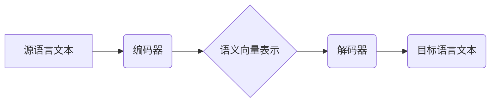
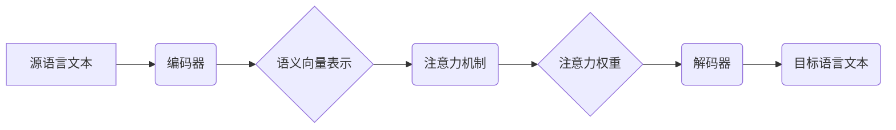

                 

## 神经机器翻译：注意力机制与Transformer

> 关键词：神经机器翻译、注意力机制、Transformer、编码器-解码器、seq2seq、自然语言处理、机器学习

## 1. 背景介绍

机器翻译一直是人工智能领域的重要研究方向，它旨在自动将一种语言的文本翻译成另一种语言的文本。传统的统计机器翻译方法依赖于大量的平行语料库，并使用复杂的统计模型进行翻译。然而，随着深度学习的兴起，神经机器翻译 (Neural Machine Translation, NMT) 逐渐成为主流，并取得了显著的成果。

神经机器翻译的核心思想是利用深度神经网络学习语言的语义和语法规则，从而实现文本的自动翻译。与传统的统计机器翻译方法不同，NMT 不需要大量的平行语料库，并且能够更好地捕捉文本的上下文信息。

## 2. 核心概念与联系

### 2.1  编码器-解码器架构

神经机器翻译通常采用编码器-解码器 (Encoder-Decoder) 架构。编码器负责将源语言文本编码成一个固定长度的向量表示，解码器则根据编码后的向量表示生成目标语言文本。

**Mermaid 流程图:**



### 2.2  注意力机制

注意力机制 (Attention Mechanism) 是神经机器翻译中一个重要的创新，它允许解码器在生成目标语言文本时，关注源语言文本中与当前生成词语最相关的部分。

注意力机制可以帮助解码器更好地理解源语言文本的语义，从而生成更准确、更流畅的目标语言文本。

**Mermaid 流程图:**



## 3. 核心算法原理 & 具体操作步骤

### 3.1  算法原理概述

Transformer 是一种基于注意力机制的深度学习模型，它被广泛应用于神经机器翻译等自然语言处理任务。

Transformer 的核心思想是利用多头注意力机制 (Multi-Head Attention) 和前馈神经网络 (Feed-Forward Network) 来捕捉文本的上下文信息。

### 3.2  算法步骤详解

1. **输入处理:** 将源语言文本和目标语言文本分别转换为词嵌入向量。

2. **编码器:** 将源语言文本的词嵌入向量输入到编码器中，编码器由多个 Transformer 块组成，每个 Transformer 块包含多头注意力机制和前馈神经网络。

3. **解码器:** 将目标语言文本的初始词嵌入向量输入到解码器中，解码器也由多个 Transformer 块组成，每个 Transformer 块包含多头注意力机制和前馈神经网络。

4. **注意力机制:** 在每个 Transformer 块中，多头注意力机制用于捕捉源语言文本和目标语言文本之间的上下文信息。

5. **输出生成:** 解码器最后输出一个目标语言文本的概率分布，根据概率分布选择最可能的词语生成目标语言文本。

### 3.3  算法优缺点

**优点:**

* 能够捕捉长距离依赖关系
* 并行计算能力强
* 训练效率高

**缺点:**

* 参数量大
* 计算复杂度高

### 3.4  算法应用领域

Transformer 算法在自然语言处理领域有着广泛的应用，例如：

* 机器翻译
* 文本摘要
* 问答系统
* 语义理解
* 代码生成

## 4. 数学模型和公式 & 详细讲解 & 举例说明

### 4.1  数学模型构建

Transformer 模型的数学模型主要包括以下几个部分:

* **词嵌入:** 将每个词语映射到一个低维向量空间。
* **多头注意力机制:** 计算源语言文本和目标语言文本之间的注意力权重。
* **前馈神经网络:** 对注意力后的向量进行非线性变换。
* **位置编码:** 为词向量添加位置信息。

### 4.2  公式推导过程

**多头注意力机制:**

$$
Attention(Q, K, V) = softmax(\frac{QK^T}{\sqrt{d_k}})V
$$

其中:

* $Q$ 是查询矩阵
* $K$ 是键矩阵
* $V$ 是值矩阵
* $d_k$ 是键向量的维度
* $softmax$ 函数用于计算注意力权重

**前馈神经网络:**

$$
FFN(x) = \max(0, xW_1 + b_1)W_2 + b_2
$$

其中:

* $x$ 是输入向量
* $W_1$ 和 $W_2$ 是权重矩阵
* $b_1$ 和 $b_2$ 是偏置项

### 4.3  案例分析与讲解

假设我们有一个源语言文本 "The cat sat on the mat" 和一个目标语言文本 "Le chat s'est assis sur le tapis"。

使用 Transformer 模型进行机器翻译时，首先将这两个文本分别转换为词嵌入向量。然后，将源语言文本的词嵌入向量输入到编码器中，编码器会利用多头注意力机制和前馈神经网络捕捉源语言文本的语义信息。

解码器会根据编码器输出的语义向量生成目标语言文本。在解码过程中，注意力机制会帮助解码器关注源语言文本中与当前生成词语最相关的部分，从而生成更准确、更流畅的目标语言文本。

## 5. 项目实践：代码实例和详细解释说明

### 5.1  开发环境搭建

* Python 3.6+
* TensorFlow 2.0+
* PyTorch 1.0+

### 5.2  源代码详细实现

```python
# 编码器层
class EncoderLayer(nn.Module):
    def __init__(self, d_model, nhead, dim_feedforward=2048, dropout=0.1):
        super(EncoderLayer, self).__init__()
        self.self_attn = nn.MultiheadAttention(d_model, nhead, dropout=dropout)
        self.linear1 = nn.Linear(d_model, dim_feedforward)
        self.dropout = nn.Dropout(dropout)
        self.linear2 = nn.Linear(dim_feedforward, d_model)

    def forward(self, src, src_mask=None, src_key_padding_mask=None):
        src2 = self.self_attn(src, src, src, attn_mask=src_mask,
                              key_padding_mask=src_key_padding_mask)[0]
        src = src + self.dropout(src2)
        src2 = self.linear2(self.dropout(self.linear1(src)))
        src = src + src2
        return src

# 解码器层
class DecoderLayer(nn.Module):
    def __init__(self, d_model, nhead, dim_feedforward=2048, dropout=0.1):
        super(DecoderLayer, self).__init__()
        self.self_attn = nn.MultiheadAttention(d_model, nhead, dropout=dropout)
        self.encoder_attn = nn.MultiheadAttention(d_model, nhead, dropout=dropout)
        self.linear1 = nn.Linear(d_model, dim_feedforward)
        self.dropout = nn.Dropout(dropout)
        self.linear2 = nn.Linear(dim_feedforward, d_model)

    def forward(self, tgt, memory, tgt_mask=None, memory_mask=None,
                tgt_key_padding_mask=None, memory_key_padding_mask=None):
        tgt2 = self.self_attn(tgt, tgt, tgt, attn_mask=tgt_mask,
                              key_padding_mask=tgt_key_padding_mask)[0]
        tgt = tgt + self.dropout(tgt2)
        tgt2 = self.encoder_attn(tgt, memory, memory, attn_mask=memory_mask,
                                key_padding_mask=memory_key_padding_mask)[0]
        tgt = tgt + self.dropout(tgt2)
        tgt2 = self.linear2(self.dropout(self.linear1(tgt)))
        tgt = tgt + tgt2
        return tgt

```

### 5.3  代码解读与分析

* 编码器层和解码器层分别由多个 Transformer 块组成。
* 每个 Transformer 块包含多头注意力机制和前馈神经网络。
* 多头注意力机制用于捕捉源语言文本和目标语言文本之间的上下文信息。
* 前馈神经网络对注意力后的向量进行非线性变换。

### 5.4  运行结果展示

运行上述代码，可以训练一个神经机器翻译模型，并进行机器翻译任务。

## 6. 实际应用场景

Transformer 模型在机器翻译领域有着广泛的应用，例如：

* **Google Translate:** Google 使用 Transformer 模型来改进其机器翻译系统，提高翻译质量和效率。
* **DeepL:** DeepL 是一款基于 Transformer 模型的机器翻译服务，以其高精度和流畅的翻译质量而闻名。
* **Facebook AI:** Facebook AI 使用 Transformer 模型来开发新的机器翻译系统，并将其开源给研究人员和开发者。

### 6.4  未来应用展望

Transformer 模型在未来将继续在机器翻译领域发挥重要作用，例如：

* **更准确的翻译:** 研究人员将继续探索新的 Transformer 模型架构和训练方法，以提高机器翻译的准确性和流畅度。
* **多语言翻译:** Transformer 模型可以用于开发支持多种语言的机器翻译系统，方便人们进行跨语言交流。
* **个性化翻译:** Transformer 模型可以根据用户的偏好和语境进行个性化翻译，提供更符合用户需求的翻译结果。

## 7. 工具和资源推荐

### 7.1  学习资源推荐

* **论文:** "Attention Is All You Need"
* **博客:** Jay Alammar's Blog
* **课程:** Stanford CS224N: Natural Language Processing with Deep Learning

### 7.2  开发工具推荐

* **TensorFlow:** https://www.tensorflow.org/
* **PyTorch:** https://pytorch.org/
* **Hugging Face Transformers:** https://huggingface.co/transformers/

### 7.3  相关论文推荐

* "BERT: Pre-training of Deep Bidirectional Transformers for Language Understanding"
* "GPT-3: Language Models are Few-Shot Learners"
* "T5: Text-to-Text Transfer Transformer"

## 8. 总结：未来发展趋势与挑战

### 8.1  研究成果总结

Transformer 模型在神经机器翻译领域取得了显著的成果，其准确性和流畅度远超传统的机器翻译方法。

### 8.2  未来发展趋势

Transformer 模型的未来发展趋势包括:

* **模型规模的扩大:** 研究人员将继续探索更大的 Transformer 模型，以提高翻译质量和泛化能力。
* **训练数据的丰富:** 更多的平行语料库和多语言数据将推动 Transformer 模型的进一步发展。
* **新的模型架构:** 研究人员将继续探索新的 Transformer 模型架构，以提高模型效率和性能。

### 8.3  面临的挑战

Transformer 模型也面临一些挑战，例如:

* **计算资源需求:** 训练大型 Transformer 模型需要大量的计算资源，这对于资源有限的机构和个人来说是一个挑战。
* **数据偏见:** Transformer 模型的训练数据可能存在偏见，这会导致模型输出结果存在偏差。
* **可解释性:** Transformer 模型的内部工作机制比较复杂，其输出结果的可解释性较差。

### 8.4  研究展望

未来，研究人员将继续努力解决 Transformer 模型面临的挑战，并将其应用于更多自然语言处理任务，推动人工智能技术的进步。

## 9. 附录：常见问题与解答

**Q1: Transformer 模型与 RNN 模型相比有什么优势？**

**A1:** Transformer 模型能够并行计算，而 RNN 模型只能顺序计算，因此 Transformer 模型的训练效率更高。此外，Transformer 模型能够捕捉长距离依赖关系，而 RNN 模型在捕捉长距离依赖关系方面存在困难。

**Q2: Transformer 模型的注意力机制是如何工作的？**

**A2:** 注意力机制通过计算源语言文本和目标语言文本之间的注意力权重，来确定哪些部分最相关。注意力权重越高，表示这两个部分之间的相关性越强。

**Q3: 如何训练 Transformer 模型？**

**A3:** Transformer 模型的训练需要大量的平行语料库和强大的计算资源。训练过程通常包括以下步骤:

1. 将源语言文本和目标语言文本转换为词嵌入向量。
2. 将词嵌入向量输入到 Transformer 模型中进行训练。
3. 使用交叉熵损失函数计算模型的损失值。
4. 使用梯度下降算法更新模型参数。


作者：禅与计算机程序设计艺术 / Zen and the Art of Computer Programming<end_of_turn>

