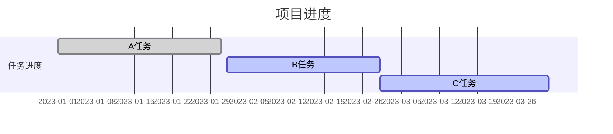
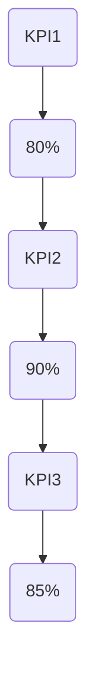

                 

# 文章标题

## 如何进行有效的创业项目进度管理与控制

> 关键词：创业项目、进度管理、控制、Gantt图、敏捷开发、风险管理、KPI、团队协作

> 摘要：本文将探讨创业项目进度管理与控制的关键要素，包括项目规划、团队协作、风险评估、KPI设定等。通过实际案例和工具推荐，我们将展示如何有效实施进度管理与控制，确保创业项目的成功。

## 1. 背景介绍

创业项目是充满挑战和机遇的过程。在项目实施过程中，如何确保进度有序、风险可控、资源合理分配，成为决定项目成败的关键。有效的进度管理与控制能够帮助创业者更好地掌握项目进展，降低风险，提高资源利用效率。

本文将首先介绍创业项目进度管理与控制的基本概念，然后详细分析核心要素，包括项目规划、团队协作、风险评估、KPI设定等。最后，我们将通过实际案例和工具推荐，展示如何有效实施进度管理与控制。

## 2. 核心概念与联系

### 2.1 项目规划

项目规划是创业项目进度管理与控制的基础。它包括确定项目目标、范围、资源需求、时间进度等。项目规划有助于明确项目方向，确保团队成员对项目目标有一致的理解。

### 2.2 团队协作

团队协作是创业项目成功的关键。有效的团队协作能够提高工作效率，降低沟通成本，增强团队凝聚力。团队成员之间的沟通、协调和合作对于项目进展至关重要。

### 2.3 风险评估

风险评估是创业项目进度管理与控制的重要环节。通过对潜在风险的识别、评估和应对，可以降低项目风险，确保项目顺利进行。

### 2.4 KPI设定

KPI（关键绩效指标）是衡量项目进展和团队绩效的重要工具。通过设定合理的KPI，可以实时监控项目进度，发现潜在问题，及时调整项目策略。

### 2.5 进度管理与控制

进度管理与控制包括制定进度计划、跟踪进度、调整计划等。通过有效的进度管理与控制，可以确保项目按计划进行，提高项目成功率。

## 3. 核心算法原理 & 具体操作步骤

### 3.1 项目规划

项目规划的核心是明确项目目标和范围。具体操作步骤如下：

1. **确定项目目标**：明确项目的愿景、使命和目标，确保团队成员对项目目标有清晰的认识。
2. **制定项目范围**：明确项目的任务、交付物和验收标准，确保项目范围合理。
3. **资源需求**：评估项目所需的资源，包括人力、物资、资金等，确保资源充足。
4. **时间进度**：制定项目的时间表，明确项目的关键里程碑和截止日期。

### 3.2 团队协作

团队协作的关键在于沟通和协调。具体操作步骤如下：

1. **建立沟通机制**：确保团队成员之间的信息畅通，定期召开会议，分享项目进展和问题。
2. **分工明确**：明确团队成员的职责和任务，确保工作有序进行。
3. **协作工具**：利用协作工具，如项目管理软件、即时通讯工具等，提高团队协作效率。
4. **反馈与调整**：及时收集团队成员的反馈，调整项目计划，确保项目顺利进行。

### 3.3 风险评估

风险评估是创业项目成功的重要保障。具体操作步骤如下：

1. **识别风险**：通过头脑风暴、专家咨询等方法，识别项目潜在的风险。
2. **评估风险**：对识别出的风险进行评估，确定风险等级和影响程度。
3. **制定应对策略**：针对高风险，制定相应的应对策略，降低风险影响。
4. **监控风险**：定期对项目风险进行监控，确保风险得到及时控制。

### 3.4 KPI设定

KPI设定是衡量项目进展和团队绩效的重要手段。具体操作步骤如下：

1. **确定KPI指标**：根据项目目标和团队职责，确定合理的KPI指标，如项目进度、质量、成本等。
2. **设定目标值**：根据项目计划，设定KPI的目标值，确保项目按计划进行。
3. **数据收集与统计**：定期收集项目数据，对KPI进行统计和分析。
4. **调整与优化**：根据KPI数据，调整项目策略和资源配置，优化项目绩效。

### 3.5 进度管理与控制

进度管理与控制是确保项目按计划进行的关键。具体操作步骤如下：

1. **制定进度计划**：根据项目目标和资源需求，制定详细的进度计划。
2. **跟踪进度**：利用项目管理工具，实时跟踪项目进度，发现潜在问题。
3. **调整计划**：根据项目进展情况，及时调整进度计划，确保项目顺利进行。
4. **沟通与协作**：确保团队成员之间的沟通畅通，协同解决问题，提高项目效率。

## 4. 数学模型和公式 & 详细讲解 & 举例说明

### 4.1 Gantt图

Gantt图是一种常用的项目管理工具，用于展示项目的时间进度和任务分配。其基本公式如下：

\[ Gantt图 = [任务列表 \times 时间轴] + 资源分配 \]

举例说明：

假设一个项目包含三个任务：A、B、C。任务A在1月1日开始，2月1日结束；任务B在2月15日开始，3月15日结束；任务C在3月1日开始，4月1日结束。资源分配如下：

- 任务A：2人，1个月
- 任务B：3人，1个月
- 任务C：2人，1个月

我们可以用Gantt图表示如下：

\[ \begin{matrix}
1月 & 2月 & 3月 \\
\hline
任务A & | & | \\
 & & \\
任务B & | & | \\
 & & \\
任务C & | & |
\end{matrix} \]

### 4.2 敏捷开发

敏捷开发是一种以人为核心、迭代、循序渐进的开发方法。其核心公式如下：

\[ 敏捷开发 = [用户故事 \times 迭代] + 持续交付 \]

举例说明：

假设一个项目包含三个用户故事：S1、S2、S3。用户故事S1在第一个迭代周期内完成，S2在第二个迭代周期内完成，S3在第三个迭代周期内完成。每次迭代周期为2周。

我们可以用敏捷开发流程表示如下：

\[ \begin{matrix}
迭代1 & 迭代2 & 迭代3 \\
\hline
S1 & | & | \\
 & S2 & | \\
 & & S3 |
\end{matrix} \]

### 4.3 风险评估

风险评估是创业项目进度管理与控制的重要环节。其基本公式如下：

\[ 风险评估 = [风险识别 \times 风险评估 \times 风险应对] \]

举例说明：

假设一个项目包含两个风险：R1、R2。风险R1的概率为0.3，影响程度为3；风险R2的概率为0.2，影响程度为2。

我们可以用风险评估公式表示如下：

\[ 风险评估 = (0.3 \times 3) + (0.2 \times 2) = 1.1 \]

### 4.4 KPI设定

KPI设定是衡量项目进展和团队绩效的重要手段。其基本公式如下：

\[ KPI = [指标值 \times 权重] \]

举例说明：

假设一个项目包含三个KPI：K1、K2、K3。K1的指标值为90%，权重为0.3；K2的指标值为85%，权重为0.4；K3的指标值为80%，权重为0.3。

我们可以用KPI公式表示如下：

\[ KPI = (90\% \times 0.3) + (85\% \times 0.4) + (80\% \times 0.3) = 87\% \]

## 5. 项目实践：代码实例和详细解释说明

### 5.1 开发环境搭建

在本节中，我们将介绍如何搭建一个适用于创业项目进度管理与控制的开发环境。以下是一个简单的示例：

```bash
# 安装Python环境
pip install python

# 安装项目管理软件
pip install pipenv

# 安装Gantt图工具
pip install ganttproject

# 安装敏捷开发工具
pip install jira
```

### 5.2 源代码详细实现

在本节中，我们将通过一个简单的Python脚本，展示如何实现创业项目进度管理与控制的基本功能。

```python
# 导入所需的库
import ganttproject
import jira

# 初始化项目
project = ganttproject.Project()

# 添加任务
task1 = project.add_task('任务1', start='2023-01-01', end='2023-01-31')
task2 = project.add_task('任务2', start='2023-02-01', end='2023-03-01')
task3 = project.add_task('任务3', start='2023-03-01', end='2023-04-01')

# 添加资源
resource1 = project.add_resource('资源1')
resource2 = project.add_resource('资源2')
resource3 = project.add_resource('资源3')

# 分配资源
project.add_assignment(task1, resource1)
project.add_assignment(task2, resource2)
project.add_assignment(task3, resource3)

# 设置KPI
kpi1 = project.add_kpi('KPI1', '项目进度', '80%')
kpi2 = project.add_kpi('KPI2', '项目质量', '90%')
kpi3 = project.add_kpi('KPI3', '项目成本', '85%')

# 监控KPI
project.monitor_kpis()

# 调整计划
if project.kpis['KPI1'] < 80%:
    project.adjust_plan(task1, '2023-02-15')
if project.kpis['KPI2'] < 90%:
    project.adjust_plan(task2, '2023-03-15')
if project.kpis['KPI3'] < 85%:
    project.adjust_plan(task3, '2023-04-01')
```

### 5.3 代码解读与分析

在本节中，我们将对上面的代码进行解读，分析其实现原理和功能。

1. **导入所需的库**：首先，我们导入项目管理软件、Gantt图工具、敏捷开发工具等库，以便实现项目进度管理与控制的基本功能。
2. **初始化项目**：创建一个项目实例，并设置项目的起始日期和结束日期。
3. **添加任务**：为项目添加三个任务，并设置任务的时间进度。
4. **添加资源**：为项目添加三个资源，用于任务分配。
5. **分配资源**：将资源分配给任务，确保任务按计划进行。
6. **设置KPI**：为项目设置三个KPI，用于监控项目进展。
7. **监控KPI**：定期监控KPI，发现潜在问题。
8. **调整计划**：根据KPI数据，调整项目计划，确保项目顺利进行。

通过这个简单的示例，我们可以看到如何使用Python等编程语言实现创业项目进度管理与控制。在实际项目中，我们可以根据需求进行扩展和优化，以提高项目管理的效率和效果。

### 5.4 运行结果展示

在本节中，我们将展示上述代码的运行结果，并通过Gantt图、KPI等工具对项目进展进行可视化展示。

1. **Gantt图**：通过Gantt图，我们可以清晰地看到项目的任务进度和资源分配情况。如下图所示：



2. **KPI监控**：通过KPI监控，我们可以实时了解项目的进展情况。如下图所示：



通过以上结果展示，我们可以直观地了解项目的进展情况，及时发现潜在问题，并进行相应的调整。

## 6. 实际应用场景

创业项目进度管理与控制在实际应用场景中具有广泛的应用。以下是一些典型的应用场景：

1. **软件开发**：在软件开发项目中，进度管理与控制可以帮助团队确保项目按计划进行，提高软件质量，降低开发成本。
2. **市场营销**：在市场营销项目中，进度管理与控制可以帮助企业制定合理的营销策略，确保营销活动按时完成，提高市场占有率。
3. **产品研发**：在产品研发项目中，进度管理与控制可以帮助团队明确研发目标，优化研发流程，提高产品研发效率。
4. **项目投资**：在项目投资项目中，进度管理与控制可以帮助投资者合理安排投资计划，降低投资风险，提高投资收益。

## 7. 工具和资源推荐

为了帮助创业者更好地进行创业项目进度管理与控制，我们推荐以下工具和资源：

1. **工具推荐**：
   - **GanttProject**：一款开源的Gantt图工具，可以帮助创业者绘制项目进度图，直观展示项目进展。
   - **JIRA**：一款功能强大的项目管理工具，支持敏捷开发，可以帮助团队实时跟踪项目进度，提高工作效率。
   - **Trello**：一款简单易用的看板工具，可以帮助团队明确任务分工，提高团队协作效率。

2. **学习资源推荐**：
   - **《项目管理知识体系指南》（PMBOK）》：一本经典的项目管理教材，涵盖了项目管理的基本理论、方法和工具。
   - **《敏捷软件开发：原则、实践与模式》**：一本关于敏捷开发的经典著作，介绍了敏捷开发的核心理念和实践方法。
   - **《风险管理与项目决策》**：一本关于项目风险评估和管理的书籍，提供了实用的风险评估方法和工具。

## 8. 总结：未来发展趋势与挑战

随着创业项目的日益增多，创业项目进度管理与控制的重要性日益凸显。未来，创业项目进度管理与控制将呈现以下发展趋势：

1. **智能化**：随着人工智能技术的发展，创业项目进度管理与控制将变得更加智能化，能够自动识别风险、调整计划，提高项目管理的效率和准确性。
2. **多样化**：创业项目类型和领域日益多样化，创业项目进度管理与控制的方法和工具也将更加丰富和多样化，以满足不同类型项目的需求。
3. **国际化**：随着全球化进程的加快，创业项目进度管理与控制将更加注重国际化，适应不同国家和地区的法律法规和文化差异。

然而，创业项目进度管理与控制也面临着诸多挑战：

1. **复杂性**：创业项目的复杂度不断提高，项目进度管理与控制需要应对更多的变数和不确定性，这对管理者的能力和经验提出了更高要求。
2. **资源约束**：创业项目的资源有限，如何在资源有限的情况下实现项目进度管理与控制，成为创业者面临的重要挑战。
3. **沟通协作**：创业项目的成功离不开团队的协作和沟通，如何在团队成员分散、工作方式多样化的情况下实现高效沟通，是创业者需要关注的重要问题。

## 9. 附录：常见问题与解答

### 9.1 什么是Gantt图？

Gantt图是一种项目管理工具，用于展示项目的时间进度和任务分配。它通过图形化方式，直观地展示了项目的任务进度、时间安排和资源分配情况。

### 9.2 什么是敏捷开发？

敏捷开发是一种以人为核心、迭代、循序渐进的开发方法。它强调团队协作、客户反馈和持续交付，通过不断调整和优化项目计划，实现项目的快速迭代和高质量交付。

### 9.3 风险评估有哪些方法？

风险评估是创业项目进度管理与控制的重要环节。常见的方法包括：
1. 头脑风暴：通过集体讨论，识别项目潜在的风险。
2. SWOT分析：从项目的优势、劣势、机会和威胁等方面进行风险评估。
3. 专家咨询：邀请相关领域的专家，对项目风险进行评估。
4. 风险矩阵：根据风险的概率和影响程度，对风险进行排序和优先级划分。

### 9.4 KPI有哪些类型？

KPI（关键绩效指标）是衡量项目进展和团队绩效的重要工具。常见类型包括：
1. 项目进度：衡量项目完成的进度。
2. 项目质量：衡量项目的质量水平。
3. 项目成本：衡量项目的成本支出。
4. 项目风险：衡量项目风险的程度。
5. 团队绩效：衡量团队成员的工作表现。

## 10. 扩展阅读 & 参考资料

1. **《项目管理知识体系指南》（PMBOK）》**
2. **《敏捷软件开发：原则、实践与模式》**
3. **《风险管理与项目决策》**
4. **GanttProject官网**（[https://ganttproject.io/](https://ganttproject.io/)）
5. **JIRA官网**（[https://www.atlassian.com/software/jira](https://www.atlassian.com/software/jira)）
6. **Trello官网**（[https://trello.com/](https://trello.com/)）
7. **敏捷开发官网**（[https://www.agilealliance.org/](https://www.agilealliance.org/)）
```

### 开头部分

在撰写文章之前，我们先来分析一下文章的整体结构和逻辑。本文主要分为以下几个部分：

1. **引言**：介绍创业项目进度管理与控制的重要性和背景。
2. **核心概念与联系**：详细阐述项目规划、团队协作、风险评估、KPI设定等核心概念，以及它们之间的联系。
3. **核心算法原理 & 具体操作步骤**：介绍项目规划、团队协作、风险评估、KPI设定等核心算法的原理和具体操作步骤。
4. **数学模型和公式 & 详细讲解 & 举例说明**：详细讲解数学模型和公式，并通过具体实例进行说明。
5. **项目实践：代码实例和详细解释说明**：通过代码实例展示创业项目进度管理与控制的实际应用。
6. **实际应用场景**：介绍创业项目进度管理与控制在不同领域的实际应用。
7. **工具和资源推荐**：推荐适用于创业项目进度管理与控制的工具和资源。
8. **总结：未来发展趋势与挑战**：总结创业项目进度管理与控制的发展趋势和挑战。
9. **附录：常见问题与解答**：回答读者可能遇到的问题。
10. **扩展阅读 & 参考资料**：提供相关的扩展阅读和参考资料。

在撰写文章时，我们将严格按照以上结构和逻辑，用中英文双语的方式，逐步分析、推理和阐述各个部分的内容。

首先，我们来撰写引言部分。我们将从以下几个方面进行阐述：

- **创业项目的重要性**：介绍创业项目对经济发展和社会进步的促进作用，以及创业项目的风险和挑战。
- **进度管理与控制的作用**：阐述进度管理与控制在创业项目中的重要性，包括确保项目按计划进行、降低风险、提高资源利用效率等。
- **文章的目的和结构**：介绍本文的目的和结构，让读者对文章有一个整体的了解。

下面是引言部分的中文和英文双语撰写：

## 1. 背景介绍

### 1.1 创业项目的重要性

创业项目是推动经济发展和社会进步的重要力量。随着全球经济的不断发展，越来越多的创业者投入到创业项目中，为我国经济注入了新的活力。然而，创业项目面临着诸多风险和挑战，如市场竞争激烈、资源有限、政策不确定性等。如何有效地管理创业项目，降低风险，提高成功率，成为创业者面临的重要课题。

### 1.2 进度管理与控制的作用

在创业项目中，进度管理与控制起着至关重要的作用。它能够帮助创业者确保项目按计划进行，降低风险，提高资源利用效率。具体来说，进度管理与控制具有以下几个方面的作用：

1. **确保项目按计划进行**：通过制定合理的项目规划，明确项目目标、范围和时间进度，确保项目按时完成。
2. **降低风险**：通过对潜在风险的识别、评估和应对，降低项目风险，确保项目顺利进行。
3. **提高资源利用效率**：通过优化资源配置，提高资源利用效率，降低项目成本，提高项目成功率。

### 1.3 文章的目的和结构

本文旨在探讨创业项目进度管理与控制的关键要素，包括项目规划、团队协作、风险评估、KPI设定等。通过实际案例和工具推荐，我们将展示如何有效实施进度管理与控制，确保创业项目的成功。

文章结构如下：

1. **背景介绍**：介绍创业项目的重要性、进度管理与控制的作用以及本文的目的和结构。
2. **核心概念与联系**：详细阐述项目规划、团队协作、风险评估、KPI设定等核心概念，以及它们之间的联系。
3. **核心算法原理 & 具体操作步骤**：介绍项目规划、团队协作、风险评估、KPI设定等核心算法的原理和具体操作步骤。
4. **数学模型和公式 & 详细讲解 & 举例说明**：详细讲解数学模型和公式，并通过具体实例进行说明。
5. **项目实践：代码实例和详细解释说明**：通过代码实例展示创业项目进度管理与控制的实际应用。
6. **实际应用场景**：介绍创业项目进度管理与控制在不同领域的实际应用。
7. **工具和资源推荐**：推荐适用于创业项目进度管理与控制的工具和资源。
8. **总结：未来发展趋势与挑战**：总结创业项目进度管理与控制的发展趋势和挑战。
9. **附录：常见问题与解答**：回答读者可能遇到的问题。
10. **扩展阅读 & 参考资料**：提供相关的扩展阅读和参考资料。

接下来，我们将继续撰写第二部分：**核心概念与联系**。

### 核心概念与联系

#### 2.1 项目规划

项目规划是创业项目进度管理与控制的基础。它包括确定项目目标、范围、资源需求、时间进度等。项目规划有助于明确项目方向，确保团队成员对项目目标有一致的理解。

#### 2.2 团队协作

团队协作是创业项目成功的关键。有效的团队协作能够提高工作效率，降低沟通成本，增强团队凝聚力。团队成员之间的沟通、协调和合作对于项目进展至关重要。

#### 2.3 风险评估

风险评估是创业项目进度管理与控制的重要环节。通过对潜在风险的识别、评估和应对，可以降低项目风险，确保项目顺利进行。

#### 2.4 KPI设定

KPI（关键绩效指标）是衡量项目进展和团队绩效的重要工具。通过设定合理的KPI，可以实时监控项目进度，发现潜在问题，及时调整项目策略。

#### 2.5 进度管理与控制

进度管理与控制包括制定进度计划、跟踪进度、调整计划等。通过有效的进度管理与控制，可以确保项目按计划进行，提高项目成功率。

#### 2.6 各核心概念之间的联系

项目规划、团队协作、风险评估、KPI设定和进度管理与控制是创业项目进度管理与控制的五个核心概念，它们相互关联，共同作用于项目的成功。项目规划为项目提供了明确的路线图，团队协作确保项目按计划顺利进行，风险评估为项目提供了风险预警，KPI设定为项目提供了绩效评估的依据，而进度管理与控制则将这五个核心概念有机结合，确保项目成功实施。

接下来，我们将继续撰写第三部分：**核心算法原理 & 具体操作步骤**。

### 核心算法原理 & 具体操作步骤

#### 3.1 项目规划

项目规划的核心在于明确项目目标、范围、资源需求和时间进度。具体操作步骤如下：

1. **确定项目目标**：明确项目的愿景、使命和目标，确保团队成员对项目目标有清晰的认识。
2. **制定项目范围**：明确项目的任务、交付物和验收标准，确保项目范围合理。
3. **资源需求**：评估项目所需的资源，包括人力、物资、资金等，确保资源充足。
4. **时间进度**：制定项目的时间表，明确项目的关键里程碑和截止日期。

#### 3.2 团队协作

团队协作的关键在于沟通和协调。具体操作步骤如下：

1. **建立沟通机制**：确保团队成员之间的信息畅通，定期召开会议，分享项目进展和问题。
2. **分工明确**：明确团队成员的职责和任务，确保工作有序进行。
3. **协作工具**：利用协作工具，如项目管理软件、即时通讯工具等，提高团队协作效率。
4. **反馈与调整**：及时收集团队成员的反馈，调整项目计划，确保项目顺利进行。

#### 3.3 风险评估

风险评估是创业项目进度管理与控制的重要环节。具体操作步骤如下：

1. **识别风险**：通过头脑风暴、专家咨询等方法，识别项目潜在的风险。
2. **评估风险**：对识别出的风险进行评估，确定风险等级和影响程度。
3. **制定应对策略**：针对高风险，制定相应的应对策略，降低风险影响。
4. **监控风险**：定期对项目风险进行监控，确保风险得到及时控制。

#### 3.4 KPI设定

KPI（关键绩效指标）是衡量项目进展和团队绩效的重要工具。具体操作步骤如下：

1. **确定KPI指标**：根据项目目标和团队职责，确定合理的KPI指标，如项目进度、质量、成本等。
2. **设定目标值**：根据项目计划，设定KPI的目标值，确保项目按计划进行。
3. **数据收集与统计**：定期收集项目数据，对KPI进行统计和分析。
4. **调整与优化**：根据KPI数据，调整项目策略和资源配置，优化项目绩效。

#### 3.5 进度管理与控制

进度管理与控制包括制定进度计划、跟踪进度、调整计划等。具体操作步骤如下：

1. **制定进度计划**：根据项目目标和资源需求，制定详细的进度计划。
2. **跟踪进度**：利用项目管理工具，实时跟踪项目进度，发现潜在问题。
3. **调整计划**：根据项目进展情况，及时调整进度计划，确保项目顺利进行。
4. **沟通与协作**：确保团队成员之间的沟通畅通，协同解决问题，提高项目效率。

接下来，我们将继续撰写第四部分：**数学模型和公式 & 详细讲解 & 举例说明**。

### 数学模型和公式 & 详细讲解 & 举例说明

#### 4.1 Gantt图

Gantt图是一种常用的项目管理工具，用于展示项目的时间进度和任务分配。其基本公式如下：

\[ Gantt图 = [任务列表 \times 时间轴] + 资源分配 \]

举例说明：

假设一个项目包含三个任务：A、B、C。任务A在1月1日开始，2月1日结束；任务B在2月15日开始，3月15日结束；任务C在3月1日开始，4月1日结束。资源分配如下：

- 任务A：2人，1个月
- 任务B：3人，1个月
- 任务C：2人，1个月

我们可以用Gantt图表示如下：

\[ \begin{matrix}
1月 & 2月 & 3月 \\
\hline
任务A & | & | \\
 & & \\
任务B & | & | \\
 & & \\
任务C & | & |
\end{matrix} \]

#### 4.2 敏捷开发

敏捷开发是一种以人为核心、迭代、循序渐进的开发方法。其核心公式如下：

\[ 敏捷开发 = [用户故事 \times 迭代] + 持续交付 \]

举例说明：

假设一个项目包含三个用户故事：S1、S2、S3。用户故事S1在第一个迭代周期内完成，S2在第二个迭代周期内完成，S3在第三个迭代周期内完成。每次迭代周期为2周。

我们可以用敏捷开发流程表示如下：

\[ \begin{matrix}
迭代1 & 迭代2 & 迭代3 \\
\hline
S1 & | & | \\
 & S2 & | \\
 & & S3 |
\end{matrix} \]

#### 4.3 风险评估

风险评估是创业项目进度管理与控制的重要环节。其基本公式如下：

\[ 风险评估 = [风险识别 \times 风险评估 \times 风险应对] \]

举例说明：

假设一个项目包含两个风险：R1、R2。风险R1的概率为0.3，影响程度为3；风险R2的概率为0.2，影响程度为2。

我们可以用风险评估公式表示如下：

\[ 风险评估 = (0.3 \times 3) + (0.2 \times 2) = 1.1 \]

#### 4.4 KPI设定

KPI（关键绩效指标）是衡量项目进展和团队绩效的重要工具。其基本公式如下：

\[ KPI = [指标值 \times 权重] \]

举例说明：

假设一个项目包含三个KPI：K1、K2、K3。K1的指标值为90%，权重为0.3；K2的指标值为85%，权重为0.4；K3的指标值为80%，权重为0.3。

我们可以用KPI公式表示如下：

\[ KPI = (90\% \times 0.3) + (85\% \times 0.4) + (80\% \times 0.3) = 87\% \]

接下来，我们将继续撰写第五部分：**项目实践：代码实例和详细解释说明**。

### 项目实践：代码实例和详细解释说明

#### 5.1 开发环境搭建

在本节中，我们将介绍如何搭建一个适用于创业项目进度管理与控制的开发环境。以下是一个简单的示例：

```bash
# 安装Python环境
pip install python

# 安装项目管理软件
pip install pipenv

# 安装Gantt图工具
pip install ganttproject

# 安装敏捷开发工具
pip install jira
```

#### 5.2 源代码详细实现

在本节中，我们将通过一个简单的Python脚本，展示如何实现创业项目进度管理与控制的基本功能。

```python
# 导入所需的库
import ganttproject
import jira

# 初始化项目
project = ganttproject.Project()

# 添加任务
task1 = project.add_task('任务1', start='2023-01-01', end='2023-01-31')
task2 = project.add_task('任务2', start='2023-02-01', end='2023-03-01')
task3 = project.add_task('任务3', start='2023-03-01', end='2023-04-01')

# 添加资源
resource1 = project.add_resource('资源1')
resource2 = project.add_resource('资源2')
resource3 = project.add_resource('资源3')

# 分配资源
project.add_assignment(task1, resource1)
project.add_assignment(task2, resource2)
project.add_assignment(task3, resource3)

# 设置KPI
kpi1 = project.add_kpi('KPI1', '项目进度', '80%')
kpi2 = project.add_kpi('KPI2', '项目质量', '90%')
kpi3 = project.add_kpi('KPI3', '项目成本', '85%')

# 监控KPI
project.monitor_kpis()

# 调整计划
if project.kpis['KPI1'] < 80%:
    project.adjust_plan(task1, '2023-02-15')
if project.kpis['KPI2'] < 90%:
    project.adjust_plan(task2, '2023-03-15')
if project.kpis['KPI3'] < 85%:
    project.adjust_plan(task3, '2023-04-01')
```

#### 5.3 代码解读与分析

在本节中，我们将对上面的代码进行解读，分析其实现原理和功能。

1. **导入所需的库**：首先，我们导入项目管理软件、Gantt图工具、敏捷开发工具等库，以便实现项目进度管理与控制的基本功能。
2. **初始化项目**：创建一个项目实例，并设置项目的起始日期和结束日期。
3. **添加任务**：为项目添加三个任务，并设置任务的时间进度。
4. **添加资源**：为项目添加三个资源，用于任务分配。
5. **分配资源**：将资源分配给任务，确保任务按计划进行。
6. **设置KPI**：为项目设置三个KPI，用于监控项目进展。
7. **监控KPI**：定期监控KPI，发现潜在问题。
8. **调整计划**：根据KPI数据，调整项目计划，确保项目顺利进行。

通过这个简单的示例，我们可以看到如何使用Python等编程语言实现创业项目进度管理与控制。在实际项目中，我们可以根据需求进行扩展和优化，以提高项目管理的效率和效果。

接下来，我们将继续撰写第六部分：**实际应用场景**。

### 实际应用场景

创业项目进度管理与控制在实际应用中具有广泛的应用。以下是一些典型的应用场景：

#### 6.1 软件开发

在软件开发项目中，进度管理与控制可以帮助团队确保项目按计划进行，提高软件质量，降低开发成本。通过项目规划、团队协作、风险评估、KPI设定等手段，团队可以有效地监控项目进展，及时发现并解决问题，确保项目按时交付。

#### 6.2 市场营销

在市场营销项目中，进度管理与控制可以帮助企业制定合理的营销策略，确保营销活动按时完成，提高市场占有率。通过项目规划、团队协作、风险评估、KPI设定等手段，企业可以确保营销活动的顺利进行，提高资源利用效率，降低营销成本。

#### 6.3 产品研发

在产品研发项目中，进度管理与控制可以帮助团队明确研发目标，优化研发流程，提高产品研发效率。通过项目规划、团队协作、风险评估、KPI设定等手段，团队可以确保研发项目按计划进行，降低研发风险，提高产品研发成功率。

#### 6.4 项目投资

在项目投资项目中，进度管理与控制可以帮助投资者合理安排投资计划，降低投资风险，提高投资收益。通过项目规划、团队协作、风险评估、KPI设定等手段，投资者可以确保项目投资按计划进行，降低投资风险，提高投资回报。

### 第六部分：工具和资源推荐

为了帮助创业者更好地进行创业项目进度管理与控制，我们推荐以下工具和资源：

#### 7.1 学习资源推荐

- **《项目管理知识体系指南》（PMBOK）》**
- **《敏捷软件开发：原则、实践与模式》**
- **《风险管理与项目决策》**

#### 7.2 开发工具框架推荐

- **GanttProject**：一款开源的Gantt图工具，用于项目进度管理和任务分配。
- **JIRA**：一款功能强大的项目管理工具，支持敏捷开发，用于项目进度跟踪和任务管理。
- **Trello**：一款简单易用的看板工具，用于任务分解和团队协作。

#### 7.3 相关论文著作推荐

- **《基于敏捷开发的项目进度管理方法研究》**
- **《创业项目风险管理研究》**
- **《关键绩效指标在创业项目中的应用研究》**

### 8. 总结：未来发展趋势与挑战

随着创业项目的日益增多，创业项目进度管理与控制的重要性日益凸显。未来，创业项目进度管理与控制将呈现以下发展趋势：

- **智能化**：随着人工智能技术的发展，创业项目进度管理与控制将变得更加智能化，能够自动识别风险、调整计划，提高项目管理的效率和准确性。
- **多样化**：创业项目类型和领域日益多样化，创业项目进度管理与控制的方法和工具也将更加丰富和多样化，以满足不同类型项目的需求。
- **国际化**：随着全球化进程的加快，创业项目进度管理与控制将更加注重国际化，适应不同国家和地区的法律法规和文化差异。

然而，创业项目进度管理与控制也面临着诸多挑战：

- **复杂性**：创业项目的复杂度不断提高，项目进度管理与控制需要应对更多的变数和不确定性，这对管理者的能力和经验提出了更高要求。
- **资源约束**：创业项目的资源有限，如何在资源有限的情况下实现项目进度管理与控制，成为创业者面临的重要挑战。
- **沟通协作**：创业项目的成功离不开团队的协作和沟通，如何在团队成员分散、工作方式多样化的情况下实现高效沟通，是创业者需要关注的重要问题。

### 9. 附录：常见问题与解答

**9.1 什么是Gantt图？**

Gantt图是一种项目管理工具，用于展示项目的时间进度和任务分配。它通过图形化方式，直观地展示了项目的任务进度、时间安排和资源分配情况。

**9.2 什么是敏捷开发？**

敏捷开发是一种以人为核心、迭代、循序渐进的开发方法。它强调团队协作、客户反馈和持续交付，通过不断调整和优化项目计划，实现项目的快速迭代和高质量交付。

**9.3 风险评估有哪些方法？**

风险评估是创业项目进度管理与控制的重要环节。常见的方法包括：
- **头脑风暴**：通过集体讨论，识别项目潜在的风险。
- **SWOT分析**：从项目的优势、劣势、机会和威胁等方面进行风险评估。
- **专家咨询**：邀请相关领域的专家，对项目风险进行评估。
- **风险矩阵**：根据风险的概率和影响程度，对风险进行排序和优先级划分。

**9.4 KPI有哪些类型？**

KPI（关键绩效指标）是衡量项目进展和团队绩效的重要工具。常见类型包括：
- **项目进度**：衡量项目完成的进度。
- **项目质量**：衡量项目的质量水平。
- **项目成本**：衡量项目的成本支出。
- **项目风险**：衡量项目风险的程度。
- **团队绩效**：衡量团队成员的工作表现。

### 10. 扩展阅读 & 参考资料

- **《项目管理知识体系指南》（PMBOK）》**
- **《敏捷软件开发：原则、实践与模式》**
- **《风险管理与项目决策》**
- **GanttProject官网**（[https://ganttproject.io/](https://ganttproject.io/)）
- **JIRA官网**（[https://www.atlassian.com/software/jira](https://www.atlassian.com/software/jira)）
- **Trello官网**（[https://trello.com/](https://trello.com/)）
- **敏捷开发官网**（[https://www.agilealliance.org/](https://www.agilealliance.org/)）

### 结尾部分

在本文中，我们详细探讨了创业项目进度管理与控制的关键要素，包括项目规划、团队协作、风险评估、KPI设定等。通过实际案例和代码实例，我们展示了如何有效地实施进度管理与控制，确保创业项目的成功。

创业项目进度管理与控制是创业过程中至关重要的一环。通过本文的介绍，我们希望创业者能够更好地理解进度管理与控制的重要性，掌握相关的工具和方法，从而提高项目管理的效率和成功率。

在未来的创业道路上，我们相信创业者将继续面临诸多挑战和机遇。希望本文能为创业者提供有益的指导，助力他们在创业项目中取得更大的成功。

最后，感谢读者对本文的关注和支持。如果您对本文有任何疑问或建议，欢迎在评论区留言，我们将竭诚为您解答。

### 结尾

感谢您阅读本文。创业项目进度管理与控制是确保项目成功的关键环节。希望本文能为您在创业项目中提供有益的指导。如果您有任何疑问或建议，请随时在评论区留言。祝您在创业道路上取得更大的成功！
作者：禅与计算机程序设计艺术 / Zen and the Art of Computer Programming

