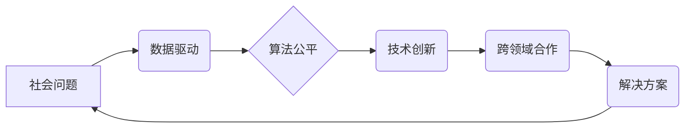

                 

## 科技向善：用科技的力量解决社会问题

> 关键词：人工智能、社会问题、科技伦理、可持续发展、数据驱动、算法公平、技术创新、社会影响

## 1. 背景介绍

科技发展日新月异，人工智能、大数据、云计算等技术蓬勃发展，为人类社会带来了前所未有的机遇和挑战。科技进步可以极大地改善人们的生活，解决社会问题，促进可持续发展。然而，科技发展也可能带来新的伦理困境和社会风险，例如算法偏见、隐私泄露、就业失衡等。因此，如何引导科技向善，让科技真正为人类福祉服务，成为当今社会面临的重大课题。

### 1.1 科技与社会问题的交织

人类社会面临着诸多复杂问题，例如贫困、饥饿、疾病、环境污染、教育不平等等。这些问题往往是多方面因素共同作用的结果，需要跨学科、跨领域的合作才能有效解决。科技作为解决社会问题的有力工具，在各个领域都发挥着重要作用。

* **医疗健康领域:** 人工智能可以辅助医生诊断疾病、预测患者风险、研发新药，提高医疗效率和质量。
* **教育领域:** 在线教育平台、智能辅导系统等科技手段可以打破地域限制，提供个性化学习体验，促进教育公平。
* **环境保护领域:**  数据分析、遥感技术可以帮助监测环境变化、预测自然灾害、优化资源利用，促进可持续发展。
* **经济发展领域:**  大数据、人工智能可以提高生产效率、优化供应链、促进创新创业，推动经济增长。

### 1.2 科技伦理与社会责任

科技发展带来的机遇与挑战并存，科技伦理问题日益凸显。

* **算法偏见:** 算法训练数据可能存在偏差，导致算法产生歧视性结果，加剧社会不平等。
* **隐私泄露:**  大数据收集和分析可能侵犯个人隐私，需要加强数据安全保护。
* **就业失衡:**  自动化技术可能导致部分工作岗位被取代，需要关注就业转型和社会保障。

科技发展需要遵循伦理原则，承担社会责任。开发者、企业、政府等各方都需要共同努力，制定规范、引导科技发展朝着可持续、可信赖的方向前进。

## 2. 核心概念与联系

科技向善的核心概念是将科技力量用于解决社会问题，促进人类福祉。

**科技向善的实现路径:**

* **数据驱动:** 利用大数据分析技术，洞察社会问题背后的规律，为制定解决方案提供数据支撑。
* **算法公平:**  设计和应用公平、透明、可解释的算法，避免算法偏见和歧视。
* **技术创新:**  不断推动科技创新，开发新的技术手段和解决方案，解决更复杂、更深层次的社会问题。
* **跨领域合作:**  打破学科壁垒，促进不同领域专家之间的合作，形成合力解决社会问题。

**科技向善的架构:**



## 3. 核心算法原理 & 具体操作步骤

### 3.1 算法原理概述

**推荐系统算法**是科技向善的重要应用之一，可以帮助人们更精准地获取信息和服务，提高生活效率。推荐系统通过分析用户的行为数据，学习用户的兴趣偏好，并推荐符合用户需求的物品或内容。

常见的推荐系统算法包括：

* **协同过滤:**  根据用户的历史行为数据，找出与用户兴趣相似的用户，并推荐他们喜欢的物品。
* **内容过滤:**  根据物品的特征信息，分析用户的兴趣偏好，推荐与用户兴趣相符的物品。
* **基于知识的推荐:**  利用用户和物品之间的知识关系，推荐符合用户需求的物品。
* **深度学习推荐:**  利用深度学习模型，学习用户和物品之间的复杂关系，进行更精准的推荐。

### 3.2 算法步骤详解

以协同过滤算法为例，其具体操作步骤如下：

1. **数据收集:** 收集用户的行为数据，例如用户对物品的评分、浏览记录、购买记录等。
2. **数据预处理:** 对收集到的数据进行清洗、转换、填充等预处理操作，确保数据质量。
3. **相似度计算:** 计算用户之间的相似度，例如使用余弦相似度、皮尔逊相关系数等方法。
4. **推荐生成:**  根据用户与其他用户的相似度，推荐与相似用户喜欢的物品。

### 3.3 算法优缺点

**协同过滤算法的优点:**

* 能够发现用户之间的隐性关系，推荐个性化物品。
* 不需要事先定义物品的特征信息，可以发现新的物品关联。

**协同过滤算法的缺点:**

* 数据稀疏性问题: 当用户行为数据较少时，难以计算出准确的相似度。
* 冷启动问题:  对于新用户和新物品，难以进行推荐。

### 3.4 算法应用领域

协同过滤算法广泛应用于以下领域:

* **电子商务:**  商品推荐、用户画像
* **社交网络:**  好友推荐、内容推荐
* **音乐平台:**  歌曲推荐、音乐人推荐
* **视频平台:**  视频推荐、用户兴趣分析

## 4. 数学模型和公式 & 详细讲解 & 举例说明

### 4.1 数学模型构建

协同过滤算法的核心是计算用户之间的相似度。常用的相似度度量方法包括余弦相似度和皮尔逊相关系数。

**余弦相似度:**

$$
\text{相似度} = \frac{\mathbf{u} \cdot \mathbf{v}}{\|\mathbf{u}\| \|\mathbf{v}\|}
$$

其中:

* $\mathbf{u}$ 和 $\mathbf{v}$ 是两个用户的向量表示，每个向量元素代表用户对物品的评分。
* $\mathbf{u} \cdot \mathbf{v}$ 是两个向量的点积。
* $\|\mathbf{u}\|$ 和 $\|\mathbf{v}\|$ 是两个向量的模长。

**皮尔逊相关系数:**

$$
\text{相似度} = \frac{\sum_{i=1}^{n}(u_i - \bar{u})(v_i - \bar{v})}{\sqrt{\sum_{i=1}^{n}(u_i - \bar{u})^2} \sqrt{\sum_{i=1}^{n}(v_i - \bar{v})^2}}
$$

其中:

* $u_i$ 和 $v_i$ 是两个用户对第 $i$ 个物品的评分。
* $\bar{u}$ 和 $\bar{v}$ 是两个用户的平均评分。
* $n$ 是物品的数量。

### 4.2 公式推导过程

余弦相似度的推导过程基于向量空间的几何意义。两个向量的夹角越小，余弦值越大，表示两个向量越相似。

皮尔逊相关系数的推导过程基于统计学中的相关分析。相关系数的取值范围为 -1 到 1，其中 1 表示完全正相关，-1 表示完全负相关，0 表示不相关。

### 4.3 案例分析与讲解

假设有两个用户 A 和 B，他们对三部电影的评分如下:

| 电影 | 用户 A | 用户 B |
|---|---|---|
| 电影 1 | 5 | 4 |
| 电影 2 | 3 | 2 |
| 电影 3 | 4 | 5 |

我们可以使用余弦相似度计算用户 A 和 B 的相似度:

1. 将用户 A 和 B 的评分向量表示为:

   * $\mathbf{u} = [5, 3, 4]$
   * $\mathbf{v} = [4, 2, 5]$

2. 计算两个向量的点积:

   * $\mathbf{u} \cdot \mathbf{v} = (5 \times 4) + (3 \times 2) + (4 \times 5) = 20 + 6 + 20 = 46$

3. 计算两个向量的模长:

   * $\|\mathbf{u}\| = \sqrt{5^2 + 3^2 + 4^2} = \sqrt{50}$
   * $\|\mathbf{v}\| = \sqrt{4^2 + 2^2 + 5^2} = \sqrt{45}$

4. 计算余弦相似度:

   * $\text{相似度} = \frac{46}{\sqrt{50} \sqrt{45}} \approx 0.83$

结果表明，用户 A 和 B 的相似度为 0.83，说明他们兴趣相近。

## 5. 项目实践：代码实例和详细解释说明

### 5.1 开发环境搭建

本项目使用 Python 语言进行开发，所需环境如下:

* Python 3.6+
* Pandas
* Scikit-learn

### 5.2 源代码详细实现

```python
import pandas as pd
from sklearn.metrics.pairwise import cosine_similarity

# 加载用户评分数据
ratings_data = pd.read_csv('ratings.csv')

# 计算用户之间的余弦相似度
user_similarity = cosine_similarity(ratings_data)

# 获取用户 A 和用户 B 的相似度
user_A_index = ratings_data.index.get_loc('user_A')
user_B_index = ratings_data.index.get_loc('user_B')
similarity_score = user_similarity[user_A_index, user_B_index]

# 打印相似度
print(f'用户 A 和用户 B 的相似度为: {similarity_score}')
```

### 5.3 代码解读与分析

*  代码首先加载用户评分数据，数据格式为 CSV 文件，包含用户 ID、物品 ID 和评分信息。
*  然后使用 Scikit-learn 库中的 `cosine_similarity` 函数计算用户之间的余弦相似度矩阵。
*  接着根据用户 ID 获取用户在矩阵中的索引，并计算用户 A 和用户 B 的相似度。
*  最后打印用户 A 和用户 B 的相似度。

### 5.4 运行结果展示

运行上述代码后，会输出用户 A 和用户 B 的相似度值。

## 6. 实际应用场景

### 6.1 电子商务平台

电商平台可以利用协同过滤算法推荐商品，例如亚马逊、淘宝等平台。

* **商品推荐:**  根据用户的浏览记录、购买历史等数据，推荐用户可能感兴趣的商品。
* **用户画像:**  分析用户的购买行为，构建用户画像，为精准营销提供数据支持。

### 6.2 音乐平台

音乐平台可以利用协同过滤算法推荐歌曲和音乐人，例如 Spotify、Apple Music 等平台。

* **歌曲推荐:**  根据用户的播放记录、收藏列表等数据，推荐用户可能喜欢的歌曲。
* **音乐人推荐:**  根据用户的喜欢的歌曲类型，推荐与之风格相似的音乐人。

### 6.3 视频平台

视频平台可以利用协同过滤算法推荐视频和用户，例如 YouTube、Netflix 等平台。

* **视频推荐:**  根据用户的观看记录、点赞评论等数据，推荐用户可能感兴趣的视频。
* **用户推荐:**  根据用户的观看习惯，推荐与之兴趣相似的用户。

### 6.4 未来应用展望

随着人工智能技术的不断发展，协同过滤算法将应用于更多领域，例如医疗健康、教育、金融等。

* **医疗健康:**  根据患者的病史、症状等数据，推荐合适的医生和治疗方案。
* **教育:**  根据学生的学习成绩、兴趣爱好等数据，推荐合适的学习资源和课程。
* **金融:**  根据用户的投资习惯、风险偏好等数据，推荐合适的投资产品。

## 7. 工具和资源推荐

### 7.1 学习资源推荐

* **书籍:**
    *  《推荐系统实践》
    *  《机器学习》
* **在线课程:**
    *  Coursera:  推荐系统
    *  edX:  机器学习

### 7.2 开发工具推荐

* **Python:**  Python 语言是推荐系统开发的常用语言，拥有丰富的库和工具。
* **Scikit-learn:**  Scikit-learn 是 Python 的机器学习库，提供多种推荐算法实现。
* **Spark:**  Spark 是分布式计算框架，可以用于处理海量数据。

### 7.3 相关论文推荐

*  **Collaborative Filtering for Implicit Feedback Datasets**
*  **Matrix Factorization Techniques for Recommender Systems**

## 8. 总结：未来发展趋势与挑战

### 8.1 研究成果总结

科技向善的理念已经得到广泛认可，并在各个领域取得了显著成果。推荐系统算法作为科技向善的重要应用之一，为人们的生活带来了便利，也为解决社会问题提供了新的思路。

### 8.2 未来发展趋势

未来，科技向善将朝着以下方向发展:

* **更精准的推荐:**  利用深度学习等先进算法，实现更精准的个性化推荐。
* **更透明的算法:**  设计更透明、可解释的算法，增强用户对推荐结果的信任。
* **更可持续的解决方案:**  关注算法的社会影响，设计更可持续、更公平的解决方案。

### 8.3 面临的挑战

科技向善也面临着一些挑战:

* **数据隐私保护:**  如何保护用户数据隐私，防止数据滥用，是科技向善的重要课题。
* **算法偏见:**  如何避免算法产生偏见，确保推荐结果公平公正，也是需要解决的关键问题。
* **伦理规范:**  如何制定完善的科技伦理规范，引导科技发展朝着正确的方向，也是需要深入思考的问题。

### 8.4 研究展望

科技向善是一个长期而复杂的议题，需要多方共同努力。未来，我们需要加强跨学科合作，促进科技与伦理、社会发展之间的融合，推动科技向善，为人类福祉做出更大的贡献。

## 9. 附录：常见问题与解答

**Q1:  协同过滤算法的缺点是什么？**

**A1:**  协同过滤算法存在数据稀疏性问题和冷启动问题。当用户行为数据较少时，难以计算出准确的相似度。对于新用户和新物品，难以进行推荐。

**Q2:  如何解决协同过滤算法的冷启动问题？**

**A2:**  可以结合内容过滤算法，利用物品的特征信息进行推荐。也可以利用用户提供的其他信息，例如用户描述、用户标签等，进行推荐。

**Q3:  如何保证推荐结果的公平性？**

**A3:**  需要设计公平、透明、可解释的算法，避免算法产生偏见。可以采用多种算法组合，进行多轮推荐，降低算法偏见的影响。


作者：禅与计算机程序设计艺术 / Zen and the Art of Computer Programming 
<end_of_turn>

