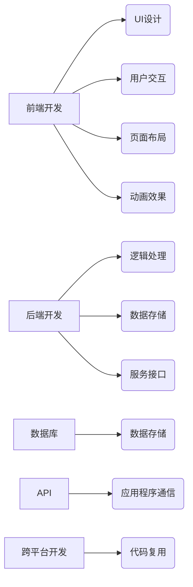

                 

## 移动端全栈开发：为智能手机创建应用程序

> 关键词：移动端开发、全栈开发、前端开发、后端开发、数据库、API、UI设计、UX设计、跨平台开发、Flutter、React Native、Kotlin、Swift

### 1. 背景介绍

智能手机已成为人们生活中不可或缺的一部分，移动应用程序的普及也催生了巨大的市场需求。移动端全栈开发应运而生，它指掌握前端、后端、数据库等多个环节的开发技能，能够独立完成移动应用程序的整个开发流程。

随着移动互联网的快速发展，用户对应用程序的需求越来越高，不仅需要流畅的用户体验，还需要强大的功能和数据安全保障。因此，移动端全栈开发人才的需求量不断攀升，成为炙手可热的新兴职业。

### 2. 核心概念与联系

移动端全栈开发涉及多个核心概念，它们相互关联，共同构成了移动应用程序的完整生态系统。

#### 2.1 前端开发

前端开发负责用户界面（UI）的设计和实现，包括用户交互、页面布局、动画效果等。常用的前端技术包括 HTML、CSS、JavaScript、React、Vue 等。

#### 2.2 后端开发

后端开发负责应用程序的逻辑处理、数据存储和服务接口。常用的后端技术包括 Python、Java、Node.js、PHP 等，以及数据库技术如 MySQL、MongoDB 等。

#### 2.3 数据库

数据库用于存储应用程序的数据，包括用户数据、商品信息、订单记录等。常见的数据库类型包括关系型数据库和非关系型数据库。

#### 2.4 API

API（应用程序接口）是应用程序之间通信的桥梁，允许不同应用程序共享数据和功能。

#### 2.5 跨平台开发

跨平台开发是指使用一套代码实现多个平台（如 iOS、Android）的应用程序，可以节省开发时间和成本。常用的跨平台开发框架包括 Flutter、React Native 等。

**核心概念关系图**



### 3. 核心算法原理 & 具体操作步骤

#### 3.1 算法原理概述

移动端全栈开发涉及多种算法，例如数据结构算法、排序算法、搜索算法等。这些算法为应用程序的性能优化、数据处理和用户体验提升提供了基础。

#### 3.2 算法步骤详解

以常见的排序算法为例，介绍其具体操作步骤：

1. **选择排序算法:** 
    - 遍历待排序数组，找到最小元素，将其与当前位置元素交换。
    - 重复上述步骤，直到整个数组排序完成。

2. **插入排序算法:**
    - 将待排序数组中的第一个元素作为有序数组，然后依次将剩余元素插入到有序数组中，保持有序。

#### 3.3 算法优缺点

不同的排序算法具有不同的优缺点，选择合适的算法取决于具体应用场景。

| 算法 | 优点 | 缺点 |
|---|---|---|
| 选择排序 | 简单易实现 | 时间复杂度高 |
| 插入排序 | 效率高，适合小规模数据 | 时间复杂度高 |

#### 3.4 算法应用领域

排序算法广泛应用于移动端应用程序中，例如：

- **联系人列表排序:** 根据姓名、电话号码等字段排序联系人列表。
- **商品列表排序:** 根据价格、销量等字段排序商品列表。
- **消息列表排序:** 根据时间、发送者等字段排序消息列表。

### 4. 数学模型和公式 & 详细讲解 & 举例说明

#### 4.1 数学模型构建

移动端应用程序的开发过程中，需要使用数学模型来描述和分析应用程序的行为。例如，可以使用线性回归模型来预测用户行为，可以使用贝叶斯网络来分析用户数据。

#### 4.2 公式推导过程

以线性回归模型为例，其目标是找到一条直线，使得预测值与实际值之间的误差最小。

**公式:**

$$y = mx + c$$

其中：

- $y$ 是预测值
- $x$ 是输入变量
- $m$ 是斜率
- $c$ 是截距

#### 4.3 案例分析与讲解

假设我们想要预测用户的购买行为，可以使用线性回归模型，将用户的年龄、收入等信息作为输入变量，预测用户的购买概率。

**数据:**

| 年龄 | 收入 | 购买概率 |
|---|---|---|
| 25 | 50000 | 0.8 |
| 30 | 60000 | 0.9 |
| 35 | 70000 | 0.95 |

**模型训练:**

使用上述数据训练线性回归模型，得到模型参数 $m$ 和 $c$。

**预测:**

对于一个年龄为 40，收入为 80000 的用户，可以使用模型预测其购买概率。

### 5. 项目实践：代码实例和详细解释说明

#### 5.1 开发环境搭建

移动端全栈开发需要搭建相应的开发环境，包括：

- **IDE:** Android Studio、Xcode 等
- **SDK:** Android SDK、iOS SDK 等
- **数据库工具:** MySQL Workbench、MongoDB Compass 等
- **版本控制工具:** Git

#### 5.2 源代码详细实现

以下是一个简单的移动端应用程序的源代码示例，使用 Flutter 框架开发：

```dart
import 'package:flutter/material.dart';

void main() {
  runApp(MyApp());
}

class MyApp extends StatelessWidget {
  @override
  Widget build(BuildContext context) {
    return MaterialApp(
      title: 'Flutter Demo',
      theme: ThemeData(
        primarySwatch: Colors.blue,
      ),
      home: MyHomePage(title: 'Flutter Demo Home Page'),
    );
  }
}

class MyHomePage extends StatefulWidget {
  MyHomePage({Key? key, required this.title}) : super(key: key);

  final String title;

  @override
  _MyHomePageState createState() => _MyHomePageState();
}

class _MyHomePageState extends State<MyHomePage> {
  int _counter = 0;

  void _incrementCounter() {
    setState(() {
      _counter++;
    });
  }

  @override
  Widget build(BuildContext context) {
    return Scaffold(
      appBar: AppBar(
        title: Text(widget.title),
      ),
      body: Center(
        child: Column(
          mainAxisAlignment: MainAxisAlignment.center,
          children: <Widget>[
            Text(
              'You have pushed the button this many times:',
            ),
            Text(
              '$_counter',
              style: Theme.of(context).textTheme.headline4,
            ),
          ],
        ),
      ),
      floatingActionButton: FloatingActionButton(
        onPressed: _incrementCounter,
        tooltip: 'Increment',
        child: Icon(Icons.add),
      ),
    );
  }
}
```

#### 5.3 代码解读与分析

这段代码实现了一个简单的 Flutter 应用程序，包含一个计数器，用户可以点击按钮增加计数器值。

- `runApp()` 函数启动应用程序。
- `MaterialApp()` 创建一个 Material Design 风格的应用程序。
- `MyHomePage()` 是应用程序的主页面。
- `_MyHomePageState()` 是页面状态管理类。
- `_counter` 变量存储计数器值。
- `_incrementCounter()` 函数增加计数器值并更新页面。
- `Scaffold()` 创建应用程序的基本结构，包含导航栏、主体内容和悬浮按钮。
- `Center()` 将内容居中显示。
- `Column()` 创建一个垂直排列的布局。
- `Text()` 创建文本显示。
- `FloatingActionButton()` 创建一个悬浮按钮。

#### 5.4 运行结果展示

运行这段代码后，会显示一个简单的 Flutter 应用程序，包含一个计数器和一个增加计数器的按钮。

### 6. 实际应用场景

移动端全栈开发技术广泛应用于各种场景，例如：

#### 6.1 社交媒体应用程序

社交媒体应用程序需要处理大量用户数据、消息和内容，需要高效的数据库、API 和用户界面设计。

#### 6.2 商业电子商务应用程序

电子商务应用程序需要实现商品展示、购物车、支付等功能，需要强大的后端逻辑、数据安全保障和用户体验优化。

#### 6.3 游戏应用程序

游戏应用程序需要实现复杂的逻辑、图形渲染和用户交互，需要高效的算法、图形引擎和游戏设计理念。

#### 6.4 教育学习应用程序

教育学习应用程序需要提供丰富的学习内容、互动练习和个性化学习方案，需要强大的数据分析、内容管理和用户行为追踪能力。

#### 6.5 健康医疗应用程序

健康医疗应用程序需要处理敏感医疗数据，需要严格的数据安全保障、隐私保护和医疗专业知识。

### 6.4 未来应用展望

随着移动互联网的不断发展，移动端全栈开发技术将迎来更多应用场景和发展机遇，例如：

- **人工智能驱动的移动应用程序:** 利用人工智能技术，开发更加智能、个性化的移动应用程序。
- **虚拟现实和增强现实移动应用程序:** 利用 VR/AR 技术，开发更加沉浸式、交互式的移动应用程序。
- **物联网连接的移动应用程序:** 利用物联网技术，开发更加智能、便捷的移动应用程序。

### 7. 工具和资源推荐

#### 7.1 学习资源推荐

- **在线课程:** Udemy、Coursera、Udacity 等平台提供丰富的移动端开发课程。
- **书籍:** 《Android 开发者指南》、《iOS 开发者指南》、《移动端全栈开发》等书籍。
- **博客和论坛:** Stack Overflow、Medium、GitHub 等平台提供丰富的技术博客和论坛讨论。

#### 7.2 开发工具推荐

- **IDE:** Android Studio、Xcode、Visual Studio Code 等。
- **数据库工具:** MySQL Workbench、MongoDB Compass、SQLite Studio 等。
- **版本控制工具:** Git、GitHub、GitLab 等。

#### 7.3 相关论文推荐

- **移动应用程序开发趋势:** ACM Transactions on Software Engineering and Methodology (TOSEM)
- **跨平台移动应用程序开发技术:** IEEE Transactions on Software Engineering (TSE)
- **移动应用程序安全技术:** IEEE Security & Privacy

### 8. 总结：未来发展趋势与挑战

#### 8.1 研究成果总结

移动端全栈开发技术已经取得了显著的成果，例如：

- **跨平台开发框架的成熟:** Flutter、React Native 等框架使得开发人员可以使用一套代码实现多个平台的应用程序。
- **人工智能技术的应用:** 人工智能技术被应用于移动应用程序开发，例如用户行为分析、个性化推荐等。
- **云计算技术的应用:** 云计算技术为移动应用程序提供了更强大的计算能力和数据存储能力。

#### 8.2 未来发展趋势

移动端全栈开发技术未来将朝着以下方向发展：

- **更加智能的应用程序:** 人工智能技术将更加广泛地应用于移动应用程序开发，开发更加智能、个性化的应用程序。
- **更加安全的应用程序:** 数据安全和隐私保护将成为移动应用程序开发的重点关注领域。
- **更加便捷的开发体验:** 开发工具和框架将更加完善，提供更加便捷的开发体验。

#### 8.3 面临的挑战

移动端全栈开发技术也面临着一些挑战：

- **技术更新迭代速度快:** 移动端技术更新迭代速度快，开发人员需要不断学习新技术。
- **跨平台开发的兼容性问题:** 跨平台开发框架的兼容性问题仍然存在，需要不断改进。
- **数据安全和隐私保护:** 移动应用程序需要处理大量用户数据，数据安全和隐私保护是一个重要的挑战。

#### 8.4 研究展望

未来，移动端全栈开发技术的研究将重点关注以下方面：

- **人工智能驱动的移动应用程序开发:** 研究人工智能技术在移动应用程序开发中的应用，开发更加智能、个性化的应用程序。
- **移动应用程序安全技术:** 研究更加有效的移动应用程序安全技术，保障用户数据安全和隐私保护。
- **跨平台开发技术:** 研究更加完善的跨平台开发技术，解决跨平台开发的兼容性问题。


### 9. 附录：常见问题与解答

#### 9.1 什么是移动端全栈开发？

移动端全栈开发是指掌握前端、后端、数据库等多个环节的开发技能，能够独立完成移动应用程序的整个开发流程。

#### 9.2 移动端全栈开发需要掌握哪些技术？

移动端全栈开发需要掌握以下技术：

- 前端开发技术：HTML、CSS、JavaScript、React、Vue 等
- 后端开发技术：Python、Java、Node.js、PHP 等
- 数据库技术：MySQL、MongoDB 等
- API 开发技术
- 跨平台开发框架：Flutter、React Native 等

#### 9.3 移动端全栈开发的优势是什么？

移动端全栈开发的优势包括：

- 能够独立完成应用程序的整个开发流程
- 掌握多种技术，视野更宽广
- 能够更好地理解应用程序的整体架构
- 提高开发效率和质量

#### 9.4 移动端全栈开发的挑战是什么？

移动端全栈开发的挑战包括：

- 技术更新迭代速度快
- 需要掌握多种技术，学习成本高
- 跨平台开发的兼容性问题

#### 9.5 如何成为一名优秀的移动端全栈开发工程师？

想要成为一名优秀的移动端全栈开发工程师，需要：

- 掌握扎实的编程基础
- 学习多种移动端开发技术
- 积累丰富的开发经验
- 保持学习和进步的热情


作者：禅与计算机程序设计艺术 / Zen and the Art of Computer Programming 


<end_of_turn>

