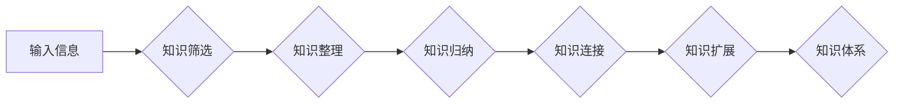

                 

## 程序员如何构建个人知识体系

> 关键词：知识体系、程序员成长、学习方法、深度学习、持续学习、技术积累、个人品牌

## 1. 背景介绍

在当今科技日新月异的时代，程序员面临着前所未有的挑战和机遇。新技术层出不穷，旧技术不断迭代更新，想要保持竞争力，必须不断学习和提升自身技能。然而，海量的技术信息和碎片化的学习资源，使得程序员难以有效地掌握和运用知识。如何构建一个高效、可持续的个人知识体系，成为程序员成长和发展的关键。

## 2. 核心概念与联系

个人知识体系，本质上是一个程序员将所学知识进行整理、归纳、连接和扩展的系统。它不仅包含具体的技术知识，更重要的是建立起知识之间的联系，形成一个完整的认知网络。

**知识体系构建的流程图:**

**核心概念:**

* **知识筛选:**  程序员需要根据自身职业目标和兴趣，从海量信息中筛选出有价值的知识。
* **知识整理:** 将筛选出的知识进行分类、归纳，形成结构化的知识框架。
* **知识归纳:**  对同一类知识进行总结和提炼，形成核心概念和关键点。
* **知识连接:**  建立不同知识之间的联系，形成一个完整的认知网络。
* **知识扩展:**  不断学习新的知识，并将其融入到现有知识体系中。

## 3. 核心算法原理 & 具体操作步骤

构建个人知识体系的核心算法，其实就是一种高效的学习和记忆方法。

### 3.1  算法原理概述

该算法基于以下几个核心原理：

* **主动学习:**  程序员需要主动地去寻找和学习知识，而不是被动地接受信息。
* **深度学习:**  程序员需要深入理解知识的本质，而不是仅仅记住表面信息。
* **知识图谱:**  程序员需要将知识以图谱的形式进行组织和连接，以便更好地理解和记忆。
* **反馈循环:**  程序员需要不断地回顾和反思自己的学习成果，并根据反馈进行调整和改进。

### 3.2  算法步骤详解

1. **明确目标:**  程序员需要明确自己的学习目标，例如想成为某个领域的专家，或者掌握某个特定的技术。
2. **选择资源:**  根据学习目标，选择合适的学习资源，例如书籍、课程、博客、开源项目等。
3. **主动学习:**  程序员需要主动地去阅读、学习和思考，而不是被动地接受信息。
4. **知识整理:**  将学习到的知识进行分类、归纳，形成结构化的知识框架。
5. **知识连接:**  建立不同知识之间的联系，形成一个完整的认知网络。
6. **知识扩展:**  不断学习新的知识，并将其融入到现有知识体系中。
7. **反馈循环:**  定期回顾和反思自己的学习成果，并根据反馈进行调整和改进。

### 3.3  算法优缺点

**优点:**

* **高效:**  通过主动学习和深度学习，可以有效地提高学习效率。
* **可持续:**  通过知识图谱和反馈循环，可以形成一个可持续的学习体系。
* **个性化:**  可以根据自身的学习目标和兴趣，构建个性化的知识体系。

**缺点:**

* **需要时间和精力:**  构建个人知识体系需要投入时间和精力，需要程序员坚持不懈地学习和实践。
* **需要一定的学习方法:**  需要程序员掌握一定的学习方法和技巧，才能有效地构建知识体系。

### 3.4  算法应用领域

该算法可以应用于程序员的各个领域，例如：

* **技术学习:**  学习新的编程语言、框架、工具等。
* **项目开发:**  解决项目中的技术难题，提高开发效率。
* **职业发展:**  提升自身竞争力，获得职业晋升。
* **个人成长:**  拓展知识面，提升个人能力。

## 4. 数学模型和公式 & 详细讲解 & 举例说明

构建个人知识体系可以抽象为一个图论模型，其中知识点作为节点，知识之间的联系作为边。

### 4.1  数学模型构建

设知识体系为一个无向图 G = (V, E)，其中：

* V 是知识点的集合，每个知识点 v ∈ V 对应一个具体的知识概念。
* E 是知识之间的联系集合，每个连接 e ∈ E 表示两个知识点之间的关系。

### 4.2  公式推导过程

知识体系的连接强度可以根据知识点之间的关联程度进行量化，例如使用共现频率、相似度等指标。

设两个知识点 v1 和 v2 的共现频率为 f(v1, v2)，则其连接强度可以表示为：

$$
strength(v1, v2) = f(v1, v2)
$$

### 4.3  案例分析与讲解

例如，对于一个程序员学习机器学习的知识体系，可以将“机器学习”作为根节点，然后将相关的子领域，例如“监督学习”、“无监督学习”、“深度学习”等作为子节点。

每个子节点之间可以根据其关联程度进行连接，例如“监督学习”和“分类算法”之间的连接强度较高，而“深度学习”和“自然语言处理”之间的连接强度较低。

## 5. 项目实践：代码实例和详细解释说明

构建个人知识体系可以借助一些工具和平台，例如 Notion、Obsidian、Evernote 等。

### 5.1  开发环境搭建

选择合适的工具平台，并进行必要的配置和设置。例如，在 Notion 中创建新的笔记本，并设置不同的页面用于存储不同领域的知识。

### 5.2  源代码详细实现

使用工具平台的特性，将知识点进行分类、归纳、连接和扩展。例如，在 Notion 中使用表格、卡片、链接等功能，将知识点进行组织和连接。

### 5.3  代码解读与分析

定期回顾和反思自己的知识体系，并根据反馈进行调整和改进。例如，可以定期进行知识点回顾，并根据实际需求进行补充和完善。

### 5.4  运行结果展示

通过持续的学习和实践，最终形成一个完整、高效、可持续的个人知识体系。

## 6. 实际应用场景

个人知识体系可以应用于程序员的各个方面，例如：

* **技术面试:**  在面试中，可以根据知识体系的结构，快速回忆和组织相关知识，提高答题效率。
* **项目开发:**  在开发过程中，可以根据知识体系的连接关系，快速找到解决问题的思路和方法。
* **技术分享:**  可以根据知识体系的结构，进行清晰、逻辑的知识分享，提高分享效果。

### 6.4  未来应用展望

随着人工智能技术的不断发展，个人知识体系将更加智能化和个性化。未来，我们可以期待：

* **智能知识推荐:**  根据用户的学习目标和兴趣，智能推荐相关的知识资源。
* **个性化知识图谱:**  根据用户的学习情况，自动生成个性化的知识图谱。
* **知识体系协作:**  程序员可以与他人共享和协作构建知识体系。

## 7. 工具和资源推荐

### 7.1  学习资源推荐

* **书籍:**  《代码大全》、《设计模式》、《深入理解计算机系统》等
* **课程:**  Coursera、edX、Udemy 等平台上的编程课程
* **博客:**  Hacker News、Medium、GitHub 等平台上的技术博客

### 7.2  开发工具推荐

* **Notion:**  笔记、知识管理、项目管理工具
* **Obsidian:**  笔记、知识图谱工具
* **Evernote:**  笔记、任务管理工具

### 7.3  相关论文推荐

* **The Semantic Web**
* **Knowledge Graphs**
* **Personalized Learning**

## 8. 总结：未来发展趋势与挑战

构建个人知识体系是程序员持续学习和成长的关键。随着科技的不断发展，个人知识体系将更加智能化、个性化和协作化。

### 8.1  研究成果总结

* 构建个人知识体系的算法和方法不断完善。
* 知识管理工具和平台不断发展，提供更加便捷和高效的知识管理服务。
* 人工智能技术将为个人知识体系的构建和应用提供新的可能性。

### 8.2  未来发展趋势

* **智能化:**  利用人工智能技术，实现知识推荐、个性化知识图谱等功能。
* **协作化:**  程序员可以与他人共享和协作构建知识体系。
* **跨领域融合:**  知识体系将更加跨领域融合，例如将编程知识与设计、心理学等领域知识结合。

### 8.3  面临的挑战

* **知识爆炸:**  海量信息和碎片化知识，如何有效地筛选和整理。
* **知识更新:**  技术迭代更新迅速，如何保持知识体系的时效性。
* **个人动力:**  构建和维护知识体系需要持续的学习和投入，如何保持学习动力。

### 8.4  研究展望

* 研究更加高效、智能的知识体系构建方法。
* 开发更加便捷、功能强大的知识管理工具和平台。
* 探索人工智能技术在知识体系构建和应用中的更多可能性。

## 9. 附录：常见问题与解答

**问题:** 如何选择合适的学习资源？

**解答:**  根据自身的学习目标和兴趣，选择合适的书籍、课程、博客等资源。可以参考专业人士的推荐，也可以通过在线平台进行搜索和筛选。

**问题:** 如何保持学习动力？

**解答:**  设定明确的学习目标，制定合理的学习计划，并定期回顾和反思自己的学习成果。可以加入学习社群，与他人交流学习经验，互相鼓励和支持。

**问题:** 如何将知识体系应用到实际工作中？

**解答:**  在工作中遇到问题时，可以根据知识体系的结构，快速回忆和组织相关知识，找到解决问题的思路和方法。也可以将知识体系中的知识点与工作任务进行关联，提高工作效率。

作者：禅与计算机程序设计艺术 / Zen and the Art of Computer Programming 
<end_of_turn>

