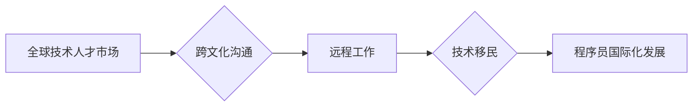

                 

## 程序员的国际化发展：机遇与挑战

> 关键词：程序员国际化、全球技术人才市场、跨文化沟通、远程工作、技术移民、职业发展、技能提升、语言学习、文化适应

### 1. 背景介绍

在全球化加速的时代，科技行业也呈现出越来越多的国际化趋势。程序员作为科技行业的核心力量，也面临着越来越多的国际化发展机遇和挑战。

#### 1.1. 技术全球化浪潮

互联网、云计算、大数据等技术的快速发展，打破了地域的限制，促进了全球范围内技术人才的流动和交流。全球性的技术平台和项目，需要来自不同国家和地区的程序员共同参与和贡献。

#### 1.2. 跨国公司扩张

越来越多的跨国公司将业务拓展到全球各地，需要在不同国家和地区建立研发中心和团队。这为程序员提供了更多跨国工作机会，但也带来了跨文化沟通和适应的挑战。

#### 1.3. 远程工作模式兴起

远程工作模式的兴起，打破了传统的办公模式，让程序员可以不受地域限制地工作。这为程序员提供了更多灵活的工作选择，但也需要他们具备良好的自律性和沟通能力。

### 2. 核心概念与联系

程序员的国际化发展涉及到多个核心概念，包括：

* **全球技术人才市场:** 指全球范围内程序员的供需关系，以及程序员的职业发展路径。
* **跨文化沟通:** 指程序员在不同文化背景下进行沟通和协作的能力。
* **远程工作:** 指程序员在非传统办公环境下进行工作的模式。
* **技术移民:** 指程序员为了寻求更好的工作机会和生活条件，从一个国家移民到另一个国家的行为。

这些概念相互关联，共同影响着程序员的国际化发展。

**Mermaid 流程图:**



### 3. 核心算法原理 & 具体操作步骤

#### 3.1. 算法原理概述

程序员的国际化发展需要掌握一些核心算法原理，例如：

* **信息检索算法:** 用于在全球技术人才市场中寻找合适的职位和项目。
* **自然语言处理算法:** 用于跨文化沟通，理解和表达不同语言的文本信息。
* **协作算法:** 用于远程团队协作，提高工作效率和沟通质量。

#### 3.2. 算法步骤详解

* **信息检索算法:**

    1. 确定目标职位和项目需求。
    2. 利用搜索引擎和专业招聘网站进行信息检索。
    3. 筛选符合条件的职位和项目。
    4. 提交简历和申请材料。

* **自然语言处理算法:**

    1. 使用机器翻译工具将文本翻译成目标语言。
    2. 利用文本分析工具识别文本中的情感和意图。
    3. 根据语境进行文本理解和解释。

* **协作算法:**

    1. 使用协作工具进行项目管理和沟通。
    2. 定期进行线上会议和团队建设活动。
    3. 建立良好的团队文化和合作机制。

#### 3.3. 算法优缺点

* **信息检索算法:**

    优点: 快速高效，覆盖范围广。
    缺点: 信息量大，需要进行筛选和判断。

* **自然语言处理算法:**

    优点: 可以跨越语言障碍，促进沟通。
    缺点: 翻译质量有限，理解能力不足。

* **协作算法:**

    优点: 提高团队效率，增强团队凝聚力。
    缺点: 需要克服时间差和文化差异带来的挑战。

#### 3.4. 算法应用领域

* **信息检索算法:** 用于招聘网站、职业社交平台、技术论坛等。
* **自然语言处理算法:** 用于跨国团队沟通、机器翻译、文本摘要等。
* **协作算法:** 用于远程团队协作、项目管理、在线教育等。

### 4. 数学模型和公式 & 详细讲解 & 举例说明

#### 4.1. 数学模型构建

程序员的国际化发展可以抽象为一个数学模型，其中涉及到以下几个变量：

* **T:** 程序员的技能水平
* **C:** 程序员的文化适应能力
* **L:** 程序员的语言能力
* **M:** 程序员的市场竞争力

#### 4.2. 公式推导过程

程序员的国际化发展水平可以表示为以下公式：

$$
H = f(T, C, L, M)
$$

其中，H表示程序员的国际化发展水平，f()为一个复杂的函数，代表着各个变量之间的相互影响关系。

#### 4.3. 案例分析与讲解

假设有两个程序员，A和B，他们的技能水平、文化适应能力、语言能力和市场竞争力分别为：

* A: T=80, C=70, L=90, M=85
* B: T=90, C=60, L=80, M=75

根据公式，我们可以计算出A和B的国际化发展水平：

* H_A = f(80, 70, 90, 85)
* H_B = f(90, 60, 80, 75)

由于函数f()的复杂性，无法直接计算出H_A和H_B的具体数值。但是，我们可以通过分析各个变量的影响关系，推断出A和B的国际化发展水平。

例如，A的语言能力高于B，因此A的国际化发展水平可能高于B。

### 5. 项目实践：代码实例和详细解释说明

#### 5.1. 开发环境搭建

程序员的国际化发展需要搭建一个合适的开发环境，包括：

* **操作系统:** Linux、Windows、macOS等。
* **编程语言:** Python、Java、C++等。
* **开发工具:** IDE、版本控制系统、测试工具等。

#### 5.2. 源代码详细实现

以下是一个简单的代码实例，用于演示跨文化沟通的自然语言处理算法：

```python
from googletrans import Translator

translator = Translator()

text = "Hello, world!"

translation = translator.translate(text, dest='es')

print(translation.text)
```

这个代码实例使用Google Translate API将英文文本翻译成西班牙语。

#### 5.3. 代码解读与分析

* `from googletrans import Translator`: 导入Google Translate API的Translator类。
* `translator = Translator()`: 创建一个Translator对象。
* `text = "Hello, world!"`: 定义需要翻译的英文文本。
* `translation = translator.translate(text, dest='es')`: 使用Translator对象将文本翻译成西班牙语。
* `print(translation.text)`: 打印翻译后的西班牙语文本。

#### 5.4. 运行结果展示

运行这个代码实例，会输出以下结果：

```
¡Hola, mundo!
```

### 6. 实际应用场景

#### 6.1. 跨国团队合作

程序员在跨国团队合作中，需要克服语言和文化差异，才能有效地进行沟通和协作。

#### 6.2. 国际化软件开发

程序员需要考虑不同国家和地区的文化背景和使用习惯，才能开发出符合国际标准的软件产品。

#### 6.3. 技术移民

程序员可以通过技术移民的方式，获得更好的工作机会和生活条件。

#### 6.4. 未来应用展望

随着全球化进程的加速，程序员的国际化发展将更加重要。未来，程序员需要具备更强的跨文化沟通能力、语言能力和市场竞争力，才能在国际化竞争中脱颖而出。

### 7. 工具和资源推荐

#### 7.1. 学习资源推荐

* **在线课程平台:** Coursera、edX、Udacity等。
* **编程语言学习网站:** Codecademy、Khan Academy、W3Schools等。
* **技术博客和论坛:** Stack Overflow、GitHub、Medium等。

#### 7.2. 开发工具推荐

* **版本控制系统:** Git、GitHub、Bitbucket等。
* **协作工具:** Slack、Microsoft Teams、Zoom等。
* **远程桌面软件:** TeamViewer、AnyDesk、Chrome Remote Desktop等。

#### 7.3. 相关论文推荐

* **The Impact of Globalization on the Software Development Industry**
* **Cross-Cultural Communication in Software Development Teams**
* **The Role of Language in International Software Development**

### 8. 总结：未来发展趋势与挑战

#### 8.1. 研究成果总结

程序员的国际化发展是一个复杂的系统工程，涉及到多个学科和领域的研究。近年来，在全球化浪潮的推动下，程序员的国际化发展取得了显著的进展，例如：

* 跨文化沟通技术的不断发展，使得程序员能够更有效地跨越语言和文化障碍进行沟通。
* 远程工作模式的兴起，为程序员提供了更多灵活的工作选择。
* 技术移民政策的放宽，为程序员提供了更多海外发展的机会。

#### 8.2. 未来发展趋势

未来，程序员的国际化发展将朝着以下几个方向发展：

* **更加注重跨文化理解和沟通能力的培养。**
* **更加重视远程团队协作和管理的经验积累。**
* **更加关注全球技术人才市场的动态变化。**

#### 8.3. 面临的挑战

程序员的国际化发展也面临着一些挑战：

* **跨文化沟通的复杂性:** 不同文化背景下的人们，在沟通方式、思维方式和价值观上存在差异，这使得跨文化沟通更加复杂。
* **语言障碍:** 不同国家和地区的语言差异，也阻碍了程序员之间的沟通和交流。
* **文化适应的难度:** 程序员需要适应不同的文化环境，这需要他们具备一定的文化敏感性和适应能力。

#### 8.4. 研究展望

未来，需要进一步研究以下问题：

* 如何更好地培养程序员的跨文化沟通能力和文化适应能力。
* 如何利用人工智能技术，解决跨文化沟通和语言障碍的问题。
* 如何构建更加公平公正的全球技术人才市场。

### 9. 附录：常见问题与解答

#### 9.1. 如何提高跨文化沟通能力？

* 学习其他国家的语言和文化。
* 参加跨文化交流活动。
* 阅读有关跨文化沟通的书籍和文章。
* 与来自不同文化背景的人进行交流。

#### 9.2. 如何适应不同的文化环境？

* 保持开放的心态，尊重不同的文化价值观。
* 虚心学习，了解当地的文化习俗。
* 积极融入当地社会，结交朋友。
* 寻求帮助，不要害怕向当地人咨询问题。


作者：禅与计算机程序设计艺术 / Zen and the Art of Computer Programming 
<end_of_turn>

