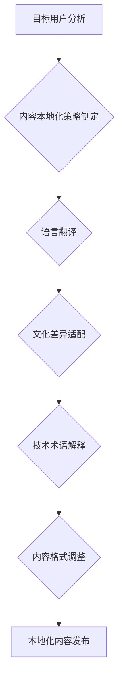

                 

## 程序员的知识付费内容本地化策略

> 关键词：知识付费、程序员、本地化、内容策略、市场营销、技术社区、文化差异

## 1. 背景介绍

近年来，随着互联网技术的快速发展和普及，知识付费行业蓬勃发展，程序员群体也成为其中重要的参与者。许多经验丰富的程序员开始通过线上平台分享技术经验、开发技能和项目案例，为其他程序员提供学习和提升的机会。然而，随着市场竞争的加剧，单纯依靠英文内容难以满足全球程序员的需求。因此，知识付费内容的本地化策略成为程序员知识付费的重要方向。

### 1.1  知识付费市场现状

知识付费市场规模持续增长，预计未来几年将保持高速发展趋势。程序员群体作为技术领域的重要力量，对技术学习和技能提升的需求旺盛，为知识付费市场提供了广阔的市场空间。

### 1.2  本地化策略的必要性

随着全球化进程的加速，不同国家和地区的程序员群体拥有不同的语言、文化背景和技术需求。单纯依靠英文内容难以满足全球程序员的需求，本地化策略可以帮助程序员知识付费内容更好地触达目标用户，提高内容的接受度和转化率。

## 2. 核心概念与联系

本地化策略是指将知识付费内容根据目标用户的语言、文化背景和技术需求进行调整和适配的过程。它涵盖了多个方面，包括语言翻译、文化差异的考虑、技术术语的解释、内容格式的调整等。

**本地化策略流程图**



## 3. 核心算法原理 & 具体操作步骤

本地化策略的实施需要结合多种算法和技术手段，例如机器翻译、自然语言处理、文化敏感度分析等。

### 3.1  算法原理概述

* **机器翻译算法:** 利用深度学习技术，将源语言文本翻译成目标语言文本。
* **自然语言处理算法:** 分析文本结构、语义和情感，帮助理解和调整内容的表达方式。
* **文化敏感度分析算法:** 识别文本中可能存在文化差异的词汇和表达方式，进行相应的调整和替换。

### 3.2  算法步骤详解

1. **目标用户分析:** 确定目标用户的语言、文化背景、技术水平和学习需求。
2. **内容本地化策略制定:** 根据目标用户分析结果，制定具体的本地化策略，包括语言翻译、文化差异适配、技术术语解释等方面。
3. **语言翻译:** 利用机器翻译算法将源语言内容翻译成目标语言。
4. **文化差异适配:** 对翻译后的内容进行文化敏感度分析，识别和替换可能存在文化差异的词汇和表达方式。
5. **技术术语解释:** 对技术术语进行解释和说明，帮助目标用户理解内容。
6. **内容格式调整:** 根据目标用户的阅读习惯和文化背景，调整内容的格式和排版。
7. **本地化内容发布:** 将本地化后的内容发布到目标用户的平台和渠道。

### 3.3  算法优缺点

* **优点:** 能够快速、高效地将知识付费内容本地化，覆盖更广泛的受众群体。
* **缺点:** 机器翻译算法的准确度和流畅度仍有待提高，文化差异的适配也需要人工干预和调整。

### 3.4  算法应用领域

* **程序员知识付费平台:** 将英文技术文档、课程和项目案例本地化，满足全球程序员的需求。
* **技术社区论坛:** 将论坛内容本地化，促进不同国家和地区的程序员交流和合作。
* **技术博客和网站:** 将技术文章和博客内容本地化，吸引更多目标用户的阅读和关注。

## 4. 数学模型和公式 & 详细讲解 & 举例说明

本地化策略的实施需要结合数学模型和公式进行量化分析和优化。例如，可以使用信息熵模型来衡量内容的本地化程度，可以使用文本相似度算法来评估翻译质量。

### 4.1  数学模型构建

**信息熵模型:**

$$H(X) = - \sum_{i=1}^{n} p(x_i) \log_2 p(x_i)$$

其中，$X$ 是一个随机变量，$x_i$ 是 $X$ 的取值，$p(x_i)$ 是 $x_i$ 的概率。

**文本相似度算法:**

* **余弦相似度:**

$$sim(A, B) = \frac{A \cdot B}{||A|| ||B||}$$

其中，$A$ 和 $B$ 是两个文本向量，$A \cdot B$ 是它们的点积，$||A||$ 和 $||B||$ 是它们的模长。

### 4.2  公式推导过程

信息熵模型的推导过程基于概率论和信息论的原理，可以参考相关书籍和论文进行详细学习。

文本相似度算法的推导过程基于向量空间模型和线性代数的原理，可以参考相关书籍和论文进行详细学习。

### 4.3  案例分析与讲解

* **信息熵模型:** 可以用来衡量不同语言版本的内容本地化程度。例如，如果一个技术文档的英文版本和中文版本的熵值相近，则说明内容的本地化程度较高。
* **文本相似度算法:** 可以用来评估机器翻译的质量。例如，可以将机器翻译后的文本与原版文本进行比较，计算它们的余弦相似度。

## 5. 项目实践：代码实例和详细解释说明

本地化策略的实施需要结合实际项目进行实践和测试。以下是一个简单的代码实例，演示了如何使用机器翻译算法将英文文本翻译成中文。

### 5.1  开发环境搭建

* Python 3.x 环境
* 安装 `googletrans` 库

```bash
pip install googletrans
```

### 5.2  源代码详细实现

```python
from googletrans import Translator

translator = Translator()

# 英文文本
text = "Hello, world!"

# 将英文文本翻译成中文
translation = translator.translate(text, dest='zh-CN')

# 打印翻译结果
print(translation.text)
```

### 5.3  代码解读与分析

* `Translator()` 创建一个翻译对象。
* `translator.translate(text, dest='zh-CN')` 使用 Google Translate API 将英文文本翻译成中文。
* `translation.text` 获取翻译后的中文文本。

### 5.4  运行结果展示

```
你好，世界！
```

## 6. 实际应用场景

本地化策略在程序员知识付费领域有广泛的应用场景，例如：

### 6.1  在线课程平台

将在线课程内容本地化，满足不同国家和地区的程序员学习需求。

### 6.2  技术文档网站

将技术文档和教程内容本地化，方便全球程序员阅读和理解。

### 6.3  技术博客和论坛

将技术博客文章和论坛内容本地化，促进不同国家和地区的程序员交流和合作。

### 6.4  未来应用展望

随着人工智能技术的不断发展，本地化策略将更加智能化和自动化。例如，可以使用深度学习算法自动识别和翻译文化差异，可以使用自然语言生成技术自动生成本地化内容。

## 7. 工具和资源推荐

### 7.1  学习资源推荐

* **机器翻译算法:**
    * 《统计机器翻译》
    * 《深度学习》
* **自然语言处理算法:**
    * 《自然语言处理入门》
    * 《深度学习与自然语言处理》
* **文化敏感度分析:**
    * 《跨文化沟通》
    * 《文化差异与管理》

### 7.2  开发工具推荐

* **机器翻译工具:**
    * Google Translate API
    * Microsoft Translator API
* **自然语言处理工具:**
    * NLTK
    * SpaCy
* **文本相似度计算工具:**
    * scikit-learn

### 7.3  相关论文推荐

* **机器翻译:**
    * "Neural Machine Translation by Jointly Learning to Align and Translate"
    * "Attention Is All You Need"
* **自然语言处理:**
    * "BERT: Pre-training of Deep Bidirectional Transformers for Language Understanding"
    * "GPT-3: Language Models are Few-Shot Learners"
* **文化敏感度分析:**
    * "A Survey of Cross-Cultural Sentiment Analysis"
    * "Cultural Bias in Machine Learning"

## 8. 总结：未来发展趋势与挑战

本地化策略是程序员知识付费内容走向全球化的重要方向。随着人工智能技术的不断发展，本地化策略将更加智能化和自动化，能够更好地满足全球程序员的需求。

### 8.1  研究成果总结

* 机器翻译算法的准确度和流畅度不断提高。
* 自然语言处理算法能够更好地理解和处理文本中的文化差异。
* 文本相似度算法能够更准确地评估翻译质量。

### 8.2  未来发展趋势

* 更智能化的本地化策略，例如使用深度学习算法自动识别和翻译文化差异。
* 更个性化的本地化内容，例如根据用户的学习习惯和偏好进行内容定制。
* 更广泛的本地化应用场景，例如将本地化策略应用于程序员招聘、技术支持等领域。

### 8.3  面临的挑战

* 文化差异的复杂性，需要更深入的理解和研究。
* 语言的多样性，需要支持更多语言的本地化。
* 数据量的不足，需要收集和积累更多本地化数据。

### 8.4  研究展望

* 研究更先进的机器翻译算法和自然语言处理算法，提高本地化策略的准确性和效率。
* 建立更完善的本地化数据平台，积累和共享更多本地化数据。
* 探索更个性化和智能化的本地化策略，满足不同用户需求。


## 9. 附录：常见问题与解答

### 9.1  Q1: 如何评估本地化内容的质量？

**A1:** 可以使用多种方法评估本地化内容的质量，例如：

* **专业翻译人员的评估:** 由专业翻译人员对本地化内容进行审核和评估。
* **用户反馈:** 收集用户对本地化内容的反馈意见，例如流畅度、准确度、文化敏感度等。
* **文本相似度算法:** 使用文本相似度算法比较本地化内容与原版内容的相似度。

### 9.2  Q2: 如何选择合适的机器翻译工具？

**A2:** 选择机器翻译工具时需要考虑以下因素：

* **支持的语言:** 确保工具支持目标语言。
* **翻译质量:** 选择翻译质量高的工具。
* **价格:** 选择价格合理的工具。
* **功能:** 选择功能满足需求的工具。

### 9.3  Q3: 如何处理文化差异带来的本地化挑战？

**A3:** 处理文化差异带来的本地化挑战需要以下步骤：

* **深入了解目标用户的文化背景:** 了解目标用户的价值观、习俗、语言习惯等。
* **识别和替换文化敏感词汇:** 识别可能存在文化差异的词汇，进行相应的替换和调整。
* **调整内容表达方式:** 调整内容的表达方式，使其符合目标用户的文化习惯。
* **进行文化敏感度测试:** 对本地化内容进行文化敏感度测试，确保内容不会造成误解或冒犯。


作者：禅与计算机程序设计艺术 / Zen and the Art of Computer Programming 
<end_of_turn>

