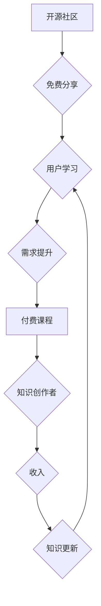

                 

## 程序员知识付费：从免费到收费

> 关键词：程序员知识付费、开源社区、知识产权、商业模式、技术博客、在线课程、付费内容、技术生态

### 1. 背景介绍

互联网时代，信息爆炸式增长，程序员作为数字时代的核心力量，面临着前所未有的学习压力和知识更新速度。传统的学习模式已经难以满足程序员不断提升技能的需求。知识付费作为一种新型的知识传播模式，逐渐成为程序员学习的重要途径。

从早期开源社区的免费分享到如今付费课程、技术博客、在线平台的兴起，程序员知识付费经历了从免费到收费的演变。这种转变反映了程序员对高质量知识的需求不断提升，以及知识创作者寻求可持续发展模式的探索。

### 2. 核心概念与联系

程序员知识付费的核心概念包括：

* **知识产权：** 程序员的知识和技能是其重要的知识产权，可以通过付费的方式进行保护和利用。
* **价值交换：**  付费模式建立在价值交换的基础上，程序员提供高质量的知识和服务，用户通过付费获得相应的价值。
* **商业模式：** 程序员知识付费涉及多种商业模式，例如在线课程、技术博客订阅、咨询服务等。

**Mermaid 流程图：程序员知识付费模式**



### 3. 核心算法原理 & 具体操作步骤

#### 3.1  算法原理概述

程序员知识付费的成功依赖于算法原理的应用，例如推荐算法、内容分发算法、用户画像算法等。这些算法可以帮助平台精准匹配用户需求，推荐合适的知识付费内容，提高用户转化率。

#### 3.2  算法步骤详解

* **用户画像算法：** 通过分析用户的学习行为、兴趣偏好、技能水平等数据，构建用户画像，以便精准推荐相关知识付费内容。
* **推荐算法：** 基于用户画像和知识内容的标签、评分等信息，使用协同过滤、内容过滤等算法，推荐用户可能感兴趣的付费课程或技术博客。
* **内容分发算法：** 根据用户行为、平台规则等因素，优化知识付费内容的展示顺序和位置，提高内容曝光率和用户点击率。

#### 3.3  算法优缺点

* **优点：** 提高用户体验，精准推荐，提升知识付费转化率。
* **缺点：** 需要大量数据支持，算法模型需要不断优化，存在算法偏差和数据安全问题。

#### 3.4  算法应用领域

* **在线教育平台：** 推荐课程、个性化学习路径、用户行为分析等。
* **技术博客平台：** 推荐文章、用户订阅、内容分发等。
* **知识付费社区：** 用户匹配、内容推荐、社区运营等。

### 4. 数学模型和公式 & 详细讲解 & 举例说明

#### 4.1  数学模型构建

用户行为预测模型可以采用马尔科夫链模型，预测用户未来学习行为。

#### 4.2  公式推导过程

状态转移概率矩阵 P：

$$
P_{ij} = P(s_t = j | s_{t-1} = i)
$$

其中：

* $s_t$ 表示用户在时间 t 的状态。
* $s_{t-1}$ 表示用户在时间 t-1 的状态。
* $P_{ij}$ 表示从状态 i 转移到状态 j 的概率。

#### 4.3  案例分析与讲解

假设用户学习状态有三种：未学习、学习中、已完成。

状态转移概率矩阵 P：

$$
P = \begin{bmatrix}
0.7 & 0.2 & 0.1 \\
0.1 & 0.6 & 0.3 \\
0 & 0.2 & 0.8
\end{bmatrix}
$$

该矩阵表示：

* 未学习状态的用户，有 70% 的概率保持未学习状态，20% 的概率进入学习中状态，10% 的概率进入已完成状态。
* 学习中状态的用户，有 10% 的概率回到未学习状态，60% 的概率保持学习中状态，30% 的概率进入已完成状态。
* 已完成状态的用户，有 20% 的概率回到学习中状态，80% 的概率保持已完成状态。

### 5. 项目实践：代码实例和详细解释说明

#### 5.1  开发环境搭建

使用 Python 语言和相关库，例如 TensorFlow、PyTorch 等，搭建机器学习模型开发环境。

#### 5.2  源代码详细实现

```python
import tensorflow as tf

# 定义模型结构
model = tf.keras.models.Sequential([
    tf.keras.layers.Dense(64, activation='relu', input_shape=(10,)),
    tf.keras.layers.Dense(32, activation='relu'),
    tf.keras.layers.Dense(3, activation='softmax')
])

# 编译模型
model.compile(optimizer='adam',
              loss='sparse_categorical_crossentropy',
              metrics=['accuracy'])

# 训练模型
model.fit(x_train, y_train, epochs=10)

# 评估模型
loss, accuracy = model.evaluate(x_test, y_test)
print('Loss:', loss)
print('Accuracy:', accuracy)
```

#### 5.3  代码解读与分析

* 使用 TensorFlow 库构建深度学习模型。
* 模型结构包括三个全连接层，激活函数为 ReLU 和 Softmax。
* 使用 Adam 优化器，交叉熵损失函数，并使用准确率作为评估指标。
* 训练模型 10 个 epochs，并评估模型在测试集上的性能。

#### 5.4  运行结果展示

训练完成后，打印模型的损失值和准确率。

### 6. 实际应用场景

#### 6.1  在线教育平台

* 推荐个性化学习路径，提高用户学习效率。
* 预测用户学习进度，及时提供学习支持。
* 分析用户学习行为，优化课程内容和教学方法。

#### 6.2  技术博客平台

* 推荐相关技术文章，帮助用户快速获取所需知识。
* 预测用户阅读兴趣，推送个性化内容。
* 分析用户阅读行为，优化文章内容和排版。

#### 6.3  知识付费社区

* 匹配用户和知识创作者，促进知识交易。
* 推荐优质知识付费内容，提高用户付费意愿。
* 分析用户付费行为，优化社区运营策略。

#### 6.4  未来应用展望

随着人工智能技术的不断发展，程序员知识付费将更加智能化、个性化和高效化。

* **更精准的推荐：** 利用深度学习算法，更加精准地推荐用户感兴趣的知识付费内容。
* **更个性化的学习：** 根据用户的学习风格和进度，定制个性化的学习路径和学习体验。
* **更丰富的知识形式：** 除了文字和视频，将更多形式的知识内容融入到付费模式中，例如音频、游戏、互动练习等。

### 7. 工具和资源推荐

#### 7.1  学习资源推荐

* **在线学习平台：** Coursera、Udemy、edX 等。
* **技术博客平台：** Medium、Hacker News、Dev.to 等。
* **开源社区：** GitHub、Stack Overflow 等。

#### 7.2  开发工具推荐

* **机器学习库：** TensorFlow、PyTorch、Scikit-learn 等。
* **数据分析工具：** Pandas、NumPy、Matplotlib 等。
* **代码编辑器：** VS Code、Sublime Text、Atom 等。

#### 7.3  相关论文推荐

* **推荐系统：** "Collaborative Filtering for Implicit Feedback Datasets"
* **深度学习：** "Deep Learning"
* **自然语言处理：** "BERT: Pre-training of Deep Bidirectional Transformers for Language Understanding"

### 8. 总结：未来发展趋势与挑战

#### 8.1  研究成果总结

程序员知识付费模式已经取得了显著的成果，为程序员学习提供了新的途径，也为知识创作者提供了新的商业模式。

#### 8.2  未来发展趋势

* **智能化：** 利用人工智能技术，实现更加智能化的知识推荐、个性化学习和内容创作。
* **多元化：** 探索更多形式的知识付费内容，例如音频、游戏、互动练习等。
* **全球化：** 打破地域限制，构建全球化的程序员知识付费生态。

#### 8.3  面临的挑战

* **知识质量控制：** 确保付费内容的质量和可靠性。
* **知识产权保护：** 维护知识创作者的知识产权。
* **用户隐私保护：** 妥善处理用户数据，保障用户隐私安全。

#### 8.4  研究展望

未来，程序员知识付费将继续朝着智能化、多元化、全球化的方向发展，并不断解决面临的挑战，为程序员学习和知识创作者发展提供更加优质的服务。

### 9. 附录：常见问题与解答

* **如何选择合适的知识付费内容？**

建议根据自己的学习目标、技能水平和兴趣爱好选择。可以参考平台的推荐、用户评价等信息。

* **如何保护知识产权？**

知识创作者可以采取以下措施保护知识产权：

* 使用版权声明和知识产权许可协议。
* 注册商标和专利。
* 利用技术手段进行内容加密和防盗版。

* **如何确保用户隐私安全？**

平台应该采取以下措施保障用户隐私安全：

* 明确用户隐私政策，获得用户同意。
* 加密用户数据，防止数据泄露。
* 不滥用用户数据，尊重用户隐私。


作者：禅与计算机程序设计艺术 / Zen and the Art of Computer Programming 
<end_of_turn>

