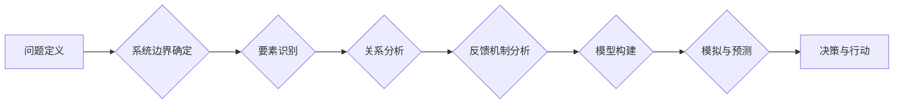

                 

## 系统思考在战略规划中的应用

> 关键词：系统思考、战略规划、复杂系统、反馈机制、循环因果关系、系统边界、系统模型、系统优化

## 1. 背景介绍

在当今瞬息万变的商业环境中，企业面临着前所未有的挑战和机遇。传统的线性思维模式已经难以应对复杂、动态的市场环境。系统思考作为一种全新的思维方式，为企业战略规划提供了新的视角和方法。

系统思考强调的是整体与部分的关系，认为任何事物都是一个相互关联、相互影响的系统。它强调理解系统的整体结构、相互作用和反馈机制，而不是仅仅关注个别要素。

## 2. 核心概念与联系

系统思考的核心概念包括：

* **系统边界:**  定义系统包含哪些要素，以及与外部环境的交互方式。
* **循环因果关系:** 系统中的要素之间存在着相互影响、相互制约的循环因果关系。
* **反馈机制:** 系统中的变化会引发一系列的反馈，这些反馈会影响系统的未来状态。
* ** emergent behavior:** 系统整体的行为可能无法通过简单地分析个体要素来预测。

**系统思考流程图:**



## 3. 核心算法原理 & 具体操作步骤

系统思考本身不是一个算法，而是一种思维方式。它没有固定的算法步骤，但可以结合其他方法，例如系统动力学、复杂网络分析等，进行更深入的分析和建模。

### 3.1  算法原理概述

系统动力学是一种用于模拟和分析复杂系统的数学模型。它通过构建系统中的变量和关系，模拟系统的动态演化过程，并预测系统的未来状态。

### 3.2  算法步骤详解

1. **问题定义:** 明确需要解决的问题，并将其转化为系统思考的框架。
2. **系统边界确定:** 定义系统的范围，包括哪些要素在系统内，哪些要素在系统外。
3. **要素识别:** 识别系统中的关键要素，例如变量、参数、反馈机制等。
4. **关系分析:** 分析系统中要素之间的关系，例如因果关系、依赖关系等。
5. **模型构建:** 使用系统动力学工具，构建系统的数学模型，并进行参数化。
6. **模拟与预测:** 使用模型进行模拟，预测系统的未来状态，并分析不同因素的影响。
7. **决策与行动:** 根据模拟结果，制定相应的决策和行动方案。

### 3.3  算法优缺点

**优点:**

* 可以模拟复杂系统的动态演化过程。
* 可以分析不同因素的影响，并预测系统的未来状态。
* 可以帮助企业制定更有效的战略决策。

**缺点:**

* 模型构建需要专业知识和经验。
* 模型的准确性取决于数据的质量和模型的复杂度。
* 模拟结果只能作为参考，不能完全预测未来的发展。

### 3.4  算法应用领域

系统动力学广泛应用于各个领域，例如：

* **商业战略规划:** 分析市场竞争、客户行为、供应链等复杂系统，制定更有效的战略决策。
* **城市规划:** 分析城市人口流动、交通流量、资源分配等复杂系统，制定更合理的城市规划方案。
* **环境保护:** 分析生态系统、气候变化、污染物扩散等复杂系统，制定更有效的环境保护策略。

## 4. 数学模型和公式 & 详细讲解 & 举例说明

系统动力学模型通常使用差分方程来描述系统变量的变化趋势。

### 4.1  数学模型构建

一个简单的系统动力学模型可以描述人口增长问题。假设人口增长率与人口数量成正比，则可以建立以下差分方程：

$$
\frac{dP}{dt} = rP
$$

其中：

* $P$ 表示人口数量
* $t$ 表示时间
* $r$ 表示人口增长率

### 4.2  公式推导过程

该方程的解为：

$$
P(t) = P_0e^{rt}
$$

其中：

* $P_0$ 表示初始人口数量

### 4.3  案例分析与讲解

假设初始人口数量为1000人，人口增长率为0.02，则人口数量随时间的变化趋势为：

$$
P(t) = 1000e^{0.02t}
$$

我们可以通过该公式计算不同时间点的预测人口数量。例如，在10年后，人口数量将为：

$$
P(10) = 1000e^{0.02 \times 10} \approx 1221人
$$

## 5. 项目实践：代码实例和详细解释说明

以下是一个使用Python语言实现简单系统动力学模型的代码实例：

### 5.1  开发环境搭建

需要安装Python语言和相关库，例如NumPy、SciPy等。

### 5.2  源代码详细实现

```python
import numpy as np
from scipy.integrate import odeint

# 定义系统动力学模型
def population_growth(P, t, r):
    return r * P

# 设置初始条件
P0 = 1000
r = 0.02

# 设置时间范围
t = np.linspace(0, 10, 100)

# 使用odeint函数求解微分方程
P = odeint(population_growth, P0, t, args=(r,))

# 绘制人口数量随时间的变化曲线
import matplotlib.pyplot as plt
plt.plot(t, P)
plt.xlabel('时间 (年)')
plt.ylabel('人口数量')
plt.title('人口增长模型')
plt.show()
```

### 5.3  代码解读与分析

该代码首先定义了一个`population_growth`函数，该函数描述了人口增长模型。然后，设置初始人口数量、人口增长率和时间范围。使用`odeint`函数求解微分方程，得到不同时间点的预测人口数量。最后，使用`matplotlib`库绘制人口数量随时间的变化曲线。

### 5.4  运行结果展示

运行该代码后，将生成一个人口数量随时间的变化曲线，曲线显示人口数量随着时间的推移呈指数增长趋势。

## 6. 实际应用场景

系统思考在战略规划中的应用场景非常广泛，例如：

* **市场分析:** 通过系统思考分析市场竞争格局、客户需求、产品生命周期等，制定更有效的市场营销策略。
* **产品开发:** 通过系统思考分析产品设计、生产流程、供应链管理等，开发更符合市场需求的产品。
* **组织管理:** 通过系统思考分析组织结构、沟通机制、激励机制等，构建更有效的组织管理体系。
* **风险管理:** 通过系统思考分析潜在风险因素、风险传播路径、风险应对措施等，制定更有效的风险管理策略。

### 6.4  未来应用展望

随着人工智能、大数据等技术的快速发展，系统思考在战略规划中的应用将更加广泛和深入。例如，可以利用人工智能技术构建更复杂的系统模型，并进行更精准的预测和分析。

## 7. 工具和资源推荐

### 7.1  学习资源推荐

* **书籍:**
    * 《系统思考》 - Peter Senge
    * 《第五项修炼》 - Jim Collins
    * 《复杂系统》 - Melanie Mitchell
* **在线课程:**
    * Coursera: Systems Thinking
    * edX: Systems Thinking for Decision Making

### 7.2  开发工具推荐

* **Vensim:** 系统动力学建模软件
* **Stella Architect:** 系统动力学建模软件
* **AnyLogic:** 多种建模方法的软件

### 7.3  相关论文推荐

* **The Fifth Discipline: The Art and Practice of the Learning Organization** - Peter Senge
* **Thinking in Systems: A Primer** - Donella Meadows
* **Complexity: A Guided Tour** - Melanie Mitchell

## 8. 总结：未来发展趋势与挑战

系统思考为企业战略规划提供了新的视角和方法，但它也面临着一些挑战。

### 8.1  研究成果总结

系统思考的研究成果表明，它可以帮助企业更好地理解复杂系统，并制定更有效的战略决策。

### 8.2  未来发展趋势

未来，系统思考的研究将更加注重以下几个方面：

* **人工智能与系统思考的结合:** 利用人工智能技术构建更复杂的系统模型，并进行更精准的预测和分析。
* **系统思考的应用场景扩展:** 将系统思考应用到更多领域，例如社会治理、环境保护等。
* **系统思考的教学方法创新:** 开发更有效的系统思考教学方法，提高人们对系统思考的理解和应用能力。

### 8.3  面临的挑战

系统思考的应用也面临着一些挑战，例如：

* **模型构建的复杂性:** 构建复杂的系统模型需要专业知识和经验。
* **数据质量问题:** 模型的准确性取决于数据的质量。
* **解释性和可操作性:** 系统思考模型的解释性和可操作性需要进一步提高。

### 8.4  研究展望

未来，需要进一步研究系统思考的理论基础、应用方法和评估指标，使其更好地服务于企业战略规划和社会发展。

## 9. 附录：常见问题与解答

**问题:** 系统思考与传统线性思维模式有什么区别？

**答案:** 系统思考强调整体与部分的关系，认为任何事物都是一个相互关联、相互影响的系统。而传统线性思维模式则只关注个别要素，忽略了系统之间的相互作用。

**问题:** 如何应用系统思考到实际的战略规划中？

**答案:** 可以通过以下步骤应用系统思考到实际的战略规划中：

1. 明确需要解决的问题。
2. 定义系统的范围和边界。
3. 识别系统中的关键要素和关系。
4. 建立系统模型，并进行模拟和预测。
5. 根据模拟结果，制定相应的战略决策。


作者：禅与计算机程序设计艺术 / Zen and the Art of Computer Programming<end_of_turn>

