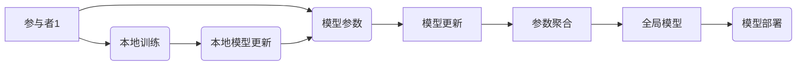

                 

## 联邦学习：隐私保护下的分布式机器学习

> 关键词：联邦学习、分布式机器学习、隐私保护、模型训练、数据安全、模型联邦

### 1. 背景介绍

随着人工智能技术的飞速发展，机器学习模型在各个领域得到了广泛应用，例如图像识别、自然语言处理、推荐系统等。然而，训练这些模型通常需要大量的训练数据，而这些数据往往分散在不同的机构或用户手中。传统的集中式机器学习模型训练方式需要将所有数据集中到一个中心服务器上进行训练，这带来了严重的隐私泄露风险。

联邦学习（Federated Learning，FL）应运而生，它是一种分布式机器学习的训练方法，旨在解决数据隐私泄露问题。在联邦学习中，模型参数在参与者之间进行迭代更新，而训练数据始终保持在本地设备上，从未离开过其原始位置。这使得联邦学习能够在保护数据隐私的同时，实现高效的模型训练。

### 2. 核心概念与联系

#### 2.1 核心概念

* **分布式机器学习:** 将机器学习模型的训练任务分解到多个设备或节点上进行，每个节点处理一部分数据并更新模型参数，最终将所有节点的更新结果聚合起来得到全局模型。
* **联邦学习:** 一种特殊的分布式机器学习方法，其核心特点是训练数据始终保持在本地设备上，模型参数在参与者之间进行迭代更新。
* **参与者:** 在联邦学习中，每个拥有训练数据的设备或机构都称为参与者。
* **模型参数:** 机器学习模型的训练结果，包含模型的权重和偏置等信息。

#### 2.2 架构



**图 1：联邦学习架构**

### 3. 核心算法原理 & 具体操作步骤

#### 3.1 算法原理概述

联邦学习的核心思想是将模型参数进行迭代更新，而训练数据始终保持在本地设备上。具体来说，联邦学习算法通常包含以下步骤：

1. **初始化:** 将一个初始模型参数分配给所有参与者。
2. **本地训练:** 每个参与者使用其本地数据对模型参数进行训练，并得到一个更新后的模型参数。
3. **参数聚合:** 所有参与者的更新后的模型参数被聚合起来，得到一个全局模型参数。
4. **模型更新:** 全局模型参数被广播到所有参与者，作为下一轮训练的初始模型参数。
5. **重复步骤 2-4:** 直到模型收敛或达到预设的训练轮数。

#### 3.2 算法步骤详解

1. **模型初始化:** 选择一个合适的初始模型，并将其参数分配给所有参与者。
2. **本地训练:** 每个参与者使用其本地数据对模型参数进行训练，并计算出模型参数的梯度。
3. **参数聚合:** 每个参与者将其本地计算出的梯度发送到一个中央服务器，服务器将所有梯度进行平均或加权平均，得到全局梯度。
4. **模型更新:** 全局梯度被用于更新全局模型参数。
5. **模型广播:** 更新后的全局模型参数被广播到所有参与者。
6. **重复步骤 2-5:** 直到模型收敛或达到预设的训练轮数。

#### 3.3 算法优缺点

**优点:**

* **隐私保护:** 训练数据始终保持在本地设备上，不会被上传到中央服务器，有效保护了数据隐私。
* **数据分散:** 可以利用分布在多个设备上的数据进行训练，提高模型的训练效率和准确性。
* **可扩展性:** 可以轻松扩展到更多的参与者和设备，适应大规模数据训练的需求。

**缺点:**

* **通信开销:** 每个参与者需要将模型参数和梯度发送到中央服务器，这会带来一定的通信开销。
* **数据不平衡:** 不同参与者的数据分布可能不均匀，这可能会导致模型训练不均衡。
* **安全风险:** 中央服务器可能会成为攻击的目标，需要采取相应的安全措施保护模型参数和梯度数据。

#### 3.4 算法应用领域

联邦学习在医疗保健、金融、物联网等领域具有广泛的应用前景，例如：

* **医疗诊断:** 利用多个医院的患者数据进行模型训练，提高疾病诊断的准确性。
* **个性化推荐:** 利用用户的浏览历史和购买记录进行模型训练，提供个性化的商品推荐。
* **智能家居:** 利用多个智能设备的数据进行模型训练，实现更智能的家庭自动化控制。

### 4. 数学模型和公式 & 详细讲解 & 举例说明

#### 4.1 数学模型构建

在联邦学习中，每个参与者 $i$ 拥有一个本地数据集 $D_i$，模型参数 $w_i$。全局模型参数 $w$ 是所有参与者模型参数的加权平均。

#### 4.2 公式推导过程

假设每个参与者 $i$ 的本地模型参数更新公式为：

$$w_i^{t+1} = w_i^t - \eta \nabla_w L(w_i^t, D_i)$$

其中：

* $w_i^t$ 是参与者 $i$ 在第 $t$ 轮训练的模型参数。
* $\eta$ 是学习率。
* $\nabla_w L(w_i^t, D_i)$ 是参与者 $i$ 在第 $t$ 轮训练的损失函数 $L$ 对模型参数 $w_i^t$ 的梯度。

全局模型参数更新公式为：

$$w^{t+1} = \frac{1}{N} \sum_{i=1}^{N} w_i^{t+1}$$

其中：

* $N$ 是参与者的总数。

#### 4.3 案例分析与讲解

假设有两个参与者，每个参与者拥有 100 个样本的数据集。学习率 $\eta = 0.1$。

* 第 1 轮训练：每个参与者使用其本地数据训练模型，并计算出模型参数的梯度。
* 参数聚合：两个参与者的梯度被平均，得到全局梯度。
* 模型更新：全局梯度被用于更新全局模型参数。
* 第 2 轮训练：每个参与者使用更新后的全局模型参数和其本地数据进行训练，并计算出模型参数的梯度。
* 参数聚合：两个参与者的梯度被平均，得到全局梯度。
* 模型更新：全局梯度被用于更新全局模型参数。

重复上述步骤，直到模型收敛或达到预设的训练轮数。

### 5. 项目实践：代码实例和详细解释说明

#### 5.1 开发环境搭建

* Python 3.6+
* TensorFlow 或 PyTorch
* 必要的库，例如 numpy、pandas、scikit-learn 等

#### 5.2 源代码详细实现

```python
# 参与者类
class Participant:
    def __init__(self, data, model):
        self.data = data
        self.model = model

    def train(self):
        # 使用本地数据训练模型
        # ...
        return self.model.parameters()

# 服务器类
class Server:
    def __init__(self):
        self.participants = []

    def aggregate_parameters(self):
        # 收集所有参与者的模型参数
        # ...
        return aggregated_parameters

    def update_global_model(self, aggregated_parameters):
        # 更新全局模型参数
        # ...

# 主程序
if __name__ == "__main__":
    # 初始化参与者和服务器
    # ...

    # 训练循环
    for t in range(num_rounds):
        # 参与者本地训练
        for participant in participants:
            updated_parameters = participant.train()

        # 参数聚合
        aggregated_parameters = server.aggregate_parameters()

        # 更新全局模型
        server.update_global_model(aggregated_parameters)

        # ...
```

#### 5.3 代码解读与分析

* 参与者类负责训练模型并返回模型参数。
* 服务器类负责收集参与者的模型参数，聚合参数，并更新全局模型参数。
* 主程序负责初始化参与者和服务器，并执行训练循环。

#### 5.4 运行结果展示

训练结果可以包括模型的准确率、损失函数值等指标。

### 6. 实际应用场景

#### 6.1 医疗保健

* **疾病诊断:** 利用多个医院的患者数据进行模型训练，提高疾病诊断的准确性。
* **个性化治疗:** 根据患者的基因信息和病史，训练模型为患者提供个性化的治疗方案。

#### 6.2 金融

* **欺诈检测:** 利用多个金融机构的交易数据进行模型训练，识别异常交易并预防欺诈行为。
* **信用评分:** 利用多个金融机构的客户数据进行模型训练，为客户提供更准确的信用评分。

#### 6.3 物联网

* **智能家居:** 利用多个智能设备的数据进行模型训练，实现更智能的家庭自动化控制。
* **工业监控:** 利用多个传感器的数据进行模型训练，监测设备运行状态并预测故障。

#### 6.4 未来应用展望

随着联邦学习技术的不断发展，其应用场景将会更加广泛，例如：

* **自动驾驶:** 利用多个车辆的数据进行模型训练，提高自动驾驶系统的安全性。
* **语音识别:** 利用多个用户的语音数据进行模型训练，提高语音识别的准确性。
* **自然语言处理:** 利用多个文本数据进行模型训练，提高自然语言处理任务的性能。

### 7. 工具和资源推荐

#### 7.1 学习资源推荐

* **论文:**
    * McMahan, H. B., Moore, E., Ramage, D., Hampson, S., & y Arcas, B. A. (2017). Communication-efficient learning of deep networks from decentralized data. In *Proceedings of the 2017 ACM International Conference on Learning Representations* (pp. 1-16).
    * Kairouz, P., McMahan, H. B., Avent, B., Bellet, A., Bennis, M., Bhagoji, A. N., ... & Zhang, H. (2020). Advances and open problems in federated learning. *arXiv preprint arXiv:2006.02377*.
* **书籍:**
    * *Federated Learning: Collaborative Machine Learning Without Centralized Training* by  H. Brendan McMahan

#### 7.2 开发工具推荐

* **TensorFlow Federated:** https://www.tensorflow.org/federated
* **PySyft:** https://www.openmined.org/

#### 7.3 相关论文推荐

* **Federated Learning: Strategies for Improving Communication Efficiency**
* **Federated Learning with Heterogeneous Data**
* **Privacy-Preserving Machine Learning: A Survey**

### 8. 总结：未来发展趋势与挑战

#### 8.1 研究成果总结

联邦学习在隐私保护、数据分散、可扩展性等方面具有显著优势，为分布式机器学习提供了新的解决方案。近年来，联邦学习的研究取得了快速进展，在算法、系统架构、安全机制等方面取得了重要突破。

#### 8.2 未来发展趋势

* **提高效率:** 降低通信开销、加速模型训练速度。
* **增强鲁棒性:** 应对数据不平衡、模型攻击等挑战。
* **拓展应用场景:** 将联邦学习应用于更多领域，例如自动驾驶、语音识别等。
* **完善安全机制:** 加强数据隐私保护、防止模型参数泄露。

#### 8.3 面临的挑战

* **数据异构性:** 不同参与者的数据分布可能不均匀，导致模型训练不均衡。
* **通信成本:** 联邦学习需要频繁地传输模型参数和梯度，这会带来一定的通信成本。
* **安全风险:** 中央服务器可能会成为攻击的目标，需要采取相应的安全措施保护模型参数和梯度数据。
* **标准化问题:** 目前联邦学习缺乏统一的标准和规范，这制约了其应用推广。

#### 8.4 研究展望

未来，联邦学习的研究将继续朝着提高效率、增强鲁棒性、拓展应用场景、完善安全机制等方向发展。同时，还需要解决数据异构性、通信成本、安全风险等挑战，推动联邦学习技术走向成熟。

### 9. 附录：常见问题与解答

* **什么是联邦学习？**

联邦学习是一种分布式机器学习方法，其核心思想是将模型参数进行迭代更新，而训练数据始终保持在本地设备上，有效保护了数据隐私。

* **联邦学习的优势是什么？**

* 隐私保护: 训练数据始终保持在本地设备上，不会被上传到中央服务器。
* 数据分散: 可以利用分布在多个设备上的数据进行训练，提高模型的训练效率和准确性。
* 可扩展性: 可以轻松扩展到更多的参与者和设备，适应大规模数据训练的需求。

* **联邦学习的缺点是什么？**

* 通信开销: 每个参与者需要将模型参数和梯度发送到中央服务器，这会带来一定的通信开销。
* 数据不平衡: 不同参与者的数据分布可能不均匀，这可能会导致模型训练不均衡。
* 安全风险: 中央服务器可能会成为攻击的目标，需要采取相应的安全措施保护模型参数和梯度数据。


作者：禅与计算机程序设计艺术 / Zen and the Art of Computer Programming 
<end_of_turn>

