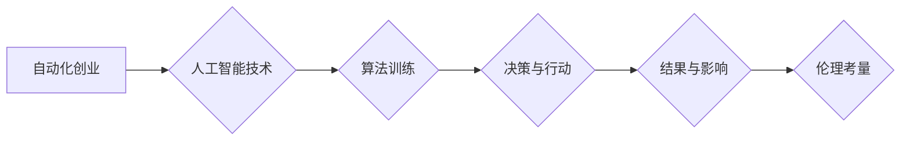

                 

## 自动化创业中的人工智能伦理考量

> 关键词：人工智能、自动化创业、伦理考量、算法偏见、数据隐私、透明度、可解释性、责任

## 1. 背景介绍

人工智能（AI）正以惊人的速度发展，其应用领域不断扩展，从医疗保健到金融，再到制造业，无处不在。在创业领域，AI 正在催生新的商业模式和颠覆传统的行业。自动化创业，即利用 AI 技术自动完成创业流程的各个环节，正成为一个炙手可热的趋势。然而，随着 AI 技术的普及，其潜在的伦理问题也日益凸显。

自动化创业的优势显而易见：

* **提高效率:** AI 可以自动完成重复性任务，例如市场调研、客户服务和数据分析，从而提高创业效率。
* **降低成本:** 通过自动化流程，创业公司可以节省人力成本和运营成本。
* **个性化体验:** AI 可以根据用户的需求和偏好提供个性化的产品和服务，提升用户体验。

然而，自动化创业也带来了一些伦理挑战：

* **算法偏见:** AI 算法的训练数据可能包含社会偏见，导致算法输出结果存在偏见，从而加剧社会不平等。
* **数据隐私:** AI 依赖于大量数据进行训练和运行，这可能会侵犯用户的隐私权。
* **透明度和可解释性:** 许多 AI 算法过于复杂，其决策过程难以理解，这使得其结果难以被解释和监督。
* **责任归属:** 当 AI 系统导致负面后果时，责任应该归咎于谁？

## 2. 核心概念与联系

### 2.1  自动化创业

自动化创业是指利用人工智能技术自动完成创业流程的各个环节，包括市场调研、产品开发、营销推广、客户服务等。

### 2.2  人工智能伦理

人工智能伦理是指在人工智能技术发展和应用过程中，需要遵循的道德准则和社会规范。

### 2.3  核心概念联系

自动化创业和人工智能伦理是密不可分的。

**Mermaid 流程图:**



## 3. 核心算法原理 & 具体操作步骤

### 3.1  算法原理概述

自动化创业中常用的 AI 算法包括机器学习、深度学习、自然语言处理等。这些算法通过学习数据模式，自动完成各种任务。例如，机器学习算法可以用于预测市场趋势、推荐产品、识别客户需求；深度学习算法可以用于图像识别、语音识别、文本生成；自然语言处理算法可以用于聊天机器人、文本摘要、机器翻译等。

### 3.2  算法步骤详解

以机器学习算法为例，其基本步骤包括：

1. **数据收集和预处理:** 收集相关数据，并进行清洗、转换、特征提取等预处理工作。
2. **模型选择:** 根据任务需求选择合适的机器学习模型，例如线性回归、逻辑回归、决策树、支持向量机等。
3. **模型训练:** 使用训练数据训练模型，调整模型参数，使其能够准确预测或分类。
4. **模型评估:** 使用测试数据评估模型的性能，例如准确率、召回率、F1-score等。
5. **模型部署:** 将训练好的模型部署到实际应用场景中，用于进行预测或分类。

### 3.3  算法优缺点

**优点:**

* 自动化程度高，提高效率。
* 能够处理海量数据，发现隐藏模式。
* 能够不断学习和改进，提升性能。

**缺点:**

* 算法训练需要大量数据，数据质量直接影响算法性能。
* 算法可能存在偏见，导致不公平的结果。
* 算法的决策过程难以解释，缺乏透明度。

### 3.4  算法应用领域

* **市场调研:** 分析市场趋势、用户需求、竞争对手情况。
* **产品开发:** 预测产品需求、设计产品功能、优化产品体验。
* **营销推广:** 个性化推荐产品、精准投放广告、优化营销策略。
* **客户服务:** 自动回复客户咨询、提供个性化服务、解决客户问题。

## 4. 数学模型和公式 & 详细讲解 & 举例说明

### 4.1  数学模型构建

在机器学习中，常用的数学模型包括线性回归模型、逻辑回归模型、决策树模型等。

**线性回归模型:**

假设我们想要预测房屋价格，根据房屋面积、房间数量等特征。我们可以构建一个线性回归模型，其数学表达式为：

$$y = w_0 + w_1x_1 + w_2x_2 + ... + w_nx_n + \epsilon$$

其中：

* $y$ 是房屋价格
* $w_0, w_1, w_2, ..., w_n$ 是模型参数
* $x_1, x_2, ..., x_n$ 是房屋面积、房间数量等特征
* $\epsilon$ 是误差项

### 4.2  公式推导过程

通过最小化误差函数，我们可以求解模型参数 $w_0, w_1, w_2, ..., w_n$。常用的误差函数是均方误差（MSE）：

$$MSE = \frac{1}{n}\sum_{i=1}^{n}(y_i - \hat{y}_i)^2$$

其中：

* $y_i$ 是实际房屋价格
* $\hat{y}_i$ 是模型预测的房屋价格

通过梯度下降算法等优化算法，我们可以迭代更新模型参数，最终得到一个能够准确预测房屋价格的线性回归模型。

### 4.3  案例分析与讲解

假设我们收集了 100 栋房屋的数据，包括房屋面积、房间数量和房屋价格。我们可以使用线性回归模型训练一个能够预测房屋价格的模型。

通过训练模型，我们可以得到模型参数 $w_0, w_1, w_2, ..., w_n$。例如，假设我们得到以下模型参数：

* $w_0 = 50000$
* $w_1 = 200$
* $w_2 = 10000$

这意味着，房屋面积每增加 1 平方米，房屋价格会增加 200 元；房间数量每增加 1 个，房屋价格会增加 10000 元。

## 5. 项目实践：代码实例和详细解释说明

### 5.1  开发环境搭建

* Python 3.x
* TensorFlow 或 PyTorch 等深度学习框架
* Jupyter Notebook 或 VS Code 等代码编辑器

### 5.2  源代码详细实现

```python
import tensorflow as tf

# 定义模型结构
model = tf.keras.models.Sequential([
    tf.keras.layers.Dense(64, activation='relu', input_shape=(3,)),
    tf.keras.layers.Dense(1)
])

# 编译模型
model.compile(optimizer='adam', loss='mse')

# 训练模型
model.fit(X_train, y_train, epochs=10)

# 评估模型
loss = model.evaluate(X_test, y_test)
print('Loss:', loss)
```

### 5.3  代码解读与分析

* 首先，我们使用 TensorFlow 库定义了一个简单的深度学习模型。
* 模型包含两层全连接神经网络层，第一层有 64 个神经元，使用 ReLU 激活函数；第二层只有一个神经元，用于输出预测结果。
* 然后，我们使用 Adam 优化器和均方误差损失函数编译模型。
* 接着，我们使用训练数据训练模型 10 个 epochs。
* 最后，我们使用测试数据评估模型的性能，并打印损失值。

### 5.4  运行结果展示

运行代码后，我们可以得到模型的训练损失和测试损失值。

## 6. 实际应用场景

### 6.1  自动化的市场调研

AI 可以分析海量市场数据，识别用户需求、竞争对手情况、市场趋势等，为创业公司提供决策支持。

### 6.2  个性化的产品推荐

AI 可以根据用户的购买历史、浏览记录、兴趣偏好等数据，推荐个性化的产品，提升用户体验和转化率。

### 6.3  智能化的客户服务

AI 可以用于构建聊天机器人，自动回复客户咨询，提供 24/7 的客户服务，提高客户满意度。

### 6.4  未来应用展望

随着 AI 技术的不断发展，自动化创业将应用到更多领域，例如自动化的财务管理、自动化的法律服务、自动化的教育培训等。

## 7. 工具和资源推荐

### 7.1  学习资源推荐

* **在线课程:** Coursera, edX, Udacity 等平台提供丰富的 AI 课程。
* **书籍:** 《深度学习》、《机器学习实战》等书籍是学习 AI 的经典教材。
* **博客和论坛:** AI 相关的博客和论坛可以获取最新的 AI 技术资讯和交流经验。

### 7.2  开发工具推荐

* **Python:** Python 是 AI 开发最常用的编程语言。
* **TensorFlow:** TensorFlow 是 Google 开发的开源深度学习框架。
* **PyTorch:** PyTorch 是 Facebook 开发的开源深度学习框架。

### 7.3  相关论文推荐

* **《ImageNet Classification with Deep Convolutional Neural Networks》:** 
* **《Attention Is All You Need》:** 

## 8. 总结：未来发展趋势与挑战

### 8.1  研究成果总结

自动化创业利用 AI 技术，提高效率、降低成本、个性化体验，为创业公司带来巨大机遇。

### 8.2  未来发展趋势

* **更强大的 AI 算法:** 随着 AI 技术的不断发展，我们将看到更强大的 AI 算法，能够解决更复杂的问题。
* **更广泛的应用场景:** AI 将应用到更多创业领域，例如自动化的法律服务、自动化的教育培训等。
* **更注重伦理考量:** 随着 AI 技术的普及，伦理考量将成为 AI 开发和应用的重要议题。

### 8.3  面临的挑战

* **算法偏见:** 算法训练数据可能包含社会偏见，导致算法输出结果存在偏见。
* **数据隐私:** AI 依赖于大量数据进行训练和运行，这可能会侵犯用户的隐私权。
* **透明度和可解释性:** 许多 AI 算法过于复杂，其决策过程难以理解，这使得其结果难以被解释和监督。

### 8.4  研究展望

未来，我们需要更加重视 AI 伦理问题，开发更加公平、透明、可解释的 AI 算法，确保 AI 技术的健康发展和可持续应用。

## 9. 附录：常见问题与解答

### 9.1  如何解决算法偏见问题？

* 使用更加多样化的训练数据，减少数据偏差。
* 开发算法公平性评估指标，监测算法输出结果是否存在偏见。
* 使用算法调优技术，减轻算法偏见的影响。

### 9.2  如何保护用户数据隐私？

* 采用数据加密技术，保护用户数据安全。
* 明确用户数据使用协议，获得用户同意。
* 遵循数据隐私保护法规，例如 GDPR。

### 9.3  如何提高 AI 算法的透明度和可解释性？

* 使用更加简单的算法模型，更容易理解其决策过程。
* 开发可解释 AI 技术，解释 AI 算法的决策结果。
* 建立 AI 算法审计机制，定期评估 AI 算法的透明度和可解释性。


作者：禅与计算机程序设计艺术 / Zen and the Art of Computer Programming 
<end_of_turn>

