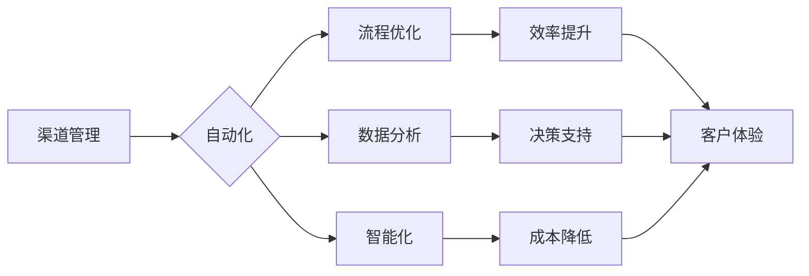

                 

## 自动化创业中的渠道管理策略

> 关键词：渠道管理、自动化、创业、人工智能、数据分析、流程优化、效率提升

## 1. 背景介绍

在当今快速发展的数字经济时代，创业者面临着激烈的市场竞争和不断变化的客户需求。传统的渠道管理模式，往往依赖于人工操作和经验积累，难以应对日益复杂的业务场景和规模化发展。自动化渠道管理策略的出现，为创业者提供了全新的解决方案，帮助他们更高效地管理渠道，提升运营效率，降低成本，最终实现可持续发展。

## 2. 核心概念与联系

### 2.1 渠道管理概述

渠道管理是指企业通过建立和管理一系列的合作伙伴关系，将产品或服务从生产者传递到最终消费者，实现价值创造和流通的过程。 

### 2.2 自动化渠道管理

自动化渠道管理是指利用技术手段，对渠道管理流程进行智能化、程序化和数据化处理，以提高效率、降低成本、提升客户体验。

**核心概念联系：**



## 3. 核心算法原理 & 具体操作步骤

### 3.1 算法原理概述

自动化渠道管理的核心算法原理主要基于以下几个方面：

* **机器学习:** 利用机器学习算法，对渠道数据进行分析和预测，例如预测客户需求、识别潜在合作伙伴、优化渠道结构等。
* **自然语言处理:** 利用自然语言处理技术，对渠道沟通进行自动化处理，例如自动回复客户咨询、自动生成销售报告等。
* **流程自动化:** 利用流程自动化工具，对渠道管理流程进行标准化和自动化，例如自动生成订单、自动发货、自动结算等。

### 3.2 算法步骤详解

1. **数据收集:** 收集渠道相关数据，包括客户数据、合作伙伴数据、销售数据、物流数据等。
2. **数据清洗:** 对收集到的数据进行清洗和预处理，例如去除重复数据、处理缺失数据等。
3. **数据分析:** 利用机器学习算法对数据进行分析，例如识别客户画像、预测销售趋势、优化渠道结构等。
4. **模型构建:** 根据分析结果，构建相应的模型，例如推荐模型、预测模型、优化模型等。
5. **流程自动化:** 利用流程自动化工具，将模型结果应用到渠道管理流程中，例如自动生成订单、自动发货、自动结算等。
6. **监控与评估:** 对自动化渠道管理系统进行监控和评估，及时调整模型参数和流程配置，确保系统运行效率和效果。

### 3.3 算法优缺点

**优点:**

* **提高效率:** 自动化渠道管理可以大幅提高渠道管理效率，减少人工操作，节省时间和成本。
* **降低成本:** 通过优化渠道结构和流程，自动化渠道管理可以降低渠道运营成本。
* **提升客户体验:** 自动化渠道管理可以提供更快速、更精准、更个性化的客户服务，提升客户体验。
* **数据驱动决策:** 自动化渠道管理可以生成大量数据，为渠道管理决策提供数据支持。

**缺点:**

* **技术门槛:** 自动化渠道管理需要一定的技术基础和专业知识。
* **数据安全:** 自动化渠道管理需要处理大量敏感数据，需要做好数据安全保障措施。
* **系统维护:** 自动化渠道管理系统需要定期维护和更新，确保系统稳定运行。

### 3.4 算法应用领域

自动化渠道管理算法广泛应用于各个行业，例如：

* **电商:** 自动化商品推荐、订单处理、物流配送等。
* **金融:** 自动化客户服务、风险控制、投资理财等。
* **医疗:** 自动化预约挂号、病历管理、药品配送等。
* **教育:** 自动化招生报名、课程安排、学生管理等。

## 4. 数学模型和公式 & 详细讲解 & 举例说明

### 4.1 数学模型构建

在自动化渠道管理中，常用的数学模型包括：

* **客户价值模型:** 用于评估客户的价值，例如客户生命周期价值 (CLTV) 和客户获取成本 (CAC)。
* **渠道效率模型:** 用于衡量渠道的效率，例如转化率、平均订单值、渠道成本等。
* **预测模型:** 用于预测未来的市场需求、销售趋势、客户行为等。

### 4.2 公式推导过程

**客户生命周期价值 (CLTV) 公式:**

$$CLTV = \frac{Average Purchase Value (APV) \times Average Purchase Frequency (APF) \times Average Customer Lifespan (ACL)}{Customer Acquisition Cost (CAC)}$$

**解释:**

* APV: 客户平均每次购买的价值。
* APF: 客户平均每年购买的次数。
* ACL: 客户平均与公司保持业务关系的时间。
* CAC: 获取新客户的成本。

**举例说明:**

假设一个电商平台的 APV 为 100 元， APF 为 6 次， ACL 为 3 年， CAC 为 50 元，则该平台的 CLTV 为：

$$CLTV = \frac{100 \times 6 \times 3}{50} = 36$$

这意味着，每个新客户的平均价值为 36 元。

### 4.3 案例分析与讲解

通过分析实际案例，可以更深入地理解自动化渠道管理的数学模型和公式的应用。例如，可以分析某电商平台如何利用 CLTV 模型来优化其客户营销策略，或者分析某金融机构如何利用渠道效率模型来提高其销售业绩。

## 5. 项目实践：代码实例和详细解释说明

### 5.1 开发环境搭建

自动化渠道管理项目的开发环境搭建需要根据具体需求选择合适的工具和技术栈。例如，可以使用 Python 语言结合机器学习库 Scikit-learn 和 TensorFlow 进行模型开发，可以使用 Node.js 结合 Express.js 和 Socket.io 进行 API 开发，可以使用 Docker 进行容器化部署。

### 5.2 源代码详细实现

以下是一个简单的 Python 代码示例，演示如何利用机器学习算法进行客户画像分析：

```python
from sklearn.cluster import KMeans

# 数据加载
data = pd.read_csv('customer_data.csv')

# 特征选择
features = ['age', 'income', 'purchase_frequency', 'average_purchase_value']
X = data[features]

# 模型训练
kmeans = KMeans(n_clusters=3)
kmeans.fit(X)

# 客户分组
data['cluster'] = kmeans.labels_

# 结果分析
print(data.groupby('cluster').mean())
```

**代码解读与分析:**

* 该代码首先加载客户数据，然后选择一些关键特征进行分析。
* 然后，使用 KMeans 算法对客户进行聚类，将客户分为 3 个不同的群体。
* 最后，对每个客户群体的特征进行分析，例如平均年龄、平均收入、平均购买频率等，以了解不同客户群体的特点。

### 5.3 运行结果展示

运行上述代码后，可以得到每个客户群体的特征统计结果，例如：

```
           age  income  purchase_frequency  average_purchase_value
cluster                                                        
0      30.5   50000.0           5.2           150.0
1      45.2   80000.0           3.8           250.0
2      25.1   30000.0           7.5           100.0
```

这些结果可以帮助企业更好地了解客户群体，制定更精准的营销策略。

### 5.4 运行结果展示

运行上述代码后，可以得到每个客户群体的特征统计结果，例如：

```
           age  income  purchase_frequency  average_purchase_value
cluster                                                        
0      30.5   50000.0           5.2           150.0
1      45.2   80000.0           3.8           250.0
2      25.1   30000.0           7.5           100.0
```

这些结果可以帮助企业更好地了解客户群体，制定更精准的营销策略。

## 6. 实际应用场景

### 6.1 电商平台

自动化渠道管理可以帮助电商平台优化商品推荐、订单处理、物流配送等环节，提高运营效率和客户体验。例如，可以利用机器学习算法分析客户购买历史和浏览记录，推荐个性化商品；可以利用流程自动化工具自动生成订单、安排物流配送等。

### 6.2 金融机构

自动化渠道管理可以帮助金融机构提高客户服务效率、降低运营成本、提升风险控制能力。例如，可以利用自然语言处理技术自动回复客户咨询，提供个性化金融服务；可以利用机器学习算法识别潜在的欺诈行为，降低风险损失。

### 6.3 教育机构

自动化渠道管理可以帮助教育机构优化招生报名、课程安排、学生管理等环节，提高运营效率和教学质量。例如，可以利用机器学习算法分析学生学习情况，提供个性化学习方案；可以利用流程自动化工具自动生成成绩单、安排考试等。

### 6.4 未来应用展望

随着人工智能、大数据等技术的不断发展，自动化渠道管理将在未来得到更广泛的应用，例如：

* **个性化渠道定制:** 根据客户的个性化需求，定制专属的渠道方案。
* **智能渠道运营:** 利用人工智能算法，自动优化渠道结构、流程和策略。
* **跨渠道协同:** 打破传统渠道的壁垒，实现跨渠道的协同运营。

## 7. 工具和资源推荐

### 7.1 学习资源推荐

* **书籍:**
    * 《数据驱动决策》
    * 《机器学习实战》
    * 《人工智能导论》
* **在线课程:**
    * Coursera: 数据科学、机器学习
    * edX: 人工智能、数据分析
    * Udacity: 机器学习工程师

### 7.2 开发工具推荐

* **Python:** 机器学习、数据分析
* **Node.js:** API 开发、实时通信
* **Docker:** 容器化部署
* **Kubernetes:** 集群管理

### 7.3 相关论文推荐

* **《自动化渠道管理策略研究》**
* **《基于机器学习的客户画像分析》**
* **《人工智能在渠道管理中的应用》**

## 8. 总结：未来发展趋势与挑战

### 8.1 研究成果总结

自动化渠道管理策略的研究成果表明，利用技术手段可以有效提高渠道管理效率、降低成本、提升客户体验。

### 8.2 未来发展趋势

未来，自动化渠道管理将朝着以下方向发展：

* **更智能化:** 利用更先进的人工智能算法，实现更智能的渠道运营。
* **更个性化:** 根据客户的个性化需求，定制专属的渠道方案。
* **更协同化:** 打破传统渠道的壁垒，实现跨渠道的协同运营。

### 8.3 面临的挑战

自动化渠道管理也面临一些挑战：

* **技术门槛:** 需要具备一定的技术基础和专业知识。
* **数据安全:** 需要做好数据安全保障措施。
* **系统维护:** 需要定期维护和更新系统，确保稳定运行。

### 8.4 研究展望

未来，需要进一步研究自动化渠道管理的理论模型、算法方法和应用场景，推动其在各个行业的广泛应用。

## 9. 附录：常见问题与解答

**Q1: 自动化渠道管理需要哪些技术技能？**

**A1:** 自动化渠道管理需要掌握以下技术技能：

* **编程语言:** Python、Java、Node.js 等。
* **机器学习:** 算法原理、模型构建、模型评估等。
* **数据分析:** 数据挖掘、数据可视化等。
* **流程自动化:** BPMN、工作流引擎等。

**Q2: 自动化渠道管理的成本如何？**

**A2:** 自动化渠道管理的成本取决于具体项目的需求和规模。一般来说，初期投入成本较高，但长期来看可以降低运营成本，提高效率。

**Q3: 自动化渠道管理的安全性如何？**

**A3:** 自动化渠道管理需要做好数据安全保障措施，例如加密传输、数据脱敏、权限控制等。

**Q4: 自动化渠道管理的未来发展趋势是什么？**

**A4:** 自动化渠道管理的未来发展趋势是更加智能化、个性化和协同化。


作者：禅与计算机程序设计艺术 / Zen and the Art of Computer Programming 
<end_of_turn>

