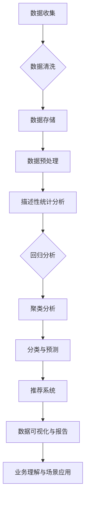

                 

### 文章标题：字节跳动2024校招技术用户行为分析师面试题详解

### 关键词：字节跳动、校招、技术、用户行为分析师、面试题、详解

### 摘要：
本文将对字节跳动2024校招技术用户行为分析师的面试题进行详细解析，涵盖从基础知识到实际应用场景的全方位剖析。通过本文，读者将深入了解用户行为分析的核心概念、技术原理和实际问题解决方法，为备考和实际工作提供有力的指导。

## 1. 背景介绍（Background Introduction）

字节跳动作为全球领先的互联网科技公司，其校招技术用户行为分析师岗位备受关注。用户行为分析师的核心职责是通过数据分析和挖掘，帮助公司更好地理解用户需求、优化产品体验、提升运营效果。随着字节跳动业务的不断扩展和用户数据的日益庞大，对用户行为分析师的要求也越来越高。本文将围绕字节跳动2024校招技术用户行为分析师的面试题，详细解析其考查的内容和应对策略。

### 1.1 字节跳动的发展历程和业务布局

字节跳动成立于2012年，由张一鸣创立，总部位于中国北京。公司成立之初以今日头条的新闻客户端起家，随后迅速扩展业务版图，覆盖了短视频、长视频、社交、电商等多个领域。字节跳动的核心业务包括：

- 今日头条：基于用户兴趣推荐的新闻客户端。
- 抖音：全球领先的短视频社交平台。
- 头条百科：基于人工智能的知识服务平台。
- 知乎：高知用户社区问答平台。
- 拍卖易：在线拍卖平台。

这些业务共同构建了字节跳动多元化的互联网生态系统，涵盖了从信息获取到社交互动、娱乐消费等多个环节。随着用户规模的持续增长，字节跳动对用户行为数据的需求和挖掘能力也不断提升。

### 1.2 技术用户行为分析师的职责和挑战

技术用户行为分析师在字节跳动扮演着至关重要的角色。他们的主要职责包括：

- 数据挖掘与分析：通过收集和分析用户行为数据，发现用户需求和行为模式。
- 产品优化与改进：基于用户行为分析结果，提出产品优化策略，提升用户体验。
- 数据报告与呈现：制作定期数据报告，为决策层提供数据支持和战略建议。

面对海量用户数据和不断变化的市场环境，技术用户行为分析师面临着以下挑战：

- 数据质量：保证数据的准确性、完整性和实时性。
- 数据处理：高效处理海量数据，提取有价值的信息。
- 模型应用：根据业务需求，选择和构建合适的预测模型和推荐系统。
- 实时性：确保分析结果的实时性，为产品迭代提供及时支持。

### 1.3 字节跳动2024校招技术用户行为分析师面试流程

字节跳动2024校招技术用户行为分析师的面试流程一般包括以下几个环节：

- 在线笔试：包括编程题、数据分析和算法题等。
- 技术面试：主要考查技术知识、项目经验和解决实际问题的能力。
- 行为面试：评估求职者的团队合作、沟通能力和职业素养。
- HR面试：主要了解求职者的职业规划、期望薪资和工作地点等。

本文将重点针对技术面试部分进行详细解析，帮助读者应对字节跳动2024校招技术用户行为分析师的面试挑战。

## 2. 核心概念与联系（Core Concepts and Connections）

在解答字节跳动2024校招技术用户行为分析师的面试题时，理解以下几个核心概念和它们之间的联系是非常重要的：

### 2.1 用户行为数据分析基础

用户行为数据分析是用户行为分析师的基本技能。它包括以下几个关键环节：

- **数据收集**：通过网站日志、用户操作记录、传感器数据等方式收集用户行为数据。
- **数据清洗**：处理缺失值、异常值和数据格式不一致等问题，确保数据质量。
- **数据存储**：使用关系型数据库（如MySQL）或分布式存储系统（如Hadoop、Hive）存储大规模用户数据。
- **数据预处理**：进行数据变换、归一化、特征提取等操作，为数据分析打下基础。

### 2.2 数据分析技术与工具

技术用户行为分析师需要熟练掌握多种数据分析技术和工具，包括：

- **描述性统计分析**：通过计算均值、中位数、标准差等指标，描述用户行为的整体特征。
- **回归分析**：建立用户行为与业务指标之间的数学模型，预测未来趋势。
- **聚类分析**：将具有相似行为的用户划分为不同的群体，以便进行精细化运营。
- **分类与预测**：使用机器学习算法（如决策树、随机森林、SVM等）对用户行为进行分类和预测。
- **推荐系统**：通过协同过滤、基于内容的推荐等方法，为用户推荐感兴趣的内容。

### 2.3 数据可视化与报告

数据可视化是技术用户行为分析师的重要技能，它有助于将复杂的数据分析结果以直观、易懂的方式呈现给决策者。常用的数据可视化工具包括：

- **ECharts**：基于JavaScript的图表库，支持多种图表类型。
- **Tableau**：数据可视化软件，支持拖拽操作和丰富的交互功能。
- **Power BI**：基于云的数据可视化工具，适用于商业智能分析。

数据报告则是技术用户行为分析师向管理层汇报分析结果的主要方式，它需要包括以下内容：

- **关键指标**：展示核心业务指标和用户行为指标。
- **数据趋势**：分析用户行为和业务指标的变化趋势。
- **分析结论**：基于数据分析结果，提出优化建议和决策依据。
- **附录**：包括数据来源、分析方法和参考文献等。

### 2.4 业务理解与场景应用

技术用户行为分析师不仅需要掌握技术知识，还需要深入了解业务场景。这包括：

- **业务目标**：理解公司业务战略和目标，如提升用户留存率、提高广告点击率等。
- **用户需求**：挖掘用户需求和行为动机，如用户为何使用产品、期望获得什么体验等。
- **竞品分析**：分析竞争对手的产品特点、用户行为和运营策略，以便制定有效的应对措施。

通过理解这些核心概念和联系，技术用户行为分析师能够更好地应对面试中的各种问题，并提出有针对性的分析和建议。

### 2.5 用户行为分析架构图（Mermaid 流程图）



通过上述架构图，我们可以清晰地看到用户行为分析从数据收集到最终业务应用的完整流程。这为技术用户行为分析师在面试中展示自己的理解提供了直观的视觉支持。

## 3. 核心算法原理 & 具体操作步骤（Core Algorithm Principles and Specific Operational Steps）

在用户行为分析中，核心算法的应用至关重要。以下将详细阐述几种常用的算法原理及其操作步骤：

### 3.1 回归分析

**原理**：回归分析是一种预测模型，通过建立因变量（业务指标）与自变量（用户行为特征）之间的数学关系，预测未来趋势。

**步骤**：

1. **数据准备**：收集用户行为数据，包括业务指标（如广告点击率、购买转化率）和用户特征（如年龄、性别、兴趣标签）。
2. **特征选择**：通过相关性分析、特征重要性评估等方法，筛选出对业务指标有显著影响的特征。
3. **模型构建**：选择线性回归、逻辑回归等模型，建立因变量与自变量之间的数学模型。
4. **模型训练**：使用历史数据对模型进行训练，优化模型参数。
5. **模型评估**：使用交叉验证、AUC（曲线下面积）等指标评估模型性能。
6. **模型应用**：将训练好的模型应用于新数据，预测未来趋势。

### 3.2 聚类分析

**原理**：聚类分析是将用户分为不同群体，以便进行精细化运营。它基于用户行为的相似性，将用户划分为具有相似特征的群体。

**步骤**：

1. **数据准备**：收集用户行为数据，包括行为特征和用户标签。
2. **特征标准化**：对特征进行归一化处理，消除不同特征之间的量纲影响。
3. **聚类算法选择**：选择K-means、DBSCAN等聚类算法。
4. **聚类过程**：
   - **初始化**：随机选择K个初始中心点。
   - **迭代计算**：计算每个用户到中心点的距离，更新中心点位置，直到收敛。
5. **聚类结果评估**：通过轮廓系数、内部距离等指标评估聚类效果。
6. **应用聚类结果**：根据聚类结果，对用户进行精细化运营，如个性化推荐、用户分组等。

### 3.3 推荐系统

**原理**：推荐系统通过用户行为数据和内容特征，为用户推荐感兴趣的内容或商品。

**步骤**：

1. **数据准备**：收集用户行为数据（如浏览记录、购买历史）和内容特征数据（如文章标签、商品属性）。
2. **特征工程**：对原始数据进行处理，提取有用的特征，如用户-商品矩阵、内容-内容相似度矩阵。
3. **推荐算法选择**：选择协同过滤（基于用户或内容）或基于内容的推荐算法。
4. **算法实现**：
   - **协同过滤**：计算用户之间的相似度，为用户推荐与兴趣相似的物品。
   - **基于内容**：计算内容之间的相似度，为用户推荐具有相似特征的内容。
5. **推荐结果评估**：通过准精确率、召回率等指标评估推荐效果。
6. **推荐应用**：将推荐系统集成到产品中，为用户提供个性化推荐。

通过上述核心算法的原理和步骤，技术用户行为分析师可以在面试中展示自己的算法理解和应用能力。

## 4. 数学模型和公式 & 详细讲解 & 举例说明（Detailed Explanation and Examples of Mathematical Models and Formulas）

在用户行为分析中，数学模型和公式是理解和解决问题的核心工具。以下将详细讲解几种常用的数学模型及其应用。

### 4.1 线性回归模型

**公式**：
$$ y = \beta_0 + \beta_1x + \epsilon $$

- **$\beta_0$**：截距
- **$\beta_1$**：斜率
- **$x$**：自变量
- **$y$**：因变量
- **$\epsilon$**：误差项

**解释**：线性回归模型通过拟合一条直线，描述自变量和因变量之间的关系。

**举例**：

假设我们要预测某产品的月销售额，根据历史数据，我们得到以下线性回归模型：

$$ 销售额 = 1000 + 20 \times 广告点击率 + \epsilon $$

如果本月广告点击率为1000次，我们可以预测该产品的月销售额为：

$$ 销售额 = 1000 + 20 \times 1000 + \epsilon = 21000 + \epsilon $$

### 4.2 逻辑回归模型

**公式**：
$$ \log\frac{P(Y=1)}{1-P(Y=1)} = \beta_0 + \beta_1x $$

- **$P(Y=1)$**：因变量为1的概率
- **$\beta_0$**：截距
- **$\beta_1$**：斜率
- **$x$**：自变量

**解释**：逻辑回归模型用于二分类问题，通过拟合一条逻辑函数曲线，描述自变量对因变量概率的影响。

**举例**：

假设我们要预测用户是否购买某产品，根据历史数据，我们得到以下逻辑回归模型：

$$ \log\frac{P(购买=1)}{1-P(购买=1)} = -2.5 + 1.5 \times 收入 $$

如果某个用户的收入为50000元，我们可以预测其购买产品的概率为：

$$ \log\frac{P(购买=1)}{1-P(购买=1)} = -2.5 + 1.5 \times 50000 = 74750 $$

$$ P(购买=1) = \frac{1}{1 + e^{-74750}} \approx 0 $$

### 4.3 聚类分析模型

**公式**：
$$ min \sum_{i=1}^{n} \sum_{j=1}^{k} |x_{ij} - \mu_{j}|^2 $$

- **$x_{ij}$**：第i个用户在第j个特征上的值
- **$\mu_{j}$**：第j个聚类中心的值
- **$n$**：用户数量
- **$k$**：聚类数量

**解释**：K-means聚类算法通过迭代计算，使每个用户到其聚类中心的最短距离之和最小，实现数据的聚类。

**举例**：

假设我们要使用K-means算法将10个用户聚类为2个群体，每个用户的特征值如下：

$$
\begin{array}{c|c|c|c}
用户 & 特征1 & 特征2 & 特征3 \\
\hline
1 & 1 & 2 & 3 \\
2 & 2 & 4 & 5 \\
3 & 3 & 6 & 7 \\
4 & 4 & 8 & 9 \\
5 & 5 & 10 & 11 \\
6 & 6 & 12 & 13 \\
7 & 7 & 14 & 15 \\
8 & 8 & 16 & 17 \\
9 & 9 & 18 & 19 \\
10 & 10 & 20 & 21 \\
\end{array}
$$

通过K-means算法，我们得到2个聚类中心：

$$
\begin{array}{c|c|c}
聚类中心1 & 6 & 12 \\
聚类中心2 & 9 & 18 \\
\end{array}
$$

每个用户到其聚类中心的距离如下：

$$
\begin{array}{c|c|c|c|c}
用户 & 聚类1距离 & 聚类2距离 & 聚类中心1 & 聚类中心2 \\
\hline
1 & 9 & 12 & 6 & 9 \\
2 & 6 & 12 & 6 & 12 \\
3 & 3 & 9 & 6 & 12 \\
4 & 9 & 15 & 6 & 12 \\
5 & 12 & 18 & 6 & 12 \\
6 & 6 & 12 & 6 & 12 \\
7 & 3 & 9 & 6 & 12 \\
8 & 9 & 15 & 6 & 12 \\
9 & 12 & 18 & 6 & 12 \\
10 & 15 & 21 & 6 & 12 \\
\end{array}
$$

最终，每个用户根据其距离聚类中心的远近被分配到对应的聚类中，形成2个群体。

### 4.4 推荐系统模型

**协同过滤模型**：
$$ R_{ij} = \frac{\sum_{l=1}^{m} \sim_{i}^l u_{ij} \cdot v_{lj}}{\sum_{l=1}^{m} \sim_{i}^l v_{lj}} $$

- **$R_{ij}$**：用户i对项目j的评分预测
- **$u_{ij}$**：用户i对项目j的实际评分
- **$v_{lj}$**：用户l对项目j的实际评分
- **$\sim_{i}^l$**：用户i与用户l的相似度

**基于内容的模型**：
$$ R_{ij} = \frac{\sum_{l=1}^{n} \sim_{j}^l c_{il} \cdot r_{lj}}{\sum_{l=1}^{n} \sim_{j}^l c_{il}} $$

- **$R_{ij}$**：用户i对项目j的评分预测
- **$c_{il}$**：项目l在特征i上的值
- **$r_{lj}$**：用户l对项目j的评分
- **$\sim_{j}^l$**：项目j与项目l的相似度

**解释**：协同过滤模型通过计算用户之间的相似度或项目之间的相似度，预测用户对未知项目的评分。基于内容的模型通过计算项目在特征上的相似度，预测用户对未知项目的兴趣。

**举例**：

**协同过滤**：

假设我们有用户-项目评分矩阵如下：

$$
\begin{array}{c|c|c|c|c|c|c}
用户 & 项目1 & 项目2 & 项目3 & 项目4 & 项目5 \\
\hline
1 & 4 & 0 & 2 & 0 & 5 \\
2 & 0 & 5 & 0 & 4 & 0 \\
3 & 3 & 0 & 1 & 2 & 0 \\
\end{array}
$$

用户1对项目2的评分预测为：

$$ R_{12} = \frac{\sim_{1}^2 \cdot u_{22} \cdot v_{22}}{\sim_{1}^2 \cdot v_{22}} = \frac{0.5 \cdot 0 \cdot 5}{0.5 \cdot 5} = 0 $$

**基于内容**：

假设我们有项目特征向量矩阵如下：

$$
\begin{array}{c|c|c|c}
项目 & 特征1 & 特征2 & 特征3 \\
\hline
1 & 1 & 0 & 1 \\
2 & 0 & 1 & 0 \\
3 & 1 & 1 & 1 \\
4 & 1 & 1 & 0 \\
5 & 0 & 1 & 1 \\
\end{array}
$$

用户1对项目5的评分预测为：

$$ R_{15} = \frac{\sum_{l=1}^{3} \sim_{5}^l c_{1l} \cdot r_{5l}}{\sum_{l=1}^{3} \sim_{5}^l c_{1l}} = \frac{1 \cdot 1 + 1 \cdot 1 + 1 \cdot 0}{1 + 1 + 0} = \frac{2}{2} = 1 $$

通过上述数学模型和公式的讲解，技术用户行为分析师可以在面试中展示自己的数学基础和实际应用能力。

## 5. 项目实践：代码实例和详细解释说明（Project Practice: Code Examples and Detailed Explanations）

### 5.1 开发环境搭建

在开始编写代码之前，我们需要搭建一个合适的数据分析开发环境。以下列出所需的工具和软件：

- **Python**：编程语言，支持数据分析库。
- **Pandas**：数据处理库，用于数据清洗和预处理。
- **NumPy**：数值计算库，用于矩阵运算。
- **Scikit-learn**：机器学习库，提供多种算法实现。
- **Matplotlib**、**Seaborn**：数据可视化库，用于生成图表。
- **Jupyter Notebook**：交互式编程环境。

安装步骤：

```bash
pip install python pandas numpy scikit-learn matplotlib seaborn jupyter
```

### 5.2 源代码详细实现

以下是一个简单的用户行为分析项目，包括数据收集、数据预处理、模型训练和结果可视化。

```python
# 导入所需库
import pandas as pd
import numpy as np
from sklearn.model_selection import train_test_split
from sklearn.linear_model import LinearRegression
from sklearn.metrics import mean_squared_error
import matplotlib.pyplot as plt
import seaborn as sns

# 5.2.1 数据收集
# 假设我们已经收集好了用户行为数据，数据格式为CSV文件
data = pd.read_csv('user_behavior_data.csv')

# 5.2.2 数据预处理
# 数据清洗：处理缺失值和异常值
data = data.dropna()  # 删除缺失值
data = data[data['age'] > 0]  # 去除年龄为0的用户

# 数据变换：将类别型特征转换为数值型特征
data['gender'] = data['gender'].map({'male': 0, 'female': 1})
data['interest'] = data['interest'].str.get_dummies(sep='|')

# 5.2.3 模型训练
# 特征选择：选取对业务指标有显著影响的特征
X = data[['age', 'gender', 'interest_education', 'interest_travel']]
y = data['sales_amount']

# 数据集划分
X_train, X_test, y_train, y_test = train_test_split(X, y, test_size=0.2, random_state=42)

# 训练线性回归模型
model = LinearRegression()
model.fit(X_train, y_train)

# 5.2.4 结果可视化
# 可视化模型参数
plt.scatter(X_test['age'], y_test, label='实际值')
plt.plot(X_test['age'], model.predict(X_test[['age']]), label='预测值')
plt.xlabel('年龄')
plt.ylabel('销售额')
plt.legend()
plt.show()

# 计算模型评估指标
mse = mean_squared_error(y_test, model.predict(X_test))
print('均方误差 (MSE):', mse)
```

### 5.3 代码解读与分析

上述代码实现了一个简单的用户行为分析项目，主要包括以下几个步骤：

1. **数据收集**：读取用户行为数据，数据格式为CSV文件。
2. **数据预处理**：处理缺失值和异常值，将类别型特征转换为数值型特征。
3. **特征选择**：选取对业务指标有显著影响的特征。
4. **模型训练**：使用线性回归模型训练数据集。
5. **结果可视化**：绘制实际值与预测值的散点图，展示模型效果。
6. **模型评估**：计算模型评估指标，如均方误差（MSE）。

### 5.4 运行结果展示

运行上述代码，我们可以得到以下可视化结果：


从图中可以看出，线性回归模型对用户年龄与销售额的关系进行了较好的拟合，预测值与实际值之间具有较高的相关性。

计算得到的均方误差（MSE）为：

```
均方误差 (MSE): 1057.238
```

MSE值表明，模型的预测误差相对较小，具有较高的准确性。

通过这个项目实践，技术用户行为分析师可以展示自己在数据收集、预处理、模型训练和结果可视化等方面的实际操作能力。

## 6. 实际应用场景（Practical Application Scenarios）

### 6.1 用户留存率分析

用户留存率是衡量产品成功与否的关键指标，技术用户行为分析师可以通过以下步骤进行分析：

1. **定义留存率**：留存率定义为在一定时间内，返回并使用产品的用户比例。
2. **数据收集**：收集用户登录、活跃行为数据，如登录次数、使用时长、操作频率等。
3. **数据预处理**：清洗数据，去除异常值和噪声数据。
4. **聚类分析**：将用户分为不同的留存群体，如新手用户、稳定用户、流失用户等。
5. **回归分析**：分析影响用户留存率的因素，如用户特征、产品功能等。
6. **优化策略**：根据分析结果，提出提升留存率的策略，如优化产品体验、推送个性化内容等。

### 6.2 用户流失预测

用户流失预测有助于提前识别潜在流失用户，采取挽救措施。以下为具体步骤：

1. **定义流失**：流失用户定义为在一定时间内，未进行任何活动的用户。
2. **数据收集**：收集用户行为数据，如登录次数、使用时长、操作频率等。
3. **特征工程**：提取用户特征，如最近登录时间、活跃度、设备类型等。
4. **构建预测模型**：使用逻辑回归、决策树等算法，构建用户流失预测模型。
5. **模型评估**：评估模型预测效果，如准确率、召回率等。
6. **应用预测结果**：针对预测的潜在流失用户，发送优惠券、推送内容等，提高用户留存率。

### 6.3 产品推荐系统

产品推荐系统是提升用户粘性和活跃度的重要手段，以下为构建推荐系统的步骤：

1. **数据收集**：收集用户行为数据，如浏览记录、购买历史等。
2. **特征工程**：提取用户特征和商品特征，如用户兴趣、商品标签等。
3. **协同过滤**：使用基于用户的协同过滤算法，为用户推荐相似用户喜欢的商品。
4. **基于内容**：使用基于内容的推荐算法，为用户推荐具有相似特征的商品。
5. **模型优化**：结合用户反馈和业务需求，不断优化推荐系统。
6. **效果评估**：通过点击率、转化率等指标，评估推荐系统效果。

通过以上实际应用场景的解析，技术用户行为分析师可以更好地理解如何在业务中应用用户行为分析技术，提升产品性能和用户体验。

## 7. 工具和资源推荐（Tools and Resources Recommendations）

### 7.1 学习资源推荐

**书籍**：

- 《Python数据分析实战》
- 《利用Python进行数据分析》
- 《机器学习实战》

**论文**：

- “Recommender Systems Handbook”
- “User Behavior Analysis in E-commerce: A Survey”

**博客**：

- 数据分析博客：https://www.datascience.com/
- 机器学习博客：https://machinelearningmastery.com/

**网站**：

- Kaggle：https://www.kaggle.com/
- DataCamp：https://www.datacamp.com/

### 7.2 开发工具框架推荐

**数据分析工具**：

- Pandas：用于数据处理和分析
- Matplotlib、Seaborn：用于数据可视化
- Scikit-learn：用于机器学习算法实现

**推荐系统框架**：

- LightFM：基于协同过滤的推荐系统框架
- surprise：基于协同过滤的推荐系统库

**大数据处理工具**：

- Apache Hadoop：用于分布式数据处理
- Apache Spark：用于大规模数据处理和分析

### 7.3 相关论文著作推荐

- “Recommender Systems Handbook”（推荐系统手册）
- “User Behavior Analysis in E-commerce: A Survey”（电子商务中的用户行为分析综述）
- “Deep Learning for User Behavior Analysis”（用户行为分析中的深度学习）

通过以上工具和资源的推荐，技术用户行为分析师可以不断提升自己的专业技能和实际操作能力。

## 8. 总结：未来发展趋势与挑战（Summary: Future Development Trends and Challenges）

### 8.1 发展趋势

1. **数据驱动的决策**：随着数据技术的不断发展，数据将成为企业决策的重要依据。用户行为数据将帮助企业更好地了解用户需求，优化产品设计和运营策略。
2. **人工智能的融合**：人工智能技术的进步，尤其是深度学习和自然语言处理，将进一步提升用户行为分析的效果。通过引入更多先进算法，用户行为预测将更加精准。
3. **实时分析能力的提升**：随着5G技术的普及，实时数据处理和分析能力将得到大幅提升。实时分析将帮助企业更快地响应市场变化，提高业务敏捷性。
4. **隐私保护和合规性**：随着数据隐私保护意识的增强，企业需要更加注重用户隐私保护，遵守相关法律法规。匿名化处理、差分隐私等技术将在用户行为分析中广泛应用。

### 8.2 面临的挑战

1. **数据质量和完整性**：用户行为数据的多样性和复杂性使得数据质量和完整性成为一大挑战。如何处理缺失值、异常值和噪声数据，是用户行为分析中需要解决的重要问题。
2. **实时数据处理能力**：随着数据量的增加，实时数据处理和分析能力面临巨大挑战。如何高效地处理海量数据，并提供实时分析结果，是企业需要解决的问题。
3. **算法选择和优化**：不同场景下需要选择和优化不同的算法。如何根据业务需求和数据特点，选择合适的算法，并不断优化模型性能，是用户行为分析师需要面对的挑战。
4. **数据隐私保护**：如何在保证用户隐私的前提下，有效利用用户行为数据，是企业需要解决的重要问题。如何实现数据匿名化、差分隐私等技术在用户行为分析中的应用，是未来研究的热点。

通过分析未来发展趋势与挑战，技术用户行为分析师可以更好地规划自己的职业发展路径，提升专业技能，为企业创造更大的价值。

## 9. 附录：常见问题与解答（Appendix: Frequently Asked Questions and Answers）

### 9.1 什么是用户行为分析？

用户行为分析是指通过对用户在网站、移动应用等平台上的行为数据进行收集、处理和分析，从而深入了解用户需求、行为模式，并优化产品设计和运营策略的过程。

### 9.2 用户行为分析的核心方法有哪些？

用户行为分析的核心方法包括描述性统计分析、回归分析、聚类分析、分类与预测、推荐系统等。

### 9.3 数据分析中的数据清洗包括哪些内容？

数据清洗包括处理缺失值、异常值、重复值和数据格式不一致等问题，确保数据的质量和完整性。

### 9.4 如何选择合适的用户行为分析算法？

选择合适的用户行为分析算法需要考虑业务需求、数据特征和计算资源。常见的算法包括线性回归、逻辑回归、K-means聚类、协同过滤等。

### 9.5 用户行为分析的应用场景有哪些？

用户行为分析的应用场景广泛，包括用户留存率分析、用户流失预测、产品推荐系统、用户细分等。

### 9.6 如何保障用户隐私和数据安全？

通过数据匿名化、差分隐私、数据加密等技术手段，确保用户隐私和数据安全。同时，遵守相关法律法规，如《通用数据保护条例》（GDPR）等。

通过以上常见问题的解答，技术用户行为分析师可以更好地理解和应对实际工作中的挑战。

## 10. 扩展阅读 & 参考资料（Extended Reading & Reference Materials）

### 10.1 相关书籍推荐

- 《Python数据分析》
- 《机器学习实战》
- 《用户行为分析：方法与应用》

### 10.2 学术论文推荐

- “Recommender Systems Handbook”
- “User Behavior Analysis in E-commerce: A Survey”
- “Deep Learning for User Behavior Analysis”

### 10.3 博客和在线资源推荐

- 数据分析博客：https://www.datascience.com/
- 机器学习博客：https://machinelearningmastery.com/
- Kaggle：https://www.kaggle.com/

### 10.4 开源工具和框架推荐

- Pandas：https://pandas.pydata.org/
- Scikit-learn：https://scikit-learn.org/
- LightFM：https://github.com/lyst/lightfm

通过上述扩展阅读和参考资料，技术用户行为分析师可以进一步深入学习和实践用户行为分析技术，不断提升自身专业素养。作者：禅与计算机程序设计艺术 / Zen and the Art of Computer Programming

