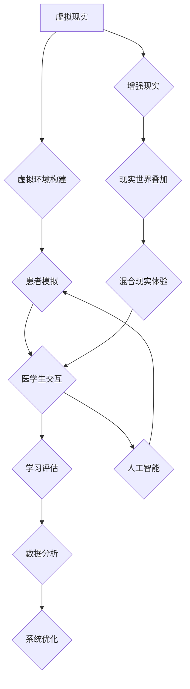

                 

## 虚拟医疗训练：全球医疗教育的数字化升级

> 关键词：虚拟现实、增强现实、医疗教育、模拟训练、人工智能、远程医疗、数字孪生

## 1. 背景介绍

医疗行业正处于数字化转型的关键时期，而虚拟医疗训练作为这一转型的重要组成部分，正在迅速改变着医疗教育的模式。传统医疗教育模式主要依赖于课堂学习和临床实习，存在着诸多局限性，例如：

* **成本高昂：** 临床实习需要大量的场地、设备和人力资源投入。
* **安全风险：** 临床实习存在着一定的风险，可能会对患者造成伤害。
* **资源分配不均：** 优质的临床实习机会往往集中在大型医院，而一些偏远地区或小型医院的医学生难以获得。

虚拟医疗训练通过利用虚拟现实 (VR)、增强现实 (AR) 和人工智能 (AI) 等技术，构建逼真的医疗模拟环境，为医学生提供安全、高效、个性化的学习体验。

## 2. 核心概念与联系

虚拟医疗训练的核心概念包括：

* **虚拟现实 (VR)：**  VR 技术通过头戴式显示器和手柄等设备，创造出一个沉浸式的虚拟环境，用户可以身临其境地体验虚拟世界。
* **增强现实 (AR)：** AR 技术将虚拟信息叠加到现实世界中，用户可以通过手机、平板电脑或眼镜等设备，看到虚拟物体和信息。
* **人工智能 (AI)：** AI 技术可以模拟患者的生理特征和行为模式，为虚拟医疗训练提供更逼真的交互体验。

**核心概念架构：**



## 3. 核心算法原理 & 具体操作步骤

### 3.1  算法原理概述

虚拟医疗训练的核心算法包括：

* **3D建模算法：** 用于构建虚拟环境中的三维模型，例如人体模型、手术器械、医疗设备等。
* **物理模拟算法：** 用于模拟虚拟环境中的物理现象，例如物体运动、碰撞、液体流动等。
* **人工智能算法：** 用于模拟患者的生理特征和行为模式，例如呼吸、心跳、反应、对话等。

### 3.2  算法步骤详解

1. **环境构建：** 使用3D建模算法构建虚拟医疗环境，包括手术室、病房、诊室等场景。
2. **患者模拟：** 使用人工智能算法模拟患者的生理特征和行为模式，例如患者的年龄、性别、病症、症状、反应等。
3. **交互设计：** 设计医学生与虚拟患者的交互方式，例如手部操作、语音指令、图像识别等。
4. **学习评估：** 设计评估医学生学习效果的指标，例如手术操作时间、准确率、患者满意度等。
5. **数据分析：** 收集医学生学习过程中的数据，例如操作轨迹、决策过程、错误类型等，并进行分析，以优化虚拟医疗训练系统。

### 3.3  算法优缺点

**优点：**

* **安全可靠：** 虚拟医疗训练环境安全可靠，不会对患者造成伤害。
* **成本效益高：** 相比于传统临床实习，虚拟医疗训练成本更低。
* **个性化学习：** 虚拟医疗训练可以根据医学生的学习进度和能力，提供个性化的学习内容和难度。
* **重复练习：** 医学生可以反复练习手术操作和诊疗技能，提高熟练度。

**缺点：**

* **技术门槛高：** 构建高质量的虚拟医疗训练系统需要专业的技术人员和大量的资源投入。
* **缺乏真实感：** 虚拟环境与真实环境存在一定的差异，可能会影响医学生的学习效果。
* **伦理问题：** 虚拟医疗训练涉及到患者隐私和数据安全等伦理问题，需要谨慎处理。

### 3.4  算法应用领域

虚拟医疗训练的应用领域非常广泛，包括：

* **外科手术模拟：** 训练外科医生进行各种手术操作，例如开刀、缝合、植入器械等。
* **内科诊断模拟：** 训练内科医生进行疾病诊断、治疗方案制定等。
* **急救处理模拟：** 训练急救人员进行抢救、处置伤病等。
* **心理咨询模拟：** 训练心理咨询师进行心理评估、治疗等。

## 4. 数学模型和公式 & 详细讲解 & 举例说明

### 4.1  数学模型构建

虚拟医疗训练中，可以使用数学模型来模拟患者的生理特征和行为模式。例如，可以使用以下数学模型来模拟患者的心跳率：

$$
HR = HR_0 + \alpha \cdot (T - T_0)
$$

其中：

* $HR$：患者的心跳率
* $HR_0$：患者静止的心跳率
* $\alpha$：心跳率变化系数
* $T$：当前时间
* $T_0$：患者开始测量心跳率的时间

### 4.2  公式推导过程

该公式的推导过程如下：

1. 假设患者的心跳率变化与时间呈线性关系。
2. 患者静止的心跳率为 $HR_0$。
3. 随着时间的推移，患者的心跳率会发生变化，变化幅度由心跳率变化系数 $\alpha$ 决定。

### 4.3  案例分析与讲解

假设患者静止的心跳率为 $HR_0 = 70$ 次/分钟，心跳率变化系数为 $\alpha = 2$ 次/分钟/分钟。当患者进行剧烈运动时，时间 $T$ 相对于 $T_0$ 增加 5 分钟，则患者的心跳率为：

$$
HR = 70 + 2 \cdot (5 - 0) = 80 \text{ 次/分钟}
$$

## 5. 项目实践：代码实例和详细解释说明

### 5.1  开发环境搭建

虚拟医疗训练项目可以使用 Unity 或 Unreal Engine 等游戏引擎进行开发。开发环境搭建需要安装相应的软件和工具，例如：

* Unity 或 Unreal Engine
* C# 或 C++ 编程语言
* 3D建模软件
* 虚拟现实头显设备

### 5.2  源代码详细实现

以下是一个简单的 Unity 项目代码示例，用于模拟患者的呼吸运动：

```csharp
using UnityEngine;

public class PatientBreathing : MonoBehaviour
{
    public float breathRate = 0.5f; // 呼吸频率
    public float breathAmplitude = 0.1f; // 呼吸幅度

    private float timer = 0f;

    void Update()
    {
        timer += Time.deltaTime;
        float breathValue = Mathf.Sin(timer * breathRate) * breathAmplitude;
        transform.localScale = new Vector3(1f, 1f + breathValue, 1f);
    }
}
```

**代码解读与分析：**

* 该代码定义了一个名为 `PatientBreathing` 的脚本，用于控制患者的呼吸运动。
* `breathRate` 属性控制呼吸频率，`breathAmplitude` 属性控制呼吸幅度。
* `Update()` 函数在每一帧更新患者的呼吸运动。
* `Mathf.Sin()` 函数用于生成正弦波，模拟呼吸的起伏。
* `transform.localScale` 属性用于调整患者的体积，实现呼吸运动的视觉效果。

### 5.3  代码解读与分析

### 5.4  运行结果展示

运行该代码后，患者的模型会随着时间变化，呈现出呼吸的运动效果。

## 6. 实际应用场景

虚拟医疗训练已在全球范围内得到广泛应用，例如：

* **美国Mayo Clinic** 使用 VR 技术训练外科医生进行复杂手术操作。
* **英国牛津大学** 使用 AR 技术帮助医学生学习人体解剖结构。
* **中国清华大学** 使用 AI 技术模拟患者的症状和行为模式，为医学生提供个性化的学习体验。

### 6.4  未来应用展望

未来，虚拟医疗训练将朝着以下方向发展：

* **更逼真的虚拟环境：** 利用更先进的 3D 建模、物理模拟和人工智能技术，构建更逼真的虚拟环境。
* **更个性化的学习体验：** 根据医学生的学习进度和能力，提供更个性化的学习内容和难度。
* **更广泛的应用场景：** 将虚拟医疗训练应用到更多医疗领域，例如护理、康复、心理咨询等。
* **远程医疗训练：** 利用云计算和网络技术，实现远程医疗训练，打破地域限制。

## 7. 工具和资源推荐

### 7.1  学习资源推荐

* **Unity Learn:** https://learn.unity.com/
* **Unreal Engine Learning:** https://www.unrealengine.com/en-US/learn
* **VR/AR Development Tutorials:** https://www.youtube.com/results?search_query=vr+ar+development+tutorials

### 7.2  开发工具推荐

* **Unity:** https://unity.com/
* **Unreal Engine:** https://www.unrealengine.com/
* **Blender:** https://www.blender.org/

### 7.3  相关论文推荐

* **Virtual Reality in Medical Education:** https://pubmed.ncbi.nlm.nih.gov/28387160/
* **Augmented Reality in Healthcare:** https://www.ncbi.nlm.nih.gov/pmc/articles/PMC6378173/

## 8. 总结：未来发展趋势与挑战

### 8.1  研究成果总结

虚拟医疗训练作为一种新兴技术，在医疗教育领域取得了显著的成果。它为医学生提供了一个安全、高效、个性化的学习环境，提高了医学生的学习效果和临床技能。

### 8.2  未来发展趋势

未来，虚拟医疗训练将朝着更逼真、更个性化、更广泛应用的方向发展。

### 8.3  面临的挑战

虚拟医疗训练也面临着一些挑战，例如：

* **技术难度高：** 构建高质量的虚拟医疗训练系统需要专业的技术人员和大量的资源投入。
* **成本问题：** 虚拟医疗训练设备和软件成本较高，难以普及。
* **伦理问题：** 虚拟医疗训练涉及到患者隐私和数据安全等伦理问题，需要谨慎处理。

### 8.4  研究展望

未来，需要加强虚拟医疗训练技术的研发，降低成本，解决伦理问题，使其更广泛地应用于医疗教育领域。

## 9. 附录：常见问题与解答

**常见问题：**

* **虚拟医疗训练与传统医疗教育相比，有哪些优势？**

**解答：** 虚拟医疗训练具有以下优势：

* 安全可靠：不会对患者造成伤害。
* 成本效益高：相较于传统临床实习，成本更低。
* 个性化学习：可以根据医学生的学习进度和能力，提供个性化的学习内容和难度。
* 重复练习：医学生可以反复练习手术操作和诊疗技能，提高熟练度。

* **虚拟医疗训练的应用场景有哪些？**

**解答：** 虚拟医疗训练的应用场景非常广泛，包括：

* 外科手术模拟
* 内科诊断模拟
* 急救处理模拟
* 心理咨询模拟

* **虚拟医疗训练的未来发展趋势是什么？**

**解答：** 未来，虚拟医疗训练将朝着以下方向发展：

* 更逼真的虚拟环境
* 更个性化的学习体验
* 更广泛的应用场景
* 远程医疗训练


作者：禅与计算机程序设计艺术 / Zen and the Art of Computer Programming 
<end_of_turn>

