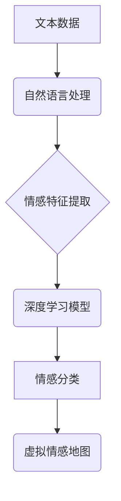

                 

## 虚拟情感地图：AI描绘的人类情感景观

> 关键词：人工智能、情感识别、自然语言处理、深度学习、情感地图、用户体验、人机交互

## 1. 背景介绍

人类情感是复杂而多变的，它影响着我们的思维、行为和决策。理解和模拟人类情感一直是人工智能领域的重要挑战之一。随着深度学习技术的快速发展，人工智能在情感识别和分析方面取得了显著进展。

传统的文本情感分析方法主要依赖于规则匹配和词袋模型，但这些方法难以捕捉到情感的细微变化和语境依赖性。深度学习方法，特别是基于循环神经网络（RNN）和卷积神经网络（CNN）的模型，能够学习到更复杂的文本表示，从而提高情感识别的准确率。

近年来，一些研究者开始探索将情感识别技术应用于构建“虚拟情感地图”。虚拟情感地图是一种基于数据驱动的模型，它试图描绘出人类情感的复杂景观，并揭示不同情感之间的关系和演变规律。

## 2. 核心概念与联系

### 2.1 情感识别

情感识别是指通过分析文本、语音、图像等数据，识别出表达的情感类型，例如快乐、悲伤、愤怒、恐惧等。

### 2.2 自然语言处理（NLP）

自然语言处理是人工智能的一个分支，它致力于使计算机能够理解和处理人类语言。NLP技术在情感识别中扮演着至关重要的角色，它负责将文本数据转换为计算机可理解的格式，并提取情感相关的特征。

### 2.3 深度学习

深度学习是一种机器学习方法，它利用多层神经网络来学习数据中的复杂模式。深度学习模型能够自动提取文本特征，并学习到更复杂的文本表示，从而提高情感识别的准确率。

**核心概念与联系流程图**



## 3. 核心算法原理 & 具体操作步骤

### 3.1 算法原理概述

构建虚拟情感地图的核心算法通常基于深度学习模型，例如循环神经网络（RNN）或卷积神经网络（CNN）。这些模型能够学习到文本数据中的情感特征，并将其映射到一个情感空间中。

情感空间是一个多维度的向量空间，每个维度代表一种情感类型。模型通过训练学习到每个文本样本在情感空间中的位置，从而实现情感分类和情感关系分析。

### 3.2 算法步骤详解

1. **数据收集和预处理:** 收集大量文本数据，并进行预处理，例如去除停用词、标点符号等，并将文本转换为数字向量。

2. **模型构建:** 选择合适的深度学习模型，例如RNN或CNN，并根据情感识别任务进行调整。

3. **模型训练:** 使用训练数据训练深度学习模型，模型会学习到文本数据中的情感特征和情感关系。

4. **模型评估:** 使用测试数据评估模型的性能，例如准确率、召回率等。

5. **虚拟情感地图构建:** 将训练好的模型应用于新的文本数据，并将其映射到情感空间中，从而构建虚拟情感地图。

### 3.3 算法优缺点

**优点:**

* 能够学习到更复杂的文本表示，提高情感识别的准确率。
* 可以分析情感之间的关系和演变规律，构建更丰富的虚拟情感地图。

**缺点:**

* 需要大量的训练数据，训练成本较高。
* 模型解释性较差，难以理解模型是如何做出情感识别的。

### 3.4 算法应用领域

* **用户体验分析:** 分析用户对产品或服务的评价，了解用户情感，改进产品设计。
* **市场营销:** 分析消费者对品牌和产品的态度，制定更有效的营销策略。
* **社交媒体监控:** 监测社交媒体上的情绪趋势，了解公众对事件或话题的看法。
* **医疗保健:** 分析患者的病历和聊天记录，识别患者的情绪状态，提供更个性化的医疗服务。

## 4. 数学模型和公式 & 详细讲解 & 举例说明

### 4.1 数学模型构建

虚拟情感地图的构建可以基于以下数学模型：

* **情感向量空间:** 将每个情感类型映射到一个维度，构成一个多维向量空间。每个文本样本在该空间中的位置代表其情感分布。

* **情感相似度度量:** 使用余弦相似度或其他距离度量来计算不同文本样本的情感相似度。

* **情感聚类:** 使用聚类算法将文本样本根据其情感相似度进行分组，形成不同的情感类别。

### 4.2 公式推导过程

**余弦相似度公式:**

$$
\text{相似度} = \frac{\mathbf{a} \cdot \mathbf{b}}{\|\mathbf{a}\| \|\mathbf{b}\|}
$$

其中:

* $\mathbf{a}$ 和 $\mathbf{b}$ 是两个文本样本的情感向量。
* $\cdot$ 表示向量点积。
* $\|\mathbf{a}\|$ 和 $\|\mathbf{b}\|$ 表示向量 $\mathbf{a}$ 和 $\mathbf{b}$ 的长度。

### 4.3 案例分析与讲解

假设我们有一个包含以下文本样本的数据集：

* 文本1: “今天天气真好，心情很愉快。”
* 文本2: “考试成绩很差，感觉很沮丧。”
* 文本3: “工作很辛苦，但很有成就感。”

我们可以使用深度学习模型将这些文本样本映射到一个情感向量空间中。例如，我们可以将“快乐”映射到维度1，将“悲伤”映射到维度2，将“成就感”映射到维度3。

然后，我们可以使用余弦相似度公式计算文本样本之间的情感相似度。例如，文本1和文本3的情感相似度可能较高，因为它们都包含了“愉快”和“成就感”的情感。而文本1和文本2的情感相似度可能较低，因为它们表达了截然不同的情感。

## 5. 项目实践：代码实例和详细解释说明

### 5.1 开发环境搭建

* Python 3.x
* TensorFlow 或 PyTorch 深度学习框架
* NLTK 自然语言处理库
* 其他必要的库，例如pandas、matplotlib等

### 5.2 源代码详细实现

```python
import tensorflow as tf
from tensorflow.keras.models import Sequential
from tensorflow.keras.layers import Embedding, LSTM, Dense

# 数据预处理
# ...

# 模型构建
model = Sequential()
model.add(Embedding(input_dim=vocab_size, output_dim=embedding_dim))
model.add(LSTM(units=128))
model.add(Dense(units=num_classes, activation='softmax'))

# 模型编译
model.compile(loss='categorical_crossentropy', optimizer='adam', metrics=['accuracy'])

# 模型训练
model.fit(X_train, y_train, epochs=10, batch_size=32)

# 模型评估
loss, accuracy = model.evaluate(X_test, y_test)
print('Test Loss:', loss)
print('Test Accuracy:', accuracy)

# 虚拟情感地图构建
# ...
```

### 5.3 代码解读与分析

* **数据预处理:** 将文本数据转换为数字向量，例如使用词嵌入技术。
* **模型构建:** 使用深度学习框架构建情感分类模型，例如循环神经网络（RNN）或卷积神经网络（CNN）。
* **模型编译:** 配置模型的损失函数、优化器和评估指标。
* **模型训练:** 使用训练数据训练模型，并调整模型参数。
* **模型评估:** 使用测试数据评估模型的性能。
* **虚拟情感地图构建:** 将训练好的模型应用于新的文本数据，并将其映射到情感空间中，从而构建虚拟情感地图。

### 5.4 运行结果展示

运行结果将包括模型的训练过程、测试结果以及构建的虚拟情感地图。虚拟情感地图可以以图表或其他形式展示，例如情感词云、情感聚类图等。

## 6. 实际应用场景

### 6.1 用户体验分析

虚拟情感地图可以帮助企业分析用户对产品或服务的评价，了解用户的情感体验，并改进产品设计。例如，电商平台可以利用虚拟情感地图分析用户对商品评论的情感倾向，从而优化商品推荐和营销策略。

### 6.2 市场营销

虚拟情感地图可以帮助企业分析消费者对品牌和产品的态度，制定更有效的营销策略。例如，广告公司可以利用虚拟情感地图分析广告文案的情感效果，从而提高广告的吸引力和转化率。

### 6.3 社交媒体监控

虚拟情感地图可以帮助企业监测社交媒体上的情绪趋势，了解公众对事件或话题的看法。例如，政府机构可以利用虚拟情感地图监测公众对政策的反应，从而及时调整政策措施。

### 6.4 未来应用展望

随着人工智能技术的不断发展，虚拟情感地图的应用场景将更加广泛。例如，它可以应用于医疗保健、教育、金融等领域，帮助人们更好地理解和应对情感问题。

## 7. 工具和资源推荐

### 7.1 学习资源推荐

* **书籍:**
    * 《深度学习》 by Ian Goodfellow, Yoshua Bengio, and Aaron Courville
    * 《自然语言处理》 by Jurafsky and Martin
* **在线课程:**
    * Coursera: 深度学习 Specialization
    * edX: 自然语言处理

### 7.2 开发工具推荐

* **TensorFlow:** https://www.tensorflow.org/
* **PyTorch:** https://pytorch.org/
* **NLTK:** https://www.nltk.org/

### 7.3 相关论文推荐

* **Recurrent Neural Network for Text Classification with Multi-Task Learning**
* **Attention Is All You Need**
* **BERT: Pre-training of Deep Bidirectional Transformers for Language Understanding**

## 8. 总结：未来发展趋势与挑战

### 8.1 研究成果总结

虚拟情感地图的构建是人工智能领域的一个重要突破，它为我们理解和模拟人类情感提供了新的视角。

### 8.2 未来发展趋势

* **更精准的情感识别:** 随着深度学习技术的不断发展，情感识别模型的准确率将进一步提高。
* **更丰富的虚拟情感地图:** 未来虚拟情感地图将更加丰富，能够捕捉到更细微的情感变化和情感关系。
* **更广泛的应用场景:** 虚拟情感地图将应用于更多领域，例如医疗保健、教育、金融等。

### 8.3 面临的挑战

* **数据标注:** 构建高质量的虚拟情感地图需要大量的标注数据，这仍然是一个挑战。
* **模型解释性:** 深度学习模型的解释性较差，难以理解模型是如何做出情感识别的。
* **伦理问题:** 虚拟情感地图的应用可能引发一些伦理问题，例如隐私保护和情感操控。

### 8.4 研究展望

未来研究将重点关注以下几个方面:

* 开发更精准、更鲁棒的情感识别模型。
* 提高虚拟情感地图的解释性和可信度。
* 探索虚拟情感地图在不同领域的应用，并解决相关伦理问题。


## 9. 附录：常见问题与解答

* **Q: 如何构建虚拟情感地图？**

A: 构建虚拟情感地图需要以下步骤:

1. 收集大量文本数据。
2. 对文本数据进行预处理，例如去除停用词、标点符号等。
3. 使用深度学习模型将文本数据映射到情感向量空间。
4. 使用情感相似度度量计算不同文本样本之间的情感相似度。
5. 使用聚类算法将文本样本根据其情感相似度进行分组。

* **Q: 虚拟情感地图的应用场景有哪些？**

A: 虚拟情感地图的应用场景非常广泛，例如用户体验分析、市场营销、社交媒体监控等。

* **Q: 虚拟情感地图有哪些挑战？**

A: 虚拟情感地图的构建和应用面临一些挑战，例如数据标注、模型解释性和伦理问题。


作者：禅与计算机程序设计艺术 / Zen and the Art of Computer Programming 
<end_of_turn>

