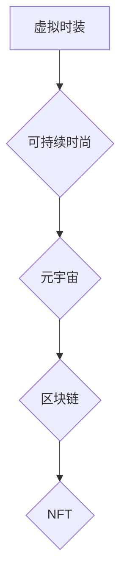

                 

## 虚拟时装可持续性:全球时尚业的环保数字化转型

> 关键词：虚拟时装、可持续时尚、元宇宙、区块链、NFT、数字孪生、环保科技、时尚科技

## 1. 背景介绍

全球时尚产业正处于一个十字路口。一方面，它以其创意和美学魅力吸引着消费者，另一方面，其对环境和社会的影响日益受到关注。传统服装生产模式耗费大量资源，产生大量废弃物，并存在着劳动剥削等问题。 

近年来，随着科技的进步，虚拟时装应运而生，为时尚产业的可持续发展提供了新的可能性。虚拟时装是指存在于数字世界中的服装，可以穿戴在虚拟形象上，例如游戏角色、社交媒体头像等。它与现实世界中的服装不同，不需要实体生产，因此可以有效减少对环境的影响。

## 2. 核心概念与联系

### 2.1 虚拟时装

虚拟时装是指在数字环境中存在的服装，可以被虚拟角色或用户在虚拟世界中穿戴。它可以是完全虚拟的，也可以是基于现实世界服装的数字化模型。

### 2.2 可持续时尚

可持续时尚是指在整个服装生命周期中，从设计、生产、销售到回收利用，都尽可能减少对环境和社会的影响的时尚理念。

### 2.3 元宇宙

元宇宙是一个由虚拟现实、增强现实和互联网连接的沉浸式数字世界，用户可以在其中创建、分享和体验虚拟内容。

### 2.4 区块链

区块链是一种分布式账本技术，可以记录和验证交易信息，确保数据的安全性和透明性。

### 2.5 NFT

NFT（非同质化代币）是一种基于区块链技术的数字资产，代表着独一无二的数字物品，例如虚拟时装。

**核心概念与联系流程图**



## 3. 核心算法原理 & 具体操作步骤

### 3.1 算法原理概述

虚拟时装的可持续性主要依赖于以下算法原理：

* **3D建模算法**: 用于创建虚拟服装的3D模型，可以利用现有服装数据进行数字化重建，或者通过新的设计进行创作。
* **纹理映射算法**: 用于将图案、颜色和材质应用于虚拟服装的3D模型，可以实现逼真的视觉效果。
* **物理模拟算法**: 用于模拟虚拟服装在虚拟环境中的运动和变形，可以使虚拟服装更加逼真和交互性强。
* **区块链验证算法**: 用于确保虚拟服装的唯一性和所有权，可以防止虚拟服装的盗版和欺诈。

### 3.2 算法步骤详解

1. **设计阶段**: 设计师使用3D建模软件创建虚拟服装的3D模型，并应用纹理映射算法实现服装的外观。
2. **生成阶段**: 利用物理模拟算法，模拟虚拟服装在虚拟环境中的运动和变形，并生成相应的动画效果。
3. **验证阶段**: 将虚拟服装的3D模型和相关数据存储在区块链网络中，并使用区块链验证算法生成NFT，证明虚拟服装的唯一性和所有权。
4. **体验阶段**: 用户可以通过虚拟现实设备或其他平台，体验虚拟服装的穿着效果，并进行社交互动。

### 3.3 算法优缺点

**优点**:

* **环保**: 不需要实体生产，减少资源消耗和废弃物产生。
* **个性化**: 用户可以根据自己的喜好定制虚拟服装，实现个性化表达。
* **互动性**: 用户可以与虚拟服装进行互动，例如改变颜色、图案和款式。
* **经济效益**: 虚拟服装可以进行交易和转让，为设计师和用户创造新的经济价值。

**缺点**:

* **技术门槛**: 虚拟服装的设计和开发需要一定的技术知识和技能。
* **用户接受度**: 一些用户可能对虚拟服装的体验和价值感存在疑问。
* **监管问题**: 虚拟服装的交易和监管尚处于探索阶段，需要制定相应的法律法规。

### 3.4 算法应用领域

* **游戏**: 游戏角色的服装定制和交易。
* **社交媒体**: 用户头像和虚拟形象的个性化表达。
* **电商**: 线上虚拟服装的销售和租赁。
* **时尚设计**: 设计师可以利用虚拟平台进行服装设计和展示。
* **教育**: 虚拟服装可以作为教学工具，帮助学生了解服装设计和制作过程。

## 4. 数学模型和公式 & 详细讲解 & 举例说明

### 4.1 数学模型构建

虚拟时装的可持续性可以被建模为一个多目标优化问题，目标函数包括环境影响、社会影响和经济效益。

**环境影响**: 可以通过计算虚拟服装生产过程中的能源消耗、水资源消耗和废弃物产生量来衡量。

**社会影响**: 可以通过评估虚拟服装生产过程中的劳动条件、公平贸易和社会责任等方面来衡量。

**经济效益**: 可以通过计算虚拟服装的销售收入、利润和市场份额来衡量。

### 4.2 公式推导过程

由于虚拟时装的可持续性是一个复杂的多目标优化问题，没有一个通用的公式可以精确地计算其可持续性指标。

但是，我们可以利用一些数学模型和公式来评估虚拟时装的可持续性，例如：

* **碳足迹计算公式**: 可以计算虚拟服装生产过程中的碳排放量。

$$
\text{碳足迹} = \sum_{i=1}^{n} \text{碳排放系数}_i \times \text{资源消耗}_i
$$

其中，$n$ 是虚拟服装生产过程中的资源消耗类型数量，$\text{碳排放系数}_i$ 是第 $i$ 种资源消耗的碳排放系数，$\text{资源消耗}_i$ 是第 $i$ 种资源消耗量。

* **社会影响评估指标**: 可以使用一些社会影响评估指标来衡量虚拟服装的社会影响，例如劳工权益指数、公平贸易指数等。

### 4.3 案例分析与讲解

例如，我们可以通过计算虚拟服装生产过程中的碳排放量，与传统服装生产过程的碳排放量进行比较，来评估虚拟服装的可持续性优势。

## 5. 项目实践：代码实例和详细解释说明

### 5.1 开发环境搭建

虚拟时装开发环境通常包括以下软件：

* **3D建模软件**: 例如Blender、Maya、3ds Max等。
* **纹理映射软件**: 例如Substance Painter、Photoshop等。
* **物理模拟软件**: 例如Houdini、PhysX等。
* **区块链开发工具**: 例如Truffle、Remix等。

### 5.2 源代码详细实现

由于虚拟时装的开发涉及多个领域和技术，这里只提供一个简单的虚拟服装3D建模代码示例，使用Python和Blender API：

```python
import bpy

# 创建一个新的立方体物体
bpy.ops.mesh.primitive_cube_add()

# 获取立方体物体
cube = bpy.context.object

# 设置立方体的尺寸
cube.scale = (1, 1, 1)

# 设置立方体的材质
material = bpy.data.materials.new(name="VirtualFabric")
material.diffuse_color = (0.8, 0.6, 0.4, 1.0)  # 设置材质颜色
cube.data.materials.append(material)

# 保存场景
bpy.ops.wm.save_as_mainfile(filepath="virtual_dress.blend")
```

### 5.3 代码解读与分析

这段代码首先使用Blender API创建了一个新的立方体物体，然后设置了立方体的尺寸、材质颜色等属性，最后保存了场景文件。

### 5.4 运行结果展示

运行这段代码后，会在Blender中创建一个新的立方体物体，材质为棕色，可以作为虚拟服装的初始模型。

## 6. 实际应用场景

### 6.1 游戏

虚拟时装可以为游戏角色提供个性化的服装选择，并可以进行交易和转让，为游戏玩家创造新的游戏体验和经济价值。

### 6.2 社交媒体

用户可以在社交媒体平台上使用虚拟时装来表达自己的个性和风格，并与其他用户进行互动。

### 6.3 电商

虚拟时装可以作为一种新的商品在电商平台上销售和租赁，为设计师和用户创造新的商业机会。

### 6.4 未来应用展望

随着元宇宙的发展，虚拟时装的应用场景将会更加广泛，例如：

* **虚拟试衣间**: 用户可以在虚拟环境中试穿虚拟服装，并根据自己的喜好进行定制。
* **虚拟时尚秀**: 设计师可以在虚拟平台上举办虚拟时尚秀，展示最新的虚拟服装设计。
* **虚拟服装租赁**: 用户可以租用虚拟服装，体验不同的风格和场合。

## 7. 工具和资源推荐

### 7.1 学习资源推荐

* **书籍**:

    * 《The Metaverse: And How It Will Revolutionize Everything》
    * 《Fashion Technology: Innovation and Sustainability》

* **在线课程**:

    * Coursera: Fashion Design and Technology
    * edX: Blockchain Fundamentals

### 7.2 开发工具推荐

* **3D建模软件**: Blender, Maya, 3ds Max
* **纹理映射软件**: Substance Painter, Photoshop
* **物理模拟软件**: Houdini, PhysX
* **区块链开发工具**: Truffle, Remix

### 7.3 相关论文推荐

* **Blockchain Technology for Fashion Supply Chain Management**
* **Virtual Fashion: A Sustainable Approach to the Fashion Industry**

## 8. 总结：未来发展趋势与挑战

### 8.1 研究成果总结

虚拟时装作为一种新的时尚形式，具有环保、个性化、互动性等优势，为时尚产业的可持续发展提供了新的可能性。

### 8.2 未来发展趋势

未来，虚拟时装将会更加逼真、智能和交互性强，并与元宇宙、人工智能等技术深度融合，创造更加丰富的虚拟体验。

### 8.3 面临的挑战

虚拟时装的发展也面临着一些挑战，例如技术门槛高、用户接受度低、监管问题等。

### 8.4 研究展望

未来研究方向包括：

* 开发更加逼真、智能和交互性的虚拟时装技术。
* 探索虚拟时装的商业模式和经济价值。
* 制定虚拟时装的监管政策和标准。


## 9. 附录：常见问题与解答

### 9.1  虚拟时装与现实世界服装的区别是什么？

虚拟时装存在于数字世界中，不需要实体生产，因此可以有效减少对环境的影响。而现实世界服装需要实体生产，会消耗大量资源和产生废弃物。

### 9.2  如何购买和使用虚拟时装？

虚拟时装可以通过电商平台、游戏平台或社交媒体平台购买。使用虚拟时装需要使用相应的虚拟平台或设备，例如虚拟现实设备或游戏角色。

### 9.3  虚拟时装的未来发展趋势是什么？

虚拟时装的未来发展趋势包括更加逼真、智能和交互性强，并与元宇宙、人工智能等技术深度融合，创造更加丰富的虚拟体验。


作者：禅与计算机程序设计艺术 / Zen and the Art of Computer Programming 
<end_of_turn>

