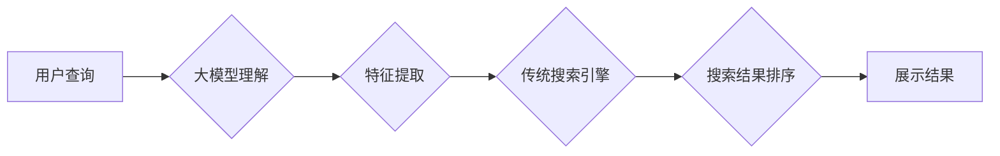

                 

## 融合大模型的搜索系统：效果评估与优化

> 关键词：大模型、搜索系统、信息检索、自然语言处理、效果评估、优化

### 1. 背景介绍

随着互联网信息爆炸式增长，传统的基于关键词匹配的搜索系统已难以满足用户日益复杂的搜索需求。用户不再仅仅依赖精确的关键词查询，而是倾向于使用更自然、更语义化的表达方式进行信息检索。大模型的出现为搜索系统带来了新的机遇。大模型，尤其是具备强大的文本理解和生成能力的Transformer模型，能够理解用户查询的深层语义，并生成更精准、更相关的搜索结果。

融合大模型的搜索系统，通过将大模型的文本理解能力与传统的搜索引擎技术相结合，能够实现以下优势：

* **更精准的语义理解:** 大模型能够理解用户查询的上下文和意图，即使用户使用模糊或不完整的关键词，也能准确识别其搜索需求。
* **更丰富的搜索结果:** 大模型可以生成多种类型的搜索结果，包括文本、图像、视频等，满足用户多样化的信息需求。
* **更个性化的搜索体验:** 大模型可以根据用户的搜索历史、偏好等信息，提供个性化的搜索结果推荐。

### 2. 核心概念与联系

#### 2.1 核心概念

* **大模型 (Large Language Model, LLM):** 指参数量巨大、训练数据海量的人工智能模型，具备强大的文本理解和生成能力。常见的LLM包括BERT、GPT、T5等。
* **搜索引擎 (Search Engine):**  通过索引和检索技术，帮助用户快速找到所需信息。传统的搜索引擎主要依赖关键词匹配算法。
* **信息检索 (Information Retrieval, IR):**  指从海量信息中找到满足用户需求的信息的过程。

#### 2.2 架构

融合大模型的搜索系统通常采用以下架构：



**流程说明:**

1. 用户输入查询语句。
2. 大模型对用户查询进行理解，提取关键信息和语义。
3. 特征提取模块将大模型的输出转换为可供传统搜索引擎处理的特征向量。
4. 传统搜索引擎根据特征向量检索相关文档。
5. 搜索结果进行排序，并根据用户偏好等因素进行个性化展示。

### 3. 核心算法原理 & 具体操作步骤

#### 3.1 算法原理概述

融合大模型的搜索系统主要依赖以下核心算法:

* **Transformer模型:** 用于理解用户查询的语义，提取关键信息。
* **Embedding技术:** 将文本转换为向量表示，方便进行语义相似度计算。
* **检索算法:** 用于从海量文档中检索与用户查询相关的文档。常见的检索算法包括BM25、TF-IDF等。
* **排序算法:** 用于对检索结果进行排序，并根据用户偏好等因素进行个性化展示。常见的排序算法包括BM25、RankNet等。

#### 3.2 算法步骤详解

1. **预处理:** 对用户查询和文档进行预处理，包括分词、去停用词、词干提取等。
2. **特征提取:** 使用Transformer模型对用户查询进行编码，生成其语义表示。
3. **文档检索:** 使用检索算法根据用户查询的语义表示，从文档库中检索相关文档。
4. **结果排序:** 使用排序算法对检索结果进行排序，并根据用户偏好等因素进行个性化展示。
5. **结果展示:** 将排序后的结果以列表、卡片等形式展示给用户。

#### 3.3 算法优缺点

**优点:**

* **更精准的语义理解:** Transformer模型能够理解用户查询的深层语义，提高搜索结果的准确性。
* **更丰富的搜索结果:** 大模型可以生成多种类型的搜索结果，满足用户多样化的信息需求。
* **更个性化的搜索体验:** 大模型可以根据用户的搜索历史、偏好等信息，提供个性化的搜索结果推荐。

**缺点:**

* **计算资源消耗大:** Transformer模型参数量巨大，训练和推理都需要大量的计算资源。
* **数据依赖性强:** 大模型的性能依赖于训练数据的质量和数量。
* **可解释性差:** Transformer模型的决策过程较为复杂，难以解释其搜索结果的生成机制。

#### 3.4 算法应用领域

融合大模型的搜索系统在以下领域具有广泛的应用前景:

* **电商搜索:** 提供更精准、更个性化的商品推荐。
* **新闻搜索:** 帮助用户快速找到与他们感兴趣的新闻。
* **学术搜索:** 提高学术论文检索的准确性和效率。
* **医疗搜索:** 帮助医生快速找到相关医学信息。

### 4. 数学模型和公式 & 详细讲解 & 举例说明

#### 4.1 数学模型构建

**Transformer模型的数学模型主要基于以下几个核心组件:**

* **Encoder:** 用于编码用户查询的语义信息。
* **Decoder:** 用于解码编码后的语义信息，生成搜索结果。
* **Attention机制:** 用于捕捉用户查询和文档之间的语义关系。

**Encoder和Decoder的结构通常由多层Transformer模块组成，每个Transformer模块包含以下组件:**

* **Multi-Head Attention:** 多头注意力机制，用于捕捉不同层级的语义信息。
* **Feed-Forward Network:** 全连接神经网络，用于对每个词的语义表示进行进一步的变换。
* **Layer Normalization:** 层归一化，用于稳定模型训练。
* **Residual Connection:** 残差连接，用于缓解梯度消失问题。

#### 4.2 公式推导过程

**Attention机制的核心公式如下:**

$$
Attention(Q, K, V) = softmax(\frac{QK^T}{\sqrt{d_k}})V
$$

其中:

* $Q$：查询矩阵
* $K$：键矩阵
* $V$：值矩阵
* $d_k$：键向量的维度
* $softmax$：softmax函数，用于归一化注意力权重

**Multi-Head Attention机制**是将多个独立的Attention头并行执行，并对它们的输出进行融合。

#### 4.3 案例分析与讲解

**举例说明:**

假设用户查询“苹果手机”，而文档库中有一篇关于“iPhone 13”的文档。

* Transformer模型会将“苹果手机”编码为一个语义向量，并将其与文档的语义向量进行比较。
* Attention机制会计算出“苹果手机”和“iPhone 13”之间的语义相似度，并赋予相应的权重。
* Decoder模块会根据Attention机制的输出，生成关于“iPhone 13”的搜索结果。

### 5. 项目实践：代码实例和详细解释说明

#### 5.1 开发环境搭建

* **操作系统:** Linux/macOS
* **编程语言:** Python
* **深度学习框架:** TensorFlow/PyTorch
* **其他依赖:** NLTK、spaCy等自然语言处理库

#### 5.2 源代码详细实现

```python
# 使用BERT模型对用户查询进行编码
from transformers import BertTokenizer, BertModel

tokenizer = BertTokenizer.from_pretrained('bert-base-uncased')
model = BertModel.from_pretrained('bert-base-uncased')

user_query = "苹果手机"
encoded_query = tokenizer(user_query, return_tensors="pt")

bert_output = model(**encoded_query)

# 使用检索算法检索相关文档
# ...

# 使用排序算法对检索结果进行排序
# ...

# 展示搜索结果
# ...
```

#### 5.3 代码解读与分析

* **BERT模型:** 使用预训练的BERT模型对用户查询进行编码，提取其语义信息。
* **Tokenizer:** 使用BERT的Tokenizer对用户查询进行分词和标记化。
* **检索算法:** 使用BM25等检索算法从文档库中检索相关文档。
* **排序算法:** 使用RankNet等排序算法对检索结果进行排序。

#### 5.4 运行结果展示

* 搜索结果列表，包含标题、摘要和链接等信息。
* 搜索结果卡片，包含标题、图片、摘要和链接等信息。

### 6. 实际应用场景

#### 6.1 电商搜索

融合大模型的搜索系统可以帮助电商平台提供更精准、更个性化的商品推荐。例如，用户搜索“运动鞋”，系统可以根据用户的性别、年龄、购买历史等信息，推荐不同类型的运动鞋。

#### 6.2 新闻搜索

融合大模型的搜索系统可以帮助用户快速找到与他们感兴趣的新闻。例如，用户搜索“科技新闻”，系统可以根据用户的阅读偏好，推荐最新的科技新闻。

#### 6.3 学术搜索

融合大模型的搜索系统可以提高学术论文检索的准确性和效率。例如，用户搜索“机器学习”，系统可以根据用户的研究领域，推荐相关的学术论文。

#### 6.4 未来应用展望

* **多模态搜索:** 将文本、图像、音频等多种模态信息融合在一起，提供更丰富的搜索体验。
* **对话式搜索:** 通过自然语言对话的方式，帮助用户更直观地表达搜索需求。
* **个性化搜索:** 根据用户的兴趣、偏好等信息，提供更个性化的搜索结果推荐。

### 7. 工具和资源推荐

#### 7.1 学习资源推荐

* **书籍:**
    * 《深度学习》
    * 《自然语言处理》
    * 《Transformer模型》
* **在线课程:**
    * Coursera: 深度学习
    * edX: 自然语言处理
    * fast.ai: 深度学习

#### 7.2 开发工具推荐

* **深度学习框架:** TensorFlow, PyTorch
* **自然语言处理库:** NLTK, spaCy
* **搜索引擎平台:** Elasticsearch, Solr

#### 7.3 相关论文推荐

* **Attention Is All You Need:** https://arxiv.org/abs/1706.03762
* **BERT: Pre-training of Deep Bidirectional Transformers for Language Understanding:** https://arxiv.org/abs/1810.04805
* **T5: Text-to-Text Transfer Transformer:** https://arxiv.org/abs/1910.10683

### 8. 总结：未来发展趋势与挑战

#### 8.1 研究成果总结

融合大模型的搜索系统取得了显著的进展，在语义理解、结果多样性和个性化推荐等方面表现出色。

#### 8.2 未来发展趋势

* **模型规模和能力的提升:** 随着计算资源的不断发展，大模型的规模和能力将进一步提升，带来更精准、更智能的搜索体验。
* **多模态搜索的融合:** 将文本、图像、音频等多种模态信息融合在一起，提供更丰富的搜索体验。
* **对话式搜索的普及:** 通过自然语言对话的方式，帮助用户更直观地表达搜索需求。
* **可解释性研究的加强:** 研究大模型的决策过程，提高搜索结果的可解释性。

#### 8.3 面临的挑战

* **计算资源消耗:** 大模型的训练和推理需要大量的计算资源，这对于资源有限的机构或个人来说是一个挑战。
* **数据依赖性:** 大模型的性能依赖于训练数据的质量和数量，高质量的训练数据是构建高性能搜索系统的关键。
* **可解释性问题:** 大模型的决策过程较为复杂，难以解释其搜索结果的生成机制，这可能会导致用户对搜索结果的信任度降低。

#### 8.4 研究展望

未来，融合大模型的搜索系统将朝着更智能、更个性化、更可解释的方向发展。研究者将继续探索新的模型架构、训练方法和评估指标，以提高搜索系统的性能和用户体验。

### 9. 附录：常见问题与解答

* **Q: 如何选择合适的检索算法?**

A: 选择合适的检索算法取决于具体的应用场景和数据特点。对于文本数据，常见的检索算法包括BM25、TF-IDF等。

* **Q: 如何评估融合大模型的搜索系统的效果?**

A: 可以使用传统的搜索评估指标，例如MAP、NDCG等，也可以使用更先进的指标，例如BERT-score、ROUGE等。

* **Q: 如何解决大模型的计算资源消耗问题?**

A: 可以使用模型压缩、模型剪枝等技术来减小模型规模，降低计算资源消耗。也可以使用分布式训练和推理技术，将模型部署在多个机器上进行训练和推理。


作者：禅与计算机程序设计艺术 / Zen and the Art of Computer Programming 
<end_of_turn>

