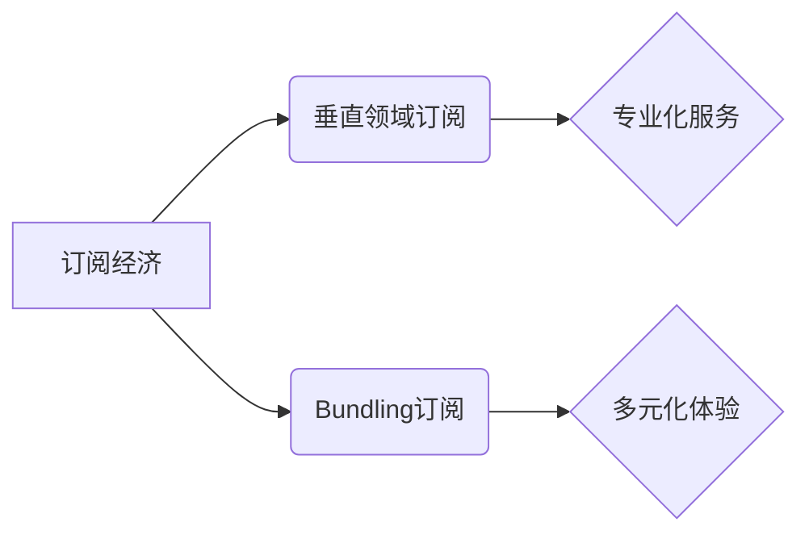

                 

## 订阅制经济的市场细分:垂直领域订阅和bundling订阅

> 关键词：订阅经济,垂直领域订阅,bundling订阅,市场细分,商业模式,用户体验,数据驱动

## 1. 背景介绍

订阅经济近年来蓬勃发展，其模式简单易懂，用户体验良好，为企业带来了稳定的收入流。然而，随着市场竞争的加剧，单纯依靠订阅模式难以满足用户日益多样化的需求。因此，订阅经济开始向细分化发展，其中垂直领域订阅和bundling订阅成为两大主要趋势。

### 1.1 订阅经济的崛起

订阅经济是指用户以定期付费的方式获取商品或服务的商业模式。其核心特点是：

* **持续收入:** 企业通过用户持续的订阅付费获得稳定的收入流，降低了销售周期和客户获取成本。
* **用户粘性:** 订阅模式建立了用户与企业的长期关系，提高了用户粘性。
* **数据驱动:** 订阅服务能够收集用户使用数据，帮助企业了解用户需求，提供个性化服务。

### 1.2 订阅经济的挑战

尽管订阅经济具有诸多优势，但也面临着一些挑战：

* **市场饱和:** 订阅经济市场竞争激烈，新进入者难以获得市场份额。
* **用户流失:** 用户对订阅服务的满意度下降，容易导致用户流失。
* **价格敏感:** 用户对订阅服务的价格敏感度高，企业需要找到合适的定价策略。

## 2. 核心概念与联系

### 2.1 垂直领域订阅

垂直领域订阅是指针对特定行业或领域的订阅服务。例如，针对律师的法律服务订阅、针对医生的医疗软件订阅等。

### 2.2 Bundling订阅

Bundling订阅是指将多个独立的订阅服务捆绑在一起，以优惠的价格提供给用户。例如，将音乐流媒体、视频流媒体和电子书订阅捆绑在一起。

### 2.3 关系图



## 3. 核心算法原理 & 具体操作步骤

### 3.1 算法原理概述

垂直领域订阅和Bundling订阅的成功关键在于精准的用户画像和个性化服务推荐。这需要利用大数据分析和机器学习算法，从用户行为数据中挖掘用户需求和偏好。

### 3.2 算法步骤详解

1. **数据收集:** 收集用户使用数据，包括用户 demographics、使用行为、反馈信息等。
2. **数据清洗:** 对收集到的数据进行清洗和预处理，去除无效数据和噪声数据。
3. **特征提取:** 从用户数据中提取特征，例如用户年龄、性别、兴趣爱好、使用频率、消费习惯等。
4. **模型训练:** 利用机器学习算法，例如协同过滤、内容推荐、深度学习等，训练用户画像模型。
5. **个性化推荐:** 根据用户画像，推荐个性化的订阅服务。

### 3.3 算法优缺点

**优点:**

* **精准推荐:** 能够根据用户需求精准推荐订阅服务，提高用户满意度。
* **个性化体验:** 为用户提供个性化的订阅服务体验，增强用户粘性。
* **数据驱动:** 基于数据分析，不断优化推荐算法和服务内容。

**缺点:**

* **数据依赖:** 算法效果依赖于数据质量和数量。
* **算法复杂:** 需要专业的技术人员进行算法开发和维护。
* **隐私安全:** 用户数据安全需要得到保障。

### 3.4 算法应用领域

* **电商平台:** 推荐个性化的商品订阅服务。
* **内容平台:** 推荐个性化的视频、音乐、电子书订阅服务。
* **软件服务:** 推荐个性化的软件订阅服务。
* **金融服务:** 推荐个性化的理财、保险订阅服务。

## 4. 数学模型和公式 & 详细讲解 & 举例说明

### 4.1 数学模型构建

用户画像模型可以采用基于用户的协同过滤算法，其核心思想是：

* **相似用户:** 找到与当前用户兴趣爱好相似的其他用户。
* **推荐物品:** 从相似用户的订阅记录中推荐他们订阅过的服务。

### 4.2 公式推导过程

协同过滤算法常用的公式包括：

* **相似度计算:** 使用余弦相似度或皮尔逊相关系数计算用户之间的相似度。

$$
\text{相似度}(u_i, u_j) = \frac{\sum_{k=1}^{n} r_{i,k} \cdot r_{j,k}}{\sqrt{\sum_{k=1}^{n} r_{i,k}^2} \cdot \sqrt{\sum_{k=1}^{n} r_{j,k}^2}}
$$

* **预测评分:** 使用相似度加权平均计算用户对特定服务的预测评分。

$$
\hat{r}_{i,k} = \frac{\sum_{j \in N(i)} \text{相似度}(u_i, u_j) \cdot r_{j,k}}{\sum_{j \in N(i)} \text{相似度}(u_i, u_j)}
$$

其中：

* $u_i$ 和 $u_j$ 表示两个用户。
* $r_{i,k}$ 表示用户 $u_i$ 对服务 $k$ 的评分。
* $N(i)$ 表示与用户 $u_i$ 相似的用户集合。

### 4.3 案例分析与讲解

假设用户 A 和用户 B 都订阅了音乐流媒体服务，用户 A 对流行音乐评分为 5 分，用户 B 对流行音乐评分为 4 分。如果用户 A 和用户 B 的相似度为 0.8，那么根据公式，我们可以预测用户 A 对流行音乐的评分为：

$$
\hat{r}_{A, \text{流行音乐}} = \frac{0.8 \cdot 4}{0.8} = 4
$$

## 5. 项目实践：代码实例和详细解释说明

### 5.1 开发环境搭建

* Python 3.x
* scikit-learn 库
* pandas 库
* matplotlib 库

### 5.2 源代码详细实现

```python
import pandas as pd
from sklearn.metrics.pairwise import cosine_similarity

# 加载用户数据
data = pd.read_csv('user_data.csv')

# 计算用户之间的余弦相似度
similarity_matrix = cosine_similarity(data[['流行音乐', '摇滚乐', '古典音乐']])

# 预测用户对特定服务的评分
def predict_rating(user_id, service_id):
    # 获取用户相似用户
    similar_users = similarity_matrix[user_id].argsort()[:-6:-1]
    # 计算预测评分
    predicted_rating = (similarity_matrix[user_id][similar_users] * data.loc[similar_users, service_id]).sum() / similarity_matrix[user_id][similar_users].sum()
    return predicted_rating

# 预测用户对流行音乐的评分
user_id = 0
predicted_rating = predict_rating(user_id, '流行音乐')
print(f'用户 {user_id} 对流行音乐的预测评分为: {predicted_rating}')
```

### 5.3 代码解读与分析

* 代码首先加载用户数据，并使用 scikit-learn 库的 cosine_similarity 函数计算用户之间的余弦相似度。
* 然后，定义了一个 predict_rating 函数，用于预测用户对特定服务的评分。该函数首先获取用户相似用户，然后使用相似度加权平均计算预测评分。
* 最后，代码演示了如何使用 predict_rating 函数预测用户对流行音乐的评分。

### 5.4 运行结果展示

运行结果将显示用户对流行音乐的预测评分。

## 6. 实际应用场景

### 6.1 垂直领域订阅

* **法律服务:** 为律师提供针对不同法律领域的订阅服务，例如合同法、民事诉讼法等。
* **医疗软件:** 为医生提供针对不同医疗专业的订阅服务，例如心血管疾病、肿瘤学等。
* **教育培训:** 为学生提供针对不同学科的订阅服务，例如数学、物理、化学等。

### 6.2 Bundling订阅

* **内容平台:** 将音乐流媒体、视频流媒体、电子书订阅捆绑在一起，提供优惠套餐。
* **软件服务:** 将办公软件、设计软件、开发软件捆绑在一起，提供企业级订阅服务。
* **生活服务:** 将外卖、打车、购物等生活服务捆绑在一起，提供综合性订阅服务。

### 6.4 未来应用展望

随着人工智能技术的不断发展，垂直领域订阅和Bundling订阅将更加精准化、个性化。未来，我们可以看到：

* **更细分的订阅服务:** 订阅服务将更加细分，满足用户更个性化的需求。
* **更智能的推荐:** 基于人工智能算法，订阅服务将更加智能化，能够精准推荐用户感兴趣的服务。
* **更丰富的体验:** 订阅服务将更加丰富，提供更多元的体验，例如线下活动、社区互动等。

## 7. 工具和资源推荐

### 7.1 学习资源推荐

* **书籍:**
    * 《推荐系统实践》
    * 《机器学习》
* **在线课程:**
    * Coursera: Machine Learning
    * edX: Artificial Intelligence

### 7.2 开发工具推荐

* **Python:** 
    * scikit-learn
    * pandas
    * matplotlib
* **云平台:**
    * AWS
    * Azure
    * GCP

### 7.3 相关论文推荐

* **协同过滤算法:**
    * "Collaborative Filtering: A User-Based Approach"
    * "Memory-Based Collaborative Filtering"
* **推荐系统:**
    * "Survey on Recommender Systems"
    * "Deep Learning for Recommender Systems"

## 8. 总结：未来发展趋势与挑战

### 8.1 研究成果总结

垂直领域订阅和Bundling订阅是订阅经济发展的重要趋势，能够满足用户日益多样化的需求。通过大数据分析和机器学习算法，我们可以构建精准的用户画像，提供个性化的订阅服务推荐。

### 8.2 未来发展趋势

* **更细分化的订阅服务:** 订阅服务将更加细分，满足用户更个性化的需求。
* **更智能的推荐:** 基于人工智能算法，订阅服务将更加智能化，能够精准推荐用户感兴趣的服务。
* **更丰富的体验:** 订阅服务将更加丰富，提供更多元的体验，例如线下活动、社区互动等。

### 8.3 面临的挑战

* **数据安全:** 用户数据安全需要得到保障。
* **算法公平性:** 算法需要避免歧视和偏见，确保公平性。
* **用户隐私:** 用户隐私需要得到尊重，避免过度收集和利用用户数据。

### 8.4 研究展望

未来，我们需要继续研究更精准、更智能、更安全的订阅服务推荐算法，并探索新的订阅服务模式，为用户提供更优质的体验。

## 9. 附录：常见问题与解答

### 9.1 如何提高用户画像的准确性？

* 收集更多用户数据，包括用户 demographics、使用行为、反馈信息等。
* 使用更先进的机器学习算法，例如深度学习算法。
* 定期更新用户画像模型，以适应用户需求的变化。

### 9.2 如何避免算法歧视和偏见？

* 使用公平的算法模型，避免算法对特定用户群体产生歧视。
* 定期评估算法的公平性，并进行必要的调整。
* 鼓励多元化的用户数据，避免算法过度依赖特定用户群体的特征。


作者：禅与计算机程序设计艺术 / Zen and the Art of Computer Programming 
<end_of_turn>

