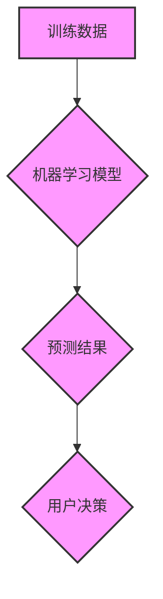

                 

## 认知偏见：影响知识理解的心理因素

> 关键词：认知偏见、知识理解、心理因素、算法、机器学习、深度学习、数据科学

## 1. 背景介绍

在数据驱动时代，我们越来越依赖于算法和机器学习模型来理解和解释世界。然而，这些模型的输出并非总是客观公正的，因为它们受到训练数据和算法本身的局限性影响。其中一个关键因素就是**认知偏见**。

认知偏见是指人们在获取、处理和解释信息时，由于心理机制和经验的影响，而产生的偏差或错误判断。这些偏见可能源于我们的文化背景、个人经历、情绪状态等多种因素，并潜移默化地影响我们的思维方式和决策过程。

在人工智能领域，认知偏见问题尤为突出。因为机器学习模型的训练数据往往来自人类，而人类本身就存在着各种各样的认知偏见。如果这些偏见被模型学习并放大，就会导致模型产生不公平、不准确甚至有害的预测结果。

例如，在招聘领域，如果训练数据中存在性别或种族偏见，那么模型可能会倾向于选择男性或特定种族候选人，从而加剧社会不平等。在医疗领域，如果模型训练数据中存在医疗资源分配不均的偏见，那么模型可能会对特定人群的疾病诊断和治疗效果产生偏差。

## 2. 核心概念与联系

### 2.1 认知偏见类型

认知偏见种类繁多，一些常见的类型包括：

* **确认偏见 (Confirmation Bias):** 倾向于搜索和解释信息，以证实自己已有的信念，而忽略或淡化与之相悖的信息。
* **锚定效应 (Anchoring Bias):** 在做出判断时，过度依赖第一个获得的信息，即使该信息并不完全准确或相关。
* **可用性启示 (Availability Heuristic):** 倾向于根据容易回忆起的例子来判断事件发生的概率，而忽略了统计数据和客观事实。
* **框架效应 (Framing Effect):** 不同表达方式会影响人们的判断和决策，即使信息内容相同。

### 2.2 认知偏见与机器学习

机器学习模型的训练过程本质上是一个从数据中学习模式的过程。然而，如果训练数据本身就存在认知偏见，那么模型就会学习并放大这些偏见，从而产生不公平或不准确的结果。

**Mermaid 流程图：**



## 3. 核心算法原理 & 具体操作步骤

### 3.1 算法原理概述

为了识别和减轻认知偏见的影响，研究人员开发了许多算法和技术，例如：

* **公平性约束优化 (Fairness-Constrained Optimization):** 在训练机器学习模型时，加入公平性约束条件，例如确保模型对不同群体预测结果的差异在可接受范围内。
* **对抗训练 (Adversarial Training):** 通过训练一个对抗模型来识别和对抗偏见，从而提高模型的公平性。
* **数据增强 (Data Augmentation):** 通过人工增加训练数据，例如对现有数据进行合成或重采样，来缓解数据偏差的影响。

### 3.2 算法步骤详解

以公平性约束优化为例，其具体操作步骤如下：

1. **定义公平性指标:** 选择一个合适的公平性指标来衡量模型的偏见程度，例如均等机会、不确定性公平等。
2. **构建优化目标函数:** 将公平性指标纳入模型的优化目标函数中，使得模型在训练过程中不仅要追求预测准确率，还要尽量减少公平性指标的违背。
3. **训练模型:** 使用优化算法训练模型，使得模型的预测结果满足公平性约束条件。
4. **评估模型公平性:** 使用测试数据评估模型的公平性，并根据评估结果进行模型调整和优化。

### 3.3 算法优缺点

**优点:**

* 可以有效地减轻模型的偏见程度。
* 能够提高模型的公平性和可解释性。

**缺点:**

* 需要对公平性指标进行仔细选择和定义。
* 可能会导致模型的预测准确率下降。
* 算法的复杂度较高，需要一定的专业知识和技术能力。

### 3.4 算法应用领域

公平性约束优化和对抗训练等算法在许多领域都有应用，例如：

* **招聘:** 避免模型对性别、种族等因素产生偏见，确保招聘过程更加公平公正。
* **医疗:** 避免模型对不同人群的疾病诊断和治疗效果产生偏差，确保医疗资源的公平分配。
* **金融:** 避免模型对不同人群的贷款申请产生偏见，确保金融服务的公平性。

## 4. 数学模型和公式 & 详细讲解 & 举例说明

### 4.1 数学模型构建

假设我们有一个分类模型，其目标是预测样本属于某个类别。我们可以使用以下公式来衡量模型的公平性：

$$DisparateImpact = \frac{TP_1 + FN_1}{TP_1 + FP_1 + TN_1 + FN_1} / \frac{TP_0 + FN_0}{TP_0 + FP_0 + TN_0 + FN_0}$$

其中：

* $TP_i$ 表示类别 $i$ 的真阳性样本数。
* $FP_i$ 表示类别 $i$ 的假阳性样本数。
* $TN_i$ 表示类别 $i$ 的真阴性样本数。
* $FN_i$ 表示类别 $i$ 的假阴性样本数。

### 4.2 公式推导过程

该公式的推导过程基于统计学中的**比例检验**。

DisparateImpact衡量的是两个类别样本被模型预测为正例的比例之差。如果DisparateImpact的值接近1，则表示模型对两个类别具有公平的预测效果。如果DisparateImpact的值大于1，则表示模型对某个类别具有更高的预测准确率，而对另一个类别则具有较低的预测准确率，存在偏见。

### 4.3 案例分析与讲解

假设我们有一个模型用于预测贷款申请是否成功。我们发现模型对男性申请人的预测准确率为80%，而对女性申请人的预测准确率为60%。

根据上述公式，我们可以计算出DisparateImpact的值为：

$$DisparateImpact = \frac{TP_M + FN_M}{TP_M + FP_M + TN_M + FN_M} / \frac{TP_F + FN_F}{TP_F + FP_F + TN_F + FN_F}$$

如果DisparateImpact的值大于1，则说明模型对男性申请人存在偏见，需要进行调整和优化。

## 5. 项目实践：代码实例和详细解释说明

### 5.1 开发环境搭建

为了演示公平性约束优化算法的应用，我们可以使用Python语言和Scikit-learn库进行开发。

需要安装以下软件包：

* Python 3.x
* Scikit-learn
* NumPy
* Pandas

### 5.2 源代码详细实现

```python
from sklearn.linear_model import LogisticRegression
from sklearn.model_selection import train_test_split
from sklearn.metrics import accuracy_score

# 加载数据
data = ...

# 将数据分为特征和标签
X = data.drop('target', axis=1)
y = data['target']

# 将数据分为训练集和测试集
X_train, X_test, y_train, y_test = train_test_split(X, y, test_size=0.2, random_state=42)

# 定义公平性指标
def disparate_impact(y_true, y_pred):
    # 计算DisparateImpact值
    return ...

# 定义公平性约束优化目标函数
def fairness_loss(y_true, y_pred, alpha=0.1):
    # 计算模型的预测损失和公平性损失
    return ...

# 创建公平性约束优化模型
model = LogisticRegression(penalty='l2', solver='liblinear', random_state=42)

# 训练模型
model.fit(X_train, y_train)

# 评估模型性能
y_pred = model.predict(X_test)
accuracy = accuracy_score(y_test, y_pred)
disparate_impact_value = disparate_impact(y_test, y_pred)

# 打印结果
print(f'Accuracy: {accuracy}')
print(f'Disparate Impact: {disparate_impact_value}')
```

### 5.3 代码解读与分析

这段代码演示了如何使用Scikit-learn库训练一个公平性约束优化模型。

首先，我们定义了公平性指标和公平性约束优化目标函数。然后，我们创建了一个LogisticRegression模型，并使用训练数据训练模型。最后，我们评估了模型的性能，并计算了DisparateImpact值。

### 5.4 运行结果展示

运行结果将显示模型的准确率和DisparateImpact值。如果DisparateImpact值大于1，则说明模型存在偏见，需要进行调整和优化。

## 6. 实际应用场景

### 6.1 医疗领域

在医疗领域，认知偏见可能会导致模型对不同种族或性别患者的诊断和治疗效果产生偏差。例如，如果模型训练数据中存在医疗资源分配不均的偏见，那么模型可能会对特定人群的疾病诊断和治疗效果产生偏差。

### 6.2 金融领域

在金融领域，认知偏见可能会导致模型对不同收入水平或信用评分的客户进行不公平的贷款审批。例如，如果模型训练数据中存在种族或性别偏见，那么模型可能会对特定人群的贷款申请产生偏见。

### 6.3 教育领域

在教育领域，认知偏见可能会导致模型对不同背景或能力的学生进行不公平的成绩预测或资源分配。例如，如果模型训练数据中存在社会经济地位偏见，那么模型可能会对来自低收入家庭的学生进行不公平的成绩预测。

### 6.4 未来应用展望

随着人工智能技术的不断发展，认知偏见问题将变得更加突出。因此，我们需要不断探索新的算法和技术来识别和减轻认知偏见的影响，确保人工智能技术能够公平、公正地服务于人类社会。

## 7. 工具和资源推荐

### 7.1 学习资源推荐

* **书籍:**
    * "Weapons of Math Destruction: How Big Data Increases Inequality and Threatens Democracy" by Cathy O'Neil
    * "Fairness and Machine Learning" by  Sarah M. Bender, Timnit Gebru, Angelina McMillan-Major, and Margaret Mitchell
* **在线课程:**
    * "Fairness in Machine Learning" by Stanford University
    * "Algorithmic Fairness" by Google AI

### 7.2 开发工具推荐

* **Scikit-learn:** 一个用于机器学习的Python库，提供多种公平性约束优化算法。
* **TensorFlow Fairness:** 一个用于 TensorFlow 的公平性工具包，提供多种公平性评估和优化方法。
* **AIF360:** 一个用于公平性评估和解释的开源工具包，支持多种机器学习算法和公平性指标。

### 7.3 相关论文推荐

* "On the Dangers of Stochastic Parrots: Can Language Models Be Too Big?" by Emily M. Bender, Timnit Gebru, Angelina McMillan-Major, and Margaret Mitchell
* "Mitigating Bias in Machine Learning" by  Arvind Narayanan and Vivek Ravindran
* "Fairness through Awareness" by  Virginia Eubanks

## 8. 总结：未来发展趋势与挑战

### 8.1 研究成果总结

近年来，在认知偏见和公平性方面取得了显著进展。研究人员开发了许多算法和技术来识别和减轻认知偏见的影响，并提出了多种公平性指标和评估方法。

### 8.2 未来发展趋势

未来，认知偏见和公平性研究将继续朝着以下方向发展：

* **更深入的理论研究:** 探索认知偏见产生的机制和影响因素，并建立更完善的理论框架。
* **更有效的算法和技术:** 开发更有效的算法和技术来识别、减轻和预防认知偏见。
* **更广泛的应用场景:** 将公平性技术应用到更多领域，例如医疗、金融、教育等，确保人工智能技术能够公平、公正地服务于人类社会。

### 8.3 面临的挑战

尽管取得了进展，但认知偏见和公平性问题仍然面临着许多挑战：

* **数据偏差:** 训练数据本身可能存在认知偏见，难以完全消除。
* **公平性指标的定义:** 不同的公平性指标可能具有不同的含义和适用范围，需要根据具体应用场景进行选择和调整。
* **解释性和透明度:** 一些公平性算法的内部机制较为复杂，难以解释和理解，这可能会阻碍其应用和推广。

### 8.4 研究展望

未来，我们需要继续加强认知偏见和公平性方面的研究，探索更有效的解决方案，并推动人工智能技术朝着更加公平、公正的方向发展。


## 9. 附录：常见问题与解答

### 9.1 如何识别数据中的认知偏见？

识别数据中的认知偏见需要结合多种方法，例如：

* **数据可视化:** 使用图表和统计分析工具来观察数据分布和特征之间的关系，寻找潜在的偏见。
* **偏见检测工具:** 使用专门的偏见检测工具来识别数据中的各种类型的偏见。
* **专家评估:** 邀请领域专家对数据进行评估，识别潜在的认知偏见。

### 9.2 如何减轻数据中的认知偏见？

减轻数据中的认知偏见可以通过以下方法：

* **数据收集:** 在收集数据时，注意确保数据样本的多样性和代表性。
* **数据清洗:** 对数据进行清洗和预处理，去除明显的有偏数据。
* **数据增强:** 通过人工合成或重采样数据，增加数据样本的多样性。
* **公平性约束优化:** 在训练模型时，加入公平性约束条件，引导模型学习更公平的决策规则。


作者：禅与计算机程序设计艺术 / Zen and the Art of Computer Programming 
<end_of_turn>

