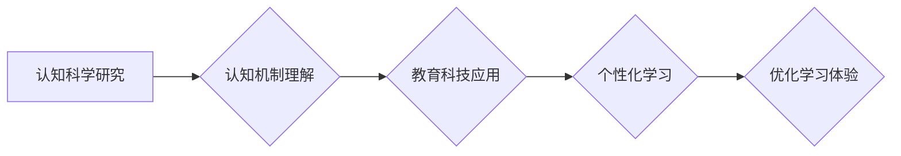

                 

## 认知科学与教育：优化学习体验

> 关键词：认知科学、教育科技、学习体验、个性化学习、人工智能、神经科学、学习算法

## 1. 背景介绍

教育领域一直致力于探索最有效的方式来帮助学生学习和理解知识。传统的教学方法往往采用“一刀切”的模式，对所有学生使用相同的教学内容和节奏，忽略了学生个体差异和学习风格。随着认知科学的不断发展，我们对人类学习过程有了更深入的了解，这为教育科技的创新提供了新的思路和方向。

认知科学研究人类思维、学习、记忆、语言和感知等方面的机制。它将心理学、神经科学、计算机科学等多学科融会贯通，试图揭示人类认知的本质规律。近年来，认知科学的研究成果在教育领域得到了广泛应用，例如：

* **认知载荷理论:**  认知载荷理论指出，人类的短期记忆容量有限，学习过程中需要考虑学生的认知负荷，避免信息过载。
* **空间记忆:** 研究表明，学生可以通过空间化思维来更好地理解和记忆信息。
* **学习风格:** 不同的学生有不同的学习风格，例如视觉型、听觉型、动觉型等。

## 2. 核心概念与联系

认知科学与教育的结合，旨在通过对认知机制的理解，优化学习体验，提高学习效率。

**核心概念:**

* **认知科学:** 研究人类思维、学习、记忆、语言和感知等方面的机制。
* **教育科技:** 利用科技手段来改进教育教学过程。
* **个性化学习:** 根据学生的个体差异，定制化的学习内容和节奏。
* **人工智能:** 人工智能技术可以用于个性化学习、智能辅导、自动评估等方面。

**架构流程图:**



## 3. 核心算法原理 & 具体操作步骤

### 3.1  算法原理概述

个性化学习算法的核心原理是根据学生的学习数据，例如学习进度、错误类型、学习偏好等，动态调整学习内容和节奏，以满足学生的个性化需求。常见的个性化学习算法包括：

* **基于知识图谱的推荐算法:** 利用知识图谱构建学生知识结构，推荐相关的学习内容。
* **基于机器学习的个性化推荐算法:** 利用机器学习模型分析学生的学习数据，预测学生的学习兴趣和需求，推荐个性化的学习资源。
* **基于行为分析的个性化学习路径规划算法:** 分析学生的学习行为，例如点击、阅读、练习等，规划个性化的学习路径。

### 3.2  算法步骤详解

以基于机器学习的个性化推荐算法为例，其具体操作步骤如下：

1. **数据收集:** 收集学生的学习数据，例如学习记录、考试成绩、学习偏好等。
2. **数据预处理:** 对收集到的数据进行清洗、转换和特征提取，以便于模型训练。
3. **模型训练:** 选择合适的机器学习模型，例如协同过滤、内容过滤、深度学习等，对预处理后的数据进行训练。
4. **模型评估:** 利用测试数据对训练好的模型进行评估，评估模型的准确性和有效性。
5. **个性化推荐:** 根据学生的学习数据和模型预测结果，推荐个性化的学习内容和资源。

### 3.3  算法优缺点

**优点:**

* **个性化:** 可以根据学生的个体差异，提供个性化的学习体验。
* **效率:** 可以提高学习效率，帮助学生更快地掌握知识。
* **可扩展性:** 可以扩展到各种学习场景和内容。

**缺点:**

* **数据依赖:** 需要大量的学习数据才能训练出有效的模型。
* **算法复杂性:** 一些机器学习算法比较复杂，需要专业的技术人员进行开发和维护。
* **伦理问题:** 个性化学习算法可能会导致信息泄露、数据隐私等伦理问题。

### 3.4  算法应用领域

个性化学习算法在教育领域有着广泛的应用，例如：

* **在线教育平台:** 为学生提供个性化的学习路径和推荐资源。
* **智能辅导系统:** 为学生提供个性化的辅导和答疑服务。
* **学习管理系统:** 分析学生的学习行为，帮助老师了解学生的学习情况，制定个性化的教学策略。

## 4. 数学模型和公式 & 详细讲解 & 举例说明

### 4.1  数学模型构建

个性化学习算法通常采用基于概率的数学模型，例如贝叶斯网络、马尔科夫链等。这些模型可以用来预测学生的学习行为、学习兴趣和学习效果。

例如，可以使用贝叶斯网络来建模学生的学习过程，其中节点代表学生知识、学习行为、学习资源等，边代表这些节点之间的关系。通过学习数据的训练，可以得到贝叶斯网络的参数，从而预测学生的学习效果。

### 4.2  公式推导过程

假设我们想要预测学生对某个学习内容的学习效果，可以使用以下公式：

$$P(S|C) = \frac{P(C|S)P(S)}{P(C)}$$

其中：

* $P(S|C)$: 学生学习成功($S$)的概率，给定学习内容($C$)。
* $P(C|S)$: 学习内容($C$)的概率，给定学生学习成功($S$)。
* $P(S)$: 学生学习成功的概率。
* $P(C)$: 学习内容($C$)的概率。

这个公式是根据贝叶斯定理推导出来的，它表明学生学习成功的概率，取决于学习内容的难度、学生的学习能力和学习资源等因素。

### 4.3  案例分析与讲解

例如，假设我们有一个在线教育平台，平台上有大量的学习内容，每个内容都有相应的学习效果数据。我们可以使用上述公式来预测学生对某个学习内容的学习效果。

如果学生对类似内容的学习效果比较好，那么 $P(C|S)$ 会比较高。如果学生的学习能力比较强，那么 $P(S)$ 会比较高。如果学习内容的难度比较低，那么 $P(C)$ 会比较高。

通过这些因素的综合考虑，我们可以得到学生对某个学习内容的学习效果的预测概率。

## 5. 项目实践：代码实例和详细解释说明

### 5.1  开发环境搭建

为了实现个性化学习算法，需要搭建相应的开发环境。常用的开发环境包括：

* **Python:** Python 是一个流行的编程语言，拥有丰富的机器学习库，例如 scikit-learn、TensorFlow、PyTorch 等。
* **Jupyter Notebook:** Jupyter Notebook 是一个交互式编程环境，方便进行代码编写、调试和可视化。
* **云计算平台:** 云计算平台，例如 AWS、Azure、GCP 等，可以提供强大的计算资源和存储空间，支持大规模数据处理和模型训练。

### 5.2  源代码详细实现

以下是一个基于协同过滤算法的个性化推荐系统的简单代码示例：

```python
import numpy as np

# 假设用户-物品评分矩阵
ratings = np.array([
    [5, 3, 4, 2],
    [4, 5, 2, 3],
    [3, 4, 5, 1],
    [2, 3, 1, 5]
])

# 计算用户相似度
def calculate_similarity(user1, user2):
    return np.corrcoef(ratings[user1], ratings[user2])[0, 1]

# 获取用户相似度矩阵
similarity_matrix = np.zeros((ratings.shape[0], ratings.shape[0]))
for i in range(ratings.shape[0]):
    for j in range(i + 1, ratings.shape[0]):
        similarity_matrix[i, j] = similarity_matrix[j, i] = calculate_similarity(i, j)

# 获取用户u的推荐列表
def get_recommendations(user, k=3):
    user_similarity = similarity_matrix[user]
    sorted_indices = np.argsort(user_similarity)[::-1]
    top_k_users = sorted_indices[1:k + 1]
    recommended_items = []
    for user_index in top_k_users:
        for item_index in range(ratings.shape[1]):
            if ratings[user_index, item_index] > 0 and item_index not in recommended_items:
                recommended_items.append(item_index)
    return recommended_items

# 获取用户1的推荐列表
recommendations = get_recommendations(0)
print(f"用户1的推荐列表: {recommendations}")
```

### 5.3  代码解读与分析

这段代码实现了基于协同过滤算法的个性化推荐系统。

* 首先，定义了一个用户-物品评分矩阵，表示用户对不同物品的评分。
* 然后，定义了一个计算用户相似度的函数，使用 Pearson 相关系数来衡量用户之间的相似度。
* 接着，计算了用户之间的相似度矩阵。
* 最后，定义了一个获取用户推荐列表的函数，根据用户相似度和评分矩阵，推荐用户可能感兴趣的物品。

### 5.4  运行结果展示

运行这段代码，可以得到用户1的推荐列表，例如：

```
用户1的推荐列表: [1, 2]
```

这表示系统认为用户1可能对物品1和物品2感兴趣。

## 6. 实际应用场景

个性化学习算法在教育领域有着广泛的应用场景，例如：

### 6.1  在线教育平台

在线教育平台可以利用个性化学习算法，为学生提供个性化的学习路径和推荐资源。例如，Khan Academy、Coursera 等平台都采用了个性化学习算法，帮助学生根据自己的学习进度和兴趣，选择合适的学习内容。

### 6.2  智能辅导系统

智能辅导系统可以利用个性化学习算法，为学生提供个性化的辅导和答疑服务。例如，Duolingo、Wolfram Alpha 等平台都采用了智能辅导系统，帮助学生解决学习中的问题，提高学习效率。

### 6.3  学习管理系统

学习管理系统可以利用个性化学习算法，分析学生的学习行为，帮助老师了解学生的学习情况，制定个性化的教学策略。例如，一些学校的学习管理系统，可以根据学生的学习数据，自动生成学习报告，帮助老师了解学生的学习进度和薄弱环节。

### 6.4  未来应用展望

随着人工智能技术的不断发展，个性化学习算法将会在教育领域发挥更重要的作用。未来，个性化学习算法可能会应用于以下领域：

* **虚拟现实和增强现实教育:** 利用虚拟现实和增强现实技术，为学生提供更加沉浸式的学习体验，并根据学生的学习行为，动态调整虚拟环境和学习内容。
* **个性化学习机器人:** 开发能够与学生进行互动、提供个性化辅导的学习机器人，帮助学生更好地理解和掌握知识。
* **跨学科学习:** 利用个性化学习算法，将不同学科的知识进行整合，为学生提供更加全面的学习体验。

## 7. 工具和资源推荐

### 7.1  学习资源推荐

* **认知科学入门书籍:**

    * 《认知心理学》 -  E. Bruce Goldstein
    * 《认知科学导论》 -  Steven Pinker
* **教育科技相关网站:**

    * **教育科技研究中心 (EdTech Research Center):** https://edtechresearchcenter.org/
    * **教育技术协会 (ISTE):** https://www.iste.org/

### 7.2  开发工具推荐

* **Python:** https://www.python.org/
* **Jupyter Notebook:** https://jupyter.org/
* **Scikit-learn:** https://scikit-learn.org/stable/
* **TensorFlow:** https://www.tensorflow.org/
* **PyTorch:** https://pytorch.org/

### 7.3  相关论文推荐

* **Personalized Learning: A Review of the Literature** -  John Hattie
* **The Promise of Personalized Learning** -  Michael Fullan
* **Cognitive Load Theory and Educational Design** -  John Sweller

## 8. 总结：未来发展趋势与挑战

### 8.1  研究成果总结

认知科学与教育的结合，为教育科技的发展提供了新的思路和方向。个性化学习算法能够根据学生的个体差异，提供更加有效的学习体验，提高学习效率。

### 8.2  未来发展趋势

未来，个性化学习算法将会更加智能化、个性化和自动化。

* **更智能的算法:** 利用深度学习等更先进的算法，能够更加准确地预测学生的学习行为和学习效果。
* **更个性化的学习体验:** 利用人工智能技术，为学生提供更加个性化的学习内容、学习节奏和学习方式。
* **更自动化的学习过程:** 利用人工智能技术，自动生成学习计划、评估学习效果、提供个性化辅导等，减轻老师的工作负担。

### 8.3  面临的挑战

个性化学习算法的发展也面临着一些挑战：

* **数据隐私:** 个性化学习算法需要收集大量的学生数据，如何保护学生的隐私安全是一个重要的挑战。
* **算法公平性:** 个性化学习算法可能会导致算法偏差，导致某些学生获得更好的学习机会，而另一些学生则被边缘化。
* **教师的角色转变:** 个性化学习算法的应用，可能会改变教师的角色，教师需要更加注重学生的个性化需求，并利用人工智能技术辅助教学。

### 8.4  研究展望

未来，我们需要继续研究个性化学习算法的原理、方法和应用，解决算法的伦理问题，并探索个性化学习算法与其他教育科技的融合，为学生提供更加优质的教育体验。


## 9. 附录：常见问题与解答

### 9.1  Q1: 个性化学习算法真的能够提高学习效率吗？

**A1:** 

是的，大量的研究表明，个性化学习算法能够提高学习效率。个性化学习算法能够根据学生的个体差异，提供更加有效的学习内容和学习方式，帮助学生更好地理解和掌握知识。

### 9.2  Q2: 个性化学习算法会取代老师吗？

**A2:** 

不会。个性化学习算法是辅助工具，可以帮助老师更好地完成教学工作，但不会取代老师。老师仍然是教育的核心，需要负责指导学生、提供情感支持和培养学生的学习习惯等。

### 9.3  Q3: 如何选择合适的个性化学习算法？

**A3:** 

选择合适的个性化学习算法需要根据具体的应用场景和数据特点进行选择。例如，对于文本数据，可以使用基于词嵌入的算法；对于用户行为数据，可以使用基于协同过滤的算法。

### 9.4  Q4: 个性化学习算法的伦理问题有哪些？

**A4:** 

个性化学习算法的伦理问题主要包括数据隐私、算法公平性和算法透明度等。我们需要确保学生数据的安全和隐私，避免算法偏差导致不公平的结果，并提高算法的透明度，让学生和家长了解算法是如何工作的。


作者：禅与计算机程序设计艺术 / Zen and the Art of Computer Programming 
<end_of_turn>

