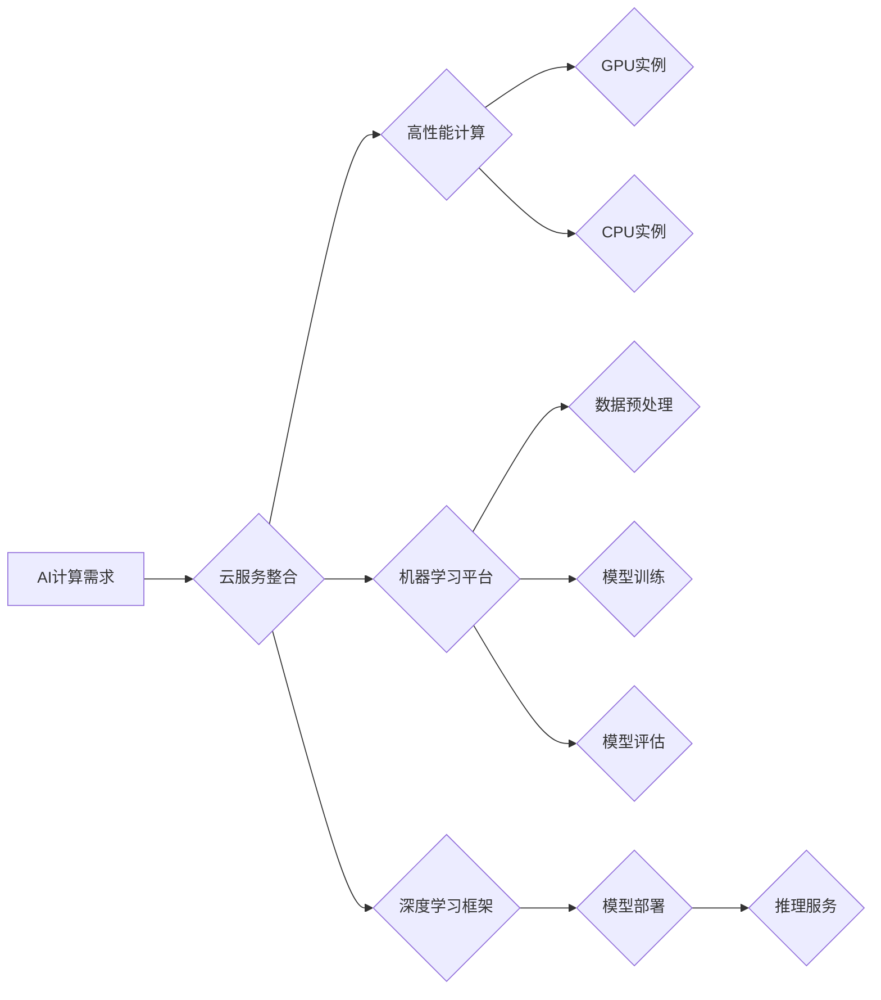

                 

## 贾扬清的创业机遇：AI计算需求的演进，云服务的整合之道

> 关键词：人工智能、云计算、AI计算需求、云服务整合、高性能计算、机器学习、深度学习、数据中心、边缘计算

## 1. 背景介绍

近年来，人工智能（AI）技术蓬勃发展，其应用场景不断拓展，从自动驾驶、语音识别到医疗诊断、金融风险控制，AI正在深刻地改变着我们的生活和工作方式。然而，AI技术的快速发展也带来了巨大的计算需求。传统的计算架构难以满足AI训练和推理的复杂性和规模性，这使得AI计算成为一个新的瓶颈。

云计算作为一种新型的计算模式，以其弹性、可扩展性和成本效益等优势，为AI计算提供了新的解决方案。云服务提供商不断推出针对AI的专用服务，例如GPU实例、机器学习平台和深度学习框架，为开发者提供了便捷的AI开发环境。

然而，云计算在满足AI计算需求方面也面临着挑战。AI模型的训练和推理需要大量的计算资源，而云计算资源的分配和调度需要考虑成本、效率和可靠性等因素。此外，数据安全、隐私保护和网络延迟等问题也需要得到有效解决。

## 2. 核心概念与联系

### 2.1 AI计算需求

AI计算需求是指人工智能算法训练和推理所需的计算资源，包括CPU、GPU、内存、存储和网络带宽等。

AI计算需求的特点：

* **高并行性:** AI算法通常具有高度的并行性，可以利用多核CPU或GPU进行并行计算，提高计算效率。
* **高数据吞吐量:** AI算法需要处理海量数据，因此需要高带宽的网络和高速存储设备。
* **高计算精度:** 一些AI算法需要高精度的计算，例如深度学习中的卷积神经网络。

### 2.2 云服务整合

云服务整合是指将不同的云服务组合在一起，形成一个完整的解决方案。

云服务整合的优势：

* **弹性扩展:** 根据需求动态调整云资源，避免资源浪费。
* **成本优化:** 利用不同云服务提供商的优势，降低整体成本。
* **功能丰富:** 通过整合不同云服务，实现更丰富的功能。

### 2.3 核心架构

**Mermaid 流程图:**



## 3. 核心算法原理 & 具体操作步骤

### 3.1 算法原理概述

深度学习算法是目前AI领域最热门的算法之一，其核心是多层神经网络。深度学习算法能够自动学习数据中的特征，并进行复杂的模式识别和预测。

### 3.2 算法步骤详解

1. **数据预处理:** 将原始数据转换为深度学习算法可以理解的格式，例如归一化、特征提取等。
2. **模型构建:** 根据任务需求选择合适的深度学习模型架构，例如卷积神经网络、循环神经网络等。
3. **模型训练:** 使用训练数据训练深度学习模型，调整模型参数，使模型能够准确地预测目标变量。
4. **模型评估:** 使用测试数据评估模型的性能，例如准确率、召回率、F1-score等。
5. **模型部署:** 将训练好的模型部署到生产环境中，用于进行预测或推理。

### 3.3 算法优缺点

**优点:**

* **高精度:** 深度学习算法能够学习数据中的复杂模式，实现高精度预测。
* **自动化特征提取:** 深度学习算法能够自动学习数据特征，无需人工特征工程。
* **通用性强:** 深度学习算法可以应用于多种任务，例如图像识别、自然语言处理、语音识别等。

**缺点:**

* **数据依赖性强:** 深度学习算法需要大量的训练数据才能达到高精度。
* **计算资源需求高:** 深度学习模型训练需要大量的计算资源，例如GPU。
* **可解释性差:** 深度学习模型的决策过程难以解释，难以理解模型的内部机制。

### 3.4 算法应用领域

深度学习算法广泛应用于以下领域:

* **计算机视觉:** 图像识别、目标检测、图像分割、人脸识别等。
* **自然语言处理:** 文本分类、情感分析、机器翻译、对话系统等。
* **语音识别:** 语音转文本、语音助手等。
* **医疗诊断:** 病理图像分析、疾病预测等。
* **金融风险控制:** 欺诈检测、信用评分等。

## 4. 数学模型和公式 & 详细讲解 & 举例说明

### 4.1 数学模型构建

深度学习模型的核心是神经网络，神经网络由多个层组成，每层包含多个神经元。神经元之间通过连接权重进行信息传递。

**神经网络模型:**

$$
y = f(W_L x_L + b_L)
$$

其中:

* $y$ 是输出值
* $x_L$ 是上一层的输出值
* $W_L$ 是当前层的权重矩阵
* $b_L$ 是当前层的偏置向量
* $f$ 是激活函数

### 4.2 公式推导过程

深度学习模型的训练过程是通过反向传播算法来进行的。反向传播算法的核心是计算模型输出与真实值的误差，并根据误差反向更新模型参数。

**误差函数:**

$$
E = \frac{1}{2} \sum_{i=1}^{N} (y_i - \hat{y}_i)^2
$$

其中:

* $E$ 是误差函数
* $N$ 是样本数量
* $y_i$ 是真实值
* $\hat{y}_i$ 是模型预测值

**梯度下降算法:**

$$
\theta = \theta - \alpha \nabla E(\theta)
$$

其中:

* $\theta$ 是模型参数
* $\alpha$ 是学习率
* $\nabla E(\theta)$ 是误差函数对模型参数的梯度

### 4.3 案例分析与讲解

**举例说明:**

假设我们训练一个简单的线性回归模型，用于预测房价。模型输入特征包括房屋面积和房间数量，输出是房价。

我们可以使用反向传播算法来训练这个模型。首先，我们定义误差函数，例如均方误差。然后，我们计算误差函数对模型参数的梯度，并使用梯度下降算法更新模型参数。

通过不断迭代，模型参数会逐渐收敛到一个最优值，使得模型能够准确地预测房价。

## 5. 项目实践：代码实例和详细解释说明

### 5.1 开发环境搭建

* **操作系统:** Ubuntu 20.04 LTS
* **编程语言:** Python 3.8
* **深度学习框架:** TensorFlow 2.0
* **GPU:** NVIDIA GeForce RTX 3080

### 5.2 源代码详细实现

```python
import tensorflow as tf

# 定义模型
model = tf.keras.Sequential([
    tf.keras.layers.Dense(64, activation='relu', input_shape=(2,)),
    tf.keras.layers.Dense(1)
])

# 编译模型
model.compile(optimizer='adam', loss='mse')

# 训练模型
model.fit(x_train, y_train, epochs=100)

# 评估模型
loss = model.evaluate(x_test, y_test)
print('Loss:', loss)

# 保存模型
model.save('house_price_model.h5')
```

### 5.3 代码解读与分析

* **模型定义:** 使用`tf.keras.Sequential`构建一个简单的线性回归模型，包含两层全连接层。
* **模型编译:** 使用`adam`优化器和`mse`损失函数编译模型。
* **模型训练:** 使用`fit`方法训练模型，输入训练数据`x_train`和`y_train`，训练100个epochs。
* **模型评估:** 使用`evaluate`方法评估模型在测试数据`x_test`和`y_test`上的性能。
* **模型保存:** 使用`save`方法将训练好的模型保存为`house_price_model.h5`文件。

### 5.4 运行结果展示

训练完成后，我们可以使用保存的模型进行预测。

```python
# 加载模型
model = tf.keras.models.load_model('house_price_model.h5')

# 预测房价
prediction = model.predict([[100, 2]])
print('Predicted house price:', prediction)
```

## 6. 实际应用场景

### 6.1 高性能计算

AI计算需求的增长推动了高性能计算的发展。云服务提供商提供高性能计算集群，例如GPU实例和TPU实例，为AI训练和推理提供强大的计算能力。

### 6.2 机器学习平台

云服务提供商提供机器学习平台，例如AWS SageMaker、Azure Machine Learning和Google Cloud AI Platform，为开发者提供便捷的AI开发环境。

### 6.3 深度学习框架

深度学习框架，例如TensorFlow、PyTorch和Keras，提供了丰富的工具和API，简化了深度学习模型的开发和训练。

### 6.4 未来应用展望

随着AI技术的不断发展，AI计算需求将继续增长。云服务将继续扮演重要角色，提供更强大的计算资源、更便捷的开发环境和更丰富的AI服务。

## 7. 工具和资源推荐

### 7.1 学习资源推荐

* **书籍:**
    * 深度学习
    * 人工智能：一种现代方法
* **在线课程:**
    * Coursera: 深度学习
    * Udacity: 机器学习工程师
* **博客和网站:**
    * TensorFlow博客
    * PyTorch博客
    * AI Weekly

### 7.2 开发工具推荐

* **深度学习框架:** TensorFlow、PyTorch、Keras
* **云服务平台:** AWS、Azure、Google Cloud
* **IDE:** Jupyter Notebook、VS Code

### 7.3 相关论文推荐

* **ImageNet Classification with Deep Convolutional Neural Networks**
* **Attention Is All You Need**
* **BERT: Pre-training of Deep Bidirectional Transformers for Language Understanding**

## 8. 总结：未来发展趋势与挑战

### 8.1 研究成果总结

近年来，AI计算领域取得了显著进展，深度学习算法取得了突破性进展，云计算平台为AI开发提供了强大的支持。

### 8.2 未来发展趋势

* **模型规模和复杂度提升:** AI模型将继续朝着更大、更复杂的方向发展，需要更强大的计算资源和算法优化。
* **边缘计算的兴起:** AI计算将逐渐向边缘设备迁移，实现更低延迟和更高效率的计算。
* **联邦学习的应用:** 联邦学习能够在不共享原始数据的情况下训练模型，将推动隐私保护和数据安全的发展。

### 8.3 面临的挑战

* **计算资源需求:** AI模型训练和推理需要大量的计算资源，如何降低计算成本和能源消耗是一个重要挑战。
* **数据安全和隐私保护:** AI模型训练需要大量数据，如何保证数据安全和隐私保护是一个关键问题。
* **算法可解释性:** 深度学习模型的决策过程难以解释，如何提高算法的可解释性和透明度是一个重要的研究方向。

### 8.4 研究展望

未来，AI计算领域将继续朝着更智能、更安全、更可持续的方向发展。研究者将继续探索新的算法、架构和技术，以应对AI计算带来的挑战，并推动AI技术的广泛应用。

## 9. 附录：常见问题与解答

* **Q1: 如何选择合适的云服务提供商？**

A1: 选择云服务提供商需要考虑多种因素，例如价格、性能、服务范围、地域分布等。建议根据自己的需求和预算进行比较选择。

* **Q2: 如何优化AI模型的训练效率？**

A2: 可以通过以下方式优化AI模型的训练效率:

* 使用更强大的计算资源，例如GPU实例。
* 采用模型压缩和量化技术。
* 使用分布式训练技术。

* **Q3: 如何保证AI模型的数据安全和隐私保护？**

A3: 可以通过以下方式保证AI模型的数据安全和隐私保护:

* 使用加密技术保护数据传输和存储。
* 采用联邦学习技术，在不共享原始数据的情况下训练模型。
* 遵循数据隐私法规，例如GDPR和CCPA。


作者：禅与计算机程序设计艺术 / Zen and the Art of Computer Programming 
<end_of_turn>

