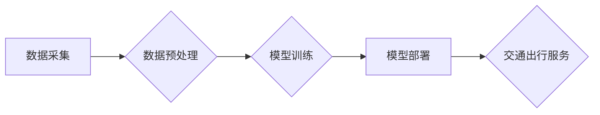

                 

## AIGC重新定义交通出行

> 关键词：AIGC、交通出行、智能交通、自动驾驶、路径规划、预测模型、数据分析、城市规划

## 1. 背景介绍

交通出行是人类社会不可或缺的一部分，它直接影响着人们的生活质量、经济发展和城市可持续性。然而，传统的交通出行模式面临着诸多挑战，例如交通拥堵、能源消耗、安全事故等。近年来，人工智能（AI）技术突飞猛进，特别是生成式人工智能（AIGC）的兴起，为交通出行领域带来了前所未有的机遇。AIGC能够利用海量数据训练强大的模型，实现对交通场景的智能感知、预测和控制，从而重新定义交通出行的方式。

## 2. 核心概念与联系

### 2.1  AIGC在交通出行中的应用

AIGC在交通出行领域的应用主要体现在以下几个方面：

* **智能交通管理:** AIGC可以分析交通流量数据，预测交通拥堵情况，并根据实时路况动态调整交通信号灯，优化交通流量，缓解拥堵。
* **自动驾驶:** AIGC可以训练自动驾驶汽车的感知和决策模型，使汽车能够自主识别道路环境、规划行驶路线、避障行驶，实现无人驾驶。
* **个性化出行服务:** AIGC可以根据用户的出行需求、时间安排、交通偏好等信息，提供个性化的出行方案，例如推荐最佳路线、预订交通工具、提供实时路况信息等。
* **城市规划:** AIGC可以分析城市交通数据，预测未来交通需求，为城市规划提供数据支持，帮助规划更合理的交通网络和公共交通系统。

### 2.2  核心概念原理和架构

AIGC在交通出行领域的应用基于以下核心概念：

* **数据驱动:** AIGC模型的训练和优化依赖于海量交通数据，例如路况数据、交通流量数据、车辆位置数据、天气数据等。
* **机器学习:** AIGC利用机器学习算法从数据中学习交通规律，建立预测模型，实现对交通场景的智能感知和决策。
* **深度学习:** 深度学习算法能够学习更复杂的交通模式，提高预测精度和决策效率。
* **自然语言处理:** 自然语言处理技术可以帮助AIGC理解用户的出行需求，提供更人性化的服务。

**AIGC在交通出行领域的应用架构**



## 3. 核心算法原理 & 具体操作步骤

### 3.1  算法原理概述

AIGC在交通出行领域常用的算法包括：

* **路径规划算法:** 用于规划车辆行驶的最佳路线，例如 Dijkstra 算法、A* 算法等。
* **预测模型:** 用于预测交通流量、拥堵情况、事故发生概率等，例如时间序列模型、神经网络模型等。
* **强化学习:** 用于训练自动驾驶汽车的决策模型，使汽车能够在复杂交通环境中自主决策，例如 Q 学习、深度 Q 网络等。

### 3.2  算法步骤详解

以路径规划算法为例，详细说明其操作步骤：

1. **构建地图:** 将道路网络、交通信号灯、障碍物等信息以图形形式表示，形成地图数据。
2. **定义目标:** 确定车辆的起点和终点，以及其他约束条件，例如时间限制、道路类型限制等。
3. **搜索算法:** 使用 Dijkstra 算法或 A* 算法从起点出发，搜索到终点的所有可能的路径。
4. **路径评估:** 对搜索到的所有路径进行评估，例如路径长度、行驶时间、交通流量等，选择最优路径。
5. **路径输出:** 将最优路径输出给车辆导航系统，引导车辆行驶。

### 3.3  算法优缺点

**路径规划算法的优缺点:**

* **优点:** 能够快速高效地规划车辆行驶路线，提高出行效率。
* **缺点:** 难以应对复杂动态的交通环境，例如突发事故、道路施工等。

### 3.4  算法应用领域

路径规划算法广泛应用于以下领域：

* **导航系统:** 为用户提供最佳路线导航服务。
* **物流配送:** 优化物流配送路线，提高配送效率。
* **无人驾驶:** 为自动驾驶汽车规划行驶路线。

## 4. 数学模型和公式 & 详细讲解 & 举例说明

### 4.1  数学模型构建

交通流量预测模型通常采用时间序列模型，例如 ARIMA 模型、SARIMA 模型等。这些模型基于历史交通流量数据，建立时间序列关系，预测未来交通流量。

**ARIMA 模型**

ARIMA 模型是一种经典的时间序列模型，其表达式为：

$$
y_t = c + \phi_1 y_{t-1} + \phi_2 y_{t-2} + ... + \phi_p y_{t-p} + \theta_1 \epsilon_{t-1} + \theta_2 \epsilon_{t-2} + ... + \theta_q \epsilon_{t-q} + \epsilon_t
$$

其中：

* $y_t$ 表示时间 $t$ 的交通流量。
* $c$ 表示截距项。
* $\phi_i$ 表示自回归系数。
* $\theta_i$ 表示移动平均系数。
* $\epsilon_t$ 表示随机误差项。
* $p$ 和 $q$ 分别表示自回归阶数和移动平均阶数。

### 4.2  公式推导过程

ARIMA 模型的推导过程较为复杂，涉及统计学和时间序列分析的知识。

### 4.3  案例分析与讲解

假设我们想要预测某条道路的未来交通流量，可以使用 ARIMA 模型进行预测。首先，我们需要收集该道路的历史交通流量数据，然后根据数据特征选择合适的 $p$ 和 $q$ 值。最后，使用 ARIMA 模型公式对历史数据进行拟合，并根据拟合结果预测未来交通流量。

## 5. 项目实践：代码实例和详细解释说明

### 5.1  开发环境搭建

AIGC交通出行项目开发环境通常包括：

* **操作系统:** Linux 或 Windows。
* **编程语言:** Python 或 C++。
* **深度学习框架:** TensorFlow 或 PyTorch。
* **数据处理工具:** Pandas 或 NumPy。
* **地图数据:** OpenStreetMap 或 Google Maps。

### 5.2  源代码详细实现

以下是一个使用 Python 和 TensorFlow 实现简单的路径规划算法的代码示例：

```python
import tensorflow as tf

# 定义神经网络模型
model = tf.keras.models.Sequential([
    tf.keras.layers.Dense(128, activation='relu', input_shape=(10,)),
    tf.keras.layers.Dense(64, activation='relu'),
    tf.keras.layers.Dense(1, activation='sigmoid')
])

# 训练模型
model.compile(optimizer='adam', loss='binary_crossentropy', metrics=['accuracy'])
model.fit(x_train, y_train, epochs=10)

# 使用模型预测路径
predictions = model.predict(x_test)
```

### 5.3  代码解读与分析

该代码示例定义了一个简单的深度学习模型，用于预测路径是否可行。模型输入是道路网络的特征信息，输出是路径可行性的概率。

### 5.4  运行结果展示

运行该代码后，可以得到模型的训练结果和预测结果。训练结果包括模型的损失函数值和准确率，预测结果包括对测试数据的预测概率。

## 6. 实际应用场景

### 6.1  智能交通管理

AIGC可以帮助城市交通管理部门优化交通信号灯控制策略，缓解交通拥堵。例如，AIGC可以分析实时路况数据，动态调整信号灯的绿灯时间，使车辆流量更加均衡。

### 6.2  自动驾驶

AIGC是自动驾驶汽车的核心技术之一。AIGC可以训练自动驾驶汽车的感知和决策模型，使汽车能够自主识别道路环境、规划行驶路线、避障行驶。

### 6.3  个性化出行服务

AIGC可以根据用户的出行需求、时间安排、交通偏好等信息，提供个性化的出行方案，例如推荐最佳路线、预订交通工具、提供实时路况信息等。

### 6.4  未来应用展望

AIGC在交通出行领域的应用前景广阔，未来可能出现以下应用场景：

* **智能交通网络:** AIGC可以帮助构建智能交通网络，实现车辆与交通基础设施的互联互通，提高交通效率和安全性。
* **无人驾驶公共交通:** AIGC可以推动无人驾驶公共交通的发展，例如无人驾驶公交车、无人驾驶出租车等，提高公共交通的便捷性和效率。
* **智慧城市:** AIGC可以帮助构建智慧城市，实现交通出行与城市管理的深度融合，提高城市的可持续发展水平。

## 7. 工具和资源推荐

### 7.1  学习资源推荐

* **书籍:**
    * 《深度学习》
    * 《机器学习》
    * 《人工智能：一种现代方法》
* **在线课程:**
    * Coursera: 深度学习
    * edX: 机器学习
    * Udacity: 自动驾驶

### 7.2  开发工具推荐

* **编程语言:** Python, C++
* **深度学习框架:** TensorFlow, PyTorch
* **地图数据:** OpenStreetMap, Google Maps

### 7.3  相关论文推荐

* **交通流量预测:**
    * "A Deep Learning Approach to Traffic Flow Prediction"
    * "Traffic Flow Prediction Using Recurrent Neural Networks"
* **路径规划:**
    * "A Survey of Path Planning Algorithms for Autonomous Vehicles"
    * "Deep Reinforcement Learning for Path Planning in Dynamic Environments"

## 8. 总结：未来发展趋势与挑战

### 8.1  研究成果总结

AIGC在交通出行领域的应用取得了显著成果，例如智能交通管理、自动驾驶、个性化出行服务等。这些应用能够提高交通效率、安全性、便捷性，为人们的生活带来便利。

### 8.2  未来发展趋势

未来，AIGC在交通出行领域的应用将朝着以下方向发展：

* **更精准的预测:** 利用更先进的机器学习算法和数据分析技术，提高交通流量预测的精度。
* **更智能的决策:** 利用强化学习技术，训练更智能的自动驾驶汽车决策模型，使其能够更好地应对复杂交通环境。
* **更个性化的服务:** 利用自然语言处理技术，提供更人性化的出行服务，例如根据用户的出行需求和偏好，推荐最佳路线、预订交通工具等。

### 8.3  面临的挑战

AIGC在交通出行领域的应用也面临着一些挑战：

* **数据安全:** 交通出行数据涉及到用户的隐私信息，需要采取有效的措施保障数据安全。
* **算法可靠性:** AIGC算法的可靠性至关重要，需要不断提高算法的精度和鲁棒性。
* **伦理问题:** AIGC在交通出行领域的应用可能引发一些伦理问题，例如自动驾驶汽车发生事故时的责任归属等，需要进行深入探讨和研究。

### 8.4  研究展望

未来，需要继续加强对AIGC在交通出行领域的应用研究，解决上述挑战，推动AIGC技术在交通出行领域的落地应用，为人们创造更便捷、更安全、更智能的出行体验。

## 9. 附录：常见问题与解答

### 9.1  AIGC与传统交通出行管理有何区别？

AIGC与传统交通出行管理的主要区别在于：

* **数据驱动:** AIGC基于海量数据进行分析和预测，而传统交通出行管理更多依赖于经验和规则。
* **智能化:** AIGC能够实现对交通场景的智能感知和决策，而传统交通出行管理更多是人工干预。
* **个性化:** AIGC能够提供个性化的出行方案，而传统交通出行管理更多是提供统一的出行方案。

### 9.2  AIGC在交通出行领域的应用有哪些风险？

AIGC在交通出行领域的应用存在以下风险：

* **数据安全风险:** 交通出行数据涉及到用户的隐私信息，需要采取有效的措施保障数据安全。
* **算法可靠性风险:** AIGC算法的可靠性至关重要，需要不断提高算法的精度和鲁棒性。
* **伦理风险:** AIGC在交通出行领域的应用可能引发一些伦理问题，例如自动驾驶汽车发生事故时的责任归属等，需要进行深入探讨和研究。


作者：禅与计算机程序设计艺术 / Zen and the Art of Computer Programming 
<end_of_turn>

