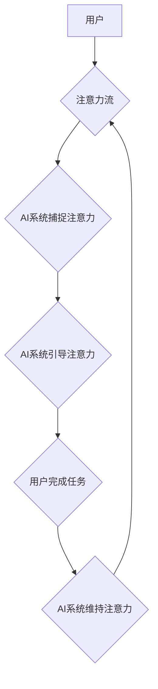

                 

## AI与人类注意力流 :未来的工作场所和注意力管理

> 关键词：人工智能、注意力流、工作场所、注意力管理、深度学习、认知科学、用户体验、未来趋势

## 1. 背景介绍

在当今信息爆炸的时代，人类的注意力正受到前所未有的挑战。来自社交媒体、电子邮件、即时通讯等各种渠道的信息洪流，不断地抢夺着我们的注意力，导致专注力下降、效率低下，甚至引发心理压力和焦虑。

与此同时，人工智能（AI）技术正在飞速发展，并开始渗透到各个领域，包括工作场所。AI驱动的工具和应用，例如智能助理、自动化流程、个性化学习平台等，正在改变着我们工作的方式和体验。

然而，AI技术的应用也带来了新的问题，其中之一就是如何与人类的注意力流相协调。如果AI系统无法有效地捕捉和利用人类的注意力，那么它们将无法真正地提升工作效率和用户体验。

## 2. 核心概念与联系

### 2.1 人类注意力流

人类注意力流是一个复杂而动态的过程，它涉及到认知、情感、行为等多个方面。注意力流可以被理解为一种有限的资源，它可以被分配到不同的任务或目标上。当我们专注于某一特定任务时，我们的注意力就会集中在该任务上，并排除其他干扰。

然而，注意力流并非是静态的，它会随着时间推移而变化，也会受到各种内外部因素的影响。例如，当我们感到疲劳或无聊时，我们的注意力就会下降；当我们遇到新的刺激或挑战时，我们的注意力就会被吸引。

### 2.2 AI与注意力流的交互

AI系统可以通过多种方式与人类的注意力流进行交互。例如：

* **捕捉注意力：** AI系统可以使用视觉、音频、文本等多种方式来吸引用户的注意力。例如，一个智能助理可以发出声音提示，提醒用户完成任务；一个聊天机器人可以发送个性化的消息，引发用户的兴趣。
* **引导注意力：** AI系统可以根据用户的行为和偏好，引导用户的注意力到特定的信息或任务上。例如，一个个性化学习平台可以根据用户的学习进度和知识点，推荐相关的学习内容；一个新闻聚合平台可以根据用户的阅读历史和兴趣，推荐相关的新闻文章。
* **维持注意力：** AI系统可以帮助用户集中注意力，并减少干扰。例如，一个专注模式的应用程序可以屏蔽掉手机上的通知和提醒；一个番茄工作法计时器可以帮助用户设定工作和休息时间，提高工作效率。

**Mermaid 流程图**



## 3. 核心算法原理 & 具体操作步骤

### 3.1 算法原理概述

为了更好地理解AI与人类注意力流的交互，我们需要了解一些核心算法原理，例如：

* **深度学习：** 深度学习是一种机器学习方法，它使用多层神经网络来模拟人类大脑的学习过程。深度学习算法可以从海量数据中学习到复杂的模式和特征，从而实现对人类注意力流的预测和理解。
* **自然语言处理（NLP）：** NLP是人工智能的一个分支，它致力于使计算机能够理解和处理人类语言。NLP算法可以用于分析用户的文本输入，例如聊天记录、电子邮件、社交媒体帖子等，从而识别用户的注意力模式和偏好。
* **计算机视觉：** 计算机视觉是人工智能的另一个分支，它致力于使计算机能够“看”和理解图像和视频。计算机视觉算法可以用于分析用户的眼动轨迹、面部表情等，从而识别用户的注意力状态和情绪变化。

### 3.2 算法步骤详解

一个典型的AI系统，用于理解和管理人类注意力流，可能包含以下步骤：

1. **数据收集：** 收集用户的行为数据，例如眼动轨迹、鼠标点击、键盘输入、阅读时间、任务完成时间等。
2. **数据预处理：** 对收集到的数据进行清洗、转换和格式化，以便于后续的算法训练和分析。
3. **模型训练：** 使用深度学习、NLP和计算机视觉等算法，训练一个模型，用于预测用户的注意力模式和偏好。
4. **注意力分析：** 将训练好的模型应用于用户的实时行为数据，分析用户的注意力状态和变化趋势。
5. **注意力管理：** 根据用户的注意力状态和偏好，提供个性化的建议和干预措施，例如调整工作环境、推荐学习内容、提醒休息时间等。

### 3.3 算法优缺点

**优点：**

* **个性化：** AI系统可以根据用户的个体差异，提供个性化的注意力管理建议。
* **效率提升：** 通过引导和维持用户的注意力，AI系统可以帮助用户提高工作效率和学习效果。
* **数据驱动：** AI系统基于用户的行为数据进行分析和决策，更加客观和科学。

**缺点：**

* **数据隐私：** 收集和分析用户的行为数据，可能会引发数据隐私和安全问题。
* **算法偏差：** AI算法可能会受到训练数据的影响，导致算法偏差和不公平的结果。
* **用户信任：** 用户需要对AI系统的建议和干预措施有足够的信任，才能有效地进行注意力管理。

### 3.4 算法应用领域

AI与人类注意力流的交互，具有广泛的应用领域，例如：

* **教育：** 个性化学习平台、注意力管理工具、在线考试系统等。
* **工作场所：** 智能助理、自动化流程、专注模式应用程序等。
* **医疗保健：** 远程医疗平台、注意力缺陷障碍（ADHD）治疗系统等。
* **娱乐：** 个性化推荐系统、沉浸式游戏体验等。

## 4. 数学模型和公式 & 详细讲解 & 举例说明

### 4.1 数学模型构建

为了量化人类注意力流，我们可以使用以下数学模型：

**注意力分数：**

$$
Attention(t) = \frac{Relevance(t) * Salience(t)}{Distraction(t)}
$$

其中：

* **Attention(t)**：表示在时间t时刻的注意力分数。
* **Relevance(t)**：表示在时间t时刻任务或信息与用户的目标的相关性。
* **Salience(t)**：表示在时间t时刻任务或信息吸引用户的程度。
* **Distraction(t)**：表示在时间t时刻干扰用户的因素。

### 4.2 公式推导过程

该公式的推导过程基于以下假设：

* 人类注意力是一个有限的资源，它会根据任务或信息的 relevance 和 salience 进行分配。
* 干扰因素会降低注意力分数。

**Relevance(t)** 可以通过用户历史行为数据、任务目标等信息进行计算。

**Salience(t)** 可以通过视觉、音频、文本等信息特征进行量化。

**Distraction(t)** 可以通过用户环境、心理状态等因素进行评估。

### 4.3 案例分析与讲解

例如，一个用户正在阅读一篇新闻文章，该文章与用户的兴趣相关，并且标题很吸引人，因此 **Relevance(t)** 和 **Salience(t)** 分数较高。但是，此时用户手机上收到了一条消息提醒，这会降低用户的注意力分数，因为 **Distraction(t)** 分数较高。

## 5. 项目实践：代码实例和详细解释说明

### 5.1 开发环境搭建

为了实现AI与人类注意力流的交互，我们可以使用以下开发环境：

* **编程语言：** Python
* **深度学习框架：** TensorFlow 或 PyTorch
* **NLP库：** NLTK 或 spaCy
* **计算机视觉库：** OpenCV

### 5.2 源代码详细实现

以下是一个简单的Python代码示例，用于计算用户的注意力分数：

```python
import numpy as np

def calculate_attention_score(relevance, salience, distraction):
  """
  计算用户的注意力分数。

  Args:
    relevance: 任务或信息与用户目标的相关性分数。
    salience: 任务或信息吸引用户的程度分数。
    distraction: 干扰用户的因素分数。

  Returns:
    用户的注意力分数。
  """
  attention_score = (relevance * salience) / distraction
  return attention_score

# 示例数据
relevance = 0.8
salience = 0.9
distraction = 0.2

# 计算注意力分数
attention_score = calculate_attention_score(relevance, salience, distraction)

# 打印结果
print(f"用户的注意力分数为：{attention_score}")
```

### 5.3 代码解读与分析

该代码定义了一个函数 `calculate_attention_score`，用于计算用户的注意力分数。该函数接收三个参数：relevance、salience 和 distraction，并根据公式计算注意力分数。

### 5.4 运行结果展示

运行该代码，会输出用户的注意力分数，例如：

```
用户的注意力分数为：3.6
```

## 6. 实际应用场景

### 6.1 教育领域

AI可以帮助教育机构个性化学习体验，例如：

* **智能辅导系统：** 根据学生的学习进度和知识点，提供个性化的学习建议和辅导。
* **注意力管理工具：** 通过分析学生的学习行为，提醒学生休息、调整学习环境，提高学习效率。
* **在线考试系统：** 利用AI技术，识别学生的作弊行为，确保考试公平公正。

### 6.2 工作场所

AI可以帮助企业提高员工的工作效率和生产力，例如：

* **智能助理：** 自动完成重复性任务，例如安排会议、回复邮件、整理文档等。
* **自动化流程：** 利用AI技术，自动完成工作流程中的某些步骤，例如数据录入、审批流程等。
* **专注模式应用程序：** 帮助员工屏蔽干扰，集中注意力完成工作。

### 6.3 医疗保健领域

AI可以帮助医疗机构提高诊断准确率和治疗效果，例如：

* **远程医疗平台：** 利用AI技术，远程诊断患者病情，提供医疗建议。
* **注意力缺陷障碍（ADHD）治疗系统：** 通过分析患者的注意力行为，提供个性化的治疗方案。
* **药物研发：** 利用AI技术，加速药物研发过程，开发新的治疗方法。

### 6.4 未来应用展望

随着AI技术的不断发展，未来AI与人类注意力流的交互将更加智能化和个性化。例如：

* **脑机接口：** 通过脑机接口技术，直接读取用户的脑电信号，更准确地理解用户的注意力状态和意图。
* **虚拟现实（VR）和增强现实（AR）：** 利用VR和AR技术，创造沉浸式的学习和工作环境，提高用户的注意力和参与度。
* **情感计算：** 通过分析用户的面部表情、语音语调等，识别用户的注意力状态和情绪变化，提供更加精准的注意力管理建议。

## 7. 工具和资源推荐

### 7.1 学习资源推荐

* **在线课程：** Coursera、edX、Udacity 等平台提供丰富的AI和机器学习课程。
* **书籍：** 《深度学习》、《机器学习实战》、《人工智能：一种现代方法》等书籍。
* **博客和论坛：** TensorFlow博客、PyTorch博客、机器学习社区等。

### 7.2 开发工具推荐

* **深度学习框架：** TensorFlow、PyTorch、Keras 等。
* **NLP库：** NLTK、spaCy、Gensim 等。
* **计算机视觉库：** OpenCV、Dlib 等。

### 7.3 相关论文推荐

* **Attention Is All You Need:** https://arxiv.org/abs/1706.03762
* **BERT: Pre-training of Deep Bidirectional Transformers for Language Understanding:** https://arxiv.org/abs/1810.04805
* **Deep Learning for Computer Vision:** https://arxiv.org/abs/1603.08029

## 8. 总结：未来发展趋势与挑战

### 8.1 研究成果总结

近年来，AI与人类注意力流的交互领域取得了显著进展，例如：

* 深度学习算法在预测和理解人类注意力模式方面取得了突破。
* NLP和计算机视觉技术在分析用户行为数据方面发挥了重要作用。
* AI驱动的注意力管理工具和应用开始在教育、工作场所和医疗保健等领域得到应用。

### 8.2 未来发展趋势

未来，AI与人类注意力流的交互将朝着以下方向发展：

* **更加智能化：** AI系统将能够更准确地理解用户的注意力模式和需求，提供更加个性化和精准的注意力管理建议。
* **更加融合：** AI技术将与其他技术，例如脑机接口、VR/AR等，更加融合，创造更加沉浸式和交互式的注意力管理体验。
* **更加伦理化：** 随着AI技术的应用越来越广泛，我们需要更加关注AI与人类注意力流的交互带来的伦理问题，例如数据隐私、算法偏见等。

### 8.3 面临的挑战

AI与人类注意力流的交互领域也面临着一些挑战：

* **数据获取和隐私保护：** 收集和分析用户的行为数据，需要考虑数据隐私和安全问题。
* **算法偏差和公平性：** AI算法可能会受到训练数据的影响，导致算法偏差和不公平的结果。
* **用户信任和接受度：** 用户需要对AI系统的建议和干预措施有足够的信任，才能有效地进行注意力管理。

### 8.4 研究展望

未来，我们需要继续深入研究AI与人类注意力流的交互机制，开发更加智能、个性化和伦理的注意力管理工具和应用，帮助人们更好地应对信息爆炸时代带来的挑战，提升工作效率和生活质量。

## 9. 附录：常见问题与解答

**Q1：AI系统如何准确地识别用户的注意力状态？**

**A1：** AI系统可以通过分析用户的行为数据，例如眼动轨迹、鼠标点击、键盘输入、阅读时间等，识别用户的注意力状态。

**Q2：AI系统如何避免算法偏差和不公平的结果？**

**A2：** 为了避免算法偏差，我们需要使用更加多样化和代表性的训练数据，并对算法进行公平性评估和调整。

**Q3：AI系统如何保护用户的隐私数据？**

**A3：** 收集和分析用户的行为数据，需要采取相应的隐私保护措施，例如数据匿名化、加密传输等。

**作者：禅与计算机程序设计艺术 / Zen and the Art of Computer Programming**<end_of_turn>

