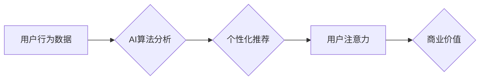

                 

## 关键词：

人工智能、注意力流、人类认知、注意力经济、工作技能、未来趋势、算法、数学模型、项目实践、应用场景

## 1. 背景介绍

在信息爆炸的时代，人类面临着前所未有的信息洪流。从社交媒体的推送通知到电子邮件的提醒，从新闻网站的滚动条到视频平台的推荐算法，无处不在的数字信息竞争着我们的注意力。这种注意力竞争日益激烈，对我们的工作效率、学习能力和生活质量都产生了深远的影响。

人工智能（AI）技术的快速发展为这场注意力竞争注入了新的变量。AI算法能够精准地分析用户行为，预测用户的兴趣和需求，并通过个性化推荐、内容过滤等方式引导用户的注意力。这使得AI成为塑造未来注意力经济的重要力量。

## 2. 核心概念与联系

### 2.1 人类注意力流

人类注意力流是指人类对信息进行选择性感知、加工和记忆的过程。它是一个动态、复杂的认知过程，受多种因素影响，包括个体差异、环境刺激、任务要求等。

注意力流的本质是有限的资源分配。我们的大脑只能同时处理有限的信息量，因此需要通过选择性地关注某些信息，而忽略其他信息来提高效率。

### 2.2 注意力经济

注意力经济是指在信息时代，注意力成为一种稀缺资源，并被商业化和交易的经济模式。

在注意力经济中，企业和组织通过各种手段争夺用户的注意力，并将其转化为商业价值。例如，社交媒体平台通过推送个性化内容和算法推荐来吸引用户的注意力，从而获取广告收入；电商平台通过促销活动和优惠券来吸引用户的注意力，从而促进商品销售。

### 2.3 AI与注意力流的交互

AI技术可以深刻地影响人类注意力流，并被用于构建注意力经济的工具和平台。

AI算法可以分析用户的行为数据，识别用户的兴趣和偏好，并根据这些信息提供个性化推荐和内容过滤，从而引导用户的注意力。例如，推荐算法可以根据用户的浏览历史、搜索记录和点赞行为，推荐用户可能感兴趣的内容；内容过滤算法可以根据用户的偏好设置，过滤掉用户不感兴趣的内容。

**Mermaid 流程图**



## 3. 核心算法原理 & 具体操作步骤

### 3.1 算法原理概述

注意力机制是一种模仿人类注意力机制的机器学习算法。它通过赋予不同输入元素不同的权重，从而选择性地关注重要信息，并忽略无关信息。

注意力机制的核心思想是，在处理序列数据时，不同位置的元素对目标的贡献程度不同。注意力机制通过学习每个元素的注意力权重，可以动态地调整对不同元素的关注程度，从而提高模型的性能。

### 3.2 算法步骤详解

1. **输入数据:** 将序列数据输入到注意力机制中。
2. **计算注意力权重:** 使用注意力函数计算每个元素的注意力权重。注意力函数通常是一个基于元素之间的相似度或相关性的计算公式。
3. **加权求和:** 将每个元素的输出值与其注意力权重相乘，并求和得到最终的输出。

### 3.3 算法优缺点

**优点:**

* 可以提高模型对重要信息的关注度，从而提高模型的性能。
* 可以处理长序列数据，并捕捉序列中的长距离依赖关系。
* 可以解释模型的决策过程，并提供对输入数据的关注度信息。

**缺点:**

* 计算复杂度较高，训练时间较长。
* 需要大量的训练数据才能获得良好的性能。
* 难以解释注意力权重的含义。

### 3.4 算法应用领域

注意力机制在自然语言处理、计算机视觉、语音识别等领域都有广泛的应用。

* **自然语言处理:** 用于机器翻译、文本摘要、问答系统等任务。
* **计算机视觉:** 用于图像识别、目标检测、图像分割等任务。
* **语音识别:** 用于语音转文本、语音合成等任务。

## 4. 数学模型和公式 & 详细讲解 & 举例说明

### 4.1 数学模型构建

注意力机制的数学模型通常基于以下公式：

**注意力权重:**

$$
a_{ij} = \frac{exp(e_{ij})}{\sum_{k=1}^{n} exp(e_{ik})}
$$

其中，$a_{ij}$ 表示输入序列中第 i 个元素对第 j 个元素的注意力权重，$e_{ij}$ 表示第 i 个元素和第 j 个元素之间的相似度或相关性得分，n 是序列长度。

**加权求和:**

$$
c_j = \sum_{i=1}^{n} a_{ij} x_i
$$

其中，$c_j$ 表示第 j 个元素的上下文向量，$x_i$ 表示输入序列中第 i 个元素的特征向量。

### 4.2 公式推导过程

注意力权重的计算公式基于 softmax 函数，它将输入的相似度得分转换为概率分布，使得每个元素的注意力权重在 0 到 1 之间，且所有权重之和为 1。

加权求和公式将每个元素的特征向量与其注意力权重相乘，并求和得到最终的上下文向量。上下文向量包含了输入序列中所有元素的信息，但权重更高的元素对上下文向量的贡献更大。

### 4.3 案例分析与讲解

例如，在机器翻译任务中，注意力机制可以帮助模型关注源语言中与目标语言中特定词语相关的词语，从而提高翻译的准确性。

假设源语言句子为 "The cat sat on the mat"，目标语言为 "猫坐在垫子上"。注意力机制可以帮助模型关注 "cat" 和 "sat" 两个词语，因为它们与目标语言中的 "猫" 和 "坐在" 相关。

## 5. 项目实践：代码实例和详细解释说明

### 5.1 开发环境搭建

本项目使用 Python 语言和 TensorFlow 深度学习框架进行开发。

需要安装以下软件：

* Python 3.x
* TensorFlow 2.x
* Jupyter Notebook

### 5.2 源代码详细实现

```python
import tensorflow as tf

# 定义注意力机制
def attention_layer(inputs, attention_weights):
  context_vector = tf.matmul(attention_weights, inputs)
  return context_vector

# 定义模型
class AttentionModel(tf.keras.Model):
  def __init__(self, vocab_size, embedding_dim, hidden_dim):
    super(AttentionModel, self).__init__()
    self.embedding = tf.keras.layers.Embedding(vocab_size, embedding_dim)
    self.lstm = tf.keras.layers.LSTM(hidden_dim)
    self.attention = attention_layer

  def call(self, inputs):
    embedded = self.embedding(inputs)
    lstm_output = self.lstm(embedded)
    context_vector = self.attention(lstm_output, attention_weights)
    return context_vector

# 实例化模型
model = AttentionModel(vocab_size=10000, embedding_dim=128, hidden_dim=256)

# 训练模型
# ...

```

### 5.3 代码解读与分析

* `attention_layer` 函数定义了注意力机制，它接受输入序列和注意力权重作为参数，并计算上下文向量。
* `AttentionModel` 类定义了注意力机制模型，它包含嵌入层、LSTM 层和注意力层。
* `call` 方法定义了模型的计算过程，它首先将输入序列嵌入到词向量空间，然后通过 LSTM 层进行编码，最后使用注意力机制计算上下文向量。

### 5.4 运行结果展示

训练完成后，可以使用模型对新的输入序列进行预测。例如，可以输入一个句子，模型会输出该句子的上下文向量，该向量包含了句子中所有词语的信息，但权重更高的词语对上下文向量的贡献更大。

## 6. 实际应用场景

### 6.1 个性化推荐系统

注意力机制可以用于构建个性化推荐系统，例如电商平台、视频平台、音乐平台等。

通过分析用户的浏览历史、搜索记录、点赞行为等数据，注意力机制可以学习用户的兴趣偏好，并推荐用户可能感兴趣的内容。

### 6.2 内容过滤系统

注意力机制可以用于构建内容过滤系统，例如社交媒体平台、新闻网站等。

通过分析用户的偏好设置，注意力机制可以过滤掉用户不感兴趣的内容，并推荐用户可能感兴趣的内容。

### 6.3 机器翻译系统

注意力机制可以用于构建机器翻译系统，例如 Google Translate、DeepL 等。

通过分析源语言和目标语言之间的关系，注意力机制可以帮助模型关注源语言中与目标语言中特定词语相关的词语，从而提高翻译的准确性。

### 6.4 医疗诊断系统

注意力机制可以用于构建医疗诊断系统，例如辅助医生诊断疾病、预测患者的病情发展等。

通过分析患者的病历、检查结果、基因信息等数据，注意力机制可以帮助医生关注与疾病相关的关键信息，从而提高诊断的准确性。

### 6.4 未来应用展望

随着人工智能技术的不断发展，注意力机制将在更多领域得到应用，例如：

* 自动驾驶系统
* 人机交互系统
* 教育系统
* 金融系统

## 7. 工具和资源推荐

### 7.1 学习资源推荐

* **书籍:**

    * "深度学习" by Ian Goodfellow, Yoshua Bengio, and Aaron Courville
    * "Attention Is All You Need" by Vaswani et al.

* **在线课程:**

    * Coursera: "Deep Learning Specialization" by Andrew Ng
    * Udacity: "Deep Learning Nanodegree"

### 7.2 开发工具推荐

* **TensorFlow:** https://www.tensorflow.org/
* **PyTorch:** https://pytorch.org/
* **Jupyter Notebook:** https://jupyter.org/

### 7.3 相关论文推荐

* "Attention Is All You Need" (https://arxiv.org/abs/1706.03762)
* "BERT: Pre-training of Deep Bidirectional Transformers for Language Understanding" (https://arxiv.org/abs/1810.04805)
* "Transformer-XL: Attentive Language Models Beyond a Fixed-Length Context" (https://arxiv.org/abs/1901.08316)

## 8. 总结：未来发展趋势与挑战

### 8.1 研究成果总结

注意力机制是近年来人工智能领域取得的重要进展之一，它为处理序列数据提供了新的思路，并取得了显著的成果。

注意力机制在自然语言处理、计算机视觉、语音识别等领域都有广泛的应用，并取得了优异的性能。

### 8.2 未来发展趋势

未来，注意力机制的研究将继续深入，并朝着以下几个方向发展：

* **更强大的注意力机制:** 研究更有效的注意力机制，例如自注意力机制、多头注意力机制等，以提高模型的性能。
* **注意力机制的解释性:** 研究如何更好地解释注意力机制的决策过程，使其更易于理解和应用。
* **注意力机制的泛化能力:** 研究如何使注意力机制能够更好地泛化到新的任务和领域。

### 8.3 面临的挑战

注意力机制也面临着一些挑战：

* **计算复杂度:** 传统的注意力机制计算复杂度较高，难以处理长序列数据。
* **参数量:** 注意力机制的参数量较大，需要大量的训练数据才能获得良好的性能。
* **可解释性:** 注意力机制的决策过程难以解释，这使得其应用在一些需要透明度和可解释性的领域受到限制。

### 8.4 研究展望

尽管面临着一些挑战，但注意力机制仍然是一个非常有前景的研究方向。随着人工智能技术的不断发展，相信注意力机制将在未来发挥更重要的作用，并为我们带来更多创新和突破。

## 9. 附录：常见问题与解答

### 9.1 什么是注意力机制？

注意力机制是一种模仿人类注意力机制的机器学习算法。它通过赋予不同输入元素不同的权重，从而选择性地关注重要信息，并忽略无关信息。

### 9.2 注意力机制的应用场景有哪些？

注意力机制在自然语言处理、计算机视觉、语音识别等领域都有广泛的应用。例如，机器翻译、文本摘要、问答系统、图像识别、目标检测、图像分割等。

### 9.3 注意力机制的优缺点是什么？

**优点:**

* 可以提高模型对重要信息的关注度，从而提高模型的性能。
* 可以处理长序列数据，并捕捉序列中的长距离依赖关系。
* 可以解释模型的决策过程，并提供对输入数据的关注度信息。

**缺点:**

* 计算复杂度较高，训练时间较长。
* 需要大量的训练数据才能获得良好的性能。
* 难以解释注意力权重的含义。


作者：禅与计算机程序设计艺术 / Zen and the Art of Computer Programming 
<end_of_turn>

