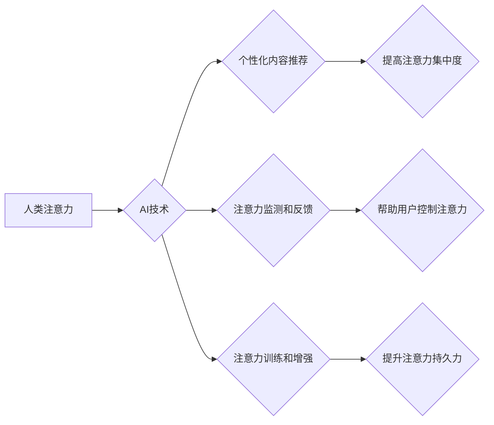

                 

## AI与人类注意力经济：未来的工作和收入

> 关键词：人工智能、注意力经济、工作转型、收入分配、未来趋势、算法、数学模型、应用场景

### 1. 背景介绍

在信息爆炸的时代，人类的注意力成为稀缺资源。我们每天被来自各个方向的海量信息所包围，如何有效地筛选和聚焦注意力成为了一个至关重要的挑战。与此同时，人工智能（AI）技术飞速发展，其强大的计算能力和学习能力正在深刻地改变着我们的生活和工作方式。

AI技术的应用已经渗透到各个领域，从自动驾驶、医疗诊断到个性化推荐，AI正在帮助我们更高效地完成任务，释放出更多的时间和精力。然而，AI的快速发展也引发了一些担忧，例如：

* **工作岗位替代：** AI自动化能力的提升可能会导致大量工作岗位被取代，从而引发社会失业问题。
* **收入分配不均：** AI带来的技术红利可能主要集中在少数掌握AI技术的精英手中，加剧社会收入分配不平等。
* **注意力被过度利用：** AI算法可以精准地预测和操控我们的注意力，从而引发隐私问题和信息茧房现象。

面对这些挑战，我们需要深入思考AI与人类注意力经济的关系，并探索如何利用AI技术，更好地管理和利用我们的注意力，从而创造更加美好的未来。

### 2. 核心概念与联系

**2.1 注意力经济**

注意力经济是指在信息爆炸的时代，注意力成为一种稀缺资源，而能够有效地获取和利用注意力的人或组织将拥有巨大的竞争优势。

**2.2 人工智能**

人工智能是指模拟人类智能的计算机系统，其主要功能包括学习、推理、决策和解决问题。

**2.3 AI与注意力经济的联系**

AI技术可以帮助我们更好地理解和管理注意力。例如：

* **个性化内容推荐：** AI算法可以根据用户的兴趣和偏好，推荐更符合其需求的内容，从而提高用户的注意力集中度。
* **注意力监测和反馈：** AI可以监测用户的注意力状态，并提供相应的反馈，帮助用户更好地控制和管理注意力。
* **注意力训练和增强：** AI可以开发出针对性注意力训练的应用程序，帮助用户提高注意力集中度和持久力。

**2.4 Mermaid 流程图**



### 3. 核心算法原理 & 具体操作步骤

**3.1 算法原理概述**

注意力机制是一种模仿人类注意力机制的机器学习算法，其核心思想是通过学习不同输入元素的重要性权重，从而提高模型对重要信息的关注度。

**3.2 算法步骤详解**

1. **输入数据：** 将输入数据（例如文本、图像等）转换为向量表示。
2. **计算权重：** 使用注意力机制计算每个输入元素的重要性权重。
3. **加权求和：** 根据计算出的权重，对输入元素进行加权求和，得到最终的输出。

**3.3 算法优缺点**

**优点：**

* 可以有效地提高模型对重要信息的关注度。
* 可以处理长序列数据，例如文本和视频。
* 可以解释模型的决策过程，提高模型的可解释性。

**缺点：**

* 计算复杂度较高。
* 需要大量的训练数据。

**3.4 算法应用领域**

* **自然语言处理：** 机器翻译、文本摘要、问答系统等。
* **计算机视觉：** 图像识别、目标检测、图像 Captioning 等。
* **语音识别：** 语音转文本、语音助手等。

### 4. 数学模型和公式 & 详细讲解 & 举例说明

**4.1 数学模型构建**

注意力机制的数学模型可以表示为：

$$
\text{Attention}(Q, K, V) = \text{softmax}\left(\frac{Q K^T}{\sqrt{d_k}}\right) V
$$

其中：

* $Q$：查询矩阵
* $K$：键矩阵
* $V$：值矩阵
* $d_k$：键向量的维度
* $\text{softmax}$：softmax函数

**4.2 公式推导过程**

1. 计算查询矩阵 $Q$ 和键矩阵 $K$ 的点积，并除以 $\sqrt{d_k}$，以规范化结果。
2. 应用 softmax 函数对点积结果进行归一化，得到每个键的注意力权重。
3. 将注意力权重与值矩阵 $V$ 进行加权求和，得到最终的输出。

**4.3 案例分析与讲解**

假设我们有一个句子 "我爱学习编程"，想要使用注意力机制来理解每个单词的重要性。

* $Q$：查询向量，表示当前词的语义信息。
* $K$：键向量，表示每个单词的语义信息。
* $V$：值向量，表示每个单词的词义信息。

通过计算 $Q$ 和 $K$ 的点积，并应用 softmax 函数，我们可以得到每个单词的注意力权重。例如，"学习" 和 "编程" 的注意力权重可能较高，因为它们与 "我爱" 的语义信息更相关。

### 5. 项目实践：代码实例和详细解释说明

**5.1 开发环境搭建**

* Python 3.x
* TensorFlow 或 PyTorch

**5.2 源代码详细实现**

```python
import tensorflow as tf

# 定义注意力机制
def attention_layer(inputs, key_dim):
    # 计算查询矩阵、键矩阵和值矩阵
    query = tf.reshape(inputs, [-1, 1, key_dim])
    key = tf.reshape(inputs, [-1, 1, key_dim])
    value = tf.reshape(inputs, [-1, 1, key_dim])

    # 计算注意力权重
    attention_weights = tf.matmul(query, key, transpose_b=True) / tf.math.sqrt(key_dim)
    attention_weights = tf.nn.softmax(attention_weights, axis=-1)

    # 加权求和
    output = tf.matmul(attention_weights, value)
    return output

# 示例用法
inputs = tf.random.normal([10, 512])
key_dim = 64
output = attention_layer(inputs, key_dim)
print(output.shape)
```

**5.3 代码解读与分析**

* 该代码定义了一个简单的注意力机制层，输入为一个张量，输出为加权求和后的张量。
* 首先计算查询矩阵、键矩阵和值矩阵，然后计算注意力权重。
* 最后将注意力权重与值矩阵进行加权求和，得到最终的输出。

**5.4 运行结果展示**

运行该代码后，会输出一个形状为 `(10, 1, 64)` 的张量，表示注意力机制后的输出。

### 6. 实际应用场景

**6.1 个性化内容推荐**

AI可以根据用户的浏览历史、点赞记录等数据，学习用户的兴趣偏好，并推荐更符合其需求的内容。例如，Netflix 和 Spotify 都使用注意力机制来个性化推荐影视作品和音乐。

**6.2 医疗诊断辅助**

AI可以分析患者的病历、影像数据等信息，并结合医学知识库，辅助医生进行诊断。例如，Google DeepMind 开发的 AlphaFold 可以预测蛋白质结构，为药物研发提供帮助。

**6.3 教育个性化学习**

AI可以根据学生的学习进度和能力水平，定制个性化的学习方案，提高学习效率。例如，Khan Academy 使用 AI 来个性化推荐学习资源。

**6.4 未来应用展望**

随着 AI 技术的不断发展，注意力机制将在更多领域得到应用，例如：

* **自动驾驶：** AI 可以利用注意力机制，专注于驾驶过程中重要的信息，例如行人、车辆和交通信号。
* **机器人控制：** AI 可以利用注意力机制，帮助机器人更好地理解环境信息，并做出更精准的决策。
* **人机交互：** AI 可以利用注意力机制，更好地理解用户的意图，并提供更自然、更人性化的交互体验。

### 7. 工具和资源推荐

**7.1 学习资源推荐**

* **书籍：**
    * 《深度学习》
    * 《Attention Is All You Need》
* **在线课程：**
    * Coursera: Deep Learning Specialization
    * Udacity: Artificial Intelligence Nanodegree

**7.2 开发工具推荐**

* **TensorFlow:** 开源深度学习框架
* **PyTorch:** 开源深度学习框架
* **Keras:** 高级深度学习 API

**7.3 相关论文推荐**

* 《Attention Is All You Need》
* 《BERT: Pre-training of Deep Bidirectional Transformers for Language Understanding》
* 《Transformer-XL: Attentive Language Models Beyond a Fixed-Length Context》

### 8. 总结：未来发展趋势与挑战

**8.1 研究成果总结**

注意力机制是近年来发展迅速的 AI 技术之一，它在自然语言处理、计算机视觉等领域取得了显著的成果。

**8.2 未来发展趋势**

* **更强大的注意力机制：** 研究人员将继续探索更强大的注意力机制，例如跨模态注意力、动态注意力等。
* **注意力机制的应用扩展：** 注意力机制将应用于更多领域，例如自动驾驶、机器人控制、人机交互等。
* **注意力机制的可解释性：** 研究人员将致力于提高注意力机制的可解释性，使其更易于理解和应用。

**8.3 面临的挑战**

* **计算复杂度：** 某些注意力机制的计算复杂度较高，难以在资源有限的设备上运行。
* **数据需求：** 训练强大的注意力模型需要大量的训练数据。
* **伦理问题：** 注意力机制可以被用于操控和利用用户的注意力，需要谨慎考虑其伦理问题。

**8.4 研究展望**

未来，注意力机制将继续推动 AI 技术的发展，并为我们带来更多创新应用。我们需要加强对注意力机制的研究，并积极探索其在社会发展中的应用，以确保 AI 技术能够造福人类。

### 9. 附录：常见问题与解答

**9.1 如何理解注意力机制？**

注意力机制是一种模仿人类注意力机制的算法，它可以帮助模型更好地理解和处理信息。

**9.2 注意力机制有哪些应用场景？**

注意力机制在自然语言处理、计算机视觉、语音识别等领域都有广泛的应用。

**9.3 注意力机制有哪些优缺点？**

注意力机制的优点是能够提高模型对重要信息的关注度，缺点是计算复杂度较高，需要大量的训练数据。


作者：禅与计算机程序设计艺术 / Zen and the Art of Computer Programming 
<end_of_turn>

