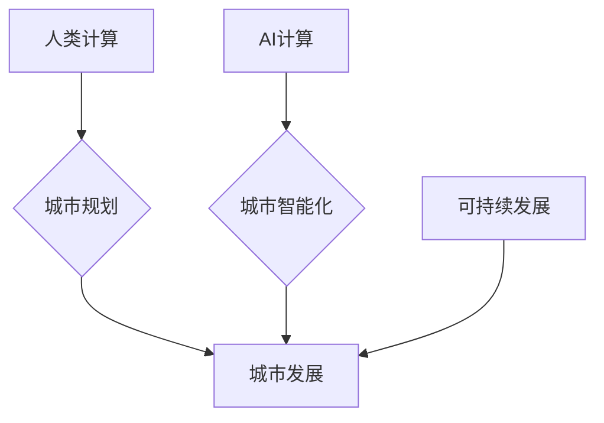

                 

## AI与人类计算：打造可持续发展的城市生活方式与规划

> 关键词：人工智能、城市规划、可持续发展、人类计算、数据驱动、机器学习、优化算法、城市智能化

## 1. 背景介绍

随着全球人口的持续增长和城市化的加速推进，城市面临着前所未有的挑战。资源短缺、环境污染、交通拥堵、社会不公等问题日益突出，这些问题严重影响着城市居民的生活质量和可持续发展。

传统城市规划模式往往依赖于静态数据和经验判断，难以有效应对城市发展的不确定性和复杂性。而人工智能（AI）技术的快速发展为城市规划提供了新的思路和解决方案。AI能够通过分析海量数据，识别城市发展趋势，预测未来需求，并提出优化方案，从而帮助城市实现可持续发展。

## 2. 核心概念与联系

**2.1 人类计算与AI计算**

人类计算是指人类利用自身的认知能力和经验进行计算和决策的过程。传统城市规划就是一种典型的“人类计算”模式。然而，随着城市规模和复杂度的不断增加，人类计算的效率和准确性受到限制。

AI计算是指利用人工智能算法和模型进行计算和决策的过程。AI能够处理海量数据，识别复杂模式，并进行精准预测，从而超越人类计算的局限性。

**2.2 城市智能化与AI应用**

城市智能化是指通过信息技术和人工智能技术，提升城市管理水平、提高城市服务质量、优化城市运行效率的过程。AI技术是城市智能化的关键驱动力，其应用场景涵盖城市交通、环境监测、公共安全、资源管理等多个领域。

**2.3 可持续发展与AI目标**

可持续发展是指满足当前代需求，而不损害未来代满足自身需求的能力。AI技术可以帮助城市实现可持续发展目标，例如：

* **节约资源：**通过智能化管理，优化资源分配，减少资源浪费。
* **减轻污染：**通过环境监测和预测，及时采取措施，减少污染排放。
* **提高生活质量：**通过智能化服务，提升城市居民的生活便利性和幸福感。

**2.4 核心概念架构**



## 3. 核心算法原理 & 具体操作步骤

**3.1 算法原理概述**

城市规划中的AI算法主要包括：

* **机器学习算法：**用于从城市数据中学习城市发展规律，预测未来需求。
* **优化算法：**用于根据城市规划目标，优化城市资源配置和空间布局。
* **模拟算法：**用于模拟城市发展过程，评估不同规划方案的效益。

**3.2 算法步骤详解**

1. **数据收集与预处理：**收集城市相关数据，例如人口、交通、环境、经济等，并进行清洗、转换、标准化等预处理工作。
2. **模型构建与训练：**根据具体规划目标，选择合适的AI算法，构建模型，并利用训练数据进行模型训练。
3. **方案评估与优化：**利用训练好的模型，模拟不同规划方案，评估其效益，并通过优化算法进行方案优化。
4. **方案实施与监控：**选择最佳方案，进行实施，并通过数据监控，评估方案效果，及时进行调整。

**3.3 算法优缺点**

**优点：**

* **数据驱动：**基于海量数据分析，决策更加科学和精准。
* **效率提升：**自动化处理大量数据和计算，提高规划效率。
* **预测能力：**能够预测未来城市发展趋势，提前应对挑战。

**缺点：**

* **数据依赖：**算法效果依赖于数据质量和完整性。
* **黑盒问题：**部分AI算法难以解释其决策逻辑，缺乏透明度。
* **伦理风险：**算法可能存在偏见，导致不公平的结果。

**3.4 算法应用领域**

* **城市交通规划：**优化交通流量，缓解拥堵，提高交通效率。
* **城市环境规划：**监测环境质量，预测污染趋势，制定环境保护措施。
* **城市资源规划：**优化资源分配，减少资源浪费，提高资源利用效率。
* **城市公共服务规划：**优化公共服务布局，提高服务质量，满足居民需求。

## 4. 数学模型和公式 & 详细讲解 & 举例说明

**4.1 数学模型构建**

城市规划中的AI算法通常基于数学模型进行构建。例如，交通流量预测模型可以基于马尔科夫链或神经网络模型构建，环境污染预测模型可以基于微分方程或统计模型构建。

**4.2 公式推导过程**

具体公式推导过程取决于所选择的算法和模型。例如，马尔科夫链模型的转移概率可以根据历史交通数据进行估计，神经网络模型的权重可以根据训练数据进行优化。

**4.3 案例分析与讲解**

**案例：城市交通流量预测**

假设我们想要预测城市某条道路的交通流量。我们可以使用马尔科夫链模型进行预测。

* **状态空间：**道路交通流量可以分为几个状态，例如轻度拥堵、中等拥堵、严重拥堵等。
* **转移概率：**根据历史交通数据，我们可以估计不同状态之间的转移概率。例如，如果今天是轻度拥堵，明天是中等拥堵的概率是多少？
* **预测过程：**根据当前状态和转移概率，我们可以预测未来交通流量的状态。

**公式：**

$$P(S_t = s_j | S_{t-1} = s_i) = P_{ij}$$

其中：

* $P(S_t = s_j | S_{t-1} = s_i)$ 表示从状态 $s_i$ 转移到状态 $s_j$ 的概率。
* $P_{ij}$ 表示状态 $s_i$ 到状态 $s_j$ 的转移概率。

## 5. 项目实践：代码实例和详细解释说明

**5.1 开发环境搭建**

* 操作系统：Linux/macOS/Windows
* Python 版本：3.6+
* 必要的库：NumPy、Pandas、Scikit-learn、TensorFlow/PyTorch

**5.2 源代码详细实现**

以下是一个简单的城市交通流量预测代码示例，使用Python和Scikit-learn库：

```python
import pandas as pd
from sklearn.model_selection import train_test_split
from sklearn.linear_model import LinearRegression

# 加载交通流量数据
data = pd.read_csv('traffic_data.csv')

# 选择特征和目标变量
features = ['hour', 'weekday', 'holiday']
target = 'traffic_volume'

# 将数据分割为训练集和测试集
X_train, X_test, y_train, y_test = train_test_split(data[features], data[target], test_size=0.2)

# 创建线性回归模型
model = LinearRegression()

# 训练模型
model.fit(X_train, y_train)

# 预测测试集数据
y_pred = model.predict(X_test)

# 评估模型性能
print('模型性能：', model.score(X_test, y_test))
```

**5.3 代码解读与分析**

* 代码首先加载交通流量数据，并选择特征和目标变量。
* 然后将数据分割为训练集和测试集，用于训练和评估模型。
* 创建线性回归模型，并使用训练数据进行模型训练。
* 最后使用测试数据进行预测，并评估模型性能。

**5.4 运行结果展示**

运行结果会显示模型的性能指标，例如R-squared值。R-squared值表示模型能够解释数据方差的比例，值越高表示模型拟合效果越好。

## 6. 实际应用场景

**6.1 城市交通管理**

* **交通流量预测：**预测道路交通流量，优化交通信号灯控制，缓解交通拥堵。
* **交通事故预警：**分析交通事故数据，识别高风险区域，预警潜在事故发生。
* **智能交通系统：**构建智能交通系统，实现车辆自动驾驶、智能停车等功能。

**6.2 城市环境监测**

* **空气质量监测：**利用传感器数据，实时监测空气质量，预测污染趋势，制定环保措施。
* **水质监测：**监测水质参数，识别水污染源，保护水资源。
* **噪声污染监测：**监测城市噪声水平，识别噪声源，降低城市噪音污染。

**6.3 城市资源管理**

* **能源管理：**优化能源分配，提高能源利用效率，减少能源浪费。
* **水资源管理：**优化水资源分配，减少水资源浪费，保障城市用水安全。
* **垃圾管理：**优化垃圾收集路线，提高垃圾处理效率，减少环境污染。

**6.4 未来应用展望**

随着AI技术的不断发展，其在城市规划领域的应用将更加广泛和深入。例如：

* **个性化城市服务：**根据居民需求，提供个性化城市服务，例如定制化交通路线、个性化公共服务推荐等。
* **城市韧性提升：**利用AI技术，提高城市应对自然灾害、突发事件等风险的能力。
* **智慧城市建设：**构建更加智能、高效、可持续的城市。

## 7. 工具和资源推荐

**7.1 学习资源推荐**

* **在线课程：**Coursera、edX、Udacity等平台提供人工智能、城市规划等相关课程。
* **书籍：**《深度学习》、《人工智能：一种现代方法》等书籍。
* **博客和论坛：**机器之心、AI科技大本营等网站提供人工智能相关资讯和讨论。

**7.2 开发工具推荐**

* **Python：**人工智能开发的常用语言。
* **TensorFlow/PyTorch：**深度学习框架。
* **Scikit-learn：**机器学习库。
* **Jupyter Notebook：**交互式编程环境。

**7.3 相关论文推荐**

* **城市规划中的AI应用：**
    * "Urban Planning with Artificial Intelligence: A Review"
    * "Deep Learning for Urban Planning: A Survey"
* **城市交通规划中的AI应用：**
    * "Traffic Flow Prediction Using Deep Learning"
    * "A Machine Learning Approach to Urban Traffic Flow Optimization"

## 8. 总结：未来发展趋势与挑战

**8.1 研究成果总结**

AI技术在城市规划领域的应用取得了显著成果，例如：

* **提高规划效率：**AI算法能够自动化处理大量数据和计算，提高规划效率。
* **提升规划精准度：**AI算法能够从数据中学习城市发展规律，预测未来需求，提高规划精准度。
* **优化城市运行：**AI技术可以帮助城市优化资源配置、交通管理、环境保护等方面，提高城市运行效率。

**8.2 未来发展趋势**

* **更强大的AI算法：**未来将出现更强大的AI算法，例如强化学习、迁移学习等，能够解决更复杂的问题。
* **更丰富的城市数据：**随着物联网、大数据等技术的发展，城市将拥有更丰富的数据资源，为AI算法提供更强大的支持。
* **更广泛的应用场景：**AI技术将应用于更多城市规划领域，例如城市设计、社区规划、公共设施规划等。

**8.3 面临的挑战**

* **数据质量问题：**AI算法的性能依赖于数据质量，城市数据往往存在不完整、不准确等问题。
* **算法解释性问题：**部分AI算法难以解释其决策逻辑，缺乏透明度，难以获得公众信任。
* **伦理风险问题：**AI算法可能存在偏见，导致不公平的结果，需要关注算法的伦理风险。

**8.4 研究展望**

未来研究方向包括：

* **开发更鲁棒、更解释性的AI算法。**
* **解决城市数据质量问题，构建高质量的城市数据平台。**
* **研究AI算法的伦理风险，制定相应的规范和政策。**


## 9. 附录：常见问题与解答

**9.1 如何评估AI算法的性能？**

常用的评估指标包括：

* **准确率：**算法正确预测的比例。
* **召回率：**算法能够识别出所有真实样本的比例。
* **F1-score：**准确率和召回率的调和平均值。
* **R-squared值：**模型能够解释数据方差的比例。

**9.2 如何解决城市数据质量问题？**

* **数据清洗：**删除重复数据、错误数据等。
* **数据标准化：**将数据转换为统一格式。
* **数据完整性检查：**确保数据完整无缺。
* **数据标注：**为数据添加标签，以便算法训练。

**9.3 如何应对AI算法的伦理风险？**

* **算法透明度：**使算法决策逻辑更加透明，易于理解。
* **算法公平性：**避免算法存在偏见，导致不公平的结果。
* **算法可解释性：**能够解释算法的决策结果，并提供合理的依据。
* **伦理审查：**对AI算法进行伦理审查，确保其符合社会道德规范。


作者：禅与计算机程序设计艺术 / Zen and the Art of Computer Programming 
<end_of_turn>

