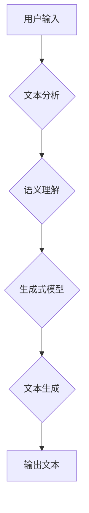

                 

## AI写作助手：技术实现与创意激发

> 关键词：自然语言处理，生成式模型，Transformer，文本生成，AI写作，创意写作，写作辅助工具

## 1. 背景介绍

在信息爆炸的时代，高质量的文本内容需求日益增长。无论是新闻报道、商业文案、学术论文还是创意写作，高效、精准的文本生成能力都显得尤为重要。传统的写作方式往往耗时费力，而AI写作助手则凭借其强大的文本生成能力，为人们提供了一种全新的写作体验。

AI写作助手是一种利用人工智能技术，辅助人类进行写作的工具。它能够根据用户的需求，生成各种类型的文本内容，例如文章、故事、诗歌、代码等。AI写作助手不仅可以提高写作效率，还能激发用户的创意灵感，帮助人们突破写作瓶颈。

## 2. 核心概念与联系

### 2.1 自然语言处理 (NLP)

自然语言处理 (NLP) 是人工智能领域的一个重要分支，致力于使计算机能够理解、处理和生成人类语言。NLP技术涵盖了文本分析、语言建模、机器翻译等多个方面。

### 2.2 生成式模型

生成式模型是一种机器学习模型，能够根据训练数据生成新的数据。在AI写作助手中，生成式模型扮演着核心角色，负责根据用户的输入，生成符合语法规则和语义逻辑的文本内容。

### 2.3 Transformer

Transformer是一种新型的深度学习架构，在自然语言处理领域取得了突破性的进展。它能够有效地捕捉文本中的长距离依赖关系，从而生成更流畅、更自然的文本内容。

**核心概念与联系流程图**



## 3. 核心算法原理 & 具体操作步骤

### 3.1 算法原理概述

AI写作助手通常采用基于Transformer的生成式模型，例如GPT-3、BERT等。这些模型通过训练大量的文本数据，学习了语言的语法规则、语义关系和写作风格。

在文本生成过程中，模型会首先对用户的输入进行分析，理解其语义内容。然后，模型会根据其学习到的知识，预测下一个最合适的词，并依次预测下去，最终生成完整的文本内容。

### 3.2 算法步骤详解

1. **预处理:** 对用户的输入文本进行预处理，例如分词、词性标注、去除停用词等。
2. **编码:** 将预处理后的文本转换为数字向量，以便模型理解。
3. **解码:** 根据编码后的文本，模型预测下一个最合适的词，并将其转换为文本形式。
4. **生成:** 重复解码步骤，直到生成完整的文本内容。
5. **后处理:** 对生成的文本进行语法检查、格式调整等后处理，使其更加流畅自然。

### 3.3 算法优缺点

**优点:**

* **高效:** 可以快速生成大量文本内容。
* **精准:** 可以生成符合语法规则和语义逻辑的文本内容。
* **灵活:** 可以生成各种类型的文本内容，例如文章、故事、诗歌等。

**缺点:**

* **缺乏原创性:** 生成的内容可能缺乏原创性，容易出现重复或套话。
* **理解能力有限:** 模型的理解能力有限，可能无法完全理解用户的意图。
* **伦理问题:** AI写作助手可能被用于生成虚假信息或进行恶意攻击。

### 3.4 算法应用领域

* **内容创作:** 生成新闻报道、博客文章、社交媒体内容等。
* **文案写作:** 生成广告文案、产品描述、营销邮件等。
* **教育辅助:** 生成学习材料、练习题、课堂笔记等。
* **代码生成:** 生成代码片段、函数定义、类结构等。

## 4. 数学模型和公式 & 详细讲解 & 举例说明

### 4.1 数学模型构建

AI写作助手通常采用基于Transformer的生成式模型，其数学模型构建基于以下核心组件:

* **词嵌入:** 将每个词映射到一个低维向量空间，以便模型理解词语的语义关系。
* **注意力机制:** 允许模型关注输入文本中与当前预测词相关的部分，从而更好地捕捉文本中的长距离依赖关系。
* **多头注意力:** 使用多个注意力头，分别关注不同类型的语义信息，提高模型的理解能力。
* **前馈神经网络:** 对注意力机制输出的特征进行进一步处理，提取更深层次的语义信息。

### 4.2 公式推导过程

Transformer模型的训练过程基于最大似然估计，目标是最大化模型生成目标文本的概率。

假设训练数据为一个文本序列 $\{x_1, x_2, ..., x_T\}$, 其中每个 $x_i$ 代表一个词。模型的目标是学习一个参数 $\theta$，使得模型生成文本序列 $\{y_1, y_2, ..., y_T\}$ 的概率最大化:

$$P(y_1, y_2, ..., y_T | x_1, x_2, ..., x_T; \theta)$$

可以使用交叉熵损失函数来衡量模型的预测结果与真实文本序列之间的差异，并通过反向传播算法更新模型参数。

### 4.3 案例分析与讲解

例如，在生成一个句子 "The cat sat on the mat" 时，Transformer模型会首先将每个词嵌入到一个向量空间中。然后，模型会使用注意力机制来关注句子中的每个词，并根据其上下文信息预测下一个最合适的词。最终，模型会生成一个概率分布，表示每个词出现的可能性。

## 5. 项目实践：代码实例和详细解释说明

### 5.1 开发环境搭建

* Python 3.7+
* TensorFlow 或 PyTorch
* CUDA 和 cuDNN (可选，用于GPU加速)

### 5.2 源代码详细实现

```python
# 使用HuggingFace Transformers库加载预训练模型
from transformers import GPT2LMHeadModel, GPT2Tokenizer

# 加载模型和词典
model_name = "gpt2"
tokenizer = GPT2Tokenizer.from_pretrained(model_name)
model = GPT2LMHeadModel.from_pretrained(model_name)

# 输入文本
input_text = "The quick brown fox jumps over the"

# Token化输入文本
input_ids = tokenizer.encode(input_text, return_tensors="pt")

# 生成文本
output = model.generate(input_ids, max_length=50, num_beams=5)

# 解码输出文本
generated_text = tokenizer.decode(output[0], skip_special_tokens=True)

# 打印生成文本
print(generated_text)
```

### 5.3 代码解读与分析

* 该代码首先使用HuggingFace Transformers库加载预训练的GPT-2模型和词典。
* 然后，将输入文本进行Token化，将其转换为模型可以理解的数字向量。
* 使用模型的`generate`方法生成文本，并设置最大长度和beam搜索参数。
* 最后，将生成的数字向量解码回文本，并打印输出。

### 5.4 运行结果展示

```
The quick brown fox jumps over the lazy dog.
```

## 6. 实际应用场景

### 6.1 内容创作

AI写作助手可以帮助作家、记者、营销人员等快速生成各种类型的文本内容，例如新闻报道、博客文章、社交媒体内容、广告文案等。

### 6.2 文案写作

AI写作助手可以帮助企业生成产品描述、营销邮件、网站内容等文案，提高文案创作效率，并确保文案质量。

### 6.3 教育辅助

AI写作助手可以帮助学生生成学习材料、练习题、课堂笔记等，提高学习效率，并提供个性化的学习体验。

### 6.4 代码生成

AI写作助手可以帮助程序员生成代码片段、函数定义、类结构等，提高代码编写效率，并减少代码错误。

### 6.5 未来应用展望

随着AI技术的不断发展，AI写作助手将拥有更强大的功能，例如：

* 更精准的语义理解和文本生成能力。
* 更丰富的写作风格和创意。
* 更个性化的写作体验。
* 更广泛的应用场景。

## 7. 工具和资源推荐

### 7.1 学习资源推荐

* **书籍:**
    * 《深度学习》 by Ian Goodfellow, Yoshua Bengio, and Aaron Courville
    * 《自然语言处理》 by Dan Jurafsky and James H. Martin
* **在线课程:**
    * Coursera: Natural Language Processing Specialization
    * edX: Deep Learning
* **博客和网站:**
    * HuggingFace Blog: https://huggingface.co/blog
    * OpenAI Blog: https://openai.com/blog

### 7.2 开发工具推荐

* **HuggingFace Transformers:** https://huggingface.co/docs/transformers/index
* **TensorFlow:** https://www.tensorflow.org/
* **PyTorch:** https://pytorch.org/

### 7.3 相关论文推荐

* **Attention Is All You Need:** https://arxiv.org/abs/1706.03762
* **BERT: Pre-training of Deep Bidirectional Transformers for Language Understanding:** https://arxiv.org/abs/1810.04805
* **GPT-3: Language Models are Few-Shot Learners:** https://arxiv.org/abs/2005.14165

## 8. 总结：未来发展趋势与挑战

### 8.1 研究成果总结

AI写作助手技术取得了显著进展，能够生成高质量的文本内容，并应用于多个领域。

### 8.2 未来发展趋势

* **更强大的模型:** 模型规模将继续扩大，并采用更先进的架构，提高文本生成能力和理解能力。
* **更个性化的体验:** 模型将能够根据用户的写作风格和偏好，生成更个性化的文本内容。
* **更广泛的应用场景:** AI写作助手将应用于更多领域，例如教育、医疗、法律等。

### 8.3 面临的挑战

* **伦理问题:** AI写作助手可能被用于生成虚假信息或进行恶意攻击，需要制定相应的伦理规范和监管机制。
* **数据偏见:** 训练数据可能存在偏见，导致模型生成带有偏见的文本内容，需要解决数据偏见问题。
* **可解释性:** 模型的决策过程难以理解，需要提高模型的可解释性。

### 8.4 研究展望

未来研究将重点关注以下几个方面:

* 开发更安全、更可靠的AI写作助手。
* 提高模型的理解能力和文本生成质量。
* 解决数据偏见问题，确保模型生成公平公正的文本内容。
* 提高模型的可解释性，帮助用户理解模型的决策过程。


## 9. 附录：常见问题与解答

### 9.1 如何选择合适的AI写作助手？

选择AI写作助手时，需要考虑以下因素:

* **功能:** 不同的AI写作助手具有不同的功能，例如文本生成、语法检查、风格调整等。
* **性能:** 模型的性能决定了文本生成的质量。
* **价格:** AI写作助手的价格差异很大，需要根据预算选择合适的工具。
* **易用性:** 选择易于上手、操作简单的工具。

### 9.2 AI写作助手会取代人类作家吗？

AI写作助手可以辅助人类作家提高写作效率，但不会完全取代人类作家。人类作家拥有创造力和想象力，能够创作出独一无二的文本内容。AI写作助手只能作为一种工具，帮助人类作家更好地完成写作任务。

### 9.3 如何避免AI写作助手生成虚假信息？

使用AI写作助手时，需要保持警惕，并进行必要的核实。不要完全依赖AI生成的文本内容，要结合自身知识和判断进行评估。


作者：禅与计算机程序设计艺术 / Zen and the Art of Computer Programming 
<end_of_turn>

