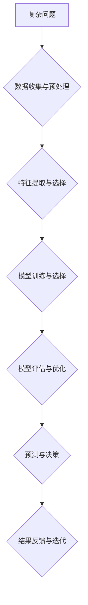

                 

## AI在复杂问题处理中的优势

> 关键词：人工智能、复杂问题、机器学习、深度学习、算法、优化、数据分析、预测建模

## 1. 背景介绍

随着科技的飞速发展，人类面临着越来越多的复杂问题，这些问题往往具有多变量、非线性、动态变化等特点，难以用传统方法有效解决。例如，气候变化、疾病预测、金融风险管理等领域都需要处理海量数据、识别复杂模式，并做出精准预测和决策。

人工智能（AI）作为一种新兴技术，凭借其强大的数据处理能力、模式识别能力和学习能力，在解决复杂问题方面展现出巨大的优势。AI算法能够从海量数据中提取隐藏的规律，建立复杂的数学模型，并不断学习和优化，最终实现对复杂问题的理解和解决。

## 2. 核心概念与联系

### 2.1  复杂问题

复杂问题是指具有以下特征的问题：

* **多变量性:** 问题涉及多个相互关联的变量，变量之间存在复杂的非线性关系。
* **非线性性:** 问题本身或其组成部分的响应关系是非线性的，难以用简单的线性模型描述。
* **动态变化:** 问题环境不断变化，需要实时调整策略和决策。
* **不确定性:** 问题存在不可预测的因素，难以获得完全的信息。

### 2.2  人工智能

人工智能是指模拟人类智能行为的计算机系统。AI技术涵盖了多个领域，包括机器学习、深度学习、自然语言处理、计算机视觉等。

### 2.3  AI在复杂问题处理中的优势

AI算法能够有效处理复杂问题，主要体现在以下几个方面：

* **数据驱动:** AI算法依赖于大量数据进行训练和学习，能够从数据中发现隐藏的模式和规律。
* **非线性建模:** AI算法能够建立复杂的非线性模型，更准确地描述现实世界的复杂关系。
* **自适应学习:** AI算法能够根据新的数据不断学习和优化，适应不断变化的环境。
* **并行处理:** AI算法能够利用并行计算技术，提高处理效率。

**Mermaid 流程图**



## 3. 核心算法原理 & 具体操作步骤

### 3.1  算法原理概述

深度学习是人工智能领域的重要分支，其核心算法是多层神经网络。深度学习算法能够自动学习数据中的特征表示，并进行复杂的模式识别和预测。

### 3.2  算法步骤详解

1. **数据收集与预处理:** 收集相关数据，并进行清洗、转换、归一化等预处理操作，以确保数据质量和算法训练效果。
2. **特征提取与选择:** 从原始数据中提取有用的特征，并选择最能代表问题的特征进行模型训练。
3. **模型构建:** 根据问题特点选择合适的深度学习模型架构，例如卷积神经网络（CNN）、循环神经网络（RNN）等。
4. **模型训练:** 使用训练数据训练深度学习模型，调整模型参数，使模型能够准确预测目标变量。
5. **模型评估与优化:** 使用测试数据评估模型性能，并根据评估结果调整模型参数、网络结构等，优化模型性能。
6. **预测与决策:** 将训练好的模型应用于新的数据，进行预测和决策。

### 3.3  算法优缺点

**优点:**

* **高精度:** 深度学习算法能够学习复杂的数据模式，实现高精度的预测和分类。
* **自动化特征提取:** 深度学习算法能够自动学习特征表示，无需人工特征工程。
* **适应性强:** 深度学习算法能够适应不断变化的数据分布和环境。

**缺点:**

* **数据依赖:** 深度学习算法需要大量数据进行训练，否则性能会下降。
* **计算资源消耗:** 深度学习模型训练需要大量的计算资源，训练时间较长。
* **可解释性差:** 深度学习模型的决策过程较为复杂，难以解释其决策依据。

### 3.4  算法应用领域

深度学习算法广泛应用于各个领域，例如：

* **图像识别:** 人脸识别、物体检测、图像分类等。
* **自然语言处理:** 文本分类、机器翻译、语音识别等。
* **医疗诊断:** 疾病预测、影像分析、药物研发等。
* **金融风险管理:** 欺诈检测、信用评分、投资预测等。

## 4. 数学模型和公式 & 详细讲解 & 举例说明

### 4.1  数学模型构建

深度学习模型的核心是多层神经网络，每个神经元接收多个输入信号，并通过激活函数进行处理，输出一个信号。神经网络层与层之间通过权重连接，权重值决定了不同神经元之间的信息传递强度。

### 4.2  公式推导过程

深度学习模型的训练过程是通过优化模型参数来最小化损失函数的过程。损失函数衡量模型预测结果与真实结果之间的差异。常用的损失函数包括均方误差（MSE）、交叉熵损失等。

**均方误差 (MSE):**

$$MSE = \frac{1}{n} \sum_{i=1}^{n} (y_i - \hat{y}_i)^2$$

其中：

* $y_i$ 是真实值
* $\hat{y}_i$ 是模型预测值
* $n$ 是样本数量

**交叉熵损失:**

$$CrossEntropy = -\frac{1}{n} \sum_{i=1}^{n} y_i \log(\hat{y}_i) + (1-y_i) \log(1-\hat{y}_i)$$

其中：

* $y_i$ 是真实值（0或1）
* $\hat{y}_i$ 是模型预测值（0到1之间的概率）

### 4.3  案例分析与讲解

例如，在图像分类任务中，可以使用卷积神经网络（CNN）模型进行训练。CNN模型能够自动学习图像特征，并进行分类预测。训练过程中，使用图像数据集进行训练，并使用交叉熵损失函数衡量模型性能。通过不断调整模型参数，使模型能够准确识别不同类别图像。

## 5. 项目实践：代码实例和详细解释说明

### 5.1  开发环境搭建

使用Python语言进行深度学习开发，需要安装以下软件：

* Python 3.x
* TensorFlow 或 PyTorch 深度学习框架
* NumPy 科学计算库
* Matplotlib 数据可视化库

### 5.2  源代码详细实现

以下是一个使用TensorFlow框架实现图像分类的简单代码示例：

```python
import tensorflow as tf

# 定义模型架构
model = tf.keras.models.Sequential([
  tf.keras.layers.Conv2D(32, (3, 3), activation='relu', input_shape=(28, 28, 1)),
  tf.keras.layers.MaxPooling2D((2, 2)),
  tf.keras.layers.Conv2D(64, (3, 3), activation='relu'),
  tf.keras.layers.MaxPooling2D((2, 2)),
  tf.keras.layers.Flatten(),
  tf.keras.layers.Dense(10, activation='softmax')
])

# 编译模型
model.compile(optimizer='adam',
              loss='sparse_categorical_crossentropy',
              metrics=['accuracy'])

# 训练模型
model.fit(x_train, y_train, epochs=5)

# 评估模型
loss, accuracy = model.evaluate(x_test, y_test)
print('Test loss:', loss)
print('Test accuracy:', accuracy)
```

### 5.3  代码解读与分析

* 代码首先定义了一个简单的卷积神经网络模型，包含两个卷积层、两个池化层、一个全连接层和一个输出层。
* 然后使用Adam优化器、交叉熵损失函数和准确率指标编译模型。
* 接着使用训练数据训练模型，训练5个epochs。
* 最后使用测试数据评估模型性能，打印测试损失和准确率。

### 5.4  运行结果展示

运行代码后，会输出模型的训练过程和测试结果，包括损失值、准确率等指标。

## 6. 实际应用场景

### 6.1  医疗诊断

深度学习算法可以用于分析医学影像，辅助医生诊断疾病。例如，可以用于识别肿瘤、骨折、心血管疾病等。

### 6.2  金融风险管理

深度学习算法可以用于识别金融欺诈、评估信用风险、预测股票价格等。

### 6.3  智能交通

深度学习算法可以用于自动驾驶、交通流量预测、智能停车等。

### 6.4  未来应用展望

随着人工智能技术的不断发展，深度学习算法将在更多领域得到应用，例如：

* **个性化教育:** 根据学生的学习情况，提供个性化的学习方案。
* **精准营销:** 根据用户的兴趣和行为，提供精准的广告和营销服务。
* **科学研究:** 加速科学研究，例如药物研发、材料科学等。

## 7. 工具和资源推荐

### 7.1  学习资源推荐

* **在线课程:** Coursera、edX、Udacity 等平台提供深度学习相关的在线课程。
* **书籍:** 《深度学习》、《动手学深度学习》等书籍对深度学习原理和应用进行了详细介绍。
* **博客和论坛:** TensorFlow、PyTorch 等深度学习框架的官方博客和论坛提供丰富的学习资源和技术支持。

### 7.2  开发工具推荐

* **TensorFlow:** Google开发的开源深度学习框架，支持多种硬件平台和编程语言。
* **PyTorch:** Facebook开发的开源深度学习框架，以其灵活性和易用性而闻名。
* **Keras:** TensorFlow的高层API，简化了深度学习模型的构建和训练过程。

### 7.3  相关论文推荐

* **《ImageNet Classification with Deep Convolutional Neural Networks》:** AlexNet模型的论文，标志着深度学习在图像识别领域的突破。
* **《Deep Residual Learning for Image Recognition》:** ResNet模型的论文，解决了深度网络训练的梯度消失问题。
* **《Attention Is All You Need》:** Transformer模型的论文，在自然语言处理领域取得了突破性进展。

## 8. 总结：未来发展趋势与挑战

### 8.1  研究成果总结

深度学习算法在复杂问题处理方面取得了显著的成果，在图像识别、自然语言处理、医疗诊断等领域取得了突破性进展。

### 8.2  未来发展趋势

* **模型规模和复杂度提升:** 未来深度学习模型将更加庞大、复杂，能够处理更复杂的数据和问题。
* **算法效率和可解释性提升:** 研究者将致力于提高深度学习算法的训练效率和可解释性，使其更加实用和可靠。
* **跨模态学习:** 深度学习算法将能够融合不同模态的数据，例如文本、图像、音频等，实现更全面的理解和分析。

### 8.3  面临的挑战

* **数据获取和隐私保护:** 深度学习算法依赖于大量数据，如何获取高质量数据并保护用户隐私是一个重要挑战。
* **算法公平性和可解释性:** 深度学习算法可能存在偏见和不可解释性问题，需要研究如何确保算法公平性和可解释性。
* **计算资源和能源消耗:** 训练大型深度学习模型需要大量的计算资源和能源，如何降低能源消耗是一个重要的研究方向。

### 8.4  研究展望

未来，深度学习技术将继续发展，在更多领域发挥重要作用。研究者将继续探索新的算法、模型和应用场景，推动人工智能技术向更智能、更安全、更可持续的方向发展。

## 9. 附录：常见问题与解答

**Q1: 深度学习算法的训练过程需要多长时间？**

A1: 深度学习算法的训练时间取决于模型复杂度、数据规模、硬件资源等因素。一般来说，训练小型模型可能只需要几小时，而训练大型模型可能需要几天甚至几周。

**Q2: 如何评估深度学习模型的性能？**

A2: 深度学习模型的性能通常使用准确率、召回率、F1-score等指标进行评估。

**Q3: 如何解决深度学习模型的过拟合问题？**

A3: 过拟合是指模型在训练数据上表现良好，但在测试数据上表现较差。解决过拟合问题的方法包括：

* 使用更大量的训练数据。
* 使用正则化技术，例如L1正则化和L2正则化。
* 使用Dropout技术，随机丢弃一部分神经元。
* 使用交叉验证技术，将数据分成多个子集进行训练和验证。


作者：禅与计算机程序设计艺术 / Zen and the Art of Computer Programming 
<end_of_turn>

