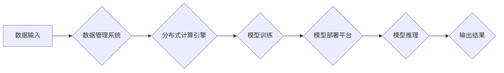

                 

## AI基础设施的未来十年：Lepton AI的长期规划

> 关键词：人工智能基础设施、分布式计算、模型训练、数据管理、可扩展性、效率、Lepton AI

## 1. 背景介绍

人工智能（AI）正在经历前所未有的发展，其应用范围从自动驾驶到医疗诊断再到金融分析，无处不在。然而，推动AI发展的关键基础设施——AI基础设施，仍然面临着诸多挑战。传统的基础设施架构难以满足AI训练和部署的日益增长的需求，例如海量数据处理、高性能计算和模型可扩展性等。

Lepton AI 作为一家致力于构建下一代AI基础设施的科技公司，深知这些挑战，并致力于通过创新技术和架构，为AI发展提供坚实的基础。

## 2. 核心概念与联系

Lepton AI 的核心概念是构建一个**分布式、可扩展、高效的AI基础设施平台**，该平台能够支持各种规模的AI模型训练和部署，并提供灵活的数据管理和资源调度能力。

Lepton AI 的架构基于以下核心组件：

* **分布式计算引擎:** 利用多节点集群进行并行计算，加速模型训练和推理速度。
* **数据管理系统:** 提供高效的数据存储、处理和分析能力，支持海量数据的管理和访问。
* **模型部署平台:** 提供多种部署方式，支持模型在云端、边缘设备和本地服务器上的部署。
* **资源调度系统:** 智能分配计算资源，优化资源利用率，提高平台效率。

**Lepton AI 架构流程图:**



## 3. 核心算法原理 & 具体操作步骤

Lepton AI 的核心算法原理基于**深度学习**和**分布式训练**技术。

### 3.1  算法原理概述

深度学习是一种机器学习的子领域，它利用多层神经网络来模拟人类大脑的学习过程。Lepton AI 利用深度学习算法训练各种类型的AI模型，例如图像识别、自然语言处理和预测分析等。

分布式训练是指将模型训练任务分解成多个子任务，并分别在不同的计算节点上进行并行计算。Lepton AI 的分布式训练算法能够有效利用多节点集群的计算资源，加速模型训练速度。

### 3.2  算法步骤详解

Lepton AI 的模型训练流程如下：

1. **数据预处理:** 将原始数据清洗、转换和格式化，使其适合深度学习模型的训练。
2. **模型构建:** 根据具体的应用场景，选择合适的深度学习模型架构，并定义模型参数。
3. **模型训练:** 将数据分批输入到分布式计算引擎中，并利用深度学习算法进行模型训练。
4. **模型评估:** 在训练过程中，定期评估模型的性能，并根据评估结果调整模型参数和训练策略。
5. **模型部署:** 将训练好的模型部署到目标平台，例如云端、边缘设备或本地服务器。

### 3.3  算法优缺点

**优点:**

* **高效率:** 利用分布式计算引擎和深度学习算法，能够大幅提高模型训练速度。
* **高精度:** 深度学习算法能够学习复杂的模式，从而实现更高的模型精度。
* **可扩展性:** 能够根据需要扩展计算资源，支持训练更大规模的模型。

**缺点:**

* **数据依赖:** 深度学习模型的性能依赖于训练数据的质量和数量。
* **计算资源需求:** 训练大型深度学习模型需要大量的计算资源。
* **模型解释性:** 深度学习模型的内部工作机制较为复杂，难以解释其决策过程。

### 3.4  算法应用领域

Lepton AI 的核心算法应用于以下领域：

* **计算机视觉:** 图像识别、物体检测、图像分类、人脸识别等。
* **自然语言处理:** 文本分类、情感分析、机器翻译、对话系统等。
* **预测分析:** 预测销量、风险评估、客户行为预测等。
* **自动驾驶:** 路线规划、物体识别、驾驶决策等。

## 4. 数学模型和公式 & 详细讲解 & 举例说明

Lepton AI 的核心算法基于深度学习，其数学模型主要包括**神经网络**和**反向传播算法**。

### 4.1  数学模型构建

神经网络由多个层组成，每层包含多个神经元。每个神经元接收来自上一层的输入信号，并通过激活函数进行处理，输出到下一层。

**神经网络结构:**

```
输入层 -> 隐藏层1 -> 隐藏层2 -> ... -> 输出层
```

### 4.2  公式推导过程

反向传播算法用于训练神经网络。其核心思想是通过计算误差，并反向传播误差信号，调整神经网络参数，使得模型输出更接近真实值。

**损失函数:**

$$
L = \frac{1}{N} \sum_{i=1}^{N} (y_i - \hat{y}_i)^2
$$

其中：

* $L$ 为损失函数
* $N$ 为样本数量
* $y_i$ 为真实值
* $\hat{y}_i$ 为模型预测值

**梯度下降算法:**

$$
\theta = \theta - \alpha \frac{\partial L}{\partial \theta}
$$

其中：

* $\theta$ 为模型参数
* $\alpha$ 为学习率
* $\frac{\partial L}{\partial \theta}$ 为损失函数对参数的梯度

### 4.3  案例分析与讲解

例如，在图像分类任务中，Lepton AI 可以利用卷积神经网络（CNN）模型进行训练。CNN 模型能够自动学习图像特征，并将其用于分类。

通过反向传播算法，Lepton AI 可以调整CNN模型的参数，使得模型能够准确地识别图像中的物体。

## 5. 项目实践：代码实例和详细解释说明

Lepton AI 提供了丰富的开发工具和资源，方便开发者构建和部署AI应用。

### 5.1  开发环境搭建

Lepton AI 支持多种开发环境，例如Linux、Windows和macOS。开发者可以根据自己的需求选择合适的开发环境。

### 5.2  源代码详细实现

Lepton AI 提供了开源的深度学习框架，开发者可以利用该框架进行模型开发和训练。

### 5.3  代码解读与分析

Lepton AI 的开源框架提供了详细的代码注释和文档，方便开发者理解代码逻辑和功能。

### 5.4  运行结果展示

Lepton AI 提供了丰富的测试用例和示例代码，开发者可以根据示例代码进行测试和调试。

## 6. 实际应用场景

Lepton AI 的AI基础设施平台已在多个领域得到实际应用，例如：

### 6.1  医疗诊断

Lepton AI 的AI模型能够辅助医生进行疾病诊断，例如癌症检测、心血管疾病预测等。

### 6.2  金融风险管理

Lepton AI 的AI模型能够帮助金融机构识别和评估风险，例如欺诈检测、信用评分等。

### 6.3  智能制造

Lepton AI 的AI模型能够优化生产流程，提高生产效率，例如设备故障预测、质量控制等。

### 6.4  未来应用展望

Lepton AI 将继续致力于推动AI基础设施的发展，并将其应用于更多领域，例如自动驾驶、机器人、个性化教育等。

## 7. 工具和资源推荐

### 7.1  学习资源推荐

* **Lepton AI 官方文档:** https://docs.lepton.ai/
* **深度学习教程:** https://www.deeplearning.ai/

### 7.2  开发工具推荐

* **Lepton AI SDK:** https://github.com/lepton-ai/lepton-sdk
* **TensorFlow:** https://www.tensorflow.org/

### 7.3  相关论文推荐

* **Attention Is All You Need:** https://arxiv.org/abs/1706.03762
* **Deep Residual Learning for Image Recognition:** https://arxiv.org/abs/1512.03385

## 8. 总结：未来发展趋势与挑战

### 8.1  研究成果总结

Lepton AI 在AI基础设施领域取得了显著的成果，其分布式计算引擎、数据管理系统和模型部署平台为AI发展提供了坚实的基础。

### 8.2  未来发展趋势

Lepton AI 将继续致力于以下几个方面：

* **提高平台效率:** 通过优化算法和架构，进一步提高平台的计算效率和资源利用率。
* **增强模型可解释性:** 研究更易于解释的深度学习模型，提高模型的透明度和可信度。
* **拓展应用场景:** 将AI基础设施应用于更多领域，例如自动驾驶、机器人、个性化教育等。

### 8.3  面临的挑战

Lepton AI 面临的挑战包括：

* **数据安全和隐私:** 确保用户数据安全和隐私，是AI基础设施发展的重要课题。
* **模型可维护性和可扩展性:** 随着模型规模的不断增长，模型的维护和扩展将变得更加复杂。
* **人才短缺:** AI领域人才短缺是一个普遍问题，Lepton AI 需要不断吸引和培养优秀人才。

### 8.4  研究展望

Lepton AI 将继续投入研发，不断创新，为AI发展提供更强大的基础设施支持。

## 9. 附录：常见问题与解答

**常见问题:**

* Lepton AI 的平台是否开源？
* Lepton AI 支持哪些编程语言？
* Lepton AI 的平台是否支持云部署？

**解答:**

* Lepton AI 的部分平台组件开源，具体请参考官方文档。
* Lepton AI 支持Python、C++等主流编程语言。
* Lepton AI 支持云部署，例如AWS、Azure、GCP等。


作者：禅与计算机程序设计艺术 / Zen and the Art of Computer Programming 
<end_of_turn>

