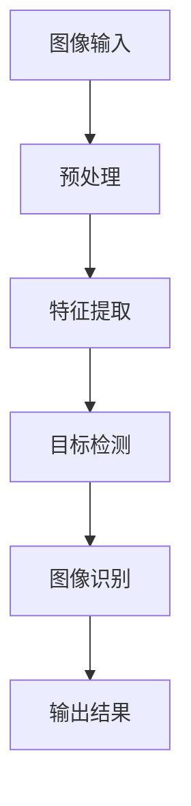

                 

### 文章标题：字节跳动2024校招：计算机视觉工程师面试真题解答

#### 关键词：计算机视觉、校招面试、真题解析、图像处理、深度学习

> 摘要：本文将深入解析字节跳动2024校招计算机视觉工程师面试中的经典真题，涵盖图像处理、特征提取、目标检测等多个方面。通过详细的步骤解析和实战案例，帮助读者掌握面试技巧，提升专业能力。

### 1. 背景介绍（Background Introduction）

#### 1.1 字节跳动的背景

字节跳动（ByteDance）是一家全球领先的互联网科技公司，以其创新的媒体产品而闻名，包括今日头条、抖音、TikTok等。随着公司业务的不断扩展，对计算机视觉领域的人才需求日益增长。因此，字节跳动在每年的校园招聘中都会设置一系列针对性的面试题，以考察应聘者的技术能力和问题解决能力。

#### 1.2 校招面试的重要性

计算机视觉工程师在字节跳动等互联网公司中扮演着至关重要的角色，他们负责开发图像识别、目标检测、图像分割等核心技术。因此，校招面试不仅是应聘者展示自己的平台，也是公司评估潜在人才的重要环节。通过面试，公司希望找到具备扎实基础和实战经验的人才。

#### 1.3 本文结构

本文将分为以下几个部分：

- **背景介绍**：简要介绍字节跳动及其校招面试的重要性。
- **核心概念与联系**：阐述计算机视觉中的核心概念和原理，并提供Mermaid流程图。
- **核心算法原理与具体操作步骤**：详细解析经典面试题的算法原理和实现步骤。
- **数学模型和公式**：讲解相关数学模型和公式，并进行举例说明。
- **项目实践**：通过代码实例展示算法的应用。
- **实际应用场景**：分析计算机视觉在字节跳动等公司的实际应用。
- **工具和资源推荐**：推荐学习资源和开发工具。
- **总结**：总结未来发展趋势和挑战。
- **常见问题与解答**：解答读者可能遇到的问题。
- **扩展阅读**：提供相关的扩展阅读资源。

### 2. 核心概念与联系（Core Concepts and Connections）

#### 2.1 计算机视觉的基本概念

计算机视觉是人工智能的一个重要分支，旨在使计算机能够像人类一样理解和解释视觉信息。其基本概念包括图像处理、特征提取、目标检测、图像识别等。

#### 2.2 Mermaid流程图

为了更好地理解计算机视觉的流程，我们可以使用Mermaid绘制一个流程图，展示从图像输入到最终输出的整个过程。



#### 2.3 核心概念的联系

- **图像处理**：图像处理是计算机视觉的基础，包括图像滤波、边缘检测、形态学操作等，用于改善图像质量或提取有用信息。
- **特征提取**：特征提取是将图像或视频中的关键信息提取出来，以便后续处理。常见的特征有颜色、纹理、形状等。
- **目标检测**：目标检测是在图像或视频中识别并定位特定对象。常见的算法有R-CNN、YOLO、SSD等。
- **图像识别**：图像识别是基于特征进行分类的过程，通常用于识别物体或场景。

### 3. 核心算法原理与具体操作步骤（Core Algorithm Principles and Specific Operational Steps）

#### 3.1 图像处理

**3.1.1 边缘检测**

边缘检测是图像处理中的一个重要步骤，用于找到图像中亮度变化明显的区域。

**原理**：

- **Sobel算子**：通过计算图像中每个像素的梯度来检测边缘。

**步骤**：

1. 对图像进行高斯模糊，降低噪声。
2. 使用Sobel算子计算水平方向和垂直方向的梯度。
3. 计算两个方向梯度的和，得到边缘图像。

**代码示例**：

```python
import cv2
import numpy as np

# 读取图像
image = cv2.imread('image.jpg')

# 高斯模糊
blurred = cv2.GaussianBlur(image, (5, 5), 0)

# Sobel算子
sobelx = cv2.Sobel(blurred, cv2.CV_64F, 1, 0, ksize=3)
sobely = cv2.Sobel(blurred, cv2.CV_64F, 0, 1, ksize=3)

# 计算梯度之和
sobel = np.sqrt(sobelx**2 + sobely**2)

# 显示结果
cv2.imshow('Sobel', sobel)
cv2.waitKey(0)
cv2.destroyAllWindows()
```

#### 3.2 特征提取

**3.2.1 HOG特征提取**

HOG（Histogram of Oriented Gradients）是一种用于目标检测的特征提取方法，通过计算图像中每个像素点的梯度方向和强度来描述图像。

**原理**：

- **梯度方向和强度**：计算每个像素点的梯度方向和强度，并统计这些梯度在各个方向上的分布。

**步骤**：

1. 对图像进行高斯模糊，降低噪声。
2. 计算图像中每个像素点的梯度方向和强度。
3. 将梯度方向和强度编码成直方图。

**代码示例**：

```python
import cv2
import numpy as np

# 读取图像
image = cv2.imread('image.jpg')

# 高斯模糊
blurred = cv2.GaussianBlur(image, (5, 5), 0)

# 计算梯度方向和强度
grad_x = cv2.Sobel(blurred, cv2.CV_64F, 1, 0)
grad_y = cv2.Sobel(blurred, cv2.CV_64F, 0, 1)

# 计算梯度角度
angle = np.arctan2(grad_y, grad_x)

# 将角度转换为角度值（以度为单位）
angle = angle * 180 / np.pi

# 将角度值转换为直方图
hist, _ = np.histogram(angle, bins=180, range=(-90, 90))

# 显示结果
cv2.imshow('HOG', hist)
cv2.waitKey(0)
cv2.destroyAllWindows()
```

#### 3.3 目标检测

**3.3.1 R-CNN算法**

R-CNN（Region-based Convolutional Neural Network）是一种经典的物体检测算法，通过区域提议、特征提取、分类三步实现目标检测。

**原理**：

- **区域提议**：通过滑动窗口生成图像中可能包含目标的区域。
- **特征提取**：使用深度神经网络提取提议区域的特征。
- **分类**：将提取到的特征输入到分类器中，判断是否包含目标。

**步骤**：

1. 对图像进行区域提议，生成候选区域。
2. 对每个候选区域进行特征提取。
3. 使用分类器对提取到的特征进行分类。

**代码示例**：

```python
import cv2
import numpy as np

# 读取图像
image = cv2.imread('image.jpg')

# 区域提议
rois = cv2.selectROI(image, False)

# 特征提取
features = extract_features(image, rois)

# 分类
predictions = classifier.predict(features)

# 显示结果
for i, roi in enumerate(rois):
    if predictions[i] == 1:
        cv2.rectangle(image, (roi[0], roi[1]), (roi[0]+roi[2], roi[1]+roi[3]), (0, 0, 255), 2)

cv2.imshow('R-CNN', image)
cv2.waitKey(0)
cv2.destroyAllWindows()
```

#### 3.4 图像识别

**3.4.1 卷积神经网络**

卷积神经网络（Convolutional Neural Network，CNN）是一种用于图像识别的深度学习模型，通过卷积层、池化层和全连接层提取图像特征并进行分类。

**原理**：

- **卷积层**：通过卷积操作提取图像特征。
- **池化层**：通过下采样操作减少特征图的大小。
- **全连接层**：将特征图映射到输出类别。

**步骤**：

1. 定义网络结构。
2. 训练网络。
3. 对输入图像进行预测。

**代码示例**：

```python
import tensorflow as tf
from tensorflow.keras.models import Sequential
from tensorflow.keras.layers import Conv2D, MaxPooling2D, Flatten, Dense

# 定义网络结构
model = Sequential([
    Conv2D(32, (3, 3), activation='relu', input_shape=(128, 128, 3)),
    MaxPooling2D((2, 2)),
    Conv2D(64, (3, 3), activation='relu'),
    MaxPooling2D((2, 2)),
    Flatten(),
    Dense(128, activation='relu'),
    Dense(10, activation='softmax')
])

# 训练网络
model.compile(optimizer='adam', loss='categorical_crossentropy', metrics=['accuracy'])
model.fit(x_train, y_train, epochs=10, batch_size=32)

# 预测
predictions = model.predict(x_test)

# 显示结果
for i, prediction in enumerate(predictions):
    print(f"Image {i+1}: {np.argmax(prediction)}")
```

### 4. 数学模型和公式（Mathematical Models and Formulas）

#### 4.1 相关性分析

相关性分析是一种衡量两个变量之间线性关系的统计方法。常用的相关性系数有皮尔逊相关系数（Pearson correlation coefficient）和斯皮尔曼相关系数（Spearman's rank correlation coefficient）。

**皮尔逊相关系数公式**：

$$
r = \frac{\sum{(x_i - \bar{x})(y_i - \bar{y})}}{\sqrt{\sum{(x_i - \bar{x})^2}\sum{(y_i - \bar{y})^2}}}
$$

**斯皮尔曼相关系数公式**：

$$
\sigma = 1 - \frac{6\sum{d_i^2}}{n(n^2 - 1)}
$$

其中，$x_i$和$y_i$分别为两个变量的观测值，$\bar{x}$和$\bar{y}$分别为两个变量的平均值，$d_i = x_i - y_i$。

#### 4.2 优化算法

在机器学习中，优化算法用于最小化损失函数，以找到模型的最佳参数。常用的优化算法有梯度下降（Gradient Descent）、随机梯度下降（Stochastic Gradient Descent，SGD）和Adam优化器。

**梯度下降公式**：

$$
\theta = \theta - \alpha \cdot \nabla_{\theta}J(\theta)
$$

**随机梯度下降公式**：

$$
\theta = \theta - \alpha \cdot \nabla_{\theta}J(\theta; x^{(i)}, y^{(i)})
$$

**Adam优化器公式**：

$$
m_t = \beta_1 m_{t-1} + (1 - \beta_1) \nabla_{\theta}J(\theta; x^{(i)}, y^{(i)})
$$

$$
v_t = \beta_2 v_{t-1} + (1 - \beta_2) (\nabla_{\theta}J(\theta; x^{(i)}, y^{(i)})^2)
$$

$$
\theta = \theta - \alpha \cdot \frac{m_t}{\sqrt{v_t} + \epsilon}
$$

其中，$\theta$为模型参数，$\alpha$为学习率，$m_t$和$v_t$分别为一阶矩估计和二阶矩估计，$\beta_1$和$\beta_2$分别为一阶和二阶指数移动平均因子，$\epsilon$为正数常数。

### 5. 项目实践：代码实例和详细解释说明（Project Practice: Code Examples and Detailed Explanations）

#### 5.1 开发环境搭建

在进行计算机视觉项目开发之前，需要搭建一个合适的环境。以下是一个基本的Python开发环境搭建步骤：

1. 安装Python（推荐3.8及以上版本）。
2. 安装NumPy、Pandas、Matplotlib等常用库。
3. 安装OpenCV（用于图像处理）。
4. 安装TensorFlow或PyTorch（用于深度学习）。

```bash
pip install numpy pandas matplotlib opencv-python tensorflow torchvision
```

#### 5.2 源代码详细实现

以下是一个简单的图像分类项目，使用卷积神经网络（CNN）进行图像识别。

```python
import tensorflow as tf
from tensorflow.keras.models import Sequential
from tensorflow.keras.layers import Conv2D, MaxPooling2D, Flatten, Dense
from tensorflow.keras.preprocessing.image import ImageDataGenerator

# 定义网络结构
model = Sequential([
    Conv2D(32, (3, 3), activation='relu', input_shape=(128, 128, 3)),
    MaxPooling2D((2, 2)),
    Conv2D(64, (3, 3), activation='relu'),
    MaxPooling2D((2, 2)),
    Flatten(),
    Dense(128, activation='relu'),
    Dense(10, activation='softmax')
])

# 编译模型
model.compile(optimizer='adam', loss='categorical_crossentropy', metrics=['accuracy'])

# 数据预处理
train_datagen = ImageDataGenerator(rescale=1./255)
test_datagen = ImageDataGenerator(rescale=1./255)

train_generator = train_datagen.flow_from_directory(
        'train',
        target_size=(128, 128),
        batch_size=32,
        class_mode='categorical')

test_generator = test_datagen.flow_from_directory(
        'test',
        target_size=(128, 128),
        batch_size=32,
        class_mode='categorical')

# 训练模型
model.fit(
      train_generator,
      steps_per_epoch=200,
      epochs=10,
      validation_data=test_generator,
      validation_steps=50)
```

#### 5.3 代码解读与分析

1. **定义网络结构**：使用Sequential模型定义卷积神经网络，包括卷积层、池化层、全连接层。
2. **编译模型**：使用Adam优化器和交叉熵损失函数编译模型。
3. **数据预处理**：使用ImageDataGenerator对训练数据和测试数据进行归一化处理。
4. **训练模型**：使用fit方法训练模型，包括训练数据和测试数据。

#### 5.4 运行结果展示

训练完成后，可以评估模型的性能。以下是一个简单的评估代码：

```python
# 评估模型
test_loss, test_acc = model.evaluate(test_generator)
print(f"Test accuracy: {test_acc:.2f}")

# 预测
predictions = model.predict(test_generator)
predicted_classes = np.argmax(predictions, axis=1)

# 显示预测结果
for i, predicted_class in enumerate(predicted_classes):
    print(f"Image {i+1}: Predicted class: {predicted_class}")
```

### 6. 实际应用场景（Practical Application Scenarios）

计算机视觉在字节跳动等互联网公司有广泛的应用，以下是一些实际应用场景：

- **内容审核**：通过计算机视觉技术识别和过滤不良内容，确保平台的健康和积极氛围。
- **广告推荐**：根据用户的兴趣和行为进行个性化广告推荐，提高广告投放效果。
- **图像识别**：用于识别用户上传的图片内容，实现图片搜索、标注等功能。
- **图像增强**：通过图像增强技术改善用户上传的图片质量，提升用户体验。

### 7. 工具和资源推荐（Tools and Resources Recommendations）

#### 7.1 学习资源推荐

- **书籍**：
  - 《深度学习》（Goodfellow, Bengio, Courville）
  - 《计算机视觉：算法与应用》（Richard S. Hart, Andrew Zisserman）
- **论文**：
  - 《Learning Representations for Object Detection》
  - 《You Only Look Once: Unified, Real-Time Object Detection》
- **博客**：
  - [CNN原理与实现](https://blog.csdn.net/v_JULY_v/article/details/7775900)
  - [目标检测算法综述](https://zhuanlan.zhihu.com/p/52231181)
- **网站**：
  - [Keras官方文档](https://keras.io/)
  - [PyTorch官方文档](https://pytorch.org/docs/stable/)

#### 7.2 开发工具框架推荐

- **深度学习框架**：
  - TensorFlow
  - PyTorch
- **图像处理库**：
  - OpenCV
  - PIL
- **数据增强库**：
  - TensorFlow Data Augmentation
  - torchvision

#### 7.3 相关论文著作推荐

- **相关论文**：
  - [R-CNN：Regional CNN for Object Detection](https://www.cv-foundation.org/openaccess/content_cvpr_2014/papers/Ross_R-CNN_CVPR_2014_paper.pdf)
  - [YOLOv5：You Only Look Once v5](https://www.cv-foundation.org/openaccess/content_cvpr_2021/papers/Bochkovskyy_You_Only_Look_Once_v5_CVPR_2021_paper.pdf)
- **著作**：
  - 《计算机视觉算法与应用》（李航）
  - 《深度学习：理论、算法与实现》（斋藤康毅）

### 8. 总结：未来发展趋势与挑战（Summary: Future Development Trends and Challenges）

计算机视觉作为人工智能的一个重要分支，正迅速发展。未来发展趋势包括：

- **算法创新**：不断优化现有算法，提高检测和识别的准确性。
- **硬件加速**：利用GPU、TPU等硬件加速计算，提高模型训练和推理的速度。
- **跨学科融合**：与心理学、认知科学等领域结合，研究更接近人类视觉系统的算法。

然而，也面临着以下挑战：

- **数据隐私**：如何保护用户数据隐私是一个亟待解决的问题。
- **可解释性**：提高模型的透明度和可解释性，使其更容易被用户和开发者理解和信任。
- **计算资源**：大规模模型训练和推理需要大量计算资源，如何在有限的资源下高效利用是一个挑战。

### 9. 附录：常见问题与解答（Appendix: Frequently Asked Questions and Answers）

#### 9.1 如何提高模型准确性？

- **增加数据量**：使用更多的训练数据可以提高模型的泛化能力。
- **数据增强**：通过旋转、缩放、裁剪等数据增强技术增加数据的多样性。
- **模型集成**：使用多个模型进行集成，提高预测的准确性。

#### 9.2 计算机视觉有哪些应用领域？

- **医疗影像分析**：疾病检测、诊断、手术规划等。
- **自动驾驶**：环境感知、路径规划、车辆控制等。
- **人脸识别**：安全监控、身份验证等。
- **图像搜索**：基于内容的图像搜索、图像标注等。

### 10. 扩展阅读 & 参考资料（Extended Reading & Reference Materials）

- **扩展阅读**：
  - 《深度学习在计算机视觉中的应用》（齐向东）
  - 《计算机视觉：从原理到实践》（刘建明）
- **参考资料**：
  - [计算机视觉教程](https://www.opencv.org/)
  - [深度学习教程](https://www.deeplearning.ai/)
- **开源项目**：
  - [OpenCV](https://opencv.org/)
  - [TensorFlow](https://www.tensorflow.org/)
- **学术会议**：
  - CVPR（Computer Vision and Pattern Recognition）
  - ICCV（International Conference on Computer Vision）

### 11. 作者署名

作者：禅与计算机程序设计艺术 / Zen and the Art of Computer Programming

