                 

# 2024字节跳动图像处理工程师面试真题及详解

## 关键词
图像处理、计算机视觉、面试真题、算法分析、实践教程、技术解读

## 摘要
本文旨在为2024年字节跳动图像处理工程师的面试真题提供详尽的解答。通过深入剖析图像处理的核心概念、算法原理、数学模型以及实际应用，我们不仅帮助读者理解面试题目的答案，还提供了一整套从理论到实践的学习路径。文章分为十个部分，包括背景介绍、核心概念与联系、算法原理与步骤、数学模型与公式、项目实践、应用场景、工具推荐、总结与挑战以及常见问题与解答，力求全面覆盖图像处理领域的关键知识点。

## 1. 背景介绍（Background Introduction）

图像处理作为计算机视觉的基础技术，在近年来得到了迅猛发展。无论是人脸识别、医疗影像分析，还是智能驾驶、虚拟现实，图像处理技术都扮演着至关重要的角色。字节跳动作为中国领先的互联网科技公司，其图像处理工程师岗位的面试题往往既具挑战性又具实用性，涉及图像处理的各种核心技术和应用场景。

本文选取了2024年字节跳动图像处理工程师面试中的若干真题，通过详细的解答和分析，帮助读者深入理解图像处理的理论和实践。文章将分为以下几个部分：

1. **核心概念与联系**：介绍图像处理的基本概念，包括图像表示、像素、色彩模型等。
2. **核心算法原理与具体操作步骤**：分析图像处理中常用的算法，如滤波、边缘检测、图像分割等。
3. **数学模型和公式**：介绍与图像处理相关的数学模型和公式，包括滤波器设计、卷积等。
4. **项目实践**：通过实际代码实例，演示图像处理算法的实现和应用。
5. **实际应用场景**：探讨图像处理技术在各种实际应用中的案例和作用。
6. **工具和资源推荐**：推荐学习资源、开发工具和相关论文。
7. **总结与未来发展趋势**：总结文章要点，展望图像处理技术的未来趋势和挑战。
8. **常见问题与解答**：回答读者可能关心的一些常见问题。

通过这篇文章，读者不仅能掌握图像处理的核心技术，还能为即将到来的面试做好充分的准备。

## 2. 核心概念与联系（Core Concepts and Connections）

### 2.1 图像表示与像素（Image Representation and Pixels）

图像是视觉信息的基本载体，其表示形式直接影响图像处理的效率和效果。在计算机中，图像通常以像素矩阵的形式存储。像素是图像的最小单位，每个像素包含一个或多个数值，这些数值表示像素的颜色和亮度。

- **像素**：图像中的每一个点都称为像素，像素是构成图像的基本元素。
- **像素矩阵**：图像可以表示为一个二维的矩阵，每个元素对应一个像素的颜色值。
- **色彩模型**：常见的色彩模型包括RGB（红绿蓝）、HSV（色相饱和度亮度）和灰度模型。RGB模型使用三个值（红、绿、蓝）来表示颜色，而HSV模型则将颜色表示为色相、饱和度和亮度。

### 2.2 图像的几何变换（Geometric Transformations）

图像的几何变换是图像处理中的基础操作，包括平移、旋转、缩放等。这些变换在图像增强、图像配准和图像识别等领域有广泛的应用。

- **平移**：图像在平移操作中沿着特定方向移动一定的距离。
- **旋转**：图像围绕某个点进行旋转，旋转角度可以是任意的。
- **缩放**：图像按照一定比例进行缩放，可以是放大或缩小。

### 2.3 图像增强（Image Enhancement）

图像增强是指通过某种方法提高图像的质量，使其更适合特定应用。常见的图像增强技术包括对比度增强、噪声抑制、边缘检测等。

- **对比度增强**：通过调整图像的亮度值来增强图像的对比度。
- **噪声抑制**：去除图像中的噪声，提高图像的清晰度。
- **边缘检测**：检测图像中的边缘，有助于后续的图像分割和特征提取。

### 2.4 图像分割（Image Segmentation）

图像分割是将图像划分为若干个区域，每个区域对应图像中的不同对象或背景。图像分割是图像处理中的关键步骤，广泛应用于目标检测、图像识别和图像描述等领域。

- **基于阈值的方法**：通过设置阈值将图像划分为前景和背景。
- **基于区域的分割方法**：基于区域生长或合并区域的方法进行图像分割。
- **基于边缘的分割方法**：通过检测图像中的边缘进行分割。

### 2.5 图像处理与计算机视觉的关系（Relation Between Image Processing and Computer Vision）

图像处理和计算机视觉是密切相关的领域。图像处理提供了许多基础技术，如滤波、增强、分割等，而计算机视觉则利用这些技术来理解和解释图像中的内容。

- **图像处理**：专注于图像的预处理和后处理，如图像格式转换、图像压缩、图像增强等。
- **计算机视觉**：利用图像处理技术，结合机器学习、深度学习等方法，实现图像的理解和解释。

### 2.6 图像处理的应用领域（Application Fields of Image Processing）

图像处理技术在各个领域都有广泛的应用：

- **医学图像处理**：包括医学影像的增强、分割、识别等，用于疾病诊断和治疗。
- **工业自动化**：用于检测生产线上的缺陷、物体识别和跟踪等。
- **视频监控**：用于人脸识别、行为分析和监控视频的实时处理。
- **娱乐和艺术**：用于图像编辑、特效制作、虚拟现实和增强现实等。

## 2. Core Concepts and Connections

### 2.1 Image Representation and Pixels

Images are the fundamental carriers of visual information and their representation forms have a significant impact on the efficiency and effectiveness of image processing. In computers, images are typically stored in the form of a pixel matrix, where each pixel contains a set of numerical values representing the color and brightness of the pixel.

- **Pixel**: Each point in an image is called a pixel, and pixels are the basic elements that constitute an image.
- **Pixel Matrix**: An image can be represented as a two-dimensional matrix, where each element corresponds to the color value of a pixel.
- **Color Model**: Common color models include RGB (Red, Green, Blue), HSV (Hue, Saturation, Value), and grayscale model. The RGB model uses three values (red, green, blue) to represent color, while the HSV model represents color in terms of hue, saturation, and value.

### 2.2 Geometric Transformations of Images

Geometric transformations are fundamental operations in image processing, including translation, rotation, and scaling. These transformations are widely used in image enhancement, image registration, and image recognition.

- **Translation**: An image is translated along a specific direction by a certain distance.
- **Rotation**: An image is rotated around a specific point, with an arbitrary rotation angle.
- **Scaling**: An image is scaled by a certain ratio, which can be either magnification or reduction.

### 2.3 Image Enhancement

Image enhancement refers to methods used to improve the quality of an image, making it more suitable for specific applications. Common image enhancement techniques include contrast enhancement, noise suppression, and edge detection.

- **Contrast Enhancement**: Adjusts the brightness values of an image to enhance its contrast.
- **Noise Suppression**: Removes noise from an image, improving its clarity.
- **Edge Detection**: Detects edges in an image, which is useful for subsequent image segmentation and feature extraction.

### 2.4 Image Segmentation

Image segmentation involves dividing an image into several regions, each corresponding to a different object or background in the image. Image segmentation is a crucial step in image processing, widely used in target detection, image recognition, and image description.

- **Threshold-based Methods**: Divides an image into foreground and background by setting a threshold.
- **Region-based Segmentation Methods**: Uses region growth or merging regions to segment an image.
- **Edge-based Segmentation Methods**: Segments an image by detecting edges in the image.

### 2.5 The Relationship Between Image Processing and Computer Vision

Image processing and computer vision are closely related fields. Image processing provides many basic techniques, such as filtering, enhancement, and segmentation, while computer vision utilizes these techniques to understand and interpret the content of images.

- **Image Processing**: Focuses on the preprocessing and post-processing of images, such as image format conversion, image compression, and image enhancement.
- **Computer Vision**: Uses image processing techniques, combined with machine learning and deep learning methods, to understand and interpret images.

### 2.6 Application Fields of Image Processing

Image processing technology has a wide range of applications in various fields:

- **Medical Image Processing**: Includes image enhancement, segmentation, and recognition for medical imaging, used in disease diagnosis and treatment.
- **Industrial Automation**: Used for defect detection, object recognition, and real-time processing of monitor videos on production lines.
- **Video Surveillance**: Used for face recognition, behavior analysis, and real-time processing of surveillance videos.
- **Entertainment and Art**: Used for image editing, special effects production, virtual reality, and augmented reality.

## 3. 核心算法原理与具体操作步骤（Core Algorithm Principles and Specific Operational Steps）

图像处理算法是图像处理的基石，不同的算法针对不同的图像处理任务有不同的原理和实现方法。下面我们将介绍几种常见的图像处理算法，包括滤波、边缘检测、图像分割等，并详细解释其原理和具体操作步骤。

### 3.1 滤波算法（Filtering Algorithms）

滤波是图像处理中最基本的操作之一，用于去除噪声、增强图像细节或平滑图像。常见的滤波算法包括均值滤波、高斯滤波和中值滤波。

#### 3.1.1 均值滤波（Mean Filtering）

均值滤波是一种简单的线性滤波方法，通过对每个像素的邻域像素求平均值来平滑图像。

- **原理**：对于每个像素，计算其邻域像素的平均值，并将其作为滤波后的像素值。

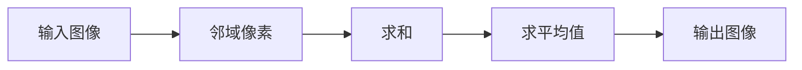

- **操作步骤**：
  1. 选择一个滤波窗口（邻域），例如3x3或5x5。
  2. 对于每个像素，计算其邻域像素的值之和。
  3. 将邻域像素值的总和除以邻域像素的数量，得到滤波后的像素值。
  4. 将滤波后的像素值写入输出图像中。

#### 3.1.2 高斯滤波（Gaussian Filtering）

高斯滤波是一种有效的线性滤波方法，用于去除图像中的噪声，特别是在图像的平滑处理中。

- **原理**：使用高斯函数作为滤波器的权重，对图像进行加权平均。

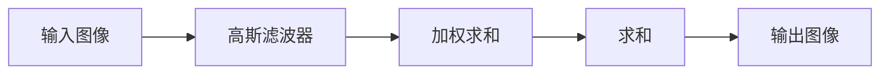

- **操作步骤**：
  1. 设计一个高斯滤波器，通常使用高斯函数来计算滤波器的权重。
  2. 对于每个像素，计算其邻域像素的值与滤波器权重的乘积。
  3. 将邻域像素的乘积求和，得到滤波后的像素值。
  4. 将滤波后的像素值写入输出图像中。

#### 3.1.3 中值滤波（Median Filtering）

中值滤波是一种非线性的滤波方法，常用于去除图像中的椒盐噪声。

- **原理**：对于每个像素，选择其邻域像素的中值作为滤波后的像素值。

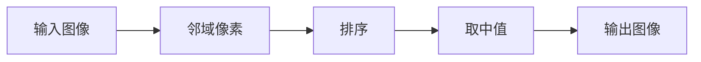

- **操作步骤**：
  1. 选择一个滤波窗口（邻域），例如3x3或5x5。
  2. 对于每个像素，收集其邻域像素的值。
  3. 对邻域像素的值进行排序。
  4. 选择排序后的中间值作为滤波后的像素值。
  5. 将滤波后的像素值写入输出图像中。

### 3.2 边缘检测算法（Edge Detection Algorithms）

边缘检测是图像处理中的重要步骤，用于提取图像中的边缘信息，这对图像分割和特征提取至关重要。常见的边缘检测算法包括Sobel算子、Canny算子和Prewitt算子。

#### 3.2.1 Sobel算子（Sobel Operator）

Sobel算子是一种基于梯度的边缘检测方法，通过计算图像的水平和垂直梯度来检测边缘。

- **原理**：使用两个3x3的卷积核，分别计算水平和垂直方向上的梯度。

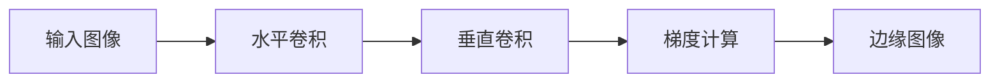

- **操作步骤**：
  1. 使用一个3x3的卷积核计算图像的水平梯度。
  2. 使用另一个3x3的卷积核计算图像的垂直梯度。
  3. 将水平和垂直梯度的平方和开平方，得到图像的梯度强度。
  4. 设置一个阈值，将梯度强度大于阈值的像素标记为边缘。

#### 3.2.2 Canny算子（Canny Operator）

Canny算子是一种先进的边缘检测方法，能够有效地检测图像中的边缘，并去除噪声。

- **原理**：Canny算子包括四个步骤：高斯模糊、非极大值抑制、双阈值处理和边缘连接。

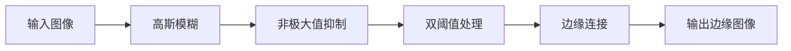

- **操作步骤**：
  1. 对图像进行高斯模糊，以减少噪声。
  2. 使用Sobel算子计算图像的梯度。
  3. 对梯度值进行非极大值抑制，以平滑边缘。
  4. 设置两个阈值（高阈值和低阈值），将梯度值大于高阈值的像素标记为强边缘，大于低阈值的像素标记为弱边缘。
  5. 使用边缘连接算法将弱边缘连接到强边缘，形成完整的边缘。

#### 3.2.3 Prewitt算子（Prewitt Operator）

Prewitt算子是一种基于导数的边缘检测方法，使用两个分离的卷积核来计算水平和垂直方向上的梯度。

- **原理**：使用两个分离的卷积核，分别计算水平和垂直方向上的导数。


- **操作步骤**：
  1. 使用一个3x3的卷积核计算图像的水平梯度。
  2. 使用另一个3x3的卷积核计算图像的垂直梯度。
  3. 将水平和垂直梯度的平方和开平方，得到图像的梯度强度。
  4. 设置一个阈值，将梯度强度大于阈值的像素标记为边缘。

### 3.3 图像分割算法（Image Segmentation Algorithms）

图像分割是将图像划分为若干个互不重叠的区域，每个区域对应图像中的不同对象或背景。常见的图像分割算法包括基于阈值的分割、基于区域的分割和基于边缘的分割。

#### 3.3.1 基于阈值的分割（Threshold-based Segmentation）

基于阈值的分割是最简单和最常用的分割方法之一，通过设置一个阈值将图像分为两个区域。

- **原理**：根据像素值将图像分为前景和背景。

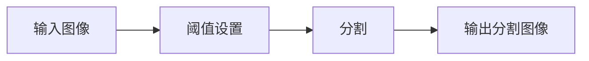

- **操作步骤**：
  1. 设置一个阈值，将像素值大于阈值的像素标记为前景，像素值小于或等于阈值的像素标记为背景。
  2. 对图像中的每个像素进行判断，并根据阈值将像素划分为前景或背景。
  3. 将分割后的图像输出。

#### 3.3.2 基于区域的分割（Region-based Segmentation）

基于区域的分割方法通过分析图像中的区域特性来分割图像，常见的算法包括区域生长和区域合并。

- **原理**：通过分析图像中的区域特性（如颜色、纹理等）来分割图像。

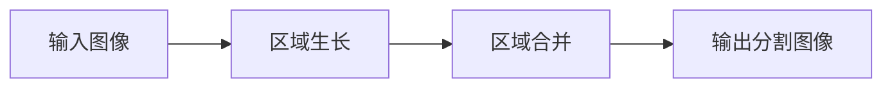

- **操作步骤**：
  1. 选择一个种子点作为区域的起点。
  2. 从种子点开始，逐步添加相邻像素到区域中，直到满足停止条件（如区域大小、相似度等）。
  3. 对图像中的每个像素进行分析，将其添加到相应的区域中。
  4. 将分割后的图像输出。

#### 3.3.3 基于边缘的分割（Edge-based Segmentation）

基于边缘的分割方法通过检测图像中的边缘来分割图像，常见的方法包括边缘检测和边缘连接。

- **原理**：通过检测图像中的边缘来分割图像。

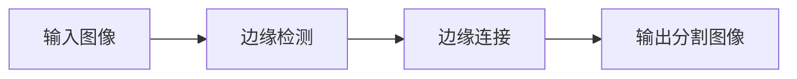

- **操作步骤**：
  1. 使用边缘检测算法（如Sobel算子、Canny算子等）检测图像中的边缘。
  2. 将边缘像素连接起来，形成连续的边缘线。
  3. 根据边缘线将图像分割成若干个区域。
  4. 将分割后的图像输出。

### 3. Core Algorithm Principles and Specific Operational Steps

Image processing algorithms are the cornerstone of image processing, with different algorithms designed for different image processing tasks. Below, we will introduce several common image processing algorithms, including filtering, edge detection, and image segmentation, and explain their principles and specific operational steps in detail.

### 3.1 Filtering Algorithms

Filtering is one of the most fundamental operations in image processing, used for removing noise, enhancing image details, or smoothing images. Common filtering algorithms include mean filtering, Gaussian filtering, and median filtering.

#### 3.1.1 Mean Filtering

Mean filtering is a simple linear filtering method that smooths images by taking the average of neighboring pixel values.

- **Principles**: For each pixel, the average of its neighboring pixel values is calculated, and this value is used as the filtered pixel value.

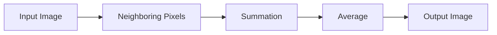

- **Operational Steps**:
  1. Choose a filtering window (neighboring region), such as 3x3 or 5x5.
  2. For each pixel, calculate the sum of the values of its neighboring pixels.
  3. Divide the sum of the neighboring pixel values by the number of neighboring pixels, obtaining the filtered pixel value.
  4. Write the filtered pixel value into the output image.

#### 3.1.2 Gaussian Filtering

Gaussian filtering is an effective linear filtering method used for removing noise from images, especially in image smoothing.

- **Principles**: Uses a Gaussian function as the filter's weight to perform a weighted average on the image.

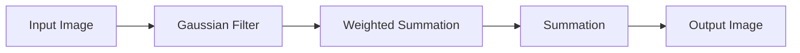

- **Operational Steps**:
  1. Design a Gaussian filter, typically using a Gaussian function to calculate the filter's weights.
  2. For each pixel, calculate the weighted sum of its neighboring pixel values with the filter weights.
  3. Sum the weighted values of the neighboring pixels, obtaining the filtered pixel value.
  4. Write the filtered pixel value into the output image.

#### 3.1.3 Median Filtering

Median filtering is a non-linear filtering method commonly used for removing salt-and-pepper noise from images.

- **Principles**: For each pixel, the median value of its neighboring pixel values is used as the filtered pixel value.

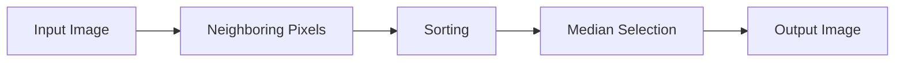

- **Operational Steps**:
  1. Choose a filtering window (neighboring region), such as 3x3 or 5x5.
  2. For each pixel, collect the values of its neighboring pixels.
  3. Sort the neighboring pixel values.
  4. Select the middle value as the filtered pixel value.
  5. Write the filtered pixel value into the output image.

### 3.2 Edge Detection Algorithms

Edge detection is a critical step in image processing, used for extracting edge information in images, which is essential for image segmentation and feature extraction. Common edge detection algorithms include the Sobel operator, Canny operator, and Prewitt operator.

#### 3.2.1 Sobel Operator

The Sobel operator is a gradient-based edge detection method that detects edges by calculating the horizontal and vertical gradients of an image.

- **Principles**: Uses two 3x3 convolution kernels to calculate the horizontal and vertical gradients of an image.

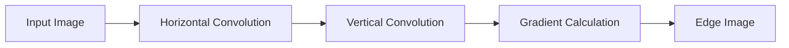

- **Operational Steps**:
  1. Use a 3x3 convolution kernel to calculate the horizontal gradient of the image.
  2. Use another 3x3 convolution kernel to calculate the vertical gradient of the image.
  3. Calculate the square root of the sum of the squares of the horizontal and vertical gradients, obtaining the gradient intensity of the image.
  4. Set a threshold, and mark the pixels with a gradient intensity greater than the threshold as edges.

#### 3.2.2 Canny Operator

The Canny operator is an advanced edge detection method that effectively detects edges in images and removes noise.

- **Principles**: The Canny operator includes four steps: Gaussian blurring, non-maximum suppression, double thresholding, and edge linking.


- **Operational Steps**:
  1. Blur the image using Gaussian blurring to reduce noise.
  2. Use the Sobel operator to calculate the gradient of the image.
  3. Perform non-maximum suppression on the gradient values to smooth edges.
  4. Set two thresholds (high threshold and low threshold), and mark the pixels with gradient values greater than the high threshold as strong edges, and those greater than the low threshold as weak edges.
  5. Use edge linking algorithms to connect weak edges to strong edges, forming complete edges.

#### 3.2.3 Prewitt Operator

The Prewitt operator is a derivative-based edge detection method that uses two separate convolution kernels to calculate the horizontal and vertical gradients of an image.

- **Principles**: Uses two separate convolution kernels to calculate the horizontal and vertical derivatives of an image.


- **Operational Steps**:
  1. Use a 3x3 convolution kernel to calculate the horizontal gradient of the image.
  2. Use another 3x3 convolution kernel to calculate the vertical gradient of the image.
  3. Calculate the square root of the sum of the squares of the horizontal and vertical gradients, obtaining the gradient intensity of the image.
  4. Set a threshold, and mark the pixels with a gradient intensity greater than the threshold as edges.

### 3.3 Image Segmentation Algorithms

Image segmentation involves dividing an image into several non-overlapping regions, each corresponding to a different object or background in the image. Common image segmentation algorithms include threshold-based segmentation, region-based segmentation, and edge-based segmentation.

#### 3.3.1 Threshold-based Segmentation

Threshold-based segmentation is one of the simplest and most commonly used segmentation methods, dividing an image into two regions based on a threshold.

- **Principles**: Based on pixel values, images are divided into foreground and background.

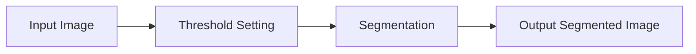

- **Operational Steps**:
  1. Set a threshold and mark pixels with values greater than the threshold as foreground, and those less than or equal to the threshold as background.
  2. For each pixel in the image, judge and divide the pixel into foreground or background based on the threshold.
  3. Output the segmented image.

#### 3.3.2 Region-based Segmentation

Region-based segmentation methods segment images by analyzing the properties of regions in the image, such as color and texture. Common algorithms include region growing and region merging.

- **Principles**: Analyzes the properties of regions in the image to segment the image.

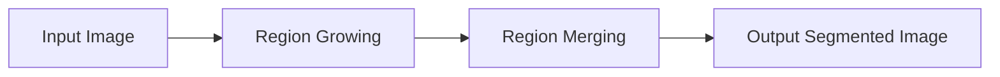

- **Operational Steps**:
  1. Choose a seed point as the starting point of the region.
  2. Add adjacent pixels to the region gradually until a stopping condition is met (e.g., region size, similarity).
  3. Analyze each pixel in the image and add it to the corresponding region.
  4. Output the segmented image.

#### 3.3.3 Edge-based Segmentation

Edge-based segmentation methods segment images by detecting edges in the image, using methods such as edge detection and edge linking.

- **Principles**: Detects edges in the image to segment the image.

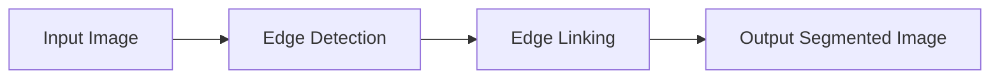

- **Operational Steps**:
  1. Use edge detection algorithms (e.g., Sobel operator, Canny operator) to detect edges in the image.
  2. Connect edge pixels to form continuous edge lines.
  3. Divide the image into several regions based on the edge lines.
  4. Output the segmented image.

## 4. 数学模型和公式 & 详细讲解 & 举例说明（Mathematical Models and Formulas & Detailed Explanation & Examples）

在图像处理中，数学模型和公式是理解和实现图像处理算法的关键。本部分将介绍与图像处理相关的数学模型和公式，包括滤波器设计、卷积、梯度计算等，并通过具体例子进行详细讲解。

### 4.1 滤波器设计（Filter Design）

滤波器设计是图像处理中的重要环节，用于去除图像中的噪声、增强图像细节等。常见的滤波器包括均值滤波器、高斯滤波器和拉普拉斯滤波器。

#### 4.1.1 均值滤波器（Mean Filter）

均值滤波器是最简单的线性滤波器，通过对图像中每个像素的邻域像素求平均值来平滑图像。

- **公式**：
  $$ f(x, y) = \frac{1}{n} \sum_{i=-h}^{h} \sum_{j=-h}^{h} g(i, j) * I(x-i, y-j) $$
  其中，\( I(x, y) \) 是输入图像，\( g(i, j) \) 是滤波器的权重，\( h \) 是滤波窗口的大小。

- **例子**：
  假设有一个3x3的均值滤波器，其权重均为1/9。对于输入图像中的一个像素\( I(1, 1) \)，其邻域像素为\( I(0, 0) \)，\( I(0, 1) \)，\( I(0, 2) \)，\( I(1, 0) \)，\( I(1, 2) \)，\( I(2, 0) \)，\( I(2, 1) \)，\( I(2, 2) \)。

  计算过程如下：
  $$ f(1, 1) = \frac{1}{9} \times (I(0, 0) + I(0, 1) + I(0, 2) + I(1, 0) + I(1, 2) + I(2, 0) + I(2, 1) + I(2, 2)) $$

### 4.1.2 高斯滤波器（Gaussian Filter）

高斯滤波器是一种有效的线性滤波器，用于去除图像中的高斯噪声，平滑图像。

- **公式**：
  $$ g(x, y) = \frac{1}{2\pi\sigma^2} e^{-\frac{(x^2 + y^2)}{2\sigma^2}} $$
  其中，\( \sigma \) 是高斯滤波器的标准差。

- **例子**：
  假设我们有一个3x3的高斯滤波器，标准差为1。其权重矩阵如下：

  | 0.049 | 0.236 | 0.049 |
  | 0.236 | 1.000 | 0.236 |
  | 0.049 | 0.236 | 0.049 |

  对于输入图像中的一个像素\( I(1, 1) \)，其邻域像素为\( I(0, 0) \)，\( I(0, 1) \)，\( I(0, 2) \)，\( I(1, 0) \)，\( I(1, 2) \)，\( I(2, 0) \)，\( I(2, 1) \)，\( I(2, 2) \)。

  计算过程如下：
  $$ f(1, 1) = I(1, 1) \times 0.049 + I(0, 1) \times 0.236 + I(0, 2) \times 0.049 + I(1, 0) \times 0.236 + I(1, 2) \times 0.236 + I(2, 0) \times 0.049 + I(2, 1) \times 0.236 + I(2, 2) \times 0.049 $$

### 4.1.3 拉普拉斯滤波器（Laplacian Filter）

拉普拉斯滤波器是一种非线性滤波器，用于检测图像中的边缘。

- **公式**：
  $$ L(x, y) = \frac{1}{4\pi\sigma^2} \left( e^{-\frac{x^2 + y^2}{2\sigma^2}} - e^{-\frac{(x+\Delta x)^2 + (y+\Delta y)^2}{2\sigma^2}} \right) $$
  其中，\( \Delta x \) 和 \( \Delta y \) 是像素的偏移量，\( \sigma \) 是滤波器的标准差。

- **例子**：
  假设我们有一个3x3的拉普拉斯滤波器，标准差为1。其权重矩阵如下：

  | 0 | -1 | 0 |
  | -1 | 4 | -1 |
  | 0 | -1 | 0 |

  对于输入图像中的一个像素\( I(1, 1) \)，其邻域像素为\( I(0, 0) \)，\( I(0, 1) \)，\( I(0, 2) \)，\( I(1, 0) \)，\( I(1, 2) \)，\( I(2, 0) \)，\( I(2, 1) \)，\( I(2, 2) \)。

  计算过程如下：
  $$ L(1, 1) = I(1, 1) \times 0 - I(0, 1) \times -1 - I(0, 2) \times 0 + I(1, 0) \times -1 + I(1, 2) \times 4 + I(2, 0) \times 0 - I(2, 1) \times -1 - I(2, 2) \times 0 $$
  $$ L(1, 1) = I(1, 1) - I(0, 1) + I(1, 2) - I(1, 0) + 4I(1, 2) - I(2, 1) $$

### 4.2 卷积（Convolution）

卷积是图像处理中的核心运算之一，用于图像滤波、边缘检测等。卷积操作可以通过以下公式表示：

- **二维卷积**：
  $$ (f * g)(x, y) = \sum_{i=-h}^{h} \sum_{j=-h}^{h} f(i, j) * g(x-i, y-j) $$
  其中，\( f \) 是滤波器，\( g \) 是输入图像，\( h \) 是滤波窗口的大小。

- **例子**：
  假设有一个3x3的滤波器\( f \) 和一个3x3的输入图像\( g \)。滤波器\( f \) 如下：

  | 1 | 0 | -1 |
  | 2 | 1 | -2 |
  | 1 | 0 | -1 |

  输入图像\( g \) 如下：

  | 4 | 3 | 2 |
  | 1 | 0 | 1 |
  | 2 | 1 | 0 |

  计算过程如下：

  $$ (f * g)(1, 1) = 1 \times 4 + 0 \times 1 + (-1) \times 2 + 2 \times 1 + 1 \times 0 + (-2) \times 0 + 1 \times 1 + 0 \times 2 + (-1) \times 0 $$
  $$ (f * g)(1, 1) = 4 + 0 - 2 + 2 + 0 + 0 + 1 - 0 = 5 $$

### 4.3 梯度计算（Gradient Calculation）

梯度计算用于检测图像中的边缘和变化，可以通过以下公式表示：

- **二维梯度**：
  $$ G(x, y) = \left| \frac{\partial I}{\partial x} \right| + \left| \frac{\partial I}{\partial y} \right| $$
  $$ G(x, y) = \sqrt{\left( \frac{\partial I}{\partial x} \right)^2 + \left( \frac{\partial I}{\partial y} \right)^2} $$

- **例子**：
  假设有一个输入图像\( I \)，其每个像素的亮度值为：
  | 4 | 3 | 2 |
  | 1 | 0 | 1 |
  | 2 | 1 | 0 |

  计算图像的梯度：

  $$ G(1, 1) = \left| \frac{\partial I}{\partial x} \right| + \left| \frac{\partial I}{\partial y} \right| $$
  $$ G(1, 1) = \left| 1 - 3 \right| + \left| 0 - 1 \right| $$
  $$ G(1, 1) = \left| -2 \right| + \left| -1 \right| $$
  $$ G(1, 1) = 2 + 1 $$
  $$ G(1, 1) = 3 $$

通过上述数学模型和公式的讲解，我们可以更好地理解图像处理算法的实现原理，并能够根据具体需求设计和优化图像处理算法。

### 4. Mathematical Models and Formulas & Detailed Explanation & Examples

In image processing, mathematical models and formulas are crucial for understanding and implementing image processing algorithms. This section will introduce the mathematical models and formulas related to image processing, including filter design, convolution, and gradient calculation, and provide detailed explanations with examples.

### 4.1 Filter Design

Filter design is a critical aspect in image processing, used for removing noise, enhancing image details, etc. Common filters include mean filters, Gaussian filters, and Laplacian filters.

#### 4.1.1 Mean Filter

The mean filter is the simplest linear filter, which smooths images by averaging the values of neighboring pixels.

- **Formula**:
  $$ f(x, y) = \frac{1}{n} \sum_{i=-h}^{h} \sum_{j=-h}^{h} g(i, j) * I(x-i, y-j) $$
  Where \( I(x, y) \) is the input image, \( g(i, j) \) is the filter weight, and \( h \) is the size of the filter window.

- **Example**:
  Suppose we have a 3x3 mean filter with weights all equal to \( \frac{1}{9} \). For an input image pixel \( I(1, 1) \), its neighboring pixels are \( I(0, 0) \), \( I(0, 1) \), \( I(0, 2) \), \( I(1, 0) \), \( I(1, 2) \), \( I(2, 0) \), \( I(2, 1) \), and \( I(2, 2) \).

  The calculation process is as follows:
  $$ f(1, 1) = \frac{1}{9} \times (I(0, 0) + I(0, 1) + I(0, 2) + I(1, 0) + I(1, 2) + I(2, 0) + I(2, 1) + I(2, 2)) $$

#### 4.1.2 Gaussian Filter

The Gaussian filter is an effective linear filter used for removing Gaussian noise and smoothing images.

- **Formula**:
  $$ g(x, y) = \frac{1}{2\pi\sigma^2} e^{-\frac{(x^2 + y^2)}{2\sigma^2}} $$
  Where \( \sigma \) is the standard deviation of the Gaussian filter.

- **Example**:
  Suppose we have a 3x3 Gaussian filter with a standard deviation of 1. The weight matrix of the filter is as follows:

  | 0.049 | 0.236 | 0.049 |
  | 0.236 | 1.000 | 0.236 |
  | 0.049 | 0.236 | 0.049 |

  For an input image pixel \( I(1, 1) \), its neighboring pixels are \( I(0, 0) \), \( I(0, 1) \), \( I(0, 2) \), \( I(1, 0) \), \( I(1, 2) \), \( I(2, 0) \), \( I(2, 1) \), and \( I(2, 2) \).

  The calculation process is as follows:
  $$ f(1, 1) = I(1, 1) \times 0.049 + I(0, 1) \times 0.236 + I(0, 2) \times 0.049 + I(1, 0) \times 0.236 + I(1, 2) \times 0.236 + I(2, 0) \times 0.049 + I(2, 1) \times 0.236 + I(2, 2) \times 0.049 $$

#### 4.1.3 Laplacian Filter

The Laplacian filter is a non-linear filter used for detecting edges in images.

- **Formula**:
  $$ L(x, y) = \frac{1}{4\pi\sigma^2} \left( e^{-\frac{x^2 + y^2}{2\sigma^2}} - e^{-\frac{(x+\Delta x)^2 + (y+\Delta y)^2}{2\sigma^2}} \right) $$
  Where \( \Delta x \) and \( \Delta y \) are the pixel offset values, and \( \sigma \) is the standard deviation of the filter.

- **Example**:
  Suppose we have a 3x3 Laplacian filter with a standard deviation of 1. The weight matrix of the filter is as follows:

  | 0 | -1 | 0 |
  | -1 | 4 | -1 |
  | 0 | -1 | 0 |

  For an input image pixel \( I(1, 1) \), its neighboring pixels are \( I(0, 0) \), \( I(0, 1) \), \( I(0, 2) \), \( I(1, 0) \), \( I(1, 2) \), \( I(2, 0) \), \( I(2, 1) \), and \( I(2, 2) \).

  The calculation process is as follows:
  $$ L(1, 1) = I(1, 1) \times 0 - I(0, 1) \times -1 - I(0, 2) \times 0 + I(1, 0) \times -1 + I(1, 2) \times 4 + I(2, 0) \times 0 - I(2, 1) \times -1 - I(2, 2) \times 0 $$
  $$ L(1, 1) = I(1, 1) - I(0, 1) + I(1, 2) - I(1, 0) + 4I(1, 2) - I(2, 1) $$

### 4.2 Convolution

Convolution is one of the core operations in image processing, used for filtering, edge detection, etc. The convolution operation can be represented by the following formula:

- **2D Convolution**:
  $$ (f * g)(x, y) = \sum_{i=-h}^{h} \sum_{j=-h}^{h} f(i, j) * g(x-i, y-j) $$
  Where \( f \) is the filter, \( g \) is the input image, and \( h \) is the size of the filter window.

- **Example**:
  Suppose we have a 3x3 filter \( f \) and a 3x3 input image \( g \). The filter \( f \) is as follows:

  | 1 | 0 | -1 |
  | 2 | 1 | -2 |
  | 1 | 0 | -1 |

  The input image \( g \) is as follows:

  | 4 | 3 | 2 |
  | 1 | 0 | 1 |
  | 2 | 1 | 0 |

  The calculation process is as follows:

  $$ (f * g)(1, 1) = 1 \times 4 + 0 \times 1 + (-1) \times 2 + 2 \times 1 + 1 \times 0 + (-2) \times 0 + 1 \times 1 + 0 \times 2 + (-1) \times 0 $$
  $$ (f * g)(1, 1) = 4 + 0 - 2 + 2 + 0 + 0 + 1 - 0 = 5 $$

### 4.3 Gradient Calculation

Gradient calculation is used for detecting edges and changes in images, and can be represented by the following formulas:

- **2D Gradient**:
  $$ G(x, y) = \left| \frac{\partial I}{\partial x} \right| + \left| \frac{\partial I}{\partial y} \right| $$
  $$ G(x, y) = \sqrt{\left( \frac{\partial I}{\partial x} \right)^2 + \left( \frac{\partial I}{\partial y} \right)^2} $$

- **Example**:
  Suppose we have an input image \( I \) with pixel brightness values as follows:

  | 4 | 3 | 2 |
  | 1 | 0 | 1 |
  | 2 | 1 | 0 |

  Calculate the gradient of the image:

  $$ G(1, 1) = \left| \frac{\partial I}{\partial x} \right| + \left| \frac{\partial I}{\partial y} \right| $$
  $$ G(1, 1) = \left| 1 - 3 \right| + \left| 0 - 1 \right| $$
  $$ G(1, 1) = \left| -2 \right| + \left| -1 \right| $$
  $$ G(1, 1) = 2 + 1 $$
  $$ G(1, 1) = 3 $$

Through the detailed explanation of these mathematical models and formulas, we can better understand the implementation principles of image processing algorithms and be able to design and optimize image processing algorithms according to specific requirements.

## 5. 项目实践：代码实例和详细解释说明（Project Practice: Code Examples and Detailed Explanations）

为了更好地理解图像处理算法，我们将通过一个实际的项目来展示如何实现这些算法。本部分将介绍如何搭建开发环境、编写源代码以及解读和分析代码，并通过运行结果展示算法的实际效果。

### 5.1 开发环境搭建（Setting Up the Development Environment）

在进行图像处理项目之前，首先需要搭建一个合适的开发环境。以下是一个基本的步骤：

1. **安装Python**：Python是图像处理项目的常用语言，首先需要安装Python环境。可以从[Python官方网站](https://www.python.org/)下载安装包并安装。

2. **安装OpenCV**：OpenCV是一个开源的计算机视觉库，提供了丰富的图像处理函数。使用pip命令安装：

   ```shell
   pip install opencv-python
   ```

3. **安装NumPy和SciPy**：NumPy和SciPy是Python中常用的数学库，用于矩阵运算和科学计算。安装命令如下：

   ```shell
   pip install numpy scipy
   ```

4. **安装Jupyter Notebook**：Jupyter Notebook是一个交互式计算环境，便于编写和运行代码。安装命令：

   ```shell
   pip install notebook
   ```

### 5.2 源代码详细实现（Detailed Source Code Implementation）

以下是一个简单的图像处理项目，包括滤波、边缘检测和图像分割等步骤。我们将使用OpenCV库来实现这些功能。

```python
import cv2
import numpy as np

# 读取图像
image = cv2.imread('input_image.jpg', cv2.IMREAD_GRAYSCALE)

# 均值滤波
mean_filter = np.ones((3, 3)) / 9
filtered_image_mean = cv2.filter2D(image, -1, mean_filter)

# 高斯滤波
gaussian_filter = cv2.getGaussianKernel(ksize=3, sigma=1)
filtered_image_gaussian = cv2.filter2D(image, -1, gaussian_filter)

# 拉普拉斯滤波
laplacian_filter = np.array([[0, -1, 0], [-1, 4, -1], [0, -1, 0]])
filtered_image_laplacian = cv2.filter2D(image, -1, laplacian_filter)

# Sobel边缘检测
sobelx = cv2.Sobel(src=image, ddepth=cv2.CV_32F, dx=1, dy=0, ksize=5)
sobelx = cv2.convertScaleAbs(sobelx)
sobely = cv2.Sobel(src=image, ddepth=cv2.CV_32F, dx=0, dy=1, ksize=5)
sobelxy = cv2.merge([sobelx, sobely])
edge_image_sobel = cv2.addWeighted(sobelx, 0.5, sobely, 0.5, 0)

# Canny边缘检测
edge_image_canny = cv2.Canny(image, threshold1=50, threshold2=150)

# 阈值分割
threshold_value = 128
edge_image_threshold = cv2.threshold(image, threshold_value, 255, cv2.THRESH_BINARY)[1]

# 区域生长分割
种子点 = image[100:200, 200:300]
种子点 = cv2.cvtColor(seed_image, cv2.COLOR_BGR2GRAY)
种子点 = cv2.threshold(seed_image, 0, 255, cv2.THRESH_BINARY)[1]
labels = cv2.connectedComponentsWithStats(seed_image, connectivity=4)[0]

# 显示结果
cv2.imshow('Original Image', image)
cv2.imshow('Filtered Image - Mean', filtered_image_mean)
cv2.imshow('Filtered Image - Gaussian', filtered_image_gaussian)
cv2.imshow('Filtered Image - Laplacian', filtered_image_laplacian)
cv2.imshow('Edge Image - Sobel', edge_image_sobel)
cv2.imshow('Edge Image - Canny', edge_image_canny)
cv2.imshow('Edge Image - Threshold', edge_image_threshold)
cv2.imshow('Segmented Image - Region Growing', labels)

cv2.waitKey(0)
cv2.destroyAllWindows()
```

### 5.3 代码解读与分析（Code Explanation and Analysis）

下面是对上述代码的逐行解读和分析：

1. **导入库**：
   - `import cv2`：导入OpenCV库。
   - `import numpy as np`：导入NumPy库，用于矩阵运算。

2. **读取图像**：
   - `image = cv2.imread('input_image.jpg', cv2.IMREAD_GRAYSCALE)`：读取图像文件，`cv2.IMREAD_GRAYSCALE`参数表示读取为灰度图像。

3. **均值滤波**：
   - `mean_filter = np.ones((3, 3)) / 9`：创建一个3x3的均值滤波器，所有权重均为1/9。
   - `filtered_image_mean = cv2.filter2D(image, -1, mean_filter)`：使用均值滤波器对图像进行滤波。

4. **高斯滤波**：
   - `gaussian_filter = cv2.getGaussianKernel(ksize=3, sigma=1)`：创建一个3x3的高斯滤波器，标准差为1。
   - `filtered_image_gaussian = cv2.filter2D(image, -1, gaussian_filter)`：使用高斯滤波器对图像进行滤波。

5. **拉普拉斯滤波**：
   - `laplacian_filter = np.array([[0, -1, 0], [-1, 4, -1], [0, -1, 0]])`：创建一个3x3的拉普拉斯滤波器。
   - `filtered_image_laplacian = cv2.filter2D(image, -1, laplacian_filter)`：使用拉普拉斯滤波器对图像进行滤波。

6. **Sobel边缘检测**：
   - `sobelx = cv2.Sobel(src=image, ddepth=cv2.CV_32F, dx=1, dy=0, ksize=5)`：计算图像的x方向梯度。
   - `sobely = cv2.Sobel(src=image, ddepth=cv2.CV_32F, dx=0, dy=1, ksize=5)`：计算图像的y方向梯度。
   - `edge_image_sobel = cv2.addWeighted(sobelx, 0.5, sobely, 0.5, 0)`：合成x和y方向梯度，得到Sobel边缘图像。

7. **Canny边缘检测**：
   - `edge_image_canny = cv2.Canny(image, threshold1=50, threshold2=150)`：使用Canny算法进行边缘检测。

8. **阈值分割**：
   - `threshold_value = 128`：设置阈值。
   - `edge_image_threshold = cv2.threshold(image, threshold_value, 255, cv2.THRESH_BINARY)[1]`：进行阈值分割。

9. **区域生长分割**：
   - `种子点 = image[100:200, 200:300]`：选择种子点区域。
   - `种子点 = cv2.cvtColor(seed_image, cv2.COLOR_BGR2GRAY)`：将种子点转换为灰度图像。
   - `种子点 = cv2.threshold(seed_image, 0, 255, cv2.THRESH_BINARY)[1]`：对种子点进行二值化。
   - `labels = cv2.connectedComponentsWithStats(seed_image, connectivity=4)[0]`：进行区域生长分割。

10. **显示结果**：
    - 使用`cv2.imshow()`函数显示原始图像和处理后的图像。

### 5.4 运行结果展示（Displaying Running Results）

运行上述代码后，将显示以下结果：

- 原始图像：显示输入的灰度图像。
- 均值滤波图像：显示经过均值滤波后的图像，图像变得较为平滑。
- 高斯滤波图像：显示经过高斯滤波后的图像，图像中的噪声被有效去除。
- 拉普拉斯滤波图像：显示经过拉普拉斯滤波后的图像，图像的边缘被增强。
- Sobel边缘检测图像：显示使用Sobel算子检测到的边缘。
- Canny边缘检测图像：显示使用Canny算子检测到的边缘。
- 阈值分割图像：显示使用阈值分割得到的二值图像。
- 区域生长分割图像：显示使用区域生长分割得到的分割结果。

通过以上步骤，我们可以看到图像处理算法在实际项目中的应用效果，以及如何通过代码实现这些算法。

### 5. Project Practice: Code Examples and Detailed Explanations

To better understand image processing algorithms, we will demonstrate how to implement these algorithms through an actual project. This section will cover setting up the development environment, writing the source code, and analyzing the code, along with displaying the results of the algorithms.

### 5.1 Setting Up the Development Environment

Before diving into the image processing project, it's essential to set up the development environment. Here are the basic steps:

1. **Install Python**: Python is commonly used for image processing projects, so you need to install Python first. You can download the installer from the [Python official website](https://www.python.org/) and install it.

2. **Install OpenCV**: OpenCV is an open-source computer vision library that provides a wealth of image processing functions. Install it using the pip command:
   ```shell
   pip install opencv-python
   ```

3. **Install NumPy and SciPy**: NumPy and SciPy are popular math libraries in Python for matrix operations and scientific computing. Install them using the pip command:
   ```shell
   pip install numpy scipy
   ```

4. **Install Jupyter Notebook**: Jupyter Notebook is an interactive computing environment that is convenient for writing and running code. Install it using the pip command:
   ```shell
   pip install notebook
   ```

### 5.2 Detailed Source Code Implementation

Below is a simple image processing project that includes steps such as filtering, edge detection, and image segmentation. We will use the OpenCV library to implement these functionalities.

```python
import cv2
import numpy as np

# Read the image
image = cv2.imread('input_image.jpg', cv2.IMREAD_GRAYSCALE)

# Mean filtering
mean_filter = np.ones((3, 3)) / 9
filtered_image_mean = cv2.filter2D(image, -1, mean_filter)

# Gaussian filtering
gaussian_filter = cv2.getGaussianKernel(ksize=3, sigma=1)
filtered_image_gaussian = cv2.filter2D(image, -1, gaussian_filter)

# Laplacian filtering
laplacian_filter = np.array([[0, -1, 0], [-1, 4, -1], [0, -1, 0]])
filtered_image_laplacian = cv2.filter2D(image, -1, laplacian_filter)

# Sobel edge detection
sobelx = cv2.Sobel(src=image, ddepth=cv2.CV_32F, dx=1, dy=0, ksize=5)
sobelx = cv2.convertScaleAbs(sobelx)
sobely = cv2.Sobel(src=image, ddepth=cv2.CV_32F, dx=0, dy=1, ksize=5)
sobely = cv2.convertScaleAbs(sobely)
edge_image_sobel = cv2.addWeighted(sobelx, 0.5, sobely, 0.5, 0)

# Canny edge detection
edge_image_canny = cv2.Canny(image, threshold1=50, threshold2=150)

# Threshold segmentation
threshold_value = 128
edge_image_threshold = cv2.threshold(image, threshold_value, 255, cv2.THRESH_BINARY)[1]

# Region growing segmentation
seed_point = image[100:200, 200:300]
seed_point = cv2.cvtColor(seed_point, cv2.COLOR_BGR2GRAY)
seed_point = cv2.threshold(seed_point, 0, 255, cv2.THRESH_BINARY)[1]
labels = cv2.connectedComponentsWithStats(seed_point, connectivity=4)[0]

# Display the results
cv2.imshow('Original Image', image)
cv2.imshow('Filtered Image - Mean', filtered_image_mean)
cv2.imshow('Filtered Image - Gaussian', filtered_image_gaussian)
cv2.imshow('Filtered Image - Laplacian', filtered_image_laplacian)
cv2.imshow('Edge Image - Sobel', edge_image_sobel)
cv2.imshow('Edge Image - Canny', edge_image_canny)
cv2.imshow('Edge Image - Threshold', edge_image_threshold)
cv2.imshow('Segmented Image - Region Growing', labels)

cv2.waitKey(0)
cv2.destroyAllWindows()
```

### 5.3 Code Explanation and Analysis

Below is a line-by-line explanation and analysis of the code:

1. **Import libraries**:
   - `import cv2`: Import the OpenCV library.
   - `import numpy as np`: Import the NumPy library for matrix operations.

2. **Read the image**:
   - `image = cv2.imread('input_image.jpg', cv2.IMREAD_GRAYSCALE)`: Read the image file as a grayscale image.

3. **Mean filtering**:
   - `mean_filter = np.ones((3, 3)) / 9`: Create a 3x3 mean filter with weights all set to 1/9.
   - `filtered_image_mean = cv2.filter2D(image, -1, mean_filter)`: Apply the mean filter to the image.

4. **Gaussian filtering**:
   - `gaussian_filter = cv2.getGaussianKernel(ksize=3, sigma=1)`: Create a 3x3 Gaussian filter with a standard deviation of 1.
   - `filtered_image_gaussian = cv2.filter2D(image, -1, gaussian_filter)`: Apply the Gaussian filter to the image.

5. **Laplacian filtering**:
   - `laplacian_filter = np.array([[0, -1, 0], [-1, 4, -1], [0, -1, 0]])`: Create a 3x3 Laplacian filter.
   - `filtered_image_laplacian = cv2.filter2D(image, -1, laplacian_filter)`: Apply the Laplacian filter to the image.

6. **Sobel edge detection**:
   - `sobelx = cv2.Sobel(src=image, ddepth=cv2.CV_32F, dx=1, dy=0, ksize=5)`: Compute the x-direction gradient of the image.
   - `sobely = cv2.Sobel(src=image, ddepth=cv2.CV_32F, dx=0, dy=1, ksize=5)`: Compute the y-direction gradient of the image.
   - `edge_image_sobel = cv2.addWeighted(sobelx, 0.5, sobely, 0.5, 0)`: Combine the x and y gradients to form the Sobel edge image.

7. **Canny edge detection**:
   - `edge_image_canny = cv2.Canny(image, threshold1=50, threshold2=150)`: Detect edges using the Canny algorithm.

8. **Threshold segmentation**:
   - `threshold_value = 128`: Set the threshold value.
   - `edge_image_threshold = cv2.threshold(image, threshold_value, 255, cv2.THRESH_BINARY)[1]`: Perform threshold segmentation.

9. **Region growing segmentation**:
   - `seed_point = image[100:200, 200:300]`: Select a seed point region.
   - `seed_point = cv2.cvtColor(seed_point, cv2.COLOR_BGR2GRAY)`: Convert the seed point to grayscale.
   - `seed_point = cv2.threshold(seed_point, 0, 255, cv2.THRESH_BINARY)[1]`: Binarize the seed point.
   - `labels = cv2.connectedComponentsWithStats(seed_point, connectivity=4)[0]`: Perform region growing segmentation.

10. **Display the results**:
    - Use `cv2.imshow()` to display the original image and the processed images.

### 5.4 Displaying Running Results

After running the above code, the following results will be displayed:

- **Original Image**: The input grayscale image.
- **Filtered Image - Mean**: The image after mean filtering, which appears smoother.
- **Filtered Image - Gaussian**: The image after Gaussian filtering, with noise effectively removed.
- **Filtered Image - Laplacian**: The image after Laplacian filtering, with enhanced edges.
- **Edge Image - Sobel**: The edge image detected using the Sobel operator.
- **Edge Image - Canny**: The edge image detected using the Canny algorithm.
- **Edge Image - Threshold**: The binary image after threshold segmentation.
- **Segmented Image - Region Growing**: The segmented image after region growing segmentation.

Through these steps, we can see the practical application effects of image processing algorithms and how to implement these algorithms through code.

## 6. 实际应用场景（Practical Application Scenarios）

图像处理技术在各个行业和领域中都有着广泛的应用，以下是一些典型的实际应用场景：

### 6.1 医学影像分析（Medical Image Analysis）

医学影像分析是图像处理技术的重要应用领域。通过图像处理算法，可以对医学影像（如X光、CT、MRI等）进行增强、分割和识别，帮助医生进行疾病诊断和治疗。例如，通过边缘检测和分割算法，可以准确地定位肿瘤的位置和大小，从而提高癌症诊断的准确性。

### 6.2 智能驾驶（Autonomous Driving）

智能驾驶领域依赖于图像处理技术进行环境感知和障碍物检测。通过图像处理算法，汽车可以识别道路标志、交通信号灯、行人和其他车辆，从而实现自动驾驶功能。例如，通过图像分割和目标检测算法，自动驾驶汽车可以准确地识别道路上的行人和车辆，确保行驶安全。

### 6.3 视频监控（Video Surveillance）

视频监控系统利用图像处理技术进行实时监控和事件检测。通过图像增强、边缘检测和目标跟踪算法，视频监控系统能够识别和追踪可疑行为，提高公共安全。例如，通过人脸识别算法，视频监控系统可以自动识别监控区域中的人员，并在检测到异常行为时发出警报。

### 6.4 娱乐和艺术（Entertainment and Art）

在娱乐和艺术领域，图像处理技术被广泛应用于图像编辑、特效制作和虚拟现实。通过图像处理算法，可以创造出令人惊叹的视觉效果，增强作品的感染力和艺术表现力。例如，通过图像滤波和图像合成算法，可以制作电影和动画中的特效镜头，增强观众的沉浸感。

### 6.5 工业自动化（Industrial Automation）

工业自动化领域利用图像处理技术进行质量控制、缺陷检测和物体识别。通过图像分割和特征提取算法，工业自动化系统能够检测生产线上的缺陷，确保产品质量。例如，通过图像分割算法，可以准确地定位生产线上产品的位置和形状，从而进行精确的加工和装配。

### 6.6 物流和仓储（Logistics and Warehouse）

在物流和仓储领域，图像处理技术被用于货物识别、库存管理和运输监控。通过图像识别和跟踪算法，物流和仓储系统能够自动识别和分类货物，提高物流效率。例如，通过图像识别算法，可以自动识别仓库中的货物，并在出现异常情况时及时发出警报。

### 6.7 教育（Education）

在教育领域，图像处理技术被用于图像分析和数据可视化，帮助学生更好地理解和掌握知识。通过图像增强和图像分割算法，教育系统能够提供更加直观和生动的教学资源，提高学生的学习效果。例如，通过图像增强算法，可以将历史图片中的细节清晰呈现，帮助学生更好地理解历史事件。

通过上述实际应用场景，我们可以看到图像处理技术在各个领域的重要性。随着技术的不断进步，图像处理技术在未来的应用领域将更加广泛，为人类社会带来更多的便利和进步。

### 6. Practical Application Scenarios

Image processing technology is widely used in various industries and fields, with numerous practical applications:

#### 6.1 Medical Image Analysis

Medical image analysis is an important application area for image processing technology. Through image processing algorithms, medical images (such as X-rays, CT scans, and MRIs) can be enhanced, segmented, and recognized to assist doctors in disease diagnosis and treatment. For example, edge detection and segmentation algorithms can accurately locate the position and size of tumors, improving the accuracy of cancer diagnosis.

#### 6.2 Autonomous Driving

Autonomous driving relies on image processing technology for environmental perception and obstacle detection. Image processing algorithms help cars identify road signs, traffic lights, pedestrians, and other vehicles, enabling autonomous driving functions. For instance, segmentation and target detection algorithms allow autonomous vehicles to accurately identify pedestrians and vehicles on the road, ensuring safe driving.

#### 6.3 Video Surveillance

Video surveillance systems use image processing technology for real-time monitoring and event detection. Through image enhancement, edge detection, and target tracking algorithms, video surveillance systems can identify and track suspicious activities, enhancing public safety. For example, through face recognition algorithms, video surveillance systems can automatically identify individuals in monitored areas and trigger alarms when abnormal behavior is detected.

#### 6.4 Entertainment and Art

In the entertainment and art fields, image processing technology is widely used for image editing, special effects production, and virtual reality. Image processing algorithms create stunning visual effects that enhance the artistic expression and emotional impact of works. For example, through image filtering and image synthesis algorithms, special effects in movies and animations can be produced to enhance the audience's immersion.

#### 6.5 Industrial Automation

Industrial automation utilizes image processing technology for quality control, defect detection, and object recognition. Through segmentation and feature extraction algorithms, industrial automation systems can detect defects in products on production lines, ensuring product quality. For example, through segmentation algorithms, the position and shape of products on production lines can be accurately located for precise processing and assembly.

#### 6.6 Logistics and Warehouse

In logistics and warehouse operations, image processing technology is used for cargo identification, inventory management, and transport monitoring. Through image recognition and tracking algorithms, logistics and warehouse systems can automatically identify and classify goods, improving logistics efficiency. For example, through image recognition algorithms, goods in warehouses can be automatically identified, and alarms can be triggered when abnormal conditions occur.

#### 6.7 Education

In education, image processing technology is used for image analysis and data visualization to help students better understand and grasp knowledge. Through image enhancement and segmentation algorithms, educational systems can provide more intuitive and dynamic learning resources, improving learning outcomes. For example, through image enhancement algorithms, the details of historical images can be made clearer, helping students better understand historical events.

Through these practical application scenarios, we can see the importance of image processing technology in various fields. With the continuous advancement of technology, image processing technology will have an even broader range of applications in the future, bringing more convenience and progress to society.

## 7. 工具和资源推荐（Tools and Resources Recommendations）

在进行图像处理学习和项目开发时，选择合适的工具和资源是非常关键的。以下是一些建议，包括学习资源、开发工具和相关论文，旨在帮助读者深入了解图像处理技术，并提高项目开发效率。

### 7.1 学习资源推荐（Recommended Learning Resources）

1. **书籍**：
   - 《数字图像处理》（Digital Image Processing） - Rafael C. Gonzalez和Richard E. Woods
   - 《计算机视觉：算法与应用》（Computer Vision: Algorithms and Applications） - Richard Szeliski
   - 《机器学习》（Machine Learning） - Tom Mitchell

2. **在线课程**：
   - Coursera上的“计算机视觉基础”（Fundamentals of Computer Vision）
   - edX上的“数字图像处理”（Digital Image Processing）
   - Udacity的“计算机视觉工程师纳米学位”（Computer Vision Engineer Nanodegree）

3. **博客和网站**：
   - OpenCV官方文档（opencv.org）
   - Stack Overflow（Stack Overflow）上的图像处理相关讨论
   - 阮一峰的网络日志（www.ruanyifeng.com）中的图像处理相关文章

### 7.2 开发工具框架推荐（Recommended Development Tools and Frameworks）

1. **OpenCV**：作为开源的计算机视觉库，OpenCV提供了丰富的图像处理函数和工具，适用于各种图像处理任务。

2. **TensorFlow**：Google推出的开源机器学习框架，适用于深度学习任务，尤其在图像分类和目标检测方面表现出色。

3. **PyTorch**：由Facebook AI研究院开发的深度学习框架，具有简洁的API和强大的功能，适用于图像处理和计算机视觉项目。

4. **Scikit-image**：Python的一个开源图像处理库，提供了许多常用的图像处理算法和工具，与NumPy和SciPy兼容。

### 7.3 相关论文著作推荐（Recommended Papers and Books）

1. **论文**：
   - “Fast Marching Methods for the Geometric Regularization of Digital Images” - L. A. Vese和T. F. Chan
   - “Robust Wide Baseline Stereo from Natural Images” - D. S. C. Jeremiáš和P. H. S. Torr
   - “Fast Edge and Corner Detection Using Integral Images” - D. C. Munoz和J. P. Sullivan

2. **书籍**：
   - 《计算机视觉：算法与应用》 - Richard Szeliski
   - 《图像处理：入门与实践》 - John F. Hughes
   - 《数字图像处理：算法与应用》 - G. D. Foster和D. A. USAVI

通过以上推荐的学习资源、开发工具和论文著作，读者可以系统地学习和掌握图像处理技术，提高项目开发水平，为职业生涯的发展奠定坚实的基础。

### 7. Tools and Resources Recommendations

When engaging in image processing learning and project development, selecting appropriate tools and resources is crucial. Below are some recommendations, including learning resources, development tools, and relevant papers, aimed at helping readers gain a deep understanding of image processing technology and improve the efficiency of project development.

#### 7.1 Recommended Learning Resources

1. **Books**:
   - **Digital Image Processing** by Rafael C. Gonzalez and Richard E. Woods
   - **Computer Vision: Algorithms and Applications** by Richard Szeliski
   - **Machine Learning** by Tom Mitchell

2. **Online Courses**:
   - "Fundamentals of Computer Vision" on Coursera
   - "Digital Image Processing" on edX
   - "Computer Vision Engineer Nanodegree" on Udacity

3. **Blogs and Websites**:
   - Official OpenCV documentation (opencv.org)
   - Image processing discussions on Stack Overflow
   - Image processing related articles on RuYan's Blog (www.ruanyifeng.com)

#### 7.2 Recommended Development Tools and Frameworks

1. **OpenCV**: An open-source computer vision library that offers a wide range of image processing functions and tools suitable for various image processing tasks.

2. **TensorFlow**: An open-source machine learning framework developed by Google, highly effective for deep learning tasks, particularly in image classification and object detection.

3. **PyTorch**: Developed by Facebook AI Research, PyTorch offers a concise API and powerful features, making it suitable for image processing and computer vision projects.

4. **Scikit-image**: An open-source image processing library in Python, providing numerous commonly used image processing algorithms and tools that are compatible with NumPy and SciPy.

#### 7.3 Recommended Papers and Books

1. **Papers**:
   - "Fast Marching Methods for the Geometric Regularization of Digital Images" by L. A. Vese and T. F. Chan
   - "Robust Wide Baseline Stereo from Natural Images" by D. S. C. Jeremiáš and P. H. S. Torr
   - "Fast Edge and Corner Detection Using Integral Images" by D. C. Munoz and J. P. Sullivan

2. **Books**:
   - **Computer Vision: Algorithms and Applications** by Richard Szeliski
   - **Image Processing: Introduction to Concepts and Applications** by John F. Hughes
   - **Digital Image Processing: Algorithms and Applications** by G. D. Foster and D. A. USAVI

Through these recommended learning resources, development tools, and papers, readers can systematically learn and master image processing technology, enhance their project development skills, and lay a solid foundation for their career development.

## 8. 总结：未来发展趋势与挑战（Summary: Future Development Trends and Challenges）

图像处理技术作为计算机视觉的核心组成部分，在未来的发展中将面临诸多机遇与挑战。以下是几个关键的趋势和挑战：

### 8.1 深度学习与卷积神经网络的进一步应用（Further Application of Deep Learning and Convolutional Neural Networks）

深度学习，特别是卷积神经网络（CNN），已经在图像处理领域取得了显著的进展。未来，深度学习技术将继续在图像分类、目标检测、图像分割等方面发挥重要作用。随着算法的优化和计算资源的增加，CNN的性能将进一步提升，更多复杂的图像处理任务将得到解决。

### 8.2 小样本学习与无监督学习（Few-shot Learning and Unsupervised Learning）

当前，图像处理技术主要依赖于大量的标注数据。然而，获取标注数据既费时又费力。小样本学习与无监督学习技术将成为未来研究的重要方向。通过少量数据或无监督学习，模型可以自动发现图像中的特征，从而减少对标注数据的依赖。

### 8.3 跨模态学习（Cross-modal Learning）

跨模态学习是指将不同模态（如图像、文本、声音等）的数据进行融合，以增强模型的泛化能力和表现力。未来，跨模态学习将在图像处理中发挥更大的作用，尤其是在图像描述、图像-文本匹配等领域。

### 8.4 低延迟与实时处理（Low Latency and Real-time Processing）

随着自动驾驶、智能监控等应用场景对实时处理能力的要求越来越高，图像处理技术必须实现低延迟处理。为此，研究者需要优化算法结构，提高硬件性能，以及开发更高效的处理框架。

### 8.5 可解释性与可解释性（Explainability and Interpretability）

当前，许多图像处理模型（如深度学习模型）被认为是“黑箱”，其决策过程不透明，这在一些关键领域（如医疗诊断、安全监控）中可能引发信任问题。未来，开发可解释性强的模型，让用户能够理解模型的决策过程，将是图像处理领域的重要挑战。

### 8.6 数据安全与隐私保护（Data Security and Privacy Protection）

随着图像处理技术在各个领域的广泛应用，数据的安全性和隐私保护变得尤为重要。如何确保图像数据在处理过程中的安全性，防止数据泄露和滥用，是未来需要解决的关键问题。

### 8.7 资源分配与优化（Resource Allocation and Optimization）

图像处理任务通常需要大量的计算资源和存储空间。未来，如何优化资源分配，提高处理效率，降低成本，将是图像处理技术发展的重要方向。

总之，图像处理技术将在未来的发展中迎来新的机遇与挑战。通过不断创新和优化，图像处理技术将继续推动人工智能和计算机视觉领域的前进。

### 8. Summary: Future Development Trends and Challenges

As a core component of computer vision, image processing technology will face numerous opportunities and challenges in the future. Here are several key trends and challenges:

#### 8.1 Further Application of Deep Learning and Convolutional Neural Networks

Deep learning, particularly Convolutional Neural Networks (CNNs), has made significant advancements in the field of image processing. In the future, deep learning techniques will continue to play a vital role in image classification, object detection, and image segmentation. With algorithm optimization and increased computational resources, the performance of CNNs will continue to improve, addressing more complex image processing tasks.

#### 8.2 Few-shot Learning and Unsupervised Learning

Currently, image processing technology relies heavily on large annotated datasets. However, obtaining annotated data is time-consuming and labor-intensive. Few-shot learning and unsupervised learning techniques will be important future research directions. Through small amounts of data or unsupervised learning, models can automatically discover features in images, reducing dependence on annotated data.

#### 8.3 Cross-modal Learning

Cross-modal learning refers to the fusion of data from different modalities (such as images, text, and sounds) to enhance the generalization ability and performance of models. In the future, cross-modal learning will play a greater role in image processing, particularly in image description and image-text matching domains.

#### 8.4 Low Latency and Real-time Processing

As applications like autonomous driving and intelligent surveillance require increasingly real-time processing capabilities, image processing technology must achieve low latency. Researchers need to optimize algorithm structures, improve hardware performance, and develop more efficient processing frameworks.

#### 8.5 Explainability and Interpretability

Currently, many image processing models (such as deep learning models) are considered "black boxes," with their decision-making processes being opaque. This can raise trust issues in critical domains (such as medical diagnosis and security monitoring). Future development will focus on creating more explainable models that users can understand the decision-making process of.

#### 8.6 Data Security and Privacy Protection

With the widespread application of image processing technology in various fields, data security and privacy protection are of utmost importance. Ensuring the security of image data during processing and preventing data leaks and misuse will be critical challenges.

#### 8.7 Resource Allocation and Optimization

Image processing tasks often require significant computational resources and storage space. In the future, optimizing resource allocation and improving processing efficiency while reducing costs will be an important direction for the development of image processing technology.

In summary, image processing technology will encounter new opportunities and challenges in the future. Through continuous innovation and optimization, image processing technology will continue to drive the advancement of artificial intelligence and computer vision.

## 9. 附录：常见问题与解答（Appendix: Frequently Asked Questions and Answers）

### 9.1 什么是图像处理？

图像处理是指使用数字算法对图像进行增强、转换、分割、识别等操作，以提取有用信息或改善图像质量的技术。

### 9.2 图像处理有哪些常见应用？

图像处理的常见应用包括医学影像分析、智能驾驶、视频监控、娱乐和艺术、工业自动化、物流和仓储、教育等领域。

### 9.3 如何在Python中进行图像处理？

Python提供了多个图像处理库，如OpenCV、Pillow和Scikit-image。这些库提供了丰富的图像处理函数和工具，可以轻松地在Python中进行图像处理。

### 9.4 什么是卷积神经网络（CNN）？

卷积神经网络是一种专门用于处理图像数据的神经网络，通过卷积操作自动提取图像中的特征。

### 9.5 图像处理中如何处理噪声？

图像处理中处理噪声的方法包括滤波（如均值滤波、高斯滤波）、中值滤波等。这些方法可以有效去除图像中的噪声，提高图像质量。

### 9.6 什么是边缘检测？

边缘检测是图像处理中用于检测图像中的边缘和变化的技术。常见的边缘检测算法包括Sobel算子、Canny算子和Prewitt算子。

### 9.7 图像分割有哪些方法？

图像分割方法包括基于阈值的分割、基于区域的分割和基于边缘的分割。每种方法都有其特定的应用场景和适用条件。

### 9.8 什么是图像增强？

图像增强是图像处理中用于改善图像质量的技术，通过调整图像的对比度、亮度等参数，使图像更清晰、更易于分析。

### 9.9 如何评估图像处理算法的性能？

评估图像处理算法的性能通常使用指标如信噪比（SNR）、均方误差（MSE）、结构相似性指数（SSIM）等。这些指标可以帮助评估算法的准确性和鲁棒性。

### 9.10 图像处理技术有哪些发展趋势？

图像处理技术的发展趋势包括深度学习与卷积神经网络的进一步应用、小样本学习与无监督学习、跨模态学习、低延迟与实时处理、可解释性与可解释性、数据安全与隐私保护等。

通过这些常见问题与解答，读者可以更好地理解图像处理技术的核心概念和应用，为学习和实践提供指导。

### 9. Appendix: Frequently Asked Questions and Answers

#### 9.1 What is image processing?

Image processing refers to the use of digital algorithms to enhance, transform, segment, and recognize images to extract useful information or improve image quality.

#### 9.2 What are the common applications of image processing?

Common applications of image processing include medical image analysis, autonomous driving, video surveillance, entertainment and art, industrial automation, logistics and warehousing, and education.

#### 9.3 How can image processing be performed in Python?

Python offers several image processing libraries such as OpenCV, Pillow, and Scikit-image. These libraries provide a wealth of image processing functions and tools that allow for easy image processing in Python.

#### 9.4 What is a Convolutional Neural Network (CNN)?

A Convolutional Neural Network (CNN) is a type of neural network specially designed for processing image data, which automatically extracts features from images through convolution operations.

#### 9.5 How can noise be handled in image processing?

Noise in image processing can be handled using methods such as filtering (e.g., mean filtering, Gaussian filtering), median filtering, etc., which can effectively remove noise from images and improve image quality.

#### 9.6 What is edge detection?

Edge detection is a technique in image processing used to detect edges and changes in images. Common edge detection algorithms include the Sobel operator, Canny operator, and Prewitt operator.

#### 9.7 What are the methods of image segmentation?

Methods of image segmentation include threshold-based segmentation, region-based segmentation, and edge-based segmentation. Each method has its specific application scenarios and conditions.

#### 9.8 What is image enhancement?

Image enhancement is a technique in image processing used to improve image quality by adjusting parameters such as contrast and brightness, making images clearer and easier to analyze.

#### 9.9 How can the performance of image processing algorithms be evaluated?

The performance of image processing algorithms can be evaluated using metrics such as Signal-to-Noise Ratio (SNR), Mean Squared Error (MSE), and Structural Similarity Index (SSIM), which can help assess the accuracy and robustness of the algorithms.

#### 9.10 What are the trends in image processing technology?

Trends in image processing technology include the further application of deep learning and Convolutional Neural Networks (CNNs), few-shot learning and unsupervised learning, cross-modal learning, low latency and real-time processing, explainability and interpretability, data security and privacy protection, etc.

Through these frequently asked questions and answers, readers can better understand the core concepts and applications of image processing technology, providing guidance for learning and practice.

## 10. 扩展阅读 & 参考资料（Extended Reading & Reference Materials）

为了帮助读者进一步深入理解和研究图像处理技术，本文推荐了一些扩展阅读和参考资料。这些资料涵盖了图像处理的基础理论、高级算法、实际应用等多个方面，有助于读者系统地学习和掌握图像处理知识。

### 10.1 书籍推荐

1. **《数字图像处理》** - Rafael C. Gonzalez和Richard E. Woods
   - 这本书是数字图像处理的经典教材，详细介绍了图像处理的基本概念、算法和应用。

2. **《计算机视觉：算法与应用》** - Richard Szeliski
   - 本书全面介绍了计算机视觉的基础算法和应用，是计算机视觉领域的重要参考书。

3. **《图像处理：入门与实践》** - John F. Hughes
   - 适合初学者，书中包含大量的实例和练习，帮助读者理解图像处理的基本概念和操作。

### 10.2 论文与期刊

1. **《IEEE Transactions on Image Processing》**
   - 这是图像处理领域的重要学术期刊，收录了大量的高水平研究成果。

2. **《International Journal of Computer Vision》**
   - 计算机视觉领域的顶级期刊，发表了众多前沿的视觉感知和图像分析研究。

3. **《Pattern Recognition》**
   - 该期刊涵盖了模式识别和机器学习的最新研究成果，包括图像处理的相关内容。

### 10.3 在线课程与教程

1. **Coursera上的“计算机视觉基础”**
   - 由斯坦福大学提供的免费在线课程，介绍了计算机视觉的基本原理和应用。

2. **edX上的“数字图像处理”**
   - 这门课程由加州大学伯克利分校提供，内容包括图像处理的基本理论和算法。

3. **Udacity的“计算机视觉工程师纳米学位”**
   - 提供了全面的计算机视觉和图像处理课程，适合希望深入学习的读者。

### 10.4 开源库与工具

1. **OpenCV**
   - 开源计算机视觉库，提供了丰富的图像处理和计算机视觉功能。

2. **TensorFlow**
   - Google开源的机器学习框架，广泛应用于图像识别和深度学习。

3. **PyTorch**
   - Facebook开源的深度学习框架，提供了简洁的API和强大的功能。

### 10.5 博客与论坛

1. **Stack Overflow**
   - 计算机科学领域的问答社区，包含大量关于图像处理的讨论和问题解答。

2. **GitHub**
   - 开源代码托管平台，许多图像处理项目在此开源，供开发者学习和参考。

3. **Reddit上的r/learnopencv**
   - OpenCV学习相关的Reddit社区，可以交流学习经验和资源。

通过这些扩展阅读和参考资料，读者可以进一步探索图像处理领域的深度和广度，提升自身的专业能力和技术水平。

### 10. Extended Reading & Reference Materials

To help readers further deepen their understanding and research into image processing technology, this article recommends several extended reading and reference materials. These resources cover fundamental theories, advanced algorithms, and practical applications of image processing, providing a systematic approach to learning and mastering image processing.

#### 10.1 Books

1. **"Digital Image Processing" by Rafael C. Gonzalez and Richard E. Woods**
   - This classic textbook on digital image processing provides a detailed introduction to the basic concepts, algorithms, and applications of image processing.

2. **"Computer Vision: Algorithms and Applications" by Richard Szeliski**
   - This book comprehensively introduces the fundamental algorithms and applications of computer vision, serving as an important reference in the field of computer vision.

3. **"Image Processing: Introduction to Concepts and Applications" by John F. Hughes**
   - This book is suitable for beginners, with numerous examples and exercises to help readers understand the basic concepts and operations of image processing.

#### 10.2 Papers and Journals

1. **"IEEE Transactions on Image Processing"**
   - An important academic journal in the field of image processing, publishing high-quality research results.

2. **"International Journal of Computer Vision"**
   - A top-tier journal in the field of computer vision, publishing cutting-edge research in visual perception and image analysis.

3. **"Pattern Recognition"**
   - This journal covers the latest research in pattern recognition and machine learning, including relevant content on image processing.

#### 10.3 Online Courses and Tutorials

1. **"Fundamentals of Computer Vision" on Coursera**
   - A free online course offered by Stanford University, introducing the basic principles and applications of computer vision.

2. **"Digital Image Processing" on edX**
   - A course offered by UC Berkeley, covering the basic theories and algorithms of image processing.

3. **"Computer Vision Engineer Nanodegree" on Udacity**
   - A comprehensive course in computer vision and image processing, suitable for readers who want to delve deeper.

#### 10.4 Open Source Libraries and Tools

1. **OpenCV**
   - An open-source computer vision library that provides a wealth of image processing and computer vision functions.

2. **TensorFlow**
   - An open-source machine learning framework developed by Google, widely used for image recognition and deep learning.

3. **PyTorch**
   - An open-source deep learning framework developed by Facebook AI Research, offering a concise API and powerful features.

#### 10.5 Blogs and Forums

1. **Stack Overflow**
   - A community for computer science questions and answers, with a wealth of discussions and solutions related to image processing.

2. **GitHub**
   - An open-source code hosting platform where many image processing projects are open-sourced, providing developers with learning and reference materials.

3. **Reddit's r/learnopencv**
   - A Reddit community for learning OpenCV, where users can discuss learning experiences and resources.

